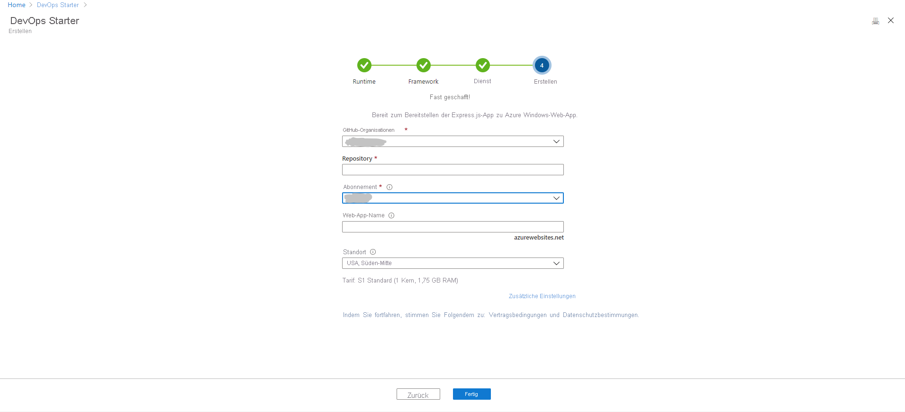
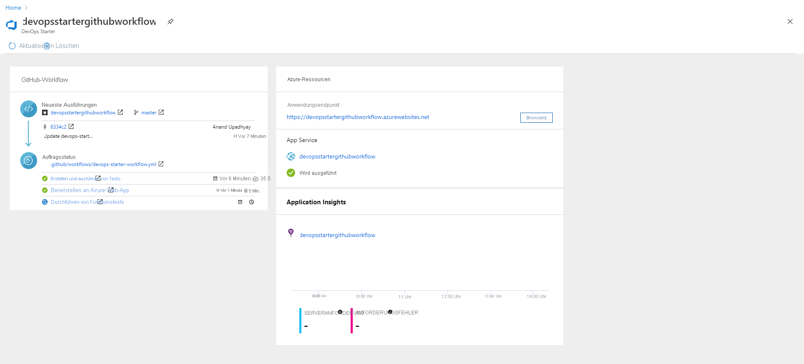

# Tutorial: Bereitstellen einer Node.js-App in Azure Web App mi DevOps Starter für GitHub Actions

Azure DevOps Starter für GitHub Actions bietet eine vereinfachte Umgebung, in der Sie eine Beispielanwendung auswählen können, um eine Continuous Integration- und Continuous Delivery-Pipeline (CI/CD) für die Bereitstellung in Azure zu erstellen. 

DevOps Starter ermöglicht außerdem:
* Automatisches Erstellen von Azure-Ressourcen, etwa einer neuen Azure Web App.
* Erstellt und konfiguriert einen Workflow in GitHub, der einen Buildauftrag für CI enthält.
* Der Workflow enthält außerdem einen Bereitstellungsauftrag für CD. 
* Erstellen einer Azure Application Insights-Ressource für die Überwachung

In diesem Lernprogramm lernen Sie Folgendes:

> [!div class="checklist"]
> * Verwenden von DevOps Starter zum Bereitstellen einer Node.js-App
> * Konfigurieren von GitHub und eines Azure-Abonnements 
> * Untersuchen des GitHub-Workflows
> * Committen von Änderungen in GitHub und automatisches Bereitstellen dieser Änderungen in Azure
> * Konfigurieren der Azure Application Insights-Überwachung
> * Bereinigen von Ressourcen

## Voraussetzungen

* Ein Azure-Konto mit einem aktiven Abonnement. Sie können [kostenlos ein Konto erstellen](https://azure.microsoft.com/free/).

## Verwenden von DevOps Starter zum Bereitstellen einer Node.js-App

Devops Starter erstellt einen Workflow in GitHub. Sie können eine vorhandene GitHub-Organisation verwenden. Ferner werden mit DevOps Starter Azure-Ressourcen wie etwa eine Web-App im Azure-Abonnement Ihrer Wahl erstellt.

1. Melden Sie sich beim [Azure-Portal](https://portal.azure.com) an.

1. Geben Sie in das Suchfeld **DevOps Starter** ein, und wählen sie die Option dann aus. Klicken Sie auf **Hinzufügen**, um einen neuen zu erstellen.

    

1. Stellen Sie sicher, dass der CI/CD-Anbieter als **GitHub Actions** ausgewählt ist.

    

1. Wählen Sie **Node.js** und dann **Weiter** aus.

1. Wählen Sie unter **Anwendungsframework auswählen** die Option **Express.js** und anschließend **Weiter** aus. Das Anwendungsframework, das Sie in einem vorherigen Schritt ausgewählt haben, bestimmt den Typ des hier verfügbaren Bereitstellungsziels für den Azure-Dienst. 

1. Wählen Sie die **Windows-Web-App** und dann **Weiter** aus.

## Konfigurieren von GitHub und eines Azure-Abonnements

1. **Autorisieren** Sie GitHub, und wählen Sie eine vorhandene GitHub-Organisation aus. 

1. Geben Sie einen Namen für Ihr **GitHub-Repository** ein. 

1. Wählen Sie Ihre Azure-Abonnementsdienste aus. Optional können Sie **Ändern** auswählen und anschließend weitere Konfigurationsdetails wie etwa den Speicherort der Azure-Ressourcen eingeben.
 
1. Geben Sie einen Namen für die Web-App ein, und wählen Sie dann **Fertig** aus. Die Azure Web App ist nach wenigen Minuten bereit. Eine Node.js-Beispielanwendung wird in einem Repository in Ihrer GitHub-Organisation eingerichtet, ein Workflow wird ausgelöst, und Ihre Anwendung wird in der neu erstellten Azure Web App bereitgestellt.

       

   Anschließend wird das DevOps Starter-Dashboard im Azure-Portal angezeigt. Sie können auch direkt über **Alle Ressourcen** im Azure-Portal zum Dashboard navigieren. 

   Das Dashboard bietet Einblick in Ihr GitHub-Coderepository, in Ihren CI/CD-Workflow und in Ihre aktive Anwendung in Azure.   

   

Mit DevOps Starter wird automatisch ein Trigger konfiguriert, durch den Codeänderungen im Repository bereitgestellt werden.
    
## Untersuchen des GitHub-Workflows

Im vorherigen Schritt wurde von DevOps Starter automatisch ein vollständiger GitHub-Workflow konfiguriert. Untersuchen Sie den Workflow, und passen Sie ihn bei Bedarf an. Führen Sie die folgenden Schritte aus, um sich mit dem Workflow vertraut zu machen.

1. Wählen Sie auf der linken Seite des DevOps Starter-Dashboards **GitHub-Workflow** aus. Über diesen Link werden eine Browserregisterkarte und der GitHub-Workflow für Ihr neues Projekt geöffnet.
    > [!NOTE]
    > Benennen Sie die Workflowdatei nicht um. Der Name der Workflowdatei sollte **devops-starter-workflow.yml** lauten, damit das Dashboard die Änderungen widerspiegelt.

1. Die YAML-Workflowdatei enthält alle GitHub Actions, die zum Erstellen und Bereitstellen der Anwendung erforderlich sind. Klicken Sie auf die Option **Datei bearbeiten**, um Ihre Workflowdatei anzupassen.

1. Klicken Sie unter der Registerkarte **Code** des Repositorys auf **Commits**. In dieser Ansicht werden die der jeweiligen Bereitstellung zugeordneten Codecommits angezeigt.

1. Auf der Registerkarte **Aktionen** des Repositorys können Sie den Verlauf aller Workflowausführungen Ihres Repositorys anzeigen.

1. Wählen Sie die **letzte Ausführung** aus, um alle Aufträge anzuzeigen, die im Workflow ausgeführt wurden.

1. Klicken Sie auf **Aufträge**, um die ausführlichen Protokolle der Workflowausführung anzuzeigen. Die Protokolle enthalten nützliche Informationen zum Bereitstellungsprozess. Sie können während und nach Bereitstellungen angezeigt werden.

1. Klicken Sie auf die Registerkarte **Pull Request**, um alle Pull Requests für Ihr Repository anzuzeigen.

## Ausführen eines Commits für Codeänderungen und Ausführen von CI/CD

Devops Starter erstellt ein Repository in GitHub. Gehen Sie wie folgt vor, um das Repository anzuzeigen und Codeänderungen an Ihrer Anwendung vorzunehmen:

1. Klicken Sie auf der linken Seite des DevOps Starter-Dashboards auf den Link für Ihren Mainbranch. Über diesen Link wird die Ansicht des neu erstellten GitHub-Repositorys geöffnet.

1. Wählen Sie oben rechts im Browser die Option **Klonen** aus, um die Repository-Klon-URL anzuzeigen. Sie können Ihr Git-Repository in Ihrer bevorzugten IDE klonen. Bei den nächsten Schritten können Sie den Webbrowser verwenden, um Codeänderungen direkt am Mainbranch vorzunehmen und für Codeänderungen einen Commit auszuführen.

1. Navigieren Sie auf der linken Seite des Browsers zur Datei **/Application/views/index.pug**.

1. Wählen Sie **Bearbeiten** aus, und ändern Sie den Text an einigen Stellen.
    Ändern Sie beispielsweise einige Textstellen für eines der Tags.

1. Wählen Sie **Commit** aus, und speichern Sie anschließend die Änderungen.

1. Navigieren Sie in Ihrem Browser zum DevOps Starter-Dashboard.   
Nun sollte ein aktuell ausgeführter GitHub-Workflowbuildauftrag angezeigt werden. Die Änderungen, die Sie soeben vorgenommen haben, werden automatisch erstellt und über einen GitHub-Workflow bereitgestellt.

1. Aktualisieren Sie nach Abschluss der Bereitstellung Ihre Anwendung, um Ihre Änderungen zu überprüfen.

## Konfigurieren der Azure Application Insights-Überwachung

Mithilfe von Azure Application Insights können Sie die Leistung und Nutzung Ihrer Anwendung ganz einfach überwachen. Mit DevOps Starter wird für Ihre Anwendung automatisch eine Application Insights-Ressource konfiguriert. Sie können Warnungen und Überwachungsfunktionen je nach Bedarf weiter konfigurieren.

1. Navigieren Sie im Azure-Portal zum DevOps Starter-Dashboard. 

1. Wählen Sie unten rechts den Link **Application Insights** für Ihre App aus. Der Bereich **Application Insights** wird geöffnet. Diese Ansicht enthält Informationen zur Nutzungs-, Leistungs- und Verfügbarkeitsüberwachung für Ihre App.

    

1. Wählen Sie **Zeitbereich** und dann **Letzte Stunde** aus. Wählen Sie zum Filtern der Ergebnisse **Aktualisieren** aus. Sie können nun alle Aktivitäten der letzten 60 Minuten anzeigen. 
    
1. Wählen Sie zum Schließen des Zeitbereichs **x** aus.

1. Wählen Sie **Warnungen** und anschließend **Metrikwarnung hinzufügen** aus. 

1. Geben Sie einen Namen für die Warnung ein.

1. Sehen Sie sich in der Dropdownliste **Metrik** die verschiedenen Warnungsmetriken an. Für die Standardwarnung gilt eine **Serverantwortzeit, die größer als 1 Sekunde** ist. Sie können problemlos eine Vielzahl von Warnungen konfigurieren und dadurch die Überwachungsfunktionen Ihrer App verbessern.

1. Aktivieren Sie das Kontrollkästchen für **Notify via Email owners, contributors, and readers** (Besitzer, Mitwirkende und Leser über E-Mail informieren). Optional können Sie durch die Ausführung einer Logik-App zusätzliche Aktionen ausführen, wenn eine Warnung angezeigt wird.

1. Wählen Sie **OK** , um die Warnung zu erstellen. Nach wenigen Augenblicken wird die Warnung auf dem Dashboard als aktiv angezeigt. 

1. Verlassen Sie den Bereich **Warnung**, und navigieren Sie zurück zum Blatt **Application Insights**.

1. Wählen Sie **Verfügbarkeit** und anschließend **Test hinzufügen** aus. 

1. Geben Sie einen Testnamen ein, und wählen Sie dann **Erstellen** aus. Ein einfacher Ping-Test wird erstellt, um die Verfügbarkeit Ihrer Anwendung zu überprüfen. Nach wenigen Minuten sind die Testergebnisse verfügbar, und das Application Insights-Dashboard zeigt einen Verfügbarkeitsstatus an.

## Bereinigen von Ressourcen

Beim Durchführen von Tests können Sie Gebühren vermeiden, indem Sie die Ressourcen bereinigen. Sie können den in diesem Tutorial erstellten virtuellen Computer und zugehörige Ressourcen löschen, wenn Sie sie nicht mehr benötigen. Verwenden Sie dazu die Funktion **Löschen** auf dem DevOps Starter-Dashboard. 

> [!IMPORTANT]
> Mit dem folgenden Verfahren werden Ressourcen endgültig gelöscht. Mit der Funktion *Löschen* werden die Daten in Azure gelöscht, die vom Projekt in DevOps Starter erstellt wurden. Diese Daten können anschließend nicht wiederhergestellt werden. Verwenden Sie dieses Verfahren nur, nachdem Sie die Anweisungen sorgfältig gelesen haben.

1. Navigieren Sie im Azure-Portal zum DevOps Starter-Dashboard.
1. Wählen Sie oben rechts **Löschen** aus. 
1. Wählen Sie an der Eingabeaufforderung **Ja** aus, um die Ressourcen *endgültig zu löschen*.

Den Workflow Pipeline können Sie optional an die Anforderungen Ihres Teams anpassen. Sie können dieses CI/CD-Muster auch als Vorlage für Ihre anderen Repositorys verwenden. 

## Nächste Schritte

In diesem Tutorial haben Sie Folgendes gelernt:

> [!div class="checklist"]
> * Verwenden von DevOps Starter zum Bereitstellen einer Node.js-App
> * Konfigurieren von GitHub und eines Azure-Abonnements 
> * Untersuchen des GitHub-Workflows
> * Committen von Änderungen in GitHub und automatisches Bereitstellen dieser Änderungen in Azure
> * Konfigurieren der Azure Application Insights-Überwachung
> * Bereinigen von Ressourcen

Weitere Informationen zu GitHub Actions und Workflows finden Sie unter:

> [!div class="nextstepaction"]
> [Anpassen des GitHub-Workflows](https://docs.github.com/actions/configuring-and-managing-workflows/configuring-and-managing-workflow-files-and-runs)
