# Schnellstart: Weiterleiten von Blob Storage-Ereignissen an einen Webendpunkt über das Azure-Portal

Azure Event Grid ist ein Ereignisdienst für die Cloud. In diesem Artikel verwenden Sie das Azure-Portal, um ein Blob Storage-Konto zu erstellen, Ereignisse für diesen Blobspeicher zu abonnieren und ein Ereignis zum Anzeigen des Ergebnisses auszulösen. Üblicherweise senden Sie Ereignisse an einen Endpunkt, der die Ereignisdaten verarbeitet und entsprechende Aktionen ausführt. Der Einfachheit halber senden Sie die Ereignisse in diesem Artikel allerdings an eine Web-App, die die Nachrichten sammelt und anzeigt.

[!INCLUDE [quickstarts-free-trial-note.md](../../includes/quickstarts-free-trial-note.md)]

Am Ende sehen Sie, dass die Ereignisdaten an die Web-App gesendet wurden.

## Speicherkonto erstellen

1. Melden Sie sich beim [Azure-Portal](https://portal.azure.com/)an.

1. Wählen Sie zum Erstellen eines Blobspeichers die Option **Ressource erstellen**. 

1. Wählen Sie **Speicher**, um die verfügbaren Optionen zu filtern, und wählen Sie anschließend **Speicherkonto – Blob, Datei, Tabelle, Warteschlange**.

   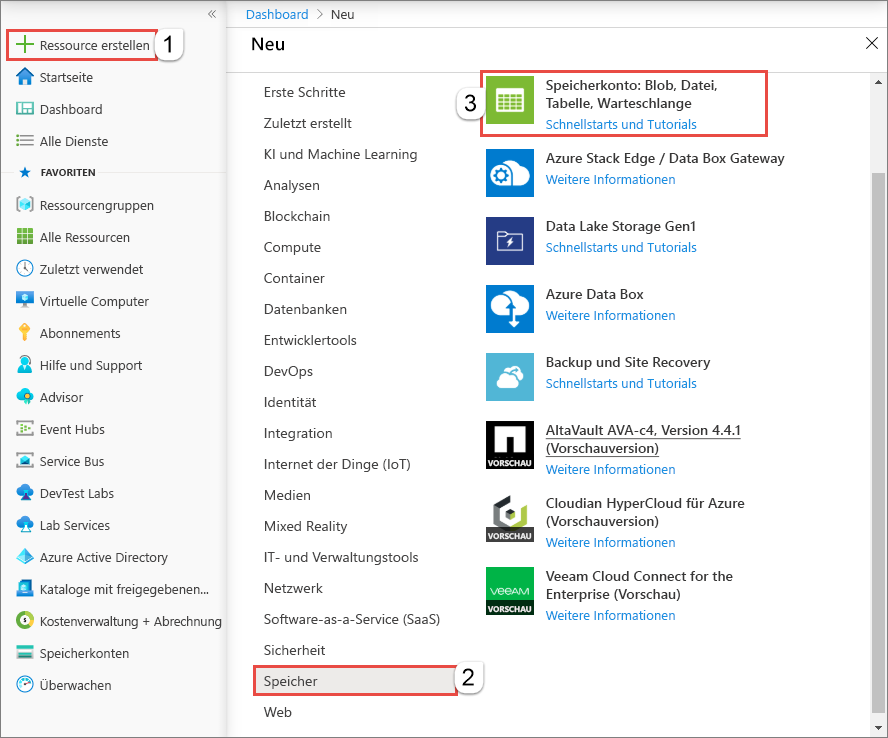

   Um Ereignisse zu abonnieren, erstellen Sie entweder ein Speicherkonto vom Typ „general-purpose v2“ oder ein Blobspeicherkonto.
   
1. Führen Sie auf der Seite **Speicherkonto erstellen** die folgenden Schritte aus:
    1. Wählen Sie Ihr Azure-Abonnement. 
    2. Erstellen Sie unter **Ressourcengruppe** eine neue Ressourcengruppe, oder wählen Sie eine vorhandene aus. 
    3. Geben Sie den Namen für Ihr Speicherkonto ein. 
    4. Klicken Sie auf **Überprüfen + erstellen**. 

       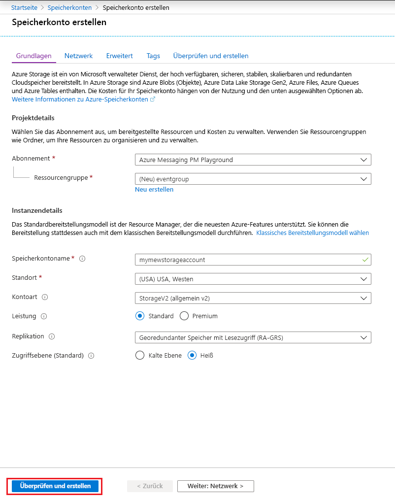    
    5. Überprüfen Sie die Einstellungen auf der Seite **Überprüfen + erstellen**, und wählen Sie **Erstellen** aus. 

        >[!NOTE]
        > Nur Speicherkonten vom Typ **StorageV2 (universell, Version 2)** und **BlobStorage** unterstützen die Ereignisintegration. **Storage (allgemein, Version 1)** unterstützt die Integration in Event Grid *nicht*.

## Erstellen eines Nachrichtenendpunkts

Vor dem Abonnieren der Ereignisse für den Blobspeicher erstellen wir zunächst den Endpunkt für die Ereignisnachricht. Der Endpunkt führt in der Regel Aktionen auf der Grundlage der Ereignisdaten aus. Der Einfachheit halber stellen Sie in dieser Schnellstartanleitung eine [vorgefertigte Web-App](https://github.com/Azure-Samples/azure-event-grid-viewer) bereit, die die Ereignisnachrichten anzeigt. Die bereitgestellte Lösung umfasst einen App Service-Plan, eine App Service-Web-App und Quellcode von GitHub.

1. Wählen Sie **Deploy to Azure** (In Azure bereitstellen), um die Lösung für Ihr Abonnement bereitzustellen. 

   
2. Gehen Sie auf der Seite **Benutzerdefinierte Bereitstellung** wie folgt vor: 
    1. Wählen Sie unter **Ressourcengruppe** die Ressourcengruppe aus, die Sie beim Erstellen des Speicherkontos erstellt haben. Dadurch muss zur Bereinigung nach Abschluss des Tutorials einfach nur die Ressourcengruppe gelöscht werden.  
    2. Geben Sie unter **Websitename** einen Namen für die Web-App ein.
    3. Geben Sie unter **Name des Hostingplans** einen Namen für den App Service-Plan zum Hosten der Web-App ein.
    4. Aktivieren Sie das Kontrollkästchen **Ich stimme den oben genannten Geschäftsbedingungen zu**. 
    5. Wählen Sie die Option **Kaufen**. 

       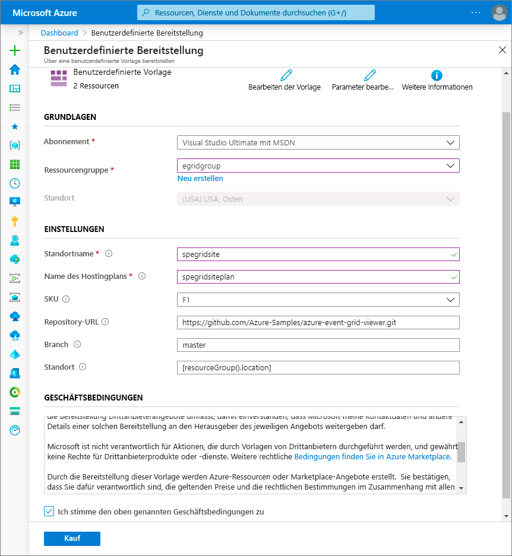
1. Die Bereitstellung kann einige Minuten dauern. Wählen Sie im Portal die Option „Warnungen“ (Glockensymbol) und anschließend **Zu Ressourcengruppe wechseln** aus. 

    
4. Wählen Sie auf der Seite **Ressourcengruppe** in der Ressourcenliste die von Ihnen erstellte Web-App aus. In dieser Liste werden auch der App Service-Plan und das Speicherkonto angezeigt. 

    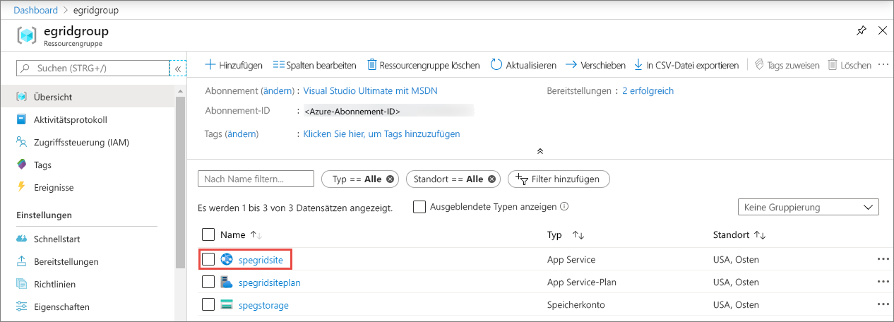
5. Wählen Sie auf der Seite **App Service** für Ihre Web-App die URL aus, um zur entsprechenden Website zu navigieren. Die URL muss folgendes Format haben: `https://<your-site-name>.azurewebsites.net`.
    
    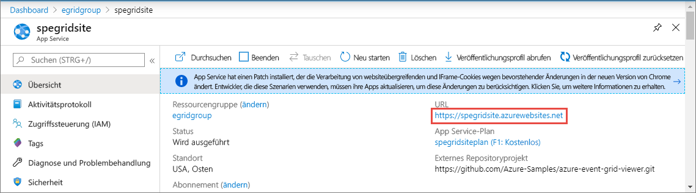

6. Vergewissern Sie sich, dass die Website angezeigt wird, aber noch keine Ereignisse bereitgestellt wurden.

   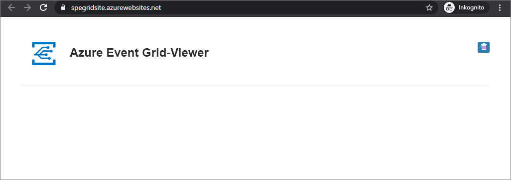

[!INCLUDE [event-grid-register-provider-portal.md](../../includes/event-grid-register-provider-portal.md)]

## Abonnieren des Blobspeichers

Sie abonnieren ein Thema, um Event Grid mitzuteilen, welche Ereignisse Sie nachverfolgen möchten und wohin diese gesendet werden sollen.

1. Navigieren Sie im Portal zu dem zuvor erstellten Azure Storage-Konto. Wählen Sie im linken Menü die Option **Alle Ressourcen** und anschließend Ihr Speicherkonto aus. 
2. Wählen Sie auf der Seite **Speicherkonto** im linken Menü die Option **Ereignisse** aus. 
1. Wählen Sie **Weitere Optionen** und dann **Webhook**. Sie verwenden einen Webhook für den Endpunkt, um Ereignisse an Ihre Viewer-App zu senden. 

   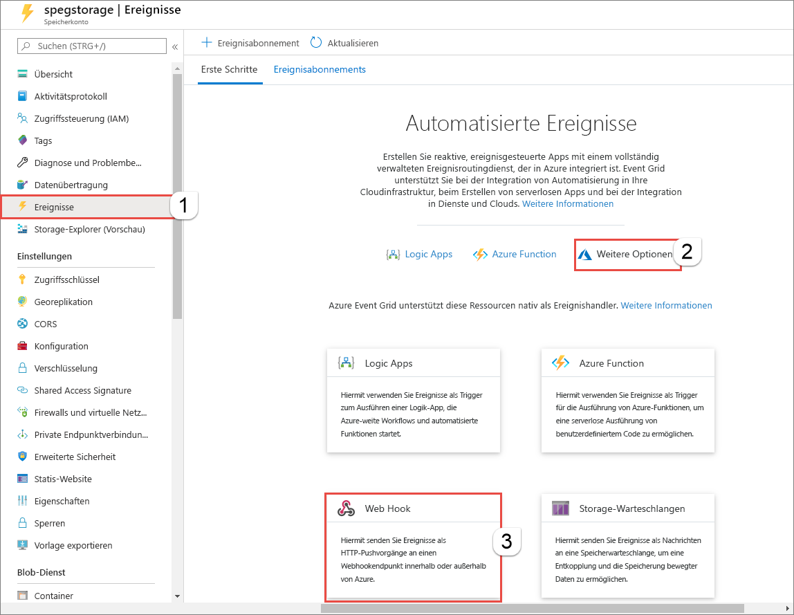
3. Führen Sie auf der Seite **Ereignisabonnement erstellen** die folgenden Schritte aus: 
    1. Geben Sie unter **Name** einen Namen für das Ereignisabonnement an.
    2. Geben Sie unter **Name** einen Namen für das **Systemthema** ein. Informationen zu Systemthemen finden Sie unter [Übersicht über Systemthemen](system-topics.md).

       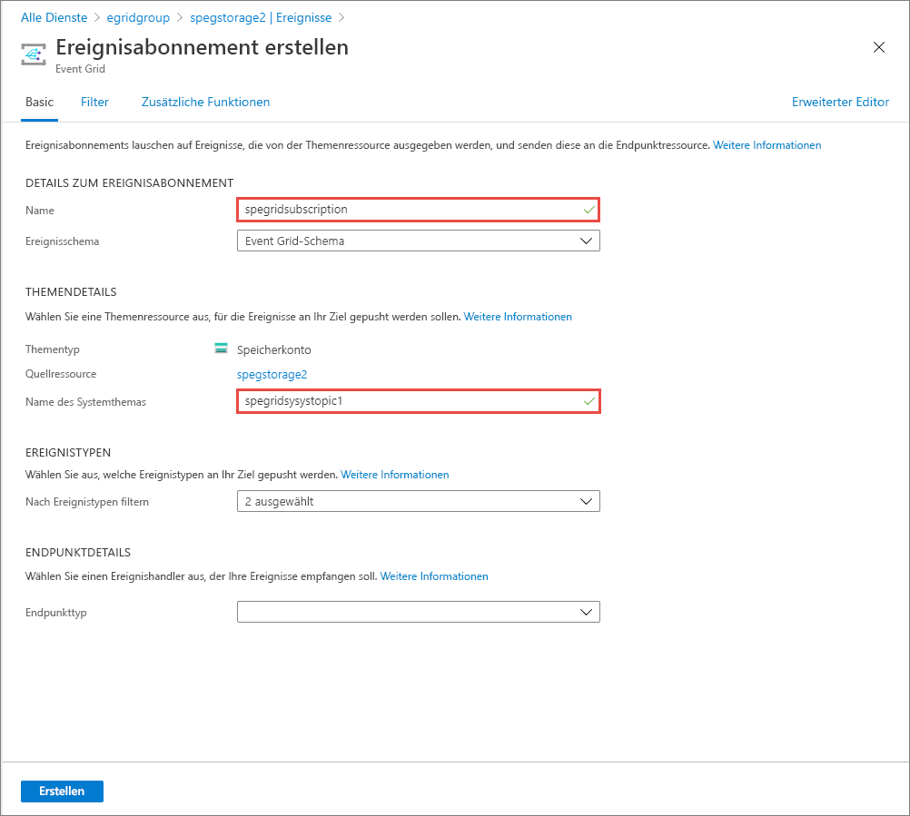
    2. Wählen Sie unter **Endpunkttyp** die Option **Webhook** aus. 

       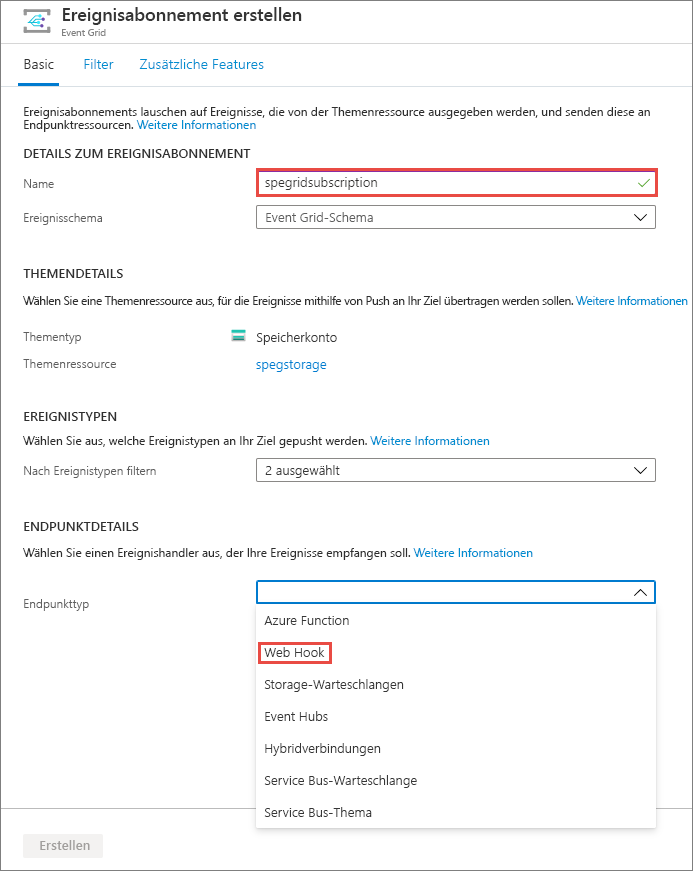
4. Klicken Sie unter **Endpunkt**, auf **Endpunkt auswählen**, geben Sie die URL Ihrer Web-App ein, fügen Sie `api/updates` zur URL der Startseite hinzu (Beispiel: `https://spegridsite.azurewebsites.net/api/updates`), und wählen Sie anschließend **Auswahl bestätigen** aus.

   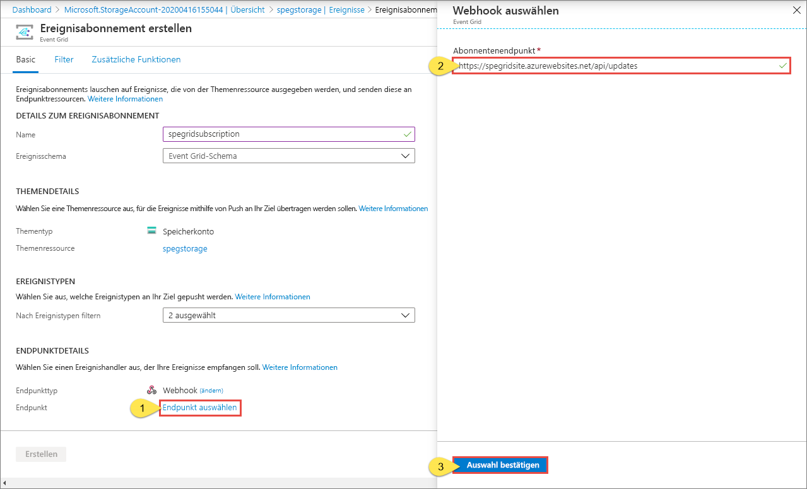
5. Wählen Sie als Nächstes auf der Seite **Ereignisabonnement erstellen** die Option **Erstellen** aus, um das Ereignisabonnement zu erstellen. 

   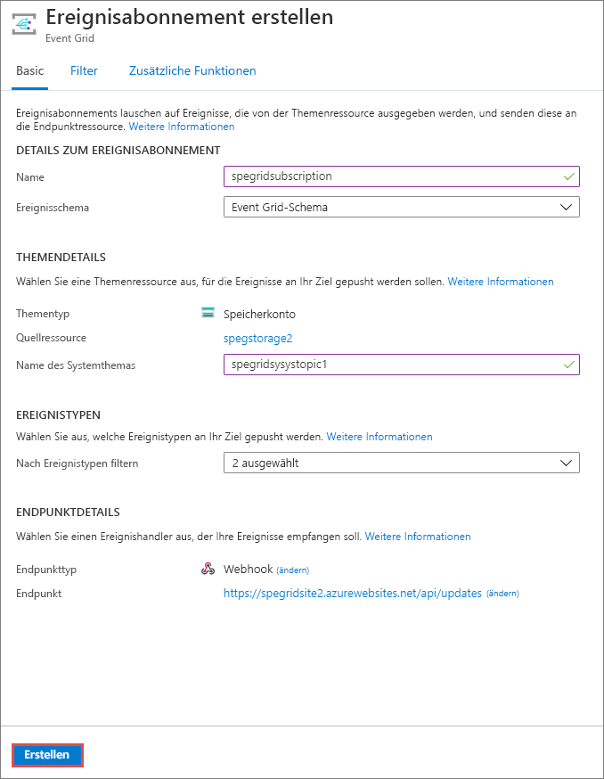

1. Zeigen Sie wieder Ihre Web-App an. Wie Sie sehen, wurde ein Abonnementüberprüfungsereignis an sie gesendet. Klicken Sie auf das Augensymbol, um die Ereignisdaten zu erweitern. Event Grid sendet das Überprüfungsereignis, damit der Endpunkt bestätigen kann, dass er Ereignisdaten empfangen möchte. Die Web-App enthält Code zur Überprüfung des Abonnements.

   

Als Nächstes lösen wir ein Ereignis aus, um zu sehen, wie Event Grid die Nachricht an Ihren Endpunkt weiterleitet.

## Senden eines Ereignisses an Ihren Endpunkt

Sie lösen ein Ereignis für den Blobspeicher aus, indem Sie eine Datei hochladen. Für die Datei ist kein spezifischer Inhalt erforderlich. In den Artikeln wird davon ausgegangen, dass Sie über eine Datei mit dem Namen „testfile.txt“ verfügen, aber Sie können eine beliebige Datei verwenden.

1. Navigieren Sie im Azure-Portal zu Ihrem Blobspeicherkonto, und wählen Sie auf der Seite **Übersicht** die Option **Container** aus.

   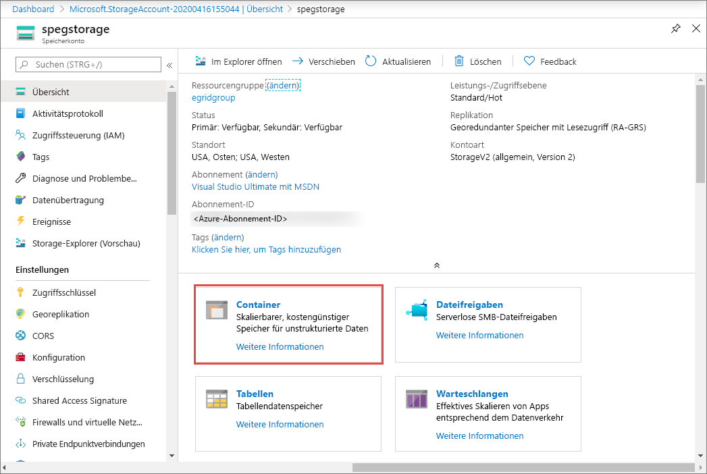

1. Wählen Sie **+ Container** aus. Geben Sie Ihrem Container einen Namen, verwenden Sie eine beliebige Zugriffsebene, und wählen Sie **Erstellen** aus. 

   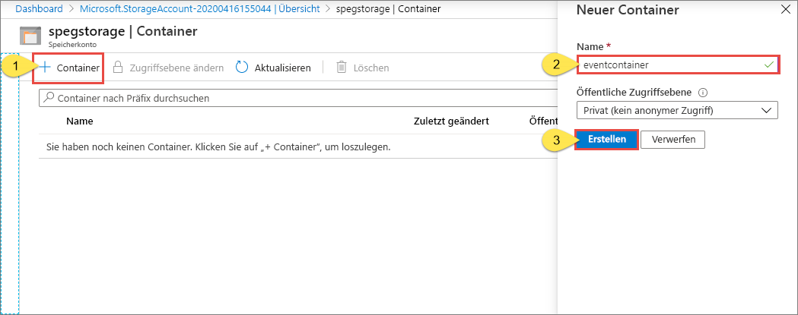

1. Wählen Sie Ihren neuen Container aus.

   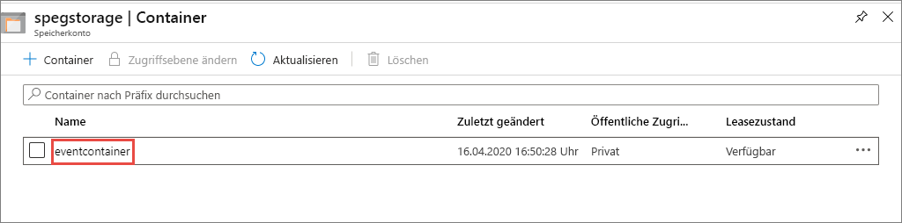

1. Wählen Sie die Option **Hochladen**, um eine Datei hochzuladen. Navigieren Sie auf der Seite **Blob hochladen** zu einer Datei, die Sie zu Testzwecken hochladen möchten, wählen Sie sie aus, und wählen Sie auf dieser Seite anschließend **Hochladen** aus. 

   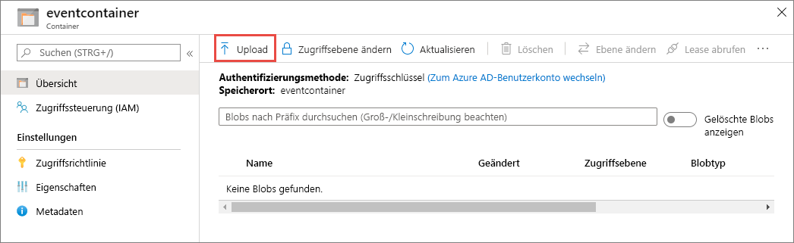

1. Navigieren Sie zu Ihrer Testdatei, und laden Sie sie hoch.

1. Sie haben das Ereignis ausgelöst, und Event Grid hat die Nachricht an den Endpunkt gesendet, den Sie beim Abonnieren konfiguriert haben. Die Nachricht weist das JSON-Format auf und enthält ein Array mit mindestens einem Ereignis. Im folgenden Beispiel enthält die JSON-Nachricht ein Array mit einem Ereignis. Zeigen Sie Ihre Web-App an. Wie Sie sehen, wurde ein Ereignis vom Typ **Blob erstellt** empfangen. 

   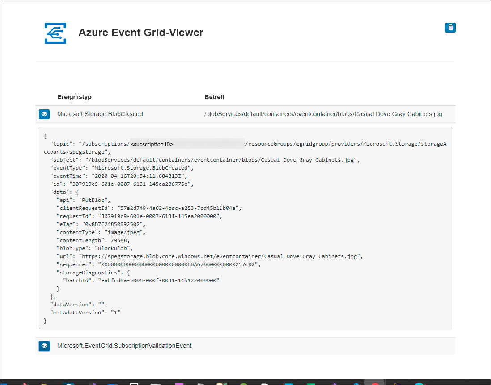

## Bereinigen von Ressourcen

Wenn Sie dieses Ereignis weiterverwenden möchten, können Sie die Bereinigung der in diesem Artikel erstellten Ressourcen überspringen. Löschen Sie andernfalls die Ressourcen, die Sie in diesem Artikel erstellt haben.

Wählen Sie die Ressourcengruppe aus, und klicken Sie auf **Ressourcengruppe löschen**.

## Nächste Schritte

Sie haben gelernt, wie Sie benutzerdefinierte Themen und Ereignisabonnements erstellen. Nun können Sie sich ausführlicher darüber informieren, welche Möglichkeiten Event Grid bietet:

- [Einführung in Azure Event Grid](overview.md)
- [Weiterleiten von Blob Storage-Ereignissen an einen benutzerdefinierten Webendpunkt](../storage/blobs/storage-blob-event-quickstart.md?toc=%2fazure%2fevent-grid%2ftoc.json)
- [Überwachen von Änderungen an virtuellen Computern mit Azure Event Grid und Logic Apps](monitor-virtual-machine-changes-event-grid-logic-app.md)
- [Streamen von Big Data in ein Data Warehouse](event-grid-event-hubs-integration.md)
