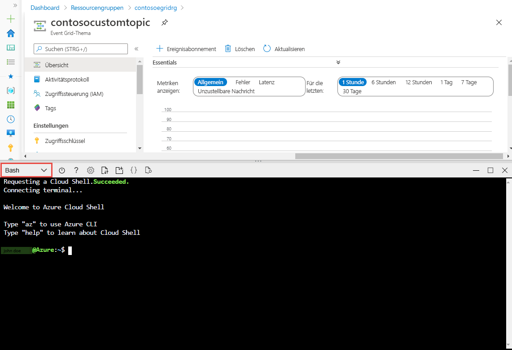

# <a name="quickstart-route-custom-events-to-web-endpoint-with-the-azure-portal-and-event-grid"></a>Schnellstart: Weiterleiten benutzerdefinierter Ereignisse an einen Webendpunkt mit dem Azure Portal und Event Grid

Azure Event Grid ist ein Ereignisdienst für die Cloud. In diesem Artikel erstellen Sie über das Azure-Portal ein benutzerdefiniertes Thema, abonnieren dieses benutzerdefinierte Thema und lösen das Ereignis zum Anzeigen des Ergebnisses aus. Üblicherweise senden Sie Ereignisse an einen Endpunkt, der die Ereignisdaten verarbeitet und entsprechende Aktionen ausführt. Der Einfachheit halber senden Sie die Ereignisse in diesem Artikel allerdings an eine Web-App, die die Nachrichten sammelt und anzeigt.

## <a name="prerequisites"></a>Voraussetzungen
[!INCLUDE [quickstarts-free-trial-note.md](../../includes/quickstarts-free-trial-note.md)]

[!INCLUDE [event-grid-register-provider-portal.md](../../includes/event-grid-register-provider-portal.md)]

## <a name="create-a-custom-topic"></a>Erstellen eines benutzerdefinierten Themas

Ein Event Grid-Thema verfügt über einen benutzerdefinierten Endpunkt für die Veröffentlichung Ihrer Ereignisse. 

1. Melden Sie sich beim [Azure-Portal](https://portal.azure.com/)an.
2. Geben Sie in der Suchleiste des Themas **Event Grid-Themen**ein, und wählen Sie dann **Event Grid-Themen** aus der Dropdownliste aus. 

    :::image type="content" source="./media/custom-event-quickstart-portal/select-event-grid-topics.png" alt-text="Event Grid-Themen suchen und auswählen":::
3. Wählen Sie auf der Symbolleiste der Seite **Event Grid-Themen** die Option **+ Hinzufügen** aus. 

    :::image type="content" source="./media/custom-event-quickstart-portal/add-event-grid-topic-button.png" alt-text="Event Grid-Themen suchen und auswählen":::
4. Gehen Sie auf der Seite **Thema erstellen** wie folgt vor:
    1. Wählen Sie Ihr Azure- **Abonnement**aus.
    2. Wählen Sie eine bereits vorhandene Ressourcengruppe aus, oder wählen Sie **Neu erstellen** aus, und geben Sie unter **Name** einen Namen für die **Ressourcengruppe** ein.
    3. Geben Sie unter **Name** einen eindeutigen Namen für das benutzerdefinierte Thema an. Der Name des Themas muss eindeutig sein, da er durch einen DNS-Eintrag dargestellt wird. Verwenden Sie nicht den Namen, der in der Abbildung zu sehen ist. Erstellen Sie stattdessen einen eigenen Namen. Dieser muss zwischen drei und 50 Zeichen lang sein und darf nur folgende Zeichen enthalten: a–z, A–Z, 0–9 und Bindestriche (-).
    4. Wählen Sie einen **Standort** für das Event Grid-Thema aus.
    5. Wählen Sie am unteren Rand der Seite die Option **Bewerten + erstellen** aus. 

        :::image type="content" source="./media/custom-event-quickstart-portal/create-custom-topic.png" alt-text="Event Grid-Themen suchen und auswählen":::
    6. Wählen Sie auf der Registerkarte **Überprüfen + erstellen** der Seite **Thema erstellen** den Befehl **Erstellen** aus. 
    
        :::image type="content" source="./media/custom-event-quickstart-portal/review-create-page.png" alt-text="Event Grid-Themen suchen und auswählen":::
5. Geben Sie nach erfolgreicher Bereitstellung noch mal in die Suchleiste **Event Grid-Themen**ein, und wählen Sie wie vorher **Event Grid-Themen** aus der Dropdownliste aus. 
6. Wählen Sie das von Ihnen erstellte Thema aus der Liste aus. 

    :::image type="content" source="./media/custom-event-quickstart-portal/select-event-grid-topic.png" alt-text="Event Grid-Themen suchen und auswählen":::

7. Daraufhin wird die Seite **Event Grid-Thema** für Ihr Thema angezeigt. Lassen Sie diese Seite geöffnet. Sie wird im weiteren Verlauf der Schnellstartanleitung benötigt. 

    :::image type="content" source="./media/custom-event-quickstart-portal/event-grid-topic-home-page.png" alt-text="Event Grid-Themen suchen und auswählen":::

## <a name="create-a-message-endpoint"></a>Erstellen eines Nachrichtenendpunkts
Erstellen Sie zunächst einen Endpunkt für die Ereignisnachricht, bevor Sie ein Abonnement für das benutzerdefinierte Thema erstellen. Der Endpunkt führt in der Regel Aktionen auf der Grundlage der Ereignisdaten aus. Der Einfachheit halber stellen Sie in dieser Schnellstartanleitung eine [vorgefertigte Web-App](https://github.com/Azure-Samples/azure-event-grid-viewer) bereit, die die Ereignisnachrichten anzeigt. Die bereitgestellte Lösung umfasst einen App Service-Plan, eine App Service-Web-App und Quellcode von GitHub.

1. Wählen Sie auf der Artikelseite **Deploy to Azure** (In Azure bereitstellen) aus, um die Lösung für Ihr Abonnement bereitzustellen. Geben Sie im Azure-Portal Werte für die Parameter an.

   <a href="https://portal.azure.com/#create/Microsoft.Template/uri/https%3A%2F%2Fraw.githubusercontent.com%2FAzure-Samples%2Fazure-event-grid-viewer%2Fmaster%2Fazuredeploy.json" target="_blank"></a>
1. Die Bereitstellung kann einige Minuten dauern. Nach erfolgreichem Abschluss der Bereitstellung können Sie Ihre Web-App anzeigen und sich vergewissern, dass sie ausgeführt wird. Navigieren Sie hierzu in einem Webbrowser zu `https://<your-site-name>.azurewebsites.net`.

    Wenn die Bereitstellung fehlschlägt, überprüfen Sie die Fehlermeldung. Möglicherweise ist der Name der Website bereits vergeben. Stellen Sie die Vorlage noch mal bereit, und wählen Sie einen anderen Namen für die Site aus. 
1. Die Website wird angezeigt, aber es wurden noch keine Ereignisse bereitgestellt.

   

## <a name="subscribe-to-custom-topic"></a>Abonnieren eines benutzerdefinierten Themas

Sie abonnieren ein Event Grid-Thema, um Event Grid mitzuteilen, welche Ereignisse Sie nachverfolgen möchten und wohin diese gesendet werden sollen.

1. Wählen Sie nun auf der Symbolleiste der Seite **Event Grid-Thema** für Ihr benutzerdefiniertes Thema die Option **+ Ereignisabonnement** aus.

    :::image type="content" source="./media/custom-event-quickstart-portal/new-event-subscription.png" alt-text="Event Grid-Themen suchen und auswählen":::
2. Gehen Sie auf der Seite **Ereignisabonnement erstellen** wie folgt vor:
    1. Geben Sie unter **Name** einen Namen für das Ereignisabonnement an.
    3. Wählen Sie unter **Endpunkttyp** die Option **Webhook** aus. 
    4. Wählen Sie **Endpunkt auswählen** aus. 

        :::image type="content" source="./media/custom-event-quickstart-portal/provide-subscription-values.png" alt-text="Event Grid-Themen suchen und auswählen":::
    5. Geben Sie für den Webhookendpunkt die URL Ihrer Web-App an, und fügen Sie `api/updates` der URL der Startseite hinzu. Klicken Sie auf **Auswahl bestätigen**.

        :::image type="content" source="./media/custom-event-quickstart-portal/provide-endpoint.png" alt-text="Event Grid-Themen suchen und auswählen":::
    6. Wählen Sie auf der Seite **Ereignisabonnement erstellen** die Option **Erstellen** aus.

3. Zeigen Sie wieder Ihre Web-App an. Wie Sie sehen, wurde ein Abonnementüberprüfungsereignis an sie gesendet. Klicken Sie auf das Augensymbol, um die Ereignisdaten zu erweitern. Event Grid sendet das Überprüfungsereignis, damit der Endpunkt bestätigen kann, dass er Ereignisdaten empfangen möchte. Die Web-App enthält Code zur Überprüfung des Abonnements.

    

## <a name="send-an-event-to-your-topic"></a>Senden eines Ereignisses an Ihr Thema

Als Nächstes lösen wir ein Ereignis aus, um zu sehen, wie Event Grid die Nachricht an Ihren Endpunkt weiterleitet. Verwenden Sie die Azure-Befehlszeilenschnittstelle oder PowerShell, um ein Testereignis an Ihr benutzerdefiniertes Thema zu senden. Üblicherweise werden die Ereignisdaten von einer Anwendung oder einem Azure-Dienst gesendet.

Im ersten Beispiel wird die Azure-Befehlszeilenschnittstelle verwendet. Es ruft die URL und den Schlüssel für das benutzerdefinierte Thema sowie Beispielereignisdaten ab. Verwenden Sie für `<topic name>` den Namen Ihres benutzerdefinierten Themas. Es werden Beispielereignisdaten erstellt. Bei dem `data`-Element des JSON-Codes handelt es sich um die Nutzlast Ihres Ereignisses. Für dieses Feld kann ein beliebiger wohlgeformter JSON-Code verwendet werden. Sie können auch das Betrefffeld zur erweiterten Weiterleitung und Filterung verwenden. CURL ist ein Hilfsprogramm zum Senden von HTTP-Anforderungen.


### <a name="azure-cli"></a>Azure CLI
1. Wählen Sie im Azure-Portal die Option **Cloud Shell** aus. Die Cloud Shell wird im unteren Bereich des Webbrowsers geöffnet. 

    :::image type="content" source="./media/custom-event-quickstart-portal/select-cloud-shell.png" alt-text="Event Grid-Themen suchen und auswählen":::
1. Wählen Sie links oben im Cloud Shell-Fenster die Option **Bash** aus. 

    
1. Führen Sie den folgenden Befehl aus, um den **Endpunkt** für das Thema abzurufen: Aktualisieren Sie nach dem Kopieren und Einfügen des Befehls den Namen des Themas (**topic name**) und den Namen der Ressourcengruppe (**resource group name**), bevor Sie den Befehl ausführen. Sie veröffentlichen Beispielereignisse in diesem Themenendpunkt. 

    ```azurecli
    endpoint=$(az eventgrid topic show --name <topic name> -g <resource group name> --query "endpoint" --output tsv)
    ```
2. Führen Sie den folgenden Befehl aus, um den **Schlüssel** für das benutzerdefinierte Thema abzurufen: Aktualisieren Sie nach dem Kopieren und Einfügen des Befehls den Namen des Themas (**topic name**) und den Namen der Ressourcengruppe (**resource group name**), bevor Sie den Befehl ausführen. Dies ist der Primärschlüssel des Event Grid-Themas. Um diesen Schlüssel aus dem Azure-Portal abzurufen, wechseln Sie zur Registerkarte **Zugriffsschlüssel** der Seite **Event Grid-Thema**. Um ein Ereignis in einem benutzerdefinierten Thema bereitstellen zu können, benötigen Sie den Zugriffsschlüssel. 

    ```azurecli
    key=$(az eventgrid topic key list --name <topic name> -g <resource group name> --query "key1" --output tsv)
    ```
3. Kopieren Sie die folgende Anweisung mit der Ereignisdefinition, und drücken Sie die **EINGABETASTE**. 

    ```json
    event='[ {"id": "'"$RANDOM"'", "eventType": "recordInserted", "subject": "myapp/vehicles/motorcycles", "eventTime": "'`date +%Y-%m-%dT%H:%M:%S%z`'", "data":{ "make": "Ducati", "model": "Monster"},"dataVersion": "1.0"} ]'
    ```
4. Führen Sie den folgenden **Curl**-Befehl aus, um das Ereignis zu veröffentlichen: In dem Befehl wird der `aeg-sas-key`-Header auf den Zugriffsschlüssel festgelegt, den Sie zuvor abgerufen haben. 

    ```
    curl -X POST -H "aeg-sas-key: $key" -d "$event" $endpoint
    ```

### <a name="azure-powershell"></a>Azure PowerShell
Im zweiten Beispiel werden ähnliche Schritte mit PowerShell ausgeführt.

1. Wählen Sie im Azure-Portal die Option **Cloud Shell** aus (navigieren Sie alternativ zu `https://shell.azure.com/`). Die Cloud Shell wird im unteren Bereich des Webbrowsers geöffnet. 

    :::image type="content" source="./media/custom-event-quickstart-portal/select-cloud-shell.png" alt-text="Event Grid-Themen suchen und auswählen":::
1. Wählen Sie in der **Cloud Shell** links oben im Cloud Shell-Fenster die Option **PowerShell** aus. Eine Beispielabbildung des Fensters **Cloud Shell** finden Sie im Abschnitt für die Azure-Befehlszeilenschnittstelle.
2. Legen Sie die folgenden Variablen fest. Aktualisieren Sie nach dem Kopieren und Einfügen der einzelnen Befehle den Namen des Themas (**topic name**) und den Namen der Ressourcengruppe (**resource group name**), bevor Sie den Befehl ausführen:

    **Ressourcengruppe**:
    ```powershell
    $resourceGroupName = "<resource group name>"
    ```

    **Name des Event Grid-Themas**:    
    ```powershell
    $topicName = "<topic name>"
    ```
3. Führen Sie die folgenden Befehle aus, um den **Endpunkt** und die **Schlüssel** für das Thema abzurufen:

    ```powershell
    $endpoint = (Get-AzEventGridTopic -ResourceGroupName $resourceGroupName -Name $topicName).Endpoint
    $keys = Get-AzEventGridTopicKey -ResourceGroupName $resourceGroupName -Name $topicName
    ```
4. Bereiten Sie das Ereignis vor. Kopieren Sie die Anweisungen, und führen Sie sie im Cloud Shell-Fenster aus. 

    ```powershell
    $eventID = Get-Random 99999

    #Date format should be SortableDateTimePattern (ISO 8601)
    $eventDate = Get-Date -Format s

    #Construct body using Hashtable
    $htbody = @{
        id= $eventID
        eventType="recordInserted"
        subject="myapp/vehicles/motorcycles"
        eventTime= $eventDate   
        data= @{
            make="Ducati"
            model="Monster"
        }
        dataVersion="1.0"
    }
    
    #Use ConvertTo-Json to convert event body from Hashtable to JSON Object
    #Append square brackets to the converted JSON payload since they are expected in the event's JSON payload syntax
    $body = "["+(ConvertTo-Json $htbody)+"]"
    ```
5. Verwenden Sie das Cmdlet **Invoke-WebRequest**, um das Ereignis zu senden. 

    ```powershell
    Invoke-WebRequest -Uri $endpoint -Method POST -Body $body -Headers @{"aeg-sas-key" = $keys.Key1}
    ```

### <a name="verify-in-the-event-grid-viewer"></a>Überprüfen im Event Grid-Viewer
Sie haben das Ereignis ausgelöst, und Event Grid hat die Nachricht an den Endpunkt gesendet, den Sie beim Abonnieren konfiguriert haben. Zeigen Sie Ihre Web-App an, um das soeben gesendete Ereignis anzuzeigen.

:::image type="content" source="./media/custom-event-quickstart-portal/event-grid-viewer-end.png" alt-text="Event Grid-Themen suchen und auswählen":::

## <a name="clean-up-resources"></a>Bereinigen von Ressourcen
Wenn Sie dieses Ereignis weiterverwenden möchten, können Sie die Bereinigung der in diesem Artikel erstellten Ressourcen überspringen. Löschen Sie andernfalls die Ressourcen, die Sie in diesem Artikel erstellt haben.

1. Wählen Sie im linken Menü die Option **Ressourcengruppen** aus. Sollte die Option nicht angezeigt werden, wählen Sie im linken Menü die Option **Alle Dienste** und anschließend **Ressourcengruppen** aus. 

    
1. Wählen Sie die Ressourcengruppe aus, um die Seite **Ressourcengruppe** zu öffnen. 
1. Wählen Sie auf der Symbolleiste die Option **Ressourcengruppe löschen** aus. 
1. Bestätigen Sie den Löschvorgang, indem Sie den Namen der Ressourcengruppe eingeben und **Löschen** auswählen. 

    Die andere Ressourcengruppe, die auf der Abbildung zu sehen ist, wurde vom Cloud Shell-Fensters erstellt und verwendet. Löschen Sie sie, falls Sie das Cloud Shell-Fenster nicht mehr benötigen. 

## <a name="next-steps"></a>Nächste Schritte

Sie haben gelernt, wie Sie benutzerdefinierte Themen und Ereignisabonnements erstellen. Nun können Sie sich ausführlicher darüber informieren, welche Möglichkeiten Event Grid bietet:

- [Einführung in Azure Event Grid](overview.md)
- [Weiterleiten von Blob Storage-Ereignissen an einen benutzerdefinierten Webendpunkt](../storage/blobs/storage-blob-event-quickstart.md?toc=%2fazure%2fevent-grid%2ftoc.json)
- [Überwachen von Änderungen an virtuellen Computern mit Azure Event Grid und Logic Apps](monitor-virtual-machine-changes-event-grid-logic-app.md)
- [Streamen von Big Data in ein Data Warehouse](event-grid-event-hubs-integration.md)
