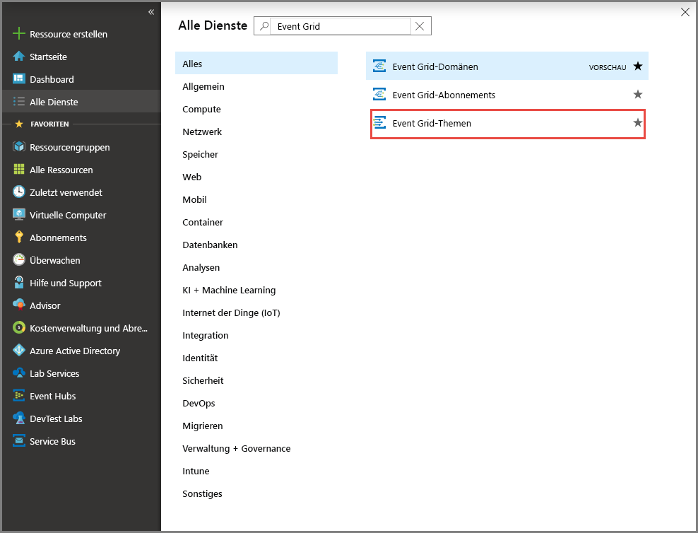
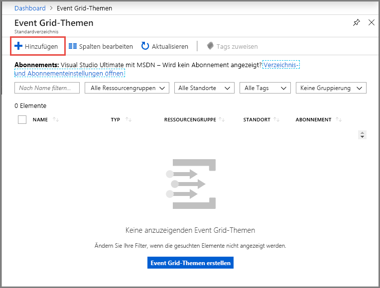
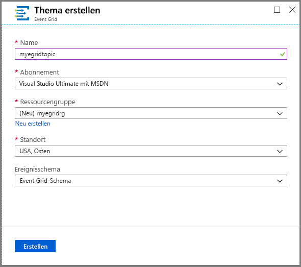
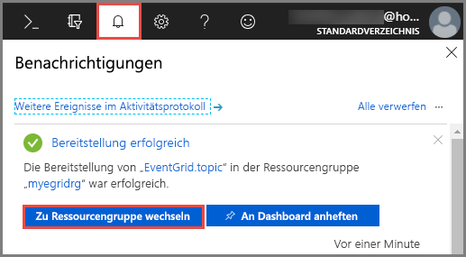
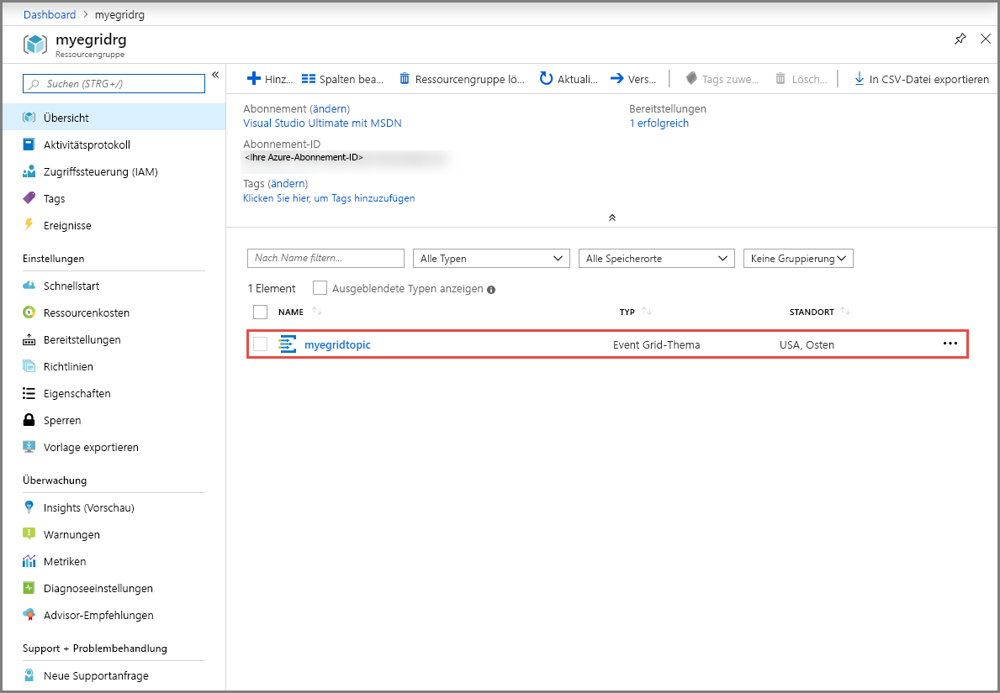
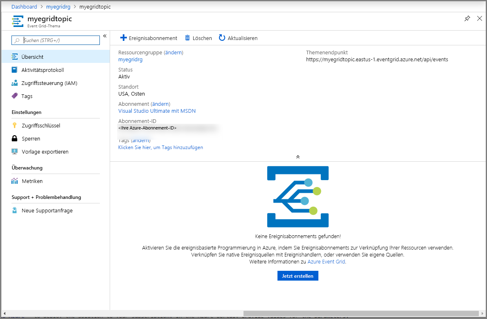
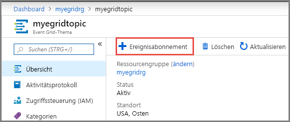
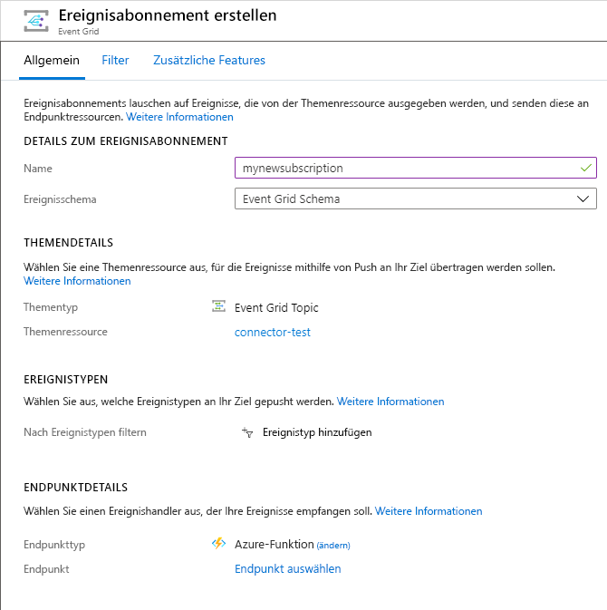
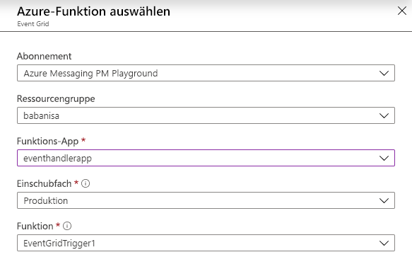
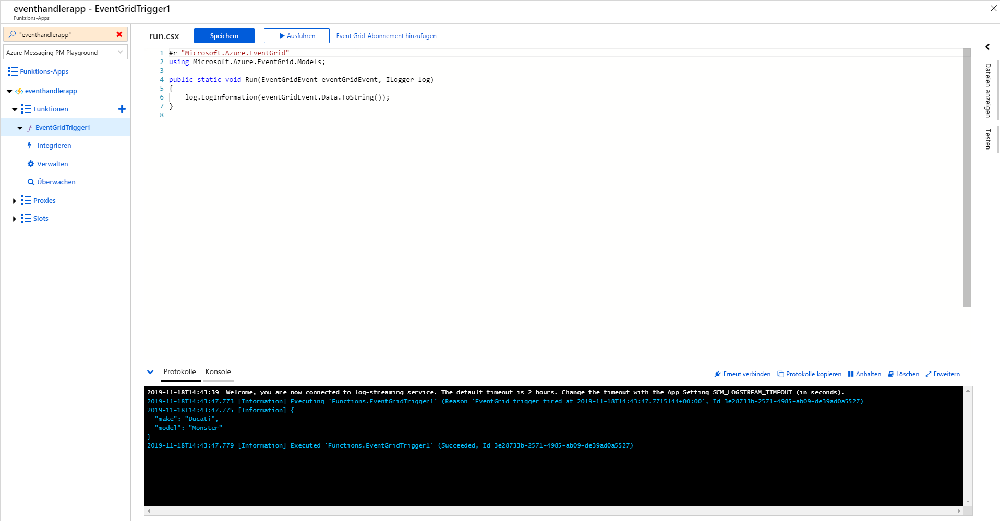

# <a name="quickstart-route-custom-events-to-an-azure-function-with-event-grid"></a>Schnellstart: Weiterleiten von benutzerdefinierten Ereignissen an eine Azure-Funktion mit Event Grid

Azure Event Grid ist ein Ereignisdienst für die Cloud. Azure Functions ist einer der unterstützten Ereignishandler. In diesem Artikel erstellen Sie über das Azure-Portal ein benutzerdefiniertes Thema, abonnieren dieses benutzerdefinierte Thema und lösen das Ereignis zum Anzeigen des Ergebnisses aus. Sie senden Ereignisse an eine Azure-Funktion.

[!INCLUDE [quickstarts-free-trial-note.md](../../includes/quickstarts-free-trial-note.md)]

## <a name="create-azure-function"></a>Azure-Funktion erstellen
Vor dem Abonnieren des benutzerdefinierten Themas erstellen wir zunächst eine Funktion zur Verarbeitung der Ereignisse. 

1. Erstellen Sie eine Funktions-App mithilfe der Anweisungen unter [Erstellen einer Funktions-App](../azure-functions/functions-create-first-azure-function.md#create-a-function-app).
2. Erstellen Sie eine Funktion mithilfe des **Event Grid-Triggers**. Wenn Sie diesen Trigger zum ersten Mal verwenden, müssen Sie möglicherweise auf „Installieren“ klicken, um die Erweiterung zu installieren.
    1. Wählen Sie auf der Seite **Funktions-App** im linken Menü **Funktionen** aus, suchen Sie in den Vorlagen nach **Event Grid**,und wählen Sie dann **Azure Event Grid-Trigger** aus. 

        :::image type="content" source="./media/custom-event-to-function/function-event-grid-trigger.png" alt-text="Auswählen des Event Grid-Triggers":::
3. Geben Sie auf der Seite **Neue Funktion** einen Namen für die Funktion ein, und wählen Sie **Funktion erstellen** aus.

    :::image type="content" source="./media/custom-event-to-function/new-function-page.png" alt-text="Auswählen des Event Grid-Triggers":::
4. Verwenden Sie die Seite **Code und testen**, um den vorhandenen Code für die Funktion anzuzeigen und zu aktualisieren. 

[!INCLUDE [event-grid-register-provider-portal.md](../../includes/event-grid-register-provider-portal.md)]

## <a name="create-a-custom-topic"></a>Erstellen eines benutzerdefinierten Themas

Ein Event Grid-Thema verfügt über einen benutzerdefinierten Endpunkt für die Veröffentlichung Ihrer Ereignisse. 

1. Melden Sie sich beim [Azure-Portal](https://portal.azure.com/)an.
2. Wählen Sie im linken Navigationsmenü die Option **Alle Dienste** aus, suchen Sie nach **Event Grid**, und wählen Sie **Event Grid-Themen** aus. 

    
3. Wählen Sie auf der Symbolleiste der Seite **Event Grid-Themen** die Option **+ Hinzufügen** aus. 

    

4. Gehen Sie auf der Seite **Thema erstellen** wie folgt vor:

    1. Geben Sie unter **Name** einen eindeutigen Namen für das benutzerdefinierte Thema an. Der Name des Themas muss eindeutig sein, da er durch einen DNS-Eintrag dargestellt wird. Verwenden Sie nicht den Namen, der in der Abbildung zu sehen ist. Erstellen Sie stattdessen einen eigenen Namen. Dieser muss zwischen drei und 50 Zeichen lang sein und darf nur folgende Zeichen enthalten: a–z, A–Z, 0–9 und Bindestriche (-).
    2. Wählen Sie Ihr Azure- **Abonnement**aus.
    3. Wählen Sie dieselbe Ressourcengruppe wie in den vorherigen Schritten aus.
    4. Wählen Sie einen **Standort** für das Event Grid-Thema aus.
    5. Behalten Sie im Feld **Ereignisschema** den Standardwert **Event Grid-Schema** bei. 

       
    6. Klicken Sie auf **Erstellen**. 

5. Nachdem das benutzerdefinierte Thema erstellt wurde, erhalten Sie eine entsprechende Benachrichtigung. Wählen Sie **Zu Ressourcengruppe wechseln** aus. 

   

6. Wählen Sie auf der Seite **Ressourcengruppe** das Event Grid-Thema aus. 

   

7. Daraufhin wird die Seite **Event Grid-Thema** für Ihre Event Grid-Instanz angezeigt. Lassen Sie diese Seite geöffnet. Sie wird im weiteren Verlauf der Schnellstartanleitung benötigt. 

    

## <a name="subscribe-to-custom-topic"></a>Abonnieren eines benutzerdefinierten Themas

Sie abonnieren ein Event Grid-Thema, um Event Grid mitzuteilen, welche Ereignisse Sie nachverfolgen möchten und wohin diese gesendet werden sollen.

1. Wählen Sie nun auf der Symbolleiste der Seite **Event Grid-Thema** für Ihr benutzerdefiniertes Thema die Option **+ Ereignisabonnement** aus.

   

2. Gehen Sie auf der Seite **Ereignisabonnement erstellen** wie folgt vor:
    1. Geben Sie unter **Name** einen Namen für das Ereignisabonnement an.
    3. Wählen Sie **Azure-Funktion** als **Endpunkttyp** aus. 
    4. Wählen Sie **Endpunkt auswählen** aus. 

       

    5. Wählen Sie als Endpunkt der Funktion das Azure-Abonnement und die Ressourcengruppe aus, in der sich Ihre Funktions-App befindet, und wählen Sie dann die zuvor erstellte Funktions-App und Funktion aus. Klicken Sie auf **Auswahl bestätigen**.

       
    6. Dieser Schritt ist optional, wird aber für Produktionsszenarien empfohlen. Navigieren Sie auf der Seite **Ereignisabonnement erstellen** zur Registerkarte **Erweiterte Funktionen**, und legen Sie Werte für **Max. Anzahl von Ereignissen pro Batch** und **Bevorzugte Batchgröße in KB** fest. 
    
        Durch die Batchverarbeitung kann ein hoher Durchsatz erreicht werden. Legen Sie für **Max. Anzahl von Ereignissen pro Batch** die maximale Anzahl von Ereignissen fest, die ein Abonnement in einen Batch einschließen soll. „Bevorzugte Batchgröße“ legt die bevorzugte Obergrenze der Batchgröße in KB fest, kann jedoch überschritten werden, wenn ein einzelnes Ereignis größer als dieser Schwellenwert ist.
    
        :::image type="content" source="./media/custom-event-to-function/enable-batching.png" alt-text="Auswählen des Event Grid-Triggers":::
    6. Wählen Sie auf der Seite **Ereignisabonnement erstellen** die Option **Erstellen** aus.

## <a name="send-an-event-to-your-topic"></a>Senden eines Ereignisses an Ihr Thema

Als Nächstes lösen wir ein Ereignis aus, um zu sehen, wie Event Grid die Nachricht an Ihren Endpunkt weiterleitet. Verwenden Sie die Azure-Befehlszeilenschnittstelle oder PowerShell, um ein Testereignis an Ihr benutzerdefiniertes Thema zu senden. Üblicherweise werden die Ereignisdaten von einer Anwendung oder einem Azure-Dienst gesendet.

Im ersten Beispiel wird die Azure-Befehlszeilenschnittstelle verwendet. Es ruft die URL und den Schlüssel für das benutzerdefinierte Thema sowie Beispielereignisdaten ab. Verwenden Sie für `<topic name>` den Namen Ihres benutzerdefinierten Themas. Es werden Beispielereignisdaten erstellt. Bei dem `data`-Element des JSON-Codes handelt es sich um die Nutzlast Ihres Ereignisses. Für dieses Feld kann ein beliebiger wohlgeformter JSON-Code verwendet werden. Sie können auch das Betrefffeld zur erweiterten Weiterleitung und Filterung verwenden. CURL ist ein Hilfsprogramm zum Senden von HTTP-Anforderungen.


### <a name="azure-cli"></a>Azure CLI
1. Wählen Sie im Azure-Portal die Option **Cloud Shell** aus. Wählen Sie links oben im Cloud Shell-Fenster die Option **Bash** aus. 

    
1. Führen Sie den folgenden Befehl aus, um den **Endpunkt** für das Thema abzurufen: Aktualisieren Sie nach dem Kopieren und Einfügen des Befehls den Namen des Themas (**topic name**) und den Namen der Ressourcengruppe (**resource group name**), bevor Sie den Befehl ausführen. 

    ```azurecli
    endpoint=$(az eventgrid topic show --name <topic name> -g <resource group name> --query "endpoint" --output tsv)
    ```
2. Führen Sie den folgenden Befehl aus, um den **Schlüssel** für das benutzerdefinierte Thema abzurufen: Aktualisieren Sie nach dem Kopieren und Einfügen des Befehls den Namen des Themas (**topic name**) und den Namen der Ressourcengruppe (**resource group name**), bevor Sie den Befehl ausführen. 

    ```azurecli
    key=$(az eventgrid topic key list --name <topic name> -g <resource group name> --query "key1" --output tsv)
    ```
3. Kopieren Sie die folgende Anweisung mit der Ereignisdefinition, und drücken Sie die **EINGABETASTE**. 

    ```json
    event='[ {"id": "'"$RANDOM"'", "eventType": "recordInserted", "subject": "myapp/vehicles/motorcycles", "eventTime": "'`date +%Y-%m-%dT%H:%M:%S%z`'", "data":{ "make": "Ducati", "model": "Monster"},"dataVersion": "1.0"} ]'
    ```
4. Führen Sie den folgenden **Curl**-Befehl aus, um das Ereignis zu veröffentlichen:

    ```
    curl -X POST -H "aeg-sas-key: $key" -d "$event" $endpoint
    ```

### <a name="azure-powershell"></a>Azure PowerShell
Im zweiten Beispiel werden ähnliche Schritte mit PowerShell ausgeführt.

1. Wählen Sie im Azure-Portal die Option **Cloud Shell** aus (navigieren Sie alternativ zu `https://shell.azure.com/`). Wählen Sie links oben im Cloud Shell-Fenster die Option **PowerShell** aus. Eine Beispielabbildung des Fensters **Cloud Shell** finden Sie im Abschnitt für die Azure-Befehlszeilenschnittstelle.
2. Legen Sie die folgenden Variablen fest. Aktualisieren Sie nach dem Kopieren und Einfügen der einzelnen Befehle den Namen des Themas (**topic name**) und den Namen der Ressourcengruppe (**resource group name**), bevor Sie den Befehl ausführen:

    ```powershell
    $resourceGroupName = <resource group name>
    $topicName = <topic name>
    ```
3. Führen Sie die folgenden Befehle aus, um den **Endpunkt** und die **Schlüssel** für das Thema abzurufen:

    ```powershell
    $endpoint = (Get-AzEventGridTopic -ResourceGroupName $resourceGroupName -Name $topicName).Endpoint
    $keys = Get-AzEventGridTopicKey -ResourceGroupName $resourceGroupName -Name $topicName
    ```
4. Bereiten Sie das Ereignis vor. Kopieren Sie die Anweisungen, und führen Sie sie im Cloud Shell-Fenster aus. 

    ```powershell
    $eventID = Get-Random 99999

    #Date format should be SortableDateTimePattern (ISO 8601)
    $eventDate = Get-Date -Format s

    #Construct body using Hashtable
    $htbody = @{
        id= $eventID
        eventType="recordInserted"
        subject="myapp/vehicles/motorcycles"
        eventTime= $eventDate   
        data= @{
            make="Ducati"
            model="Monster"
        }
        dataVersion="1.0"
    }
    
    #Use ConvertTo-Json to convert event body from Hashtable to JSON Object
    #Append square brackets to the converted JSON payload since they are expected in the event's JSON payload syntax
    $body = "["+(ConvertTo-Json $htbody)+"]"
    ```
5. Verwenden Sie das Cmdlet **Invoke-WebRequest**, um das Ereignis zu senden. 

    ```powershell
    Invoke-WebRequest -Uri $endpoint -Method POST -Body $body -Headers @{"aeg-sas-key" = $keys.Key1}
    ```

### <a name="verify-in-the-event-grid-viewer"></a>Überprüfen im Event Grid-Viewer
Sie haben das Ereignis ausgelöst, und Event Grid hat die Nachricht an den Endpunkt gesendet, den Sie beim Abonnieren konfiguriert haben. Navigieren Sie zu Ihrer ausgelösten Event Grid-Funktion, und öffnen Sie die Protokolle. In den Protokollen sollte eine Kopie der Datennutzlast des Ereignisses angezeigt werden. Ist dies nicht der Fall, achten Sie darauf, das Protokollfenster zuerst zu öffnen, oder klicken Sie auf „Erneute Verbindungsherstellung“, und versuchen Sie dann erneut, ein Testereignis zu senden.



## <a name="clean-up-resources"></a>Bereinigen von Ressourcen
Wenn Sie dieses Ereignis weiterverwenden möchten, können Sie die Bereinigung der in diesem Artikel erstellten Ressourcen überspringen. Löschen Sie andernfalls die Ressourcen, die Sie in diesem Artikel erstellt haben.

1. Wählen Sie im linken Menü die Option **Ressourcengruppen** aus. Sollte die Option nicht angezeigt werden, wählen Sie im linken Menü die Option **Alle Dienste** und anschließend **Ressourcengruppen** aus. 
2. Wählen Sie die Ressourcengruppe aus, um die Seite **Ressourcengruppe** zu öffnen. 
3. Wählen Sie auf der Symbolleiste die Option **Ressourcengruppe löschen** aus. 
4. Bestätigen Sie den Löschvorgang, indem Sie den Namen der Ressourcengruppe eingeben und **Löschen** auswählen. 

    

    Die andere Ressourcengruppe, die auf der Abbildung zu sehen ist, wurde vom Cloud Shell-Fensters erstellt und verwendet. Löschen Sie sie, falls Sie das Cloud Shell-Fenster nicht mehr benötigen. 

## <a name="next-steps"></a>Nächste Schritte

Sie haben gelernt, wie Sie Themen und Ereignisabonnements erstellen. Nun können Sie sich ausführlicher darüber informieren, welche Möglichkeiten Event Grid bietet:

- [Einführung in Azure Event Grid](overview.md)
- [Weiterleiten von Blob Storage-Ereignissen an einen benutzerdefinierten Webendpunkt](../storage/blobs/storage-blob-event-quickstart.md?toc=%2fazure%2fevent-grid%2ftoc.json)
- [Überwachen von Änderungen an virtuellen Computern mit Azure Event Grid und Logic Apps](monitor-virtual-machine-changes-event-grid-logic-app.md)
- [Streamen von Big Data in ein Data Warehouse](event-grid-event-hubs-integration.md)
