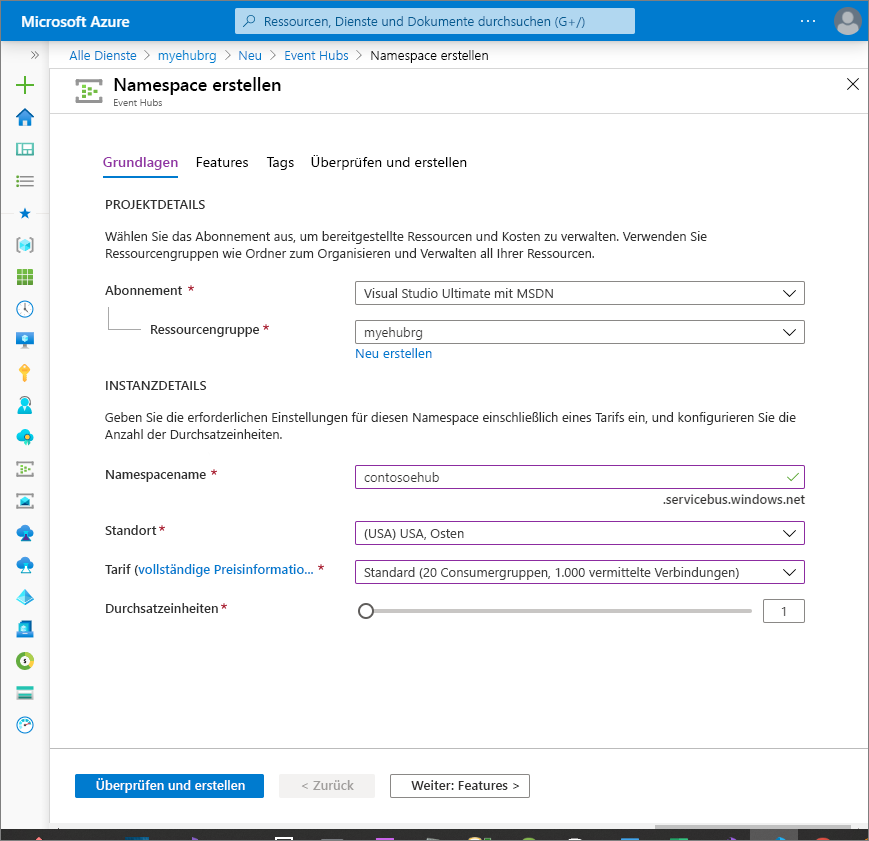
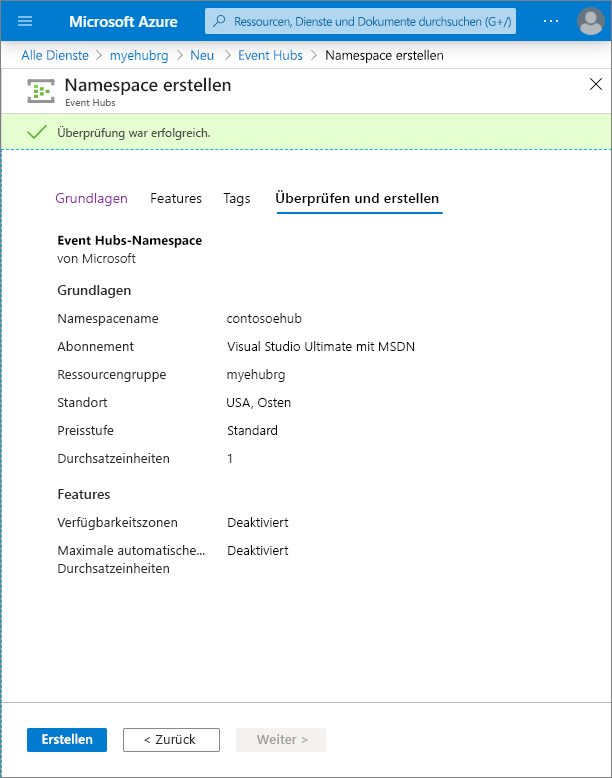
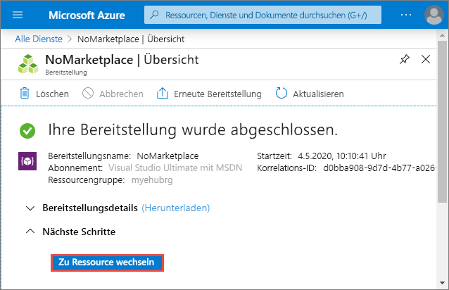
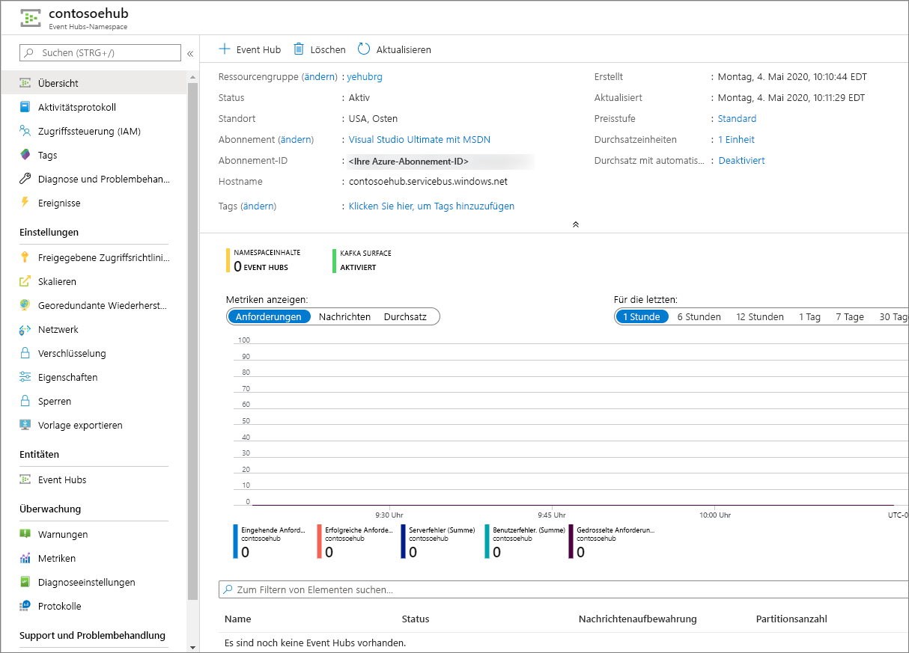

# Schnellstart: Erstellen eines Event Hubs mithilfe des Azure-Portals
Azure Event Hubs ist eine Big Data-Streamingplattform und ein Ereigniserfassungsdienst, der Millionen von Ereignissen pro Sekunde empfangen und verarbeiten kann. Event Hubs kann Ereignisse, Daten oder Telemetriedaten, die von verteilter Software und verteilten Geräten erzeugt wurden, verarbeiten und speichern. An einen Event Hub gesendete Daten können transformiert und mit einem beliebigen Echtzeitanalyse-Anbieter oder Batchverarbeitungs-/Speicheradapter gespeichert werden. Eine ausführliche Übersicht über Event Hubs finden Sie unter [Was ist Azure Event Hubs?](event-hubs-about.md) und [Event Hubs-Features im Überblick](event-hubs-features.md).

In dieser Schnellstartanleitung erstellen Sie einen Event Hub mit dem [Azure-Portal](https://portal.azure.com).

## Voraussetzungen

Stellen Sie für diese Schnellstartanleitung sicher, dass Sie über Folgendes verfügen:

- Azure-Abonnement. Falls Sie kein Abonnement besitzen, können Sie ein [kostenloses Konto erstellen](https://azure.microsoft.com/free/), bevor Sie beginnen.

## Erstellen einer Ressourcengruppe

Eine Ressourcengruppe ist eine logische Sammlung mit Azure-Ressourcen. Alle Ressourcen werden in einer Ressourcengruppe bereitgestellt und verwaltet. So erstellen Sie eine Ressourcengruppe:

1. Melden Sie sich beim [Azure-Portal](https://portal.azure.com) an.
1. Wählen Sie im linken Navigationsbereich die Option **Ressourcengruppen** aus. Wählen Sie anschließend **Hinzufügen**.

   

1. Wählen Sie unter **Abonnement** den Namen des Azure-Abonnements aus, in dem Sie die Ressourcengruppe erstellen möchten.
1. Geben Sie einen eindeutigen **Namen für die Ressourcengruppe** ein. Das System überprüft sofort, ob der Name im derzeit ausgewählten Azure-Abonnement verfügbar ist.
1. Wählen Sie eine **Region** für die Ressourcengruppe aus.
1. Klicken Sie auf **Überprüfen + erstellen**.

   
1. Wählen Sie auf der Seite **Bewerten + erstellen** die Option **Erstellen**. 

## Erstellen eines Event Hubs-Namespace

Ein Event Hubs-Namespace bietet einen Container mit einem eindeutigen Bereich, in dem Sie einen oder mehrere Event Hubs erstellen können. Führen Sie die folgenden Schritte aus, um mit dem Portal einen Namespace in Ihrer Ressourcengruppe zu erstellen:

1. Wählen Sie im Azure-Portal oben links **Ressource erstellen** aus.
1. Wählen Sie im linken Menü **Alle Dienste** aus. Wählen Sie dann in der Kategorie **Analyse** neben **Event Hubs** den **Stern (`*`)** aus. Überprüfen Sie, ob **Event Hubs** im linken Navigationsmenü zu **FAVORITEN** hinzugefügt wurde. 
    
   
1. Wählen Sie im linken Navigationsmenü unter **FAVORITEN** die Option **Event Hubs**. Wählen Sie anschließend auf der Symbolleiste die Option **Hinzufügen** aus.

   
1. Gehen Sie auf der Seite **Namespace erstellen** wie folgt vor:  
   1. Wählen Sie das **Abonnement** aus, in dem Sie den Namespace erstellen möchten.  
   1. Wählen Sie die **Ressourcengruppe** aus, die Sie im vorherigen Schritt erstellt haben.   
   1. Geben Sie einen **Namen** für den Namespace ein. Das System überprüft sofort, ob dieser Name verfügbar ist.  
   1. Wählen Sie einen **Standort** für den Namespace aus.
   1. Wählen Sie den **Tarif** (Basic oder Standard) aus. Informationen zu den Unterschieden zwischen den Tarifen „Basic“ und „Standard“ finden Sie unter [Event Hubs – Preise](https://azure.microsoft.com/pricing/details/event-hubs/), [Was ist der Unterschied zwischen den Event Hubs-Ebenen Basic und Standard?](event-hubs-faq.yml#what-is-the-difference-between-event-hubs-basic-and-standard-tiers-) und [Kontingente und Grenzwerte in Azure Event Hubs](event-hubs-quotas.md). 
   1. Lassen Sie die Einstellungen für **Durchsatzeinheiten** unverändert. Durchsatzeinheiten werden vorab als Kapazitätseinheiten erworben. Weitere Informationen zu Durchsatzeinheiten finden Sie unter [Skalierung mit Event Hubs](event-hubs-scalability.md#throughput-units).  
   1. Wählen Sie am unteren Rand der Seite die Option **Bewerten + erstellen** aus.
      
      
   1. Überprüfen Sie die Einstellungen auf der Seite **Bewerten + erstellen**, und wählen Sie **Erstellen** aus. Warten Sie, bis die Bereitstellung abgeschlossen ist. 
      
      
      
   1. Wählen Sie auf der Seite **Bereitstellung** die Option **Zu Ressource wechseln** aus, um zur Seite für Ihren Namespace zu navigieren. 
      
        
   1. Vergewissern Sie sich, dass die Seite **Event Hubs-Namespace** in etwa aussieht wie das folgende Beispiel:   
      
             

      > [!NOTE]
      > Von Azure Event Hubs wird ein Kafka-Endpunkt bereitgestellt. Dieser Endpunkt ermöglicht Ihrem Event Hubs-Namespace die native Erkennung des [Apache Kafka](https://kafka.apache.org/intro)-Nachrichtenprotokolls und der APIs. Mit dieser Funktion können Sie wie bei Kafka-Themen mit Ihrem Event Hubs kommunizieren, ohne Ihre Protokollclients ändern oder eigene Cluster ausführen zu müssen. Event Hubs unterstützt [Apache Kafka Version 1.0.](https://kafka.apache.org/10/documentation.html) und höher. Weitere Informationen finden Sie unter [Verwenden von Azure Event Hubs aus Apache Kafka-Anwendungen](event-hubs-for-kafka-ecosystem-overview.md).
    
## Erstellen eines Ereignis-Hubs

Führen Sie die folgenden Schritte aus, um im Namespace einen Event Hub zu erstellen:

1. Wählen Sie auf der Seite „Event Hubs-Namespace“ im linken Menü **Event Hubs** aus.
1. Wählen Sie oben im Fenster die Option **+ Event Hub** aus.
   
    
1. Geben Sie einen Namen für den Event Hub ein, und wählen Sie **Erstellen** aus.
   
    

    Über die Einstellung **Partitionsanzahl** können Sie den Verbrauch vieler Consumer parallelisieren. Weitere Informationen finden Sie unter [Partitionen](event-hubs-scalability.md#partitions).

    Die Einstellung **Nachrichtenaufbewahrung** gibt an, wie lange der Event Hubs-Dienst Daten speichert. Weitere Informationen finden Sie unter [Ereignisaufbewahrung](event-hubs-features.md#event-retention).
1. Sie können den Status der Event Hub-Erstellung in den Warnungen überprüfen. Nachdem der Event Hub erstellt wurde, wird er in der Liste der Event Hubs angezeigt.

    
    
## Nächste Schritte

In diesem Artikel haben Sie eine Ressourcengruppe, einen Event Hubs-Namespace und einen Event Hub erstellt. Schritt-für-Schritt-Anleitungen zum Senden von Ereignissen an einen oder Empfangen von Ereignissen von einem Event Hub finden Sie in den folgenden Tutorials: 

- [.NET Core](event-hubs-dotnet-standard-getstarted-send.md)
- [Java](event-hubs-java-get-started-send.md)
- [Python](event-hubs-python-get-started-send.md)
- [JavaScript](event-hubs-node-get-started-send.md)
- [Go](event-hubs-go-get-started-send.md)
- [C (nur senden)](event-hubs-c-getstarted-send.md)
- [Apache Storm (nur empfangen)](event-hubs-storm-getstarted-receive.md)

[Azure portal]: https://portal.azure.com/
[3]: ./media/event-hubs-quickstart-portal/sender1.png
[4]: ./media/event-hubs-quickstart-portal/receiver1.png
