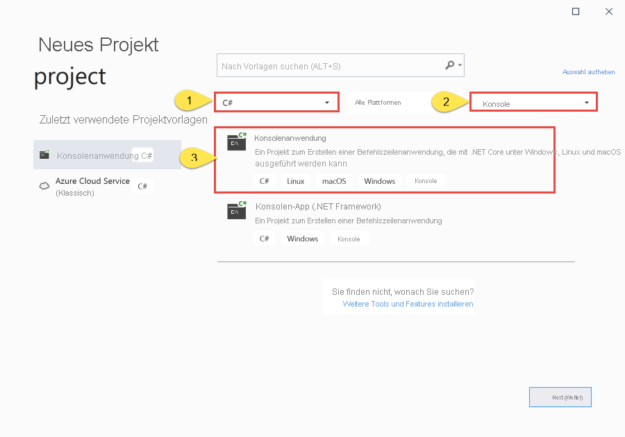
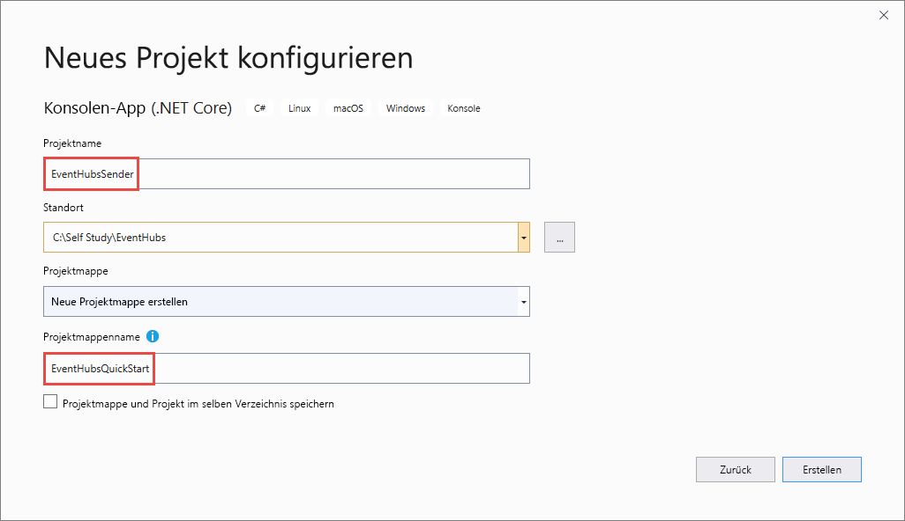

# <a name="send-events-to-or-receive-events-from-azure-event-hubs---net-core-azuremessagingeventhubs"></a>Senden oder Empfangen von Ereignissen an bzw. von Azure Event Hubs – .NET Core (Azure.Messaging.EventHubs) 
Event Hubs ist ein Dienst, der große Mengen von Ereignisdaten (Telemetriedaten) von verbundenen Geräten und Anwendungen verarbeiten kann. Nachdem Sie Daten in Event Hubs gesammelt haben, können Sie diese mithilfe eines Speicherclusters speichern oder Ereignisse verarbeiten. Eine Möglichkeit wäre beispielsweise, Ereignisdaten mithilfe eines Echtzeitanalyseanbieters zu transformieren. Diese Funktion der umfangreichen Ereignissammlung und -verarbeitung ist eine wichtige Komponente moderner Anwendungsarchitekturen. Hierzu zählt auch das Internet der Dinge (Internet of Things, IoT). Eine ausführliche Übersicht über Event Hubs finden Sie unter [Was ist Azure Event Hubs?](event-hubs-about.md) und [Event Hubs-Features im Überblick](event-hubs-features.md).

In diesem Tutorial erfahren Sie, wie Sie Ereignisse unter Verwendung des .NET Core SDK für Event Hubs an einen Event Hub senden oder von diesem empfangen. 

> [!IMPORTANT]
> In dieser Schnellstartanleitung wird die neue Bibliothek **Azure.Messaging.EventHubs** verwendet. Eine Schnellstartanleitung mit der alten Bibliothek **Microsoft.Azure.EventHubs** finden Sie in [diesem Artikel](event-hubs-dotnet-standard-getstarted-send.md). 

## <a name="prerequisites"></a>Voraussetzungen

- **Microsoft Azure-Abonnement.** Für die Verwendung von Azure-Diensten benötigen Sie ein Abonnement. Das gilt auch für Azure Event Hubs.  Falls Sie noch nicht über ein Azure-Konto verfügen, können Sie sich für eine [kostenlose Testversion](https://azure.microsoft.com/free/) registrieren oder beim [Erstellen eines Kontos](https://azure.microsoft.com) Ihre MSDN-Abonnentenvorteile nutzen.
- **Microsoft Visual Studio 2019**. Die Azure Event Hubs-Clientbibliothek nutzt neue Features, die in C# 8.0 eingeführt wurden.  Die Bibliothek kann zwar auch weiterhin mit älteren Versionen von C# verwendet werden, dann stehen aber nicht alle Funktionen zur Verfügung.  Wenn Sie diese Features aktivieren möchten, müssen Sie [.NET Core 3.0 als Ziel angeben](/dotnet/standard/frameworks#how-to-specify-target-frameworks) oder [die Sprachversion angeben](/dotnet/csharp/language-reference/configure-language-version#override-a-default), die Sie verwenden möchten (8.0 oder höher). Bei Verwendung von Visual Studio sind Versionen vor Visual Studio 2019 nicht mit den Tools kompatibel, die zum Erstellen von C# 8.0-Projekten erforderlich sind. Visual Studio 2019 (einschließlich der kostenlosen Community-Edition) kann [hier](https://visualstudio.microsoft.com/vs/) heruntergeladen werden.
- **Erstellen Sie einen Event Hubs-Namespace und einen Event Hub**. Verwenden Sie zunächst das [Azure-Portal](https://portal.azure.com), um einen Namespace vom Typ „Event Hubs“ zu erstellen, und beschaffen Sie die Verwaltungsanmeldeinformationen, die Ihre Anwendung für die Kommunikation mit dem Event Hub benötigt. Erstellen Sie anhand der Anleitung in [diesem Artikel](event-hubs-create.md) einen Namespace und einen Event Hub. Gehen Sie dann wie im folgenden Artikel beschrieben vor, um die **Verbindungszeichenfolge für den Event Hubs-Namespace** abzurufen: [Abrufen der Verbindungszeichenfolge](event-hubs-get-connection-string.md#get-connection-string-from-the-portal). Die Verbindungszeichenfolge wird im weiteren Verlauf dieses Tutorials benötigt.

## <a name="send-events"></a>Senden von Ereignisse 
In diesem Abschnitt erfahren Sie, wie Sie eine .NET Core-Anwendung zum Senden von Ereignissen an einen Event Hub erstellen. 

### <a name="create-a-console-application"></a>Erstellen einer Konsolenanwendung

1. Starten Sie Visual Studio 2019. 
1. Wählen Sie **Neues Projekt erstellen** aus. 
1. Führen Sie im Dialogfeld **Neues Projekt erstellen** die folgenden Schritte aus: Sollte dieses Dialogfeld nicht angezeigt werden, wählen Sie im Menü die Option **Datei** und anschließend **Neu** > **Projekt** aus. 
    1. Wählen Sie die Programmiersprache **C#** aus.
    1. Wählen Sie den Anwendungstyp **Konsole** aus. 
    1. Wählen Sie in der Ergebnisliste die Option **Konsolen-App (.NET Core)** aus. 
    1. Klicken Sie anschließend auf **Weiter**. 

            
1. Geben Sie **EventHubsSender** als Projektname und **EventHubsQuickStart** als Projektmappenname ein, und wählen Sie anschließend **OK** aus, um das Projekt zu erstellen. 

    

### <a name="add-the-event-hubs-nuget-package"></a>Hinzufügen des Event Hubs-NuGet-Pakets

1. Wählen Sie im Menü **Extras** > **NuGet-Paket-Manager** > **Paket-Manager-Konsole** aus. 
1. Führen Sie den folgenden Befehl aus, um das NuGet-Paket **Azure.Messaging.EventHubs** zu installieren:

    ```cmd
    Install-Package Azure.Messaging.EventHubs
    ```


### <a name="write-code-to-send-messages-to-the-event-hub"></a>Schreiben von Code zum Senden von Nachrichten an den Event Hub

1. Fügen Sie am Anfang der Datei **Program.cs** die folgenden `using`-Anweisungen hinzu:

    ```csharp
    using System.Text;
    using System.Threading.Tasks;
    using Azure.Messaging.EventHubs;
    using Azure.Messaging.EventHubs.Producer;
    ```

2. Fügen Sie der Klasse `Program` Konstanten für die Event Hubs-Verbindungszeichenfolge und den Namen des Event Hubs hinzu. Ersetzen Sie die in Klammern gesetzten Platzhalter durch die entsprechenden Werte, die Sie beim Erstellen des Event Hubs erhalten haben. Stellen Sie sicher, dass es sich bei `{Event Hubs namespace connection string}` um die Verbindungszeichenfolge auf Namespaceebene und nicht um die Event Hub-Zeichenfolge handelt. 

    ```csharp
    private const string connectionString = "<EVENT HUBS NAMESPACE - CONNECTION STRING>";
    private const string eventHubName = "<EVENT HUB NAME>";
    ```

3. Ersetzen Sie die Methode `Main` durch die folgende Methode vom Typ `async Main`. Weitere Einzelheiten finden Sie in den Codekommentaren. 

    ```csharp
        static async Task Main()
        {
            // Create a producer client that you can use to send events to an event hub
            await using (var producerClient = new EventHubProducerClient(connectionString, eventHubName))
            {
                // Create a batch of events 
                using EventDataBatch eventBatch = await producerClient.CreateBatchAsync();

                // Add events to the batch. An event is a represented by a collection of bytes and metadata. 
                eventBatch.TryAdd(new EventData(Encoding.UTF8.GetBytes("First event")));
                eventBatch.TryAdd(new EventData(Encoding.UTF8.GetBytes("Second event")));
                eventBatch.TryAdd(new EventData(Encoding.UTF8.GetBytes("Third event")));

                // Use the producer client to send the batch of events to the event hub
                await producerClient.SendAsync(eventBatch);
                Console.WriteLine("A batch of 3 events has been published.");
            }
        }
    ```
5. Erstellen Sie das Projekt, und vergewissern Sie sich, dass keine Fehler vorhanden sind.
6. Führen Sie das Programm aus, und warten Sie auf die Bestätigungsmeldung. 
7. Im Azure-Portal können Sie überprüfen, ob der Event Hub die Nachrichten empfangen hat. Wechseln Sie im Abschnitt **Metriken** zur Ansicht **Nachrichten**. Aktualisieren Sie die Seite, um das Diagramm zu aktualisieren. Es kann einige Sekunden dauern, bis angezeigt wird, dass die Nachrichten empfangen wurden. 

    [](./media/getstarted-dotnet-standard-send-v2/verify-messages-portal.png#lightbox)

    > [!NOTE]
    > Den gesamten Quellcode mit weiteren informativen Kommentaren finden Sie [auf GitHub in dieser Datei](https://github.com/Azure/azure-sdk-for-net/blob/master/sdk/eventhub/Azure.Messaging.EventHubs/samples/Sample03_PublishAnEventBatch.cs).

## <a name="receive-events"></a>Empfangen von Ereignissen
In diesem Abschnitt erfahren Sie, wie Sie eine .NET Core-Konsolenanwendung schreiben, die unter Verwendung eines Ereignisprozessors Nachrichten von einem Event Hub empfängt. Der Ereignisprozessor vereinfacht das Empfangen von Ereignissen von Event Hubs durch die Verwaltung permanenter Prüfpunkte und paralleler Empfangsvorgänge von diesen Event Hubs. Ein Ereignisprozessor wird einem bestimmten Event Hub und einer bestimmten Consumergruppe zugeordnet. Er empfängt Ereignisse von mehreren Partitionen im Event Hub und übergibt sie zur Verarbeitung an einen Handlerdelegaten, der dafür von Ihnen bereitgestellten Code verwendet. 


### <a name="create-an-azure-storage-and-a-blob-container"></a>Erstellen eines Azure Storage-Kontos und eines Blobcontainers
In dieser Schnellstartanleitung wird Azure Storage als Prüfpunktspeicher verwendet. Führen Sie die folgenden Schritte aus, um ein Azure Storage-Konto zu erstellen: 

1. [Erstellen Sie ein Azure Storage-Konto.](/azure/storage/common/storage-account-create?tabs=azure-portal)
2. [Erstellen eines Blobcontainers](../storage/blobs/storage-quickstart-blobs-portal.md#create-a-container)
3. [Abrufen der Verbindungszeichenfolge für das Speicherkonto](../storage/common/storage-configure-connection-string.md?#view-and-copy-a-connection-string)

    Notieren Sie sich die Verbindungszeichenfolge und den Containernamen. Sie werden diese Angaben im Empfangscode verwenden. 


### <a name="create-a-project-for-the-receiver"></a>Erstellen eines Projekts für den Empfänger

1. Klicken Sie im Projektmappen-Explorer mit der rechten Maustaste auf die Projektmappe **EventHubQuickStart**, zeigen Sie auf **Hinzufügen**, und wählen Sie anschließend **Neues Projekt** aus. 
1. Wählen Sie **Konsolen-App (.NET Core)** und anschließend **Weiter** aus. 
1. Geben Sie unter **Projektname** den Namen **EventHubsReceiver** ein, and wählen Sie **Erstellen** aus. 

### <a name="add-the-event-hubs-nuget-package"></a>Hinzufügen des Event Hubs-NuGet-Pakets

1. Wählen Sie im Menü **Extras** > **NuGet-Paket-Manager** > **Paket-Manager-Konsole** aus. 
1. Führen Sie den folgenden Befehl aus, um das NuGet-Paket **Azure.Messaging.EventHubs** zu installieren:

    ```cmd
    Install-Package Azure.Messaging.EventHubs
    ```
1. Führen Sie den folgenden Befehl aus, um das NuGet-Paket **Azure.Messaging.EventHubs.Processor** zu installieren:

    ```cmd
    Install-Package Azure.Messaging.EventHubs.Processor
    ```    

### <a name="update-the-main-method"></a>Aktualisieren der Methode „Main“ 

1. Fügen Sie am Anfang der Datei **Program.cs** die folgenden `using`-Anweisungen hinzu.

    ```csharp
    using System.Text;
    using System.Threading.Tasks;
    using Azure.Storage.Blobs;
    using Azure.Messaging.EventHubs;
    using Azure.Messaging.EventHubs.Consumer;
    using Azure.Messaging.EventHubs.Processor;
    ```
1. Fügen Sie der Klasse `Program` Konstanten für die Event Hubs-Verbindungszeichenfolge und den Namen des Event Hubs hinzu. Ersetzen Sie die in Klammern gesetzten Platzhalter durch die entsprechenden Werte, die Sie beim Erstellen des Event Hubs erhalten haben. Ersetzen Sie die in Klammern gesetzten Platzhalter durch die entsprechenden Werte, die Sie beim Erstellen des Event Hubs und des Speicherkontos erhalten haben (Zugriffsschlüssel, primäre Verbindungszeichenfolge). Stellen Sie sicher, dass es sich bei `{Event Hubs namespace connection string}` um die Verbindungszeichenfolge auf Namespaceebene und nicht um die Event Hub-Zeichenfolge handelt.

    ```csharp
        private const string ehubNamespaceConnectionString = "<EVENT HUBS NAMESPACE - CONNECTION STRING>";
        private const string eventHubName = "<EVENT HUB NAME>";
        private const string blobStorageConnectionString = "<AZURE STORAGE CONNECTION STRING>";
        private const string blobContainerName = "<BLOB CONTAINER NAME>";
    ```
3. Ersetzen Sie die Methode `Main` durch die folgende Methode vom Typ `async Main`. Weitere Einzelheiten finden Sie in den Codekommentaren. 

    ```csharp
        static async Task Main()
        {
            // Read from the default consumer group: $Default
            string consumerGroup = EventHubConsumerClient.DefaultConsumerGroupName;

            // Create a blob container client that the event processor will use 
            BlobContainerClient storageClient = new BlobContainerClient(blobStorageConnectionString, blobContainerName);

            // Create an event processor client to process events in the event hub
            EventProcessorClient processor = new EventProcessorClient(storageClient, consumerGroup, ehubNamespaceConnectionString, eventHubName);

            // Register handlers for processing events and handling errors
            processor.ProcessEventAsync += ProcessEventHandler;
            processor.ProcessErrorAsync += ProcessErrorHandler;

            // Start the processing
            await processor.StartProcessingAsync();

            // Wait for 10 seconds for the events to be processed
            await Task.Delay(TimeSpan.FromSeconds(10));

            // Stop the processing
            await processor.StopProcessingAsync();
        }    
    ```
1. Fügen Sie der Klasse nun die folgenden Ereignis- und Fehlerhandlermethoden hinzu. 

    ```csharp
        static Task ProcessEventHandler(ProcessEventArgs eventArgs)
        { 
            // Write the body of the event to the console window
            Console.WriteLine("\tRecevied event: {0}", Encoding.UTF8.GetString(eventArgs.Data.Body.ToArray())); 
            return Task.CompletedTask; 
        }

        static Task ProcessErrorHandler(ProcessErrorEventArgs eventArgs)
        {
            // Write details about the error to the console window
            Console.WriteLine($"\tPartition '{ eventArgs.PartitionId}': an unhandled exception was encountered. This was not expected to happen.");
            Console.WriteLine(eventArgs.Exception.Message);
            return Task.CompletedTask;
        }    
    ```
1. Erstellen Sie das Projekt, und vergewissern Sie sich, dass keine Fehler vorhanden sind.

    > [!NOTE]
    > Den gesamten Quellcode mit weiteren informativen Kommentaren finden Sie [auf GitHub in dieser Datei](https://github.com/Azure/azure-sdk-for-net/blob/master/sdk/eventhub/Azure.Messaging.EventHubs.Processor/samples/Sample01_HelloWorld.cs).
6. Führen Sie die Empfängeranwendung aus. 
1. Daraufhin sollte eine Nachricht mit dem Hinweis angezeigt werden, dass das Ereignis empfangen wurde. 

    

    Bei diesen Ereignissen handelt es sich um die drei Ereignisse, die Sie zuvor durch Ausführen des Sendeprogramms an den Event Hub gesendet haben. 


## <a name="next-steps"></a>Nächste Schritte
Sehen Sie sich die Beispiele auf GitHub an: 

- [Event Hubs-Beispiele auf GitHub](https://github.com/Azure/azure-sdk-for-net/tree/master/sdk/eventhub/Azure.Messaging.EventHubs/samples)
- [Ereignisprozessorbeispiele auf GitHub](https://github.com/Azure/azure-sdk-for-net/tree/master/sdk/eventhub/Azure.Messaging.EventHubs.Processor/samples)
