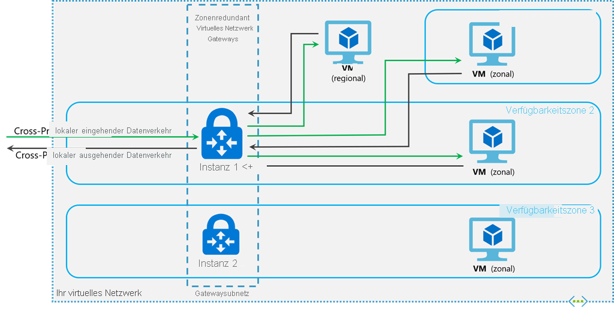

# <a name="about-expressroute-virtual-network-gateways"></a>Informationen zu ExpressRoute-Gateways für virtuelle Netzwerke

Wenn Sie Ihr virtuelles Azure-Netzwerk und Ihr lokales Netzwerk über ExpressRoute verbinden möchten, müssen Sie ein virtuelles Netzwerkgateway erstellen. Ein Gateway für virtuelle Netzwerke dient zwei Zwecken: dem Austausch von IP-Routen zwischen den Netzwerken und der Weiterleitung des Netzwerkdatenverkehrs. In diesem Artikel werden Gatewaytypen, Gateway-SKUs und die geschätzte Leistung nach SKU erläutert. In diesem Artikel wird auch ExpressRoute [FastPath](#fastpath) erläutert, ein Feature, das es dem Netzwerkdatenverkehr aus Ihrem lokalen Netzwerk ermöglicht, das virtuelle Netzwerkgateway zu umgehen, um die Leistung zu verbessern.

## <a name="gateway-types"></a>Gatewaytypen

Beim Erstellen eines Gateways für virtuelle Netzwerke müssen mehrere Einstellungen angegeben werden. Eine dieser erforderlichen Einstellungen, „-GatewayType“, gibt an, ob das Gateway für ExpressRoute- oder für VPN-Datenverkehr verwendet wird. Die zwei Gatewaytypen sind:

* **Vpn** – Wenn verschlüsselter Netzwerkdatenverkehr über das öffentliche Internet gesendet wird, verwenden Sie den Gatewaytyp „Vpn“. Dies wird auch als VPN Gateway bezeichnet. Bei Site-to-Site-, Point-to-Site- und VNet-zu-VNet-Verbindungen wird jeweils VPN Gateway verwendet.

* **ExpressRoute** – Verwenden Sie den Gatewaytyp „ExpressRoute“, wenn Netzwerkdatenverkehr über eine private Verbindung gesendet wird. Dies wird auch als ExpressRoute-Gateway bezeichnet und ist der Gatewaytyp, der auch zum Konfigurieren von ExpressRoute verwendet wird.

Ein virtuelles Netzwerk kann pro Gatewaytyp immer nur über ein einzelnes virtuelles Netzwerkgateway verfügen. So können Sie beispielsweise ein virtuelles Netzwerkgateway mit „-GatewayType Vpn“ und ein virtuelles Netzwerkgateway mit „-GatewayType ExpressRoute“ verwenden.

## <a name="gwsku"></a>Gateway-SKUs
[!INCLUDE [expressroute-gwsku-include](../../includes/expressroute-gwsku-include.md)]

Wenn Sie das Gateway auf eine leistungsfähigere Gateway-SKU aktualisieren möchten, können Sie in den meisten Fällen das PowerShell-Cmdlet „Resize-AzVirtualNetworkGateway“ verwenden. Mit diesem können Sie Upgrades von Standard- auf HighPerformance-SKUs durchführen. Für ein Upgrade auf die UltraPerformance-SKU müssen Sie jedoch das Gateway neu erstellen. Das Neuerstellen eines Gateways führt zu Ausfällen.

### <a name="aggthroughput"></a>Geschätzte Leistungen nach Gateway-SKU
In der folgenden Tabelle sind die Gatewaytypen und die geschätzten Leistungen angegeben. Diese Tabelle betrifft sowohl das Resource Manager-Bereitstellungsmodell als auch das klassische Bereitstellungsmodell.

[!INCLUDE [expressroute-table-aggthroughput](../../includes/expressroute-table-aggtput-include.md)]

> [!IMPORTANT]
> Die Anwendungsleistung hängt von mehreren Faktoren ab, z.B. der End-to-End-Latenz und der Anzahl der Datenflüsse, die die Anwendung öffnet. Die Zahlen in der Tabelle stellen die Obergrenze dar, die die Anwendung theoretisch in einer idealen Umgebung erzielen kann.
>
>

## <a name="gwsub"></a>Gatewaysubnetz

Bevor Sie ein ExpressRoute-Gateway erstellen, müssen Sie ein Gatewaysubnetz erstellen. Das Gatewaysubnetz enthält die IP-Adressen, die von den VMs und Diensten des virtuellen Netzwerkgateways verwendet werden. Bei der Erstellung des Gateways des virtuellen Netzwerks, werden Gateway-VMs für das Gatewaysubnetz bereitgestellt und mit den erforderlichen Einstellungen für das ExpressRoute-Gateway konfiguriert. Stellen Sie für das Gatewaysubnetz nie etwas anderes bereit (beispielsweise zusätzliche virtuelle Computer). Das Gatewaysubnetz muss den Namen „GatewaySubnet“ aufweisen, damit es einwandfrei funktioniert. Wenn Sie dem Gatewaysubnetz den Namen „GatewaySubnet“ zugewiesen haben, erkennt Azure, dass es sich dabei um das Subnetz handelt, für das die VMs und Dienste des virtuellen Netzwerkgateways bereitgestellt werden sollen.

>[!NOTE]
>[!INCLUDE [vpn-gateway-gwudr-warning.md](../../includes/vpn-gateway-gwudr-warning.md)]
>

Bei der Gatewayerstellung geben Sie die Anzahl der im Subnetz enthaltenen IP-Adressen an. Die IP-Adressen im Gatewaysubnetz werden den Gatewaydiensten und -VMs zugeordnet. Einige Konfigurationen erfordern mehr IP-Adressen als andere. 

Beziehen Sie sich beim Planen der Größe Ihres Gatewaysubnetzes auf die Dokumentation für die Konfiguration, die Sie erstellen möchten. Beispielsweise erfordert die Konfiguration für die parallele Ausführung von ExpressRoute/VPN Gateway ein größeres Subnetz als die meisten anderen Konfigurationen. Stellen Sie zusätzlich sicher, dass Ihr Gatewaysubnetz über genügend IP-Adressen verfügt, und berücksichtigen Sie dabei auch mögliche zukünftige Konfigurationen. Sie können zwar ein Gatewaysubnetz mit einer Größe von nur /29 erstellen, aber es empfiehlt sich, ein Gatewaysubnetz mit einer Größe von mindestens /27 oder größer (/27, /26 usw.) zu erstellen, wenn Sie über den erforderlichen Adressraum verfügen. Dies bietet Platz für die meisten Konfigurationen .

Im folgenden Resource Manager-PowerShell-Beispiel ist ein Gatewaysubnetz mit dem Namen GatewaySubnet zu sehen. Sie erkennen, das mit der CIDR-Notation die Größe /27 angegeben wird. Dies ist für eine ausreichende Zahl von IP-Adressen für die meisten Konfigurationen, die derzeit üblich sind, groß genug.

```azurepowershell-interactive
Add-AzVirtualNetworkSubnetConfig -Name 'GatewaySubnet' -AddressPrefix 10.0.3.0/27
```

[!INCLUDE [vpn-gateway-no-nsg](../../includes/vpn-gateway-no-nsg-include.md)]

### <a name="zrgw"></a>SKUs für zonenredundante Gateways

Sie können VPN- und ExpressRoute-Gateways auch in Azure-Verfügbarkeitszonen bereitstellen. Dadurch werden sie physisch und logisch in verschiedene Verfügbarkeitszonen unterteilt, wodurch Ihre lokale Netzwerkverbindung zu Azure vor Ausfällen auf Zonenebene geschützt wird.



Zonenredundante Gateways verwenden bestimmte neue Gateway-SKUs für ExpressRoute-Gateway.

* ErGw1AZ
* ErGw2AZ
* ErGw3AZ

Die neuen Gateway-SKUs unterstützen zudem andere Bereitstellungsoptionen, die Ihre Anforderungen am besten zu erfüllen. Wenn Sie ein virtuelles Netzwerkgateway mit den neuen Gateway-SKUs erstellen, haben Sie auch die Möglichkeit, das Gateway in einer bestimmten Zone bereitzustellen. Dies wird als zonenbasiertes Gateway bezeichnet. Wenn Sie ein zonenbasiertes Gateway bereitstellen, werden alle Instanzen des Gateways in derselben Verfügbarkeitszone bereitgestellt.

## <a name="fastpath"></a>FastPath

Das virtuelle Netzwerkgateway ExpressRoute wurde entwickelt, um Netzwerkrouten auszutauschen und den Netzwerkdatenverkehr zu steuern. FastPath wurde entwickelt, um die Datenpfadleistung zwischen Ihrem lokalen und dem virtuellen Netzwerk zu verbessern. Wenn aktiviert, sendet FastPath den Netzwerkdatenverkehr direkt an virtuelle Computer im virtuellen Netzwerk und umgeht dabei das Gateway.

Weitere Informationen zu FastPath, einschließlich Einschränkungen und Anforderungen, finden Sie unter [Informationen zu FastPath](about-fastpath.md).

## <a name="resources"></a>REST-APIs und PowerShell-Cmdlets
Zusätzliche technische Ressourcen und spezielle Syntaxanforderungen bei der Verwendung von REST-APIs und PowerShell-Cmdlets für Gatewaykonfigurationen für virtuelle Netzwerke finden Sie auf den folgenden Seiten:

| **Klassisch** | **Ressourcen-Manager** |
| --- | --- |
| [PowerShell](https://docs.microsoft.com/powershell/module/servicemanagement/azure/?view=azuresmps-4.0.0#azure) |[PowerShell](https://docs.microsoft.com/powershell/module/az.network#networking) |
| [REST-API](https://msdn.microsoft.com/library/jj154113.aspx) |[REST-API](https://msdn.microsoft.com/library/mt163859.aspx) |

## <a name="next-steps"></a>Nächste Schritte

Weitere Informationen zu verfügbaren Verbindungskonfigurationen finden Sie in der [ExpressRoute-Übersicht](expressroute-introduction.md).

Weitere Informationen zum Erstellen von ExpressRoute-Gateways finden Sie unter [Erstellen eines Gateways für ein virtuelles Netzwerk für ExpressRoute](expressroute-howto-add-gateway-resource-manager.md).

Weitere Informationen zum Konfigurieren zonenredundanter Gateways finden Sie unter [Erstellen eines zonenredundanten Gateways für virtuelle Netzwerke](../../articles/vpn-gateway/create-zone-redundant-vnet-gateway.md).

Weitere Informationen zu FastPath finden Sie unter [Informationen zu FastPath](about-fastpath.md).