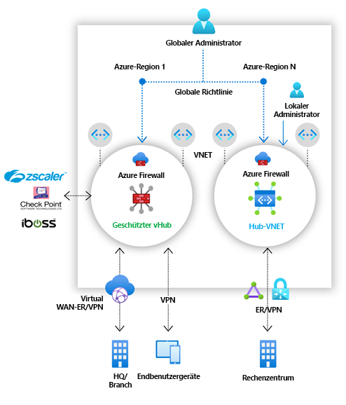

# Was ist Azure Firewall Manager?

Azure Firewall Manager ist ein Sicherheitsverwaltungsdienst, der eine zentrale Sicherheitsrichtlinien- und Routenverwaltung für cloudbasierte Sicherheitsperimeter bereitstellt. 

Firewall Manager bietet eine Sicherheitsverwaltung für zwei Netzwerkarchitekturtypen:

- **Geschützter virtueller Hub**

   Ein [Azure Virtual WAN Hub](../virtual-wan/virtual-wan-about.md#resources) ist eine von Microsoft verwaltete Ressource, mit der Sie ganz einfach Hub-and-Spoke-Architekturen erstellen können. Wenn einem solchen Hub Sicherheits- und Routingrichtlinien zugeordnet werden, wird dieser als *[geschützter virtueller Hub](secured-virtual-hub.md)* bezeichnet. 
- **Virtuelles Hubnetzwerk**

   Hierbei handelt es sich um ein virtuelles Azure-Standardnetzwerk, das Sie selbst erstellen und verwalten. Wenn einem solchen Hub Sicherheitsrichtlinien zugeordnet werden, wird dies als *virtuelles Hubnetzwerk* bezeichnet. Zurzeit wird nur die Azure Firewall-Richtlinie unterstützt. Sie können virtuelle Spoke-Netzwerke, die Ihre Workloadserver und -dienste enthalten, per Peering verknüpfen. Sie können auch Firewalls in eigenständigen virtuellen Netzwerken verwalten, die nicht per Peering mit einem Spoke verknüpft sind.

Einen ausführlichen Vergleich des *geschützten virtuellen Hubs* und des *virtuellen Hubnetzwerks* finden Sie unter [Welche Architekturoptionen gibt es für Azure Firewall Manager?](vhubs-and-vnets.md).

## Azure Firewall Manager-Features

Azure Firewall Manager bietet die folgenden Features:

### Zentrale Azure Firewall-Bereitstellung und -Konfiguration

Sie können zentral mehrere Azure Firewall-Instanzen bereitstellen und konfigurieren, die sich über verschiedene Azure-Regionen und -Abonnements erstrecken. 

### Hierarchische Richtlinien (global und lokal)

Sie können mit Azure Firewall Manager Azure Firewall-Richtlinien für mehrere geschützte virtuelle Hubs zentral verwalten. Ihre zentralen IT-Teams können globale Firewallrichtlinien erstellen, um organisationsweite und teamübergreifende Firewallrichtlinien zu erzwingen. Lokal erstellte Firewallrichtlinien ermöglichen ein DevOps-Self-Service-Modell für mehr Agilität.

### Integration von Drittanbieter-SECaaS-Lösungen für höhere Sicherheit

Zusätzlich zur Azure Firewall können Sie SECaaS-Anbieter (Security-as-a-Service) von Drittanbietern integrieren, um zusätzlichen Netzwerkschutz für Ihre VNET-Verbindungen und Internetverbindungen von Zweigstellen zu erzielen.

Dieses Feature ist nur für Bereitstellungen von geschützten virtuellen Hubs verfügbar.

- Filterung von V2I-Datenverkehr (VNET-to-Internet)

   - Filtern Sie ausgehenden VNET-Datenverkehr mit einem Drittanbieter-Sicherheitsanbieter Ihrer Wahl.
   - Nutzen Sie erweiterten, benutzerfähigen Internetschutz für Ihre in Azure ausgeführten Cloudworkloads.

- Filtern von B2I-Datenverkehr (Branch-to-Internet)

   Nutzen Sie Ihre Azure-Konnektivität und die globale Verteilung, um für B2I-Szenarien auf einfache Weise eine Drittanbieterfilterung hinzuzufügen.

Weitere Informationen zu Sicherheitspartneranbietern finden Sie unter [Was sind Azure Firewall Manager-Sicherheitspartneranbieter?](trusted-security-partners.md).

### Zentrale Routenverwaltung

Leiten Sie den Datenverkehr zur Filterung und Protokollierung einfach an Ihren geschützten Hub weiter, ohne dass Sie manuell benutzerdefinierte Routen (UDR) für virtuelle Spoke-Netzwerke einrichten müssen. 

Dieses Feature ist nur für Bereitstellungen von geschützten virtuellen Hubs verfügbar.

Sie können für die Filterung von B2I-Datenverkehr Anbieter von Drittanbietern verwenden, gemeinsam mit Azure Firewall für B2V (Branch-to-VNET), V2V (VNET-to-VNET) und V2I (VNET-to-Internet). Sie können auch Lösungen von Drittanbietern für die V2I-Datenverkehrsfilterung verwenden, solange Azure Firewall nicht für B2V oder V2V benötigt wird. 

## Regionale Verfügbarkeit

Azure Firewall-Richtlinien können regionsübergreifend verwendet werden. Beispielsweise können Sie eine Richtlinie in „USA, Westen“ erstellen und in „USA, Osten“ verwenden. 

## Bekannte Probleme

Für Azure Firewall Manager sind die folgenden Probleme bekannt:

|Problem  |BESCHREIBUNG  |Minderung  |
|---------|---------|---------|
|Trennung von Datenverkehr|Die Trennung von Microsoft 365-Datenverkehr und öffentlichem Azure-PaaS-Datenverkehr wird aktuell nicht unterstützt. Daher wird bei Auswahl eines Drittanbieters für V2I oder B2I auch der gesamte öffentliche Azure-PaaS- und Microsoft 365-Datenverkehr über den Partnerdienst gesendet.|Die Datenverkehrstrennung am Hub wird untersucht.
|Ein geschützter virtueller Hub pro Region|Sie können nicht mehr als einen geschützten virtuellen Hub pro Region verwenden.|Erstellen Sie mehrere virtuelle WANs in einer Region.|
|Basisrichtlinien müssen in derselben Region wie die lokale Richtlinie vorliegen|Erstellen Sie sämtliche Ihrer lokalen Richtlinien in derselben Region wie die Basisrichtlinie. Eine in einer Region erstellte Richtlinie kann weiterhin auf einen geschützten Hub aus einer anderen Region angewendet werden.|Wird untersucht|
|Filtern von Datenverkehr zwischen Hubs in Bereitstellungen mit geschützten Hubs|Das Filtern der Kommunikation zwischen geschützten virtuellen Hubs wird noch nicht unterstützt. Die Kommunikation zwischen Hubs funktioniert jedoch weiterhin, wenn die Filterung von privatem Datenverkehr per Azure Firewall nicht aktiviert ist.|Wird untersucht|
|Spokes in einer anderen Region als der virtuelle Hub|Spokes in einer anderen Region als der virtuelle Hub werden nicht unterstützt.|Wird untersucht  Erstellen Sie einen Hub pro Region, und verknüpfen Sie VNETs, die sich in der gleichen Region befinden wie der Hub, mittels Peering.|
|Branch-to-Branch-Datenverkehr mit aktivierter Filterung von privatem Datenverkehr|Branch-to-Branch-Datenverkehr wird nicht unterstützt, wenn die Filterung von privatem Datenverkehr aktiviert ist. |Wird untersucht  Schützen Sie privaten Datenverkehr nicht, wenn die Branch-to-Branch-Konnektivität wichtig ist.|
|Alle geschützten virtuellen Hubs, die das gleiche virtuelle WAN nutzen, müssen sich in derselben Ressourcengruppe befinden.|Dieses Verhalten orientiert sich heute an Virtual WAN-Hubs.|Erstellen Sie mehrere Virtual WAN-Instanzen, um die Erstellung von geschützten virtuellen Hubs in verschiedenen Ressourcengruppen zu ermöglichen.|
|Fehler beim Massenhinzufügen von IP-Adressen|Die Firewall des geschützten Hubs wird in einen Fehlerzustand versetzt, wenn Sie eine größere Zahl von öffentlichen IP-Adressen hinzufügen.|Fügen Sie öffentliche IP-Adressen in kleineren Schritten hinzu. Fügen Sie beispielsweise nur zehn gleichzeitig hinzu.|
|DDoS Protection Standard wird bei geschützten virtuellen Hubs nicht unterstützt.|DDoS Protection Standard ist nicht in vWANs integriert.|Wird untersucht|
|Aktivitätsprotokolle werden nicht vollständig unterstützt.|Firewallrichtlinie unterstützt derzeit keine Aktivitätsprotokolle.|Wird untersucht|
|Bei der Migration der Firewall zur Verwendung der Firewallrichtlinie werden einige Firewalleinstellungen nicht migriert.|Bei der Migration zur Azure-Firewallrichtlinie werden Verfügbarkeitszonen und private SNAT-Adressen nicht migriert.|Wird untersucht| 

## Nächste Schritte

- Lesen Sie [Übersicht über die Bereitstellung mit Azure Firewall Manager](deployment-overview.md)
- Weitere Informationen über [geschützte virtuelle Hubs](secured-virtual-hub.md)
