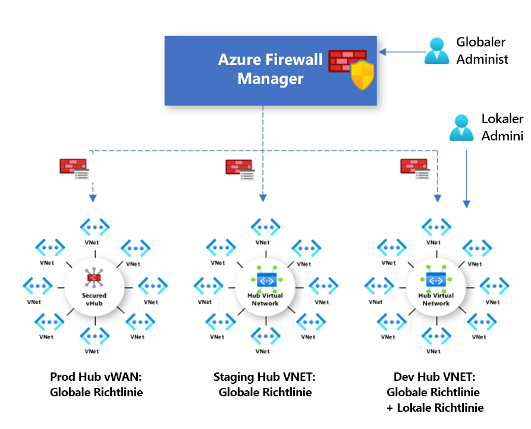

# Übersicht über die Azure Firewall Manager-Richtlinie

Bei einer Firewallrichtlinie handelt es sich um eine Azure-Ressource, die sowohl NAT-, Netzwerk- und Anwendungsregelsammlungen als auch Threat Intelligence-Einstellungen enthält. Sie ist eine globale Ressource, die über mehrere Azure Firewall-Instanzen hinweg in geschützten virtuellen Hubs sowie in virtuellen Hubnetzwerken verwendet werden kann. Richtlinien können regions- und abonnementübergreifend verwendet werden.

## Richtlinienerstellung und -zuordnung

Eine Richtlinie kann auf verschiedene Arten erstellt und verwaltet werden – etwa über das Azure-Portal, per REST-API, mithilfe von Vorlagen, per Azure PowerShell oder über die Befehlszeilenschnittstelle.

Darüber hinaus können bereits vorhandene Regeln über das Portal oder per Azure PowerShell aus Azure Firewall migriert werden, um Richtlinien zu erstellen. Weitere Informationen finden Sie unter [Migrieren von Azure Firewall-Konfigurationen zu einer Azure Firewall-Richtlinie](migrate-to-policy.md). 

Richtlinien können virtuellen Hubs oder VNETs zugeordnet werden. Die Firewall kann sich in einem beliebigen, Ihrem Konto zugeordneten Abonnement und in einer beliebigen Region befinden.

## Hierarchische Richtlinien

Neue Richtlinien können von Grund auf neu erstellt oder von vorhandenen Richtlinien geerbt werden. Die Vererbung ermöglicht DevOps die Erstellung lokaler Firewallrichtlinien zusätzlich zur obligatorischen Basisrichtlinie der Organisation.

Richtlinien, die mit nicht leeren übergeordneten Richtlinien erstellt werden, erben alle Regelsammlungen der übergeordneten Richtlinie. Netzwerkregelsammlungen, die von einer übergeordneten Richtlinie geerbt wurden, haben immer Vorrang vor Netzwerkregelsammlungen, die als Teil einer neuen Richtlinie definiert werden. Gleiches gilt auch für Anwendungsregelsammlungen. Allerdings werden Netzwerkregelsammlungen unabhängig von der Vererbung immer vor Anwendungsregelsammlungen verarbeitet.

Der Threat Intelligence-Modus wird ebenfalls von der übergeordneten Richtlinie geerbt. Sie können Ihren Threat Intelligence-Modus auf einen anderen Wert festlegen, um dieses Verhalten zu überschreiben, Sie können den Modus jedoch nicht deaktivieren. Er kann nur mit einem strengeren Wert überschrieben werden. Beispiel: Wenn die übergeordnete Richtlinie auf **Nur Warnung** festgelegt ist, können Sie diese lokale Richtlinie mit **Warnen und ablehnen** konfigurieren.

Wie der Threat Intelligence-Modus wird auch die Threat Intelligence-Zulassungsliste von der übergeordneten Richtlinie geerbt. Die untergeordnete Richtlinie kann der Zulassungsliste zusätzliche IP-Adressen hinzufügen.

NAT-Regelsammlungen werden nicht geerbt, da sie für eine bestimmte Firewall spezifisch sind.

Bei der Vererbung werden alle Änderungen an der übergeordneten Richtlinie automatisch auf die zugehörigen untergeordneten Firewallrichtlinien angewendet.

## Herkömmliche Regeln und Richtlinien

Azure Firewall unterstützt sowohl herkömmliche Regeln und als auch herkömmliche Richtlinien. Die folgende Tabelle enthält eine Gegenüberstellung von Richtlinien und Regeln:

|         |Richtlinie  |Regeln  |
|---------|---------|---------|
|Enthält     |NAT, Netzwerk, Anwendungsregeln, benutzerdefinierte DNS- und DNS-Proxy-Einstellungen, IP-Gruppen und Threat Intelligence-Einstellungen (einschließlich Zulassungsliste)|NAT, Netzwerk, Anwendungsregeln, benutzerdefinierte DNS- und DNS-Proxy-Einstellungen, IP-Gruppen und Threat Intelligence-Einstellungen (einschließlich Zulassungsliste)|
|Schutz     |Virtuelle Hubs und virtuelle Netzwerke|Nur virtuelle Netzwerke|
|Portalfunktion     |Zentrale Verwaltung mithilfe von Firewall Manager|Eigenständige Firewallumgebung|
|Unterstützung mehrerer Firewalls     |Die Firewallrichtlinie ist eine separate Ressource und kann firewallübergreifend verwendet werden.|Sie können Regeln manuell exportieren und importieren oder Verwaltungslösungen von Drittanbietern verwenden. |
|Preise     |Abrechnung auf der Grundlage der Firewallzuordnung. Siehe [Preise](#pricing).|Kostenlos|
|Unterstützte Bereitstellungsmechanismen     |Portal, REST-API, Vorlagen, Azure PowerShell und Befehlszeilenschnittstelle|Portal, REST-API, Vorlagen, PowerShell und Befehlszeilenschnittstelle |

## Preise

Richtlinien werden basierend auf der Firewallzuordnung abgerechnet. Richtlinien mit bis zu einer Firewallzuordnung sind kostenlos. Richtlinien mit mehreren Firewallzuordnungen werden zu festen Preisen abgerechnet. Weitere Informationen finden Sie unter [Preise für Azure Firewall Manager](https://azure.microsoft.com/pricing/details/firewall-manager/).

## Nächste Schritte

Wie Sie eine Azure Firewall-Instanz bereitstellen, erfahren Sie unter [Tutorial: Schützen Ihres Cloudnetzwerks mithilfe von Azure Firewall Manager unter Verwendung des Azure-Portals](secure-cloud-network.md).
