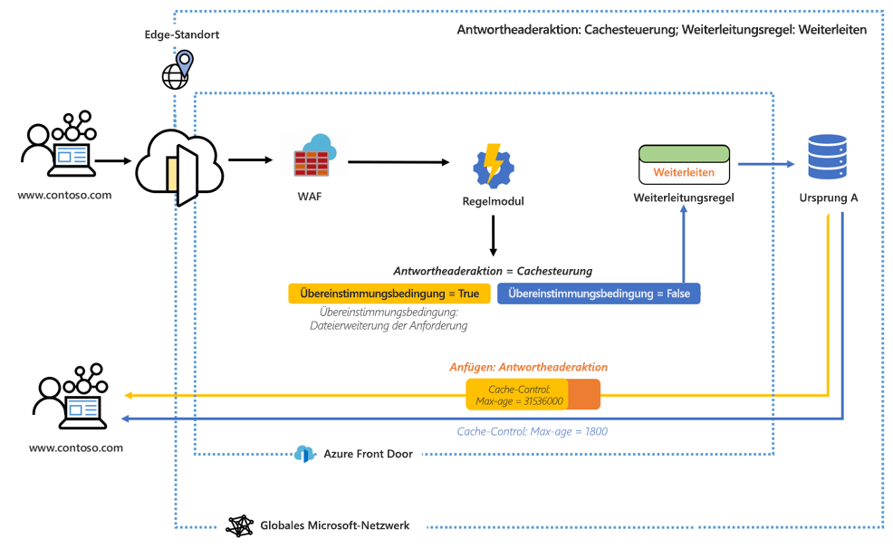
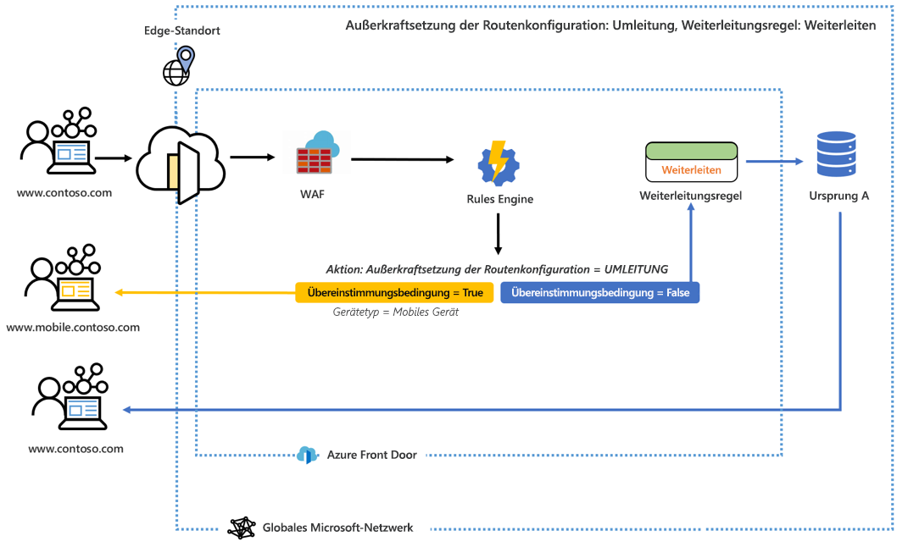

# Was ist das Regelmodul für Azure Front Door? 

Mithilfe des Regelmoduls können Sie anpassen, wie HTTP-Anforderungen im Edge-Bereich behandelt werden, und Sie können das Verhalten Ihrer Webanwendung besser steuern. Das Regelmodul für Azure Front Door umfasst verschiedene wichtige Funktionen, darunter:

- Erzwingen von HTTPS und Sicherstellen, dass alle Endbenutzer über eine sichere Verbindung mit Ihren Inhalten interagieren.
- Implementieren von Sicherheitsheadern wie HTTP Strict-Transport-Security (HSTS), X-XSS-Protection, Content-Security-Policy, X-Frame-Options sowie Access-Control-Allow-Origin-Header für Cross-Origin Resource Sharing (CORS)-Szenarien, um browserbasierte Sicherheitsrisiken zu verhindern. Sicherheitsbasierte Attribute können auch mit Cookies definiert werden.
- Weiterleiten von Anforderungen an mobile oder Desktopversionen Ihrer Anwendung, basierend auf den Mustern in den Inhalten von Anforderungsheadern, Cookies oder Abfragezeichenfolgen.
- Verwenden von Umleitungsfunktionen, um die Umleitungen 301, 302, 307 und 308 an den Client zurückzugeben, um zu neuen Hostnamen, Pfaden oder Protokollen umzuleiten.
- Dynamisches Ändern der Zwischenspeicherkonfiguration Ihrer Route, basierend auf den eingehenden Anforderungen.
- Umschreiben des Pfads der URL-Anforderung und Weiterleiten der Anforderung an das entsprechende Back-End in Ihrem konfigurierten Back-End-Pool.

## Aufbau 

Das Regelmodul behandelt Anforderungen im Edge-Bereich. Wenn eine Anforderung nach dem Konfigurieren des Regelmoduls auf den Front Door-Endpunkt trifft, wird zuerst WAF ausgeführt, gefolgt von der Regelmodulkonfiguration, die Ihrem Front-End/Ihrer Domäne zugeordnet ist. Wenn eine Regelmodulkonfiguration ausgeführt wird, bedeutet dies, dass die übergeordnete Routingregel bereits vorhanden ist. Ob alle Aktionen in den einzelnen Regeln innerhalb der Regelmodulkonfiguration ausgeführt werden, hängt davon ab, ob alle Übereinstimmungsbedingungen innerhalb dieser Regel erfüllt sind. Wenn eine Anforderung mit keiner der Bedingungen in der Regelmodulkonfiguration übereinstimmt, wird die Standardroutingregel ausgeführt. 

In der folgenden Konfiguration ist beispielsweise ein Regelmodul so konfiguriert, dass ein Antwortheader angefügt wird, der das maximale Alter des Cachesteuerelements ändert, wenn die Übereinstimmungsbedingung erfüllt ist. 

In einem anderen Beispiel sehen wir, dass das Regelmodul so konfiguriert ist, dass ein Benutzer zur mobilen Version der Website gesendet wird, wenn die Übereinstimmungsbedingung „Gerätetyp“ den Wert „true“ hat. 

In diesen beiden Beispielen wird die angegebene Routenregel ausgeführt, wenn keine der Übereinstimmungsbedingungen erfüllt ist. 

## Begriff 

Mit dem Azure Front Door-Regelmodul können Sie eine Reihe von Regelmodulkonfigurationen erstellen, die jeweils aus einer Reihe von Regeln bestehen. Im Folgenden finden Sie einige hilfreiche Begriffe, auf die Sie bei der Konfiguration Ihres Regelmoduls stoßen werden. 

- *Regelmodulkonfiguration*: Ein Satz von Regeln, die auf eine einzelne Routenregel angewendet werden. Jede Konfiguration ist auf 25 Regeln beschränkt. Sie können bis zu 10 Konfigurationen erstellen. 
- *Regelmodulregel*: Eine Regel, die bis zu 10 Übereinstimmungsbedingungen und 5 Aktionen umfasst.
- *Übereinstimmungsbedingung*: Es gibt zahlreiche Übereinstimmungsbedingungen, anhand derer Ihre eingehenden Anforderungen analysiert werden können. Eine Regel kann bis zu 10 Übereinstimmungsbedingungen enthalten. Übereinstimmungsbedingungen werden mit einem **UND**-Operator ausgewertet. Eine vollständige Liste der Übereinstimmungsbedingungen finden Sie [hier](front-door-rules-engine-match-conditions.md). 
- *Aktion:* Aktionen geben vor, was mit Ihren eingehenden Anforderungen geschieht: Derzeit sind Anforderungs-/Antwortheaderaktionen, Weiterleitungen, Umleitungen und Umschreibungen verfügbar. Eine Regel kann bis zu 5 Aktionen enthalten, aber nur eine Außerkraftsetzung einer Routenkonfiguration.  Eine vollständige Liste der Aktionen finden Sie [hier](front-door-rules-engine-actions.md).

## Nächste Schritte

- Erfahren Sie, wie Sie Ihre erste [Regelmodulkonfiguration](front-door-tutorial-rules-engine.md) einrichten. 
- Erfahren Sie mehr über das [Erstellen einer Front Door-Instanz](quickstart-create-front-door.md).
- Informieren Sie sich über die [Funktionsweise von Azure Front Door Service](front-door-routing-architecture.md).
