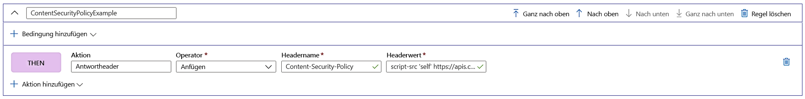

# Hinzufügen von Sicherheitsheadern mit Regel-Engines

Implementieren Sie Sicherheitsheader, um browserbasierte Sicherheitsrisiken zu vermeiden, z. B. HTTP Strict-Transport-Security (HSTS), X-XSS-Protection, Content-Security-Policy, oder X-Frame-Options. Sicherheitsbasierte Attribute können auch mit Cookies definiert werden.

Das folgende Beispiel zeigt Ihnen, wie Sie einen Content-Security-Policy-Header zu allen eingehenden Anforderungen hinzufügen, die dem Pfad entsprechen, der in der Route definiert ist, mit der Ihre Regelmodulkonfiguration verknüpft ist. Hier wird in unseren Anwendungen nur die Ausführung von Skripts von unserer vertrauenswürdigen Website **https://apiphany.portal.azure-api.net** zugelassen.

## Hinzufügen eines Content-Security-Policy-Headers im Azure-Portal

1. Wenn Sie entweder AFD oder das Regelmodul-Feature zum ersten Mal verwenden, sollten Sie vor dem Erstellen dieser speziellen Regel lernen, wie Sie [eine Frontdoor erstellen](quickstart-create-front-door.md) oder wie Sie [ein Regelmodul erstellen](front-door-tutorial-rules-engine.md).

2. Klicken Sie auf **Hinzufügen**, um eine neue Regel hinzuzufügen. Geben Sie der Regel einen Namen, und klicken Sie dann auf **Aktion hinzufügen** > **Antwortheader**.

3. Legen Sie den Operator auf **Append** fest, damit dieser Header als Antwort auf alle unter dieser Route eingehenden Anforderungen hinzugefügt wird.

4. Fügen Sie den Headernamen **Content-Security-Policy** hinzu, und definieren Sie die Werte, die dieser Header akzeptieren soll. In diesem Szenario haben wir *„script-src ‚self‘ https://apiphany.portal.azure-api.net“ ausgewählt.*

5. Nachdem Sie alle gewünschten Regeln zu Ihrer Konfiguration hinzugefügt haben, vergessen Sie nicht, zu Ihrer bevorzugten Route zu navigieren und Ihre Regelmodulkonfiguration mit Ihrer Routenregel zu verknüpfen. Dieser Schritt ist erforderlich, damit die Regel funktioniert. 

> [!NOTE]
> In diesem Szenario haben wir der Regel keine [Übereinstimmungsbedingungen](front-door-rules-engine-match-conditions.md) hinzugefügt. Für alle eingehenden Anforderungen, die dem in der Routenregel definierten Pfad entsprechen, wird diese Regel angewendet. Wenn Sie die Regel nur auf eine Teilmenge dieser Anforderungen anwenden möchten, fügen Sie dieser Regel unbedingt Ihre spezifischen Übereinstimmungsbedingungen hinzu.

## Nächste Schritte

- Erfahren Sie mehr über das [AFD-Regelmodul](front-door-rules-engine.md). 
- Erfahren Sie mehr über das [Erstellen einer Front Door-Instanz](quickstart-create-front-door.md).
- Informieren Sie sich über die [Funktionsweise von Azure Front Door Service](front-door-routing-architecture.md).
- Weitere Informationen zu [Übereinstimmungsbedingungen des Regelmoduls](front-door-rules-engine-match-conditions.md)
- Weitere Informationen finden Sie in der [CLI-Referenz](https://docs.microsoft.com/cli/azure/ext/front-door/network/front-door/rules-engine?view=azure-cli-latest) des AFD-Regelmoduls. 
- Weitere Informationen finden Sie in der [PowerShell-Referenz](https://docs.microsoft.com/powershell/module/az.frontdoor/?view=azps-3.8.0) des AFD-Regelmoduls. 
