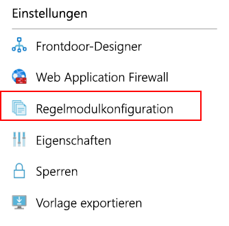
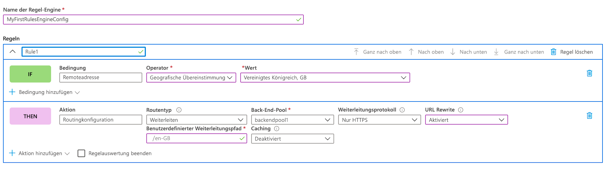
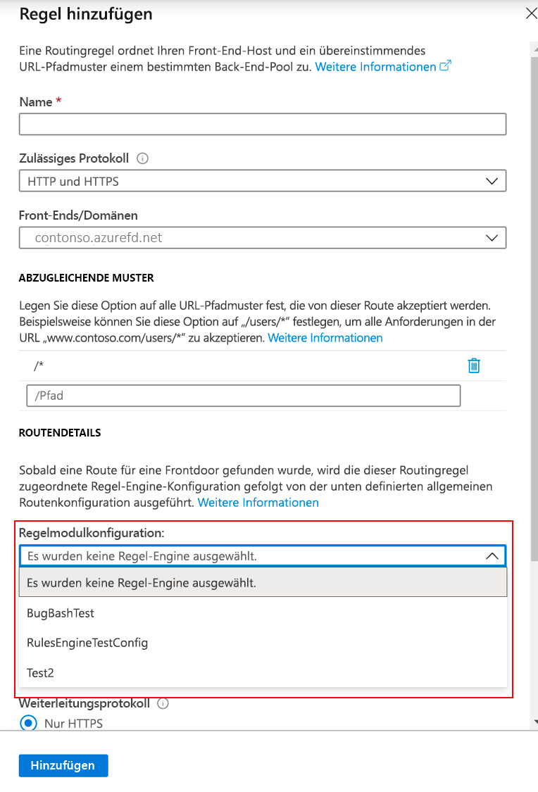

# <a name="configure-your-rules-engine"></a>Konfigurieren Ihres Regelmoduls

Dieser Artikel enthält die Schritte zum Erstellen einer Regelmodulkonfiguration und Ihrer ersten Regel sowohl im Azure-Portal als auch über die Befehlszeilenschnittstelle. 

## <a name="configure-rules-engine-in-azure-portal"></a>Konfigurieren des Regelmoduls im Azure-Portal
1. Erstellen Sie vor der Konfiguration des Regelmoduls eine [Front Door-Instanz](quickstart-create-front-door.md).

2. Wechseln Sie in der Front-Door-Ressource zu **Einstellungen** und wählen Sie die Option zur **Regelmodulkonfiguration** aus. Klicken Sie auf **Hinzufügen**, geben Sie Ihrer Konfiguration einen Namen, und beginnen Sie mit dem Erstellen Ihrer ersten Regelmodulkonfiguration.

    

3. Klicken Sie auf **Regel hinzufügen**, um Ihre erste Regel zu erstellen. Dann klicken Sie auf **Bedingung hinzufügen** oder **Aktion hinzufügen**, um Ihre Regel zu definieren.
    
    > [!NOTE]
    >- Zum Löschen einer Bedingung oder Aktion aus einer Regel verwenden Sie den Papierkorb auf der rechten Seite der jeweiligen Bedingung oder Aktion.
    > - Geben Sie keine Bedingungen an, um eine Regel zu erstellen, die für den gesamten eingehenden Datenverkehr gilt.
    > - Um die Auswertung von Regeln zu unterbinden, sobald die erste Übereinstimmungsbedingung erfüllt ist, aktivieren Sie **Auswertung der verbleibenden Regeln beenden**. Wenn diese Option aktiviert ist und alle Übereinstimmungsbedingungen einer bestimmten Regel erfüllt sind, werden die verbleibenden Regeln in der Konfiguration nicht ausgeführt.  

     

4. Bestimmen Sie die Priorität der Regeln in der Konfiguration, indem Sie die Schaltflächen zum Verschieben nach oben, nach unten und ganz nach oben verwenden. Die Priorität ist in aufsteigender Reihenfolge, was bedeutet, dass die erste aufgelistete Regel die wichtigste Regel ist.

5. Nachdem Sie eine oder mehrere Regeln erstellt haben, drücken Sie **Speichern**. Mit dieser Aktion wird die Konfiguration des Regelmoduls erstellt.

6. Nachdem Sie mindestens eine Konfiguration erstellt haben, ordnen Sie eine Regelmodulkonfiguration einer Routenregel zu. Eine einzelne Konfiguration kann zwar auf mehrere Routenregeln angewendet werden, aber eine Routenregel darf nur eine Regelmodulkonfiguration enthalten. Um die Zuordnung vorzunehmen, navigieren Sie im **Frontdoor-Designer** zu **Routenregeln**. Wählen Sie die Routenregel aus, der Sie die Regelmodulkonfiguration hinzufügen möchten, navigieren Sie zu **Routendetails** > **Regelmodulkonfiguration**, und wählen Sie die Konfiguration aus, die Sie zuordnen möchten.

    


## <a name="configure-rules-engine-in-azure-cli"></a>Konfigurieren des Regelmoduls in der Azure CLI

1. Installieren Sie die [Azure CLI](https://docs.microsoft.com/cli/azure/install-azure-cli?view=azure-cli-latest), falls Sie dies noch nicht getan haben. Fügen Sie die Front Door-Erweiterung hinzu:- az extension add --name front-door. Melden Sie sich dann an, und wechseln Sie zu Ihrem Abonnement: az account set --subscription <Name_oder_ID>.

2. Beginnen Sie mit dem Erstellen eines Regelmoduls. In diesem Beispiel wird eine Regel mit einer headerbasierten Aktion und einer Übereinstimmungsbedingung gezeigt. 

```azurecli-interactive
az network front-door rules-engine rule create -f {front_door} -g {resource_group} --rules-engine-name {rules_engine} --name {rule1} --priority 1 --action-type RequestHeader --header-action Overwrite --header-name Rewrite --header-value True --match-variable RequestFilenameExtension --operator Contains --match-values jpg png --transforms Lowercase
```

3. Listen Sie alle Regeln auf. 

```azurecli-interactive
az network front-door rules-engine rule list -f {front_door} -g {rg} --name {rules_engine}
```

4. Fügen Sie eine Aktion zur Außerkraftsetzung der Weiterleitungsroute hinzu. 

```azurecli-interactive
az network front-door rules-engine rule action add -f {front_door} -g {rg} --rules-engine-name {rules_engine} --name {rule1} --action-type ForwardRouteOverride --backend-pool {backend_pool_name} --caching Disabled
```

5. Listen Sie alle Aktionen in einer Regel auf. 

```azurecli-interactive
az network front-door rules-engine rule action list -f {front_door} -g {rg} -r {rules_engine} --name {rule1}
```

6. Verknüpfen Sie eine Regelmodulkonfiguration mit einer Routingregel.  

```azurecli-interactive
az network front-door routing-rule update -g {rg} -f {front_door} -n {routing_rule_name} --rules-engine {rules_engine}
```

7. Heben Sie die Verknüpfung des Regelmoduls auf. 

```azurecli-interactive
az network front-door routing-rule update -g {rg} -f {front_door} -n {routing_rule_name} --remove rulesEngine # case sensitive word ‘rulesEngine’
```

Weitere Informationen und die vollständige Liste der Befehle des AFD-Regelmoduls finden Sie [hier](https://docs.microsoft.com/cli/azure/ext/front-door/network/front-door/rules-engine?view=azure-cli-latest).   

## <a name="next-steps"></a>Nächste Schritte

- Erfahren Sie mehr über das [AFD-Regelmodul](front-door-rules-engine.md). 
- Erfahren Sie mehr über das [Erstellen einer Front Door-Instanz](quickstart-create-front-door.md).
- Informieren Sie sich über die [Funktionsweise von Azure Front Door Service](front-door-routing-architecture.md).
- Weitere Informationen finden Sie in der [CLI-Referenz](https://docs.microsoft.com/cli/azure/ext/front-door/network/front-door/rules-engine?view=azure-cli-latest) des AFD-Regelmoduls. 
- Weitere Informationen finden Sie in der [PowerShell-Referenz](https://docs.microsoft.com/powershell/module/az.frontdoor/?view=azps-3.8.0) des AFD-Regelmoduls. 
