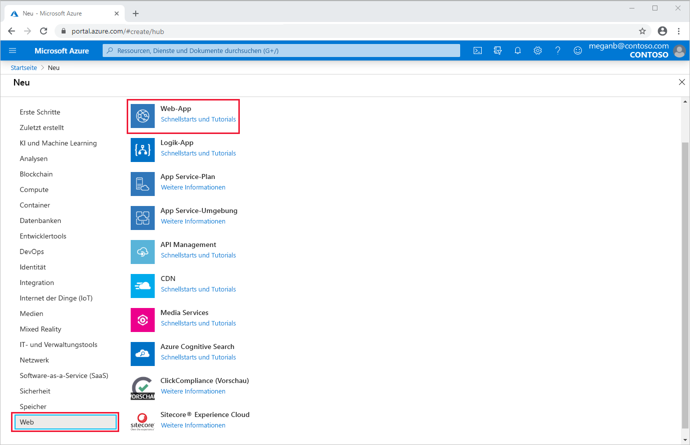
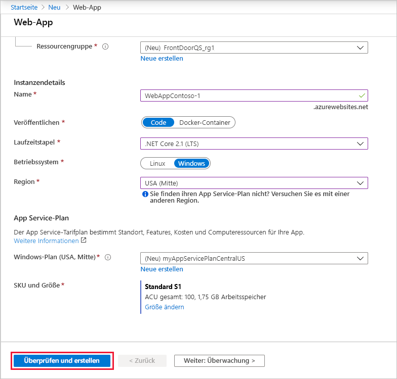
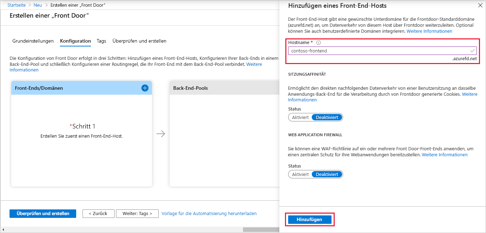
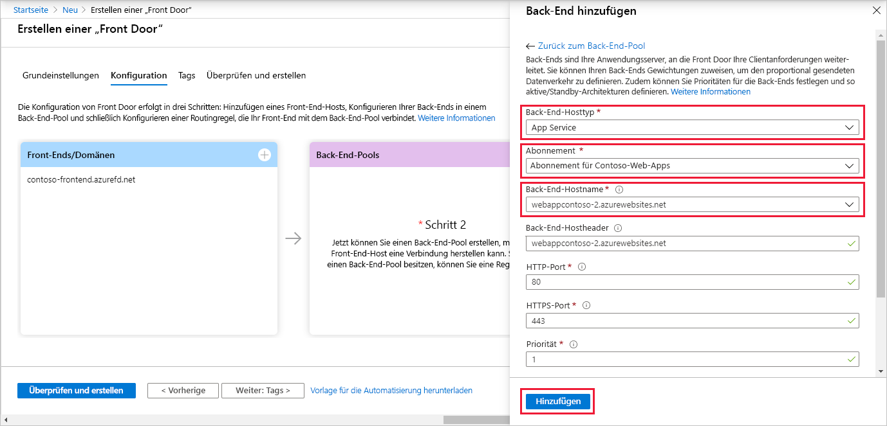
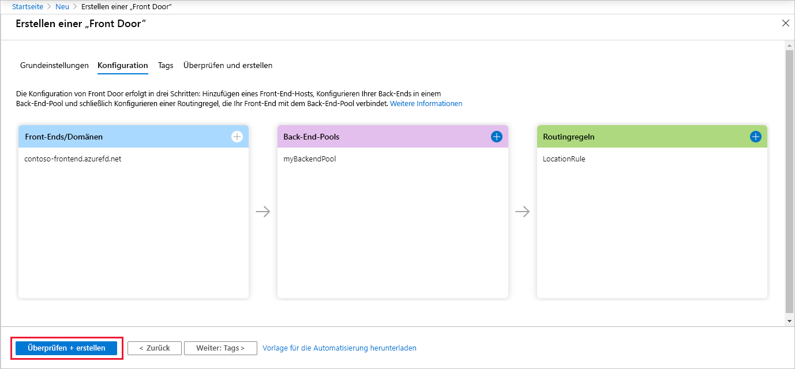
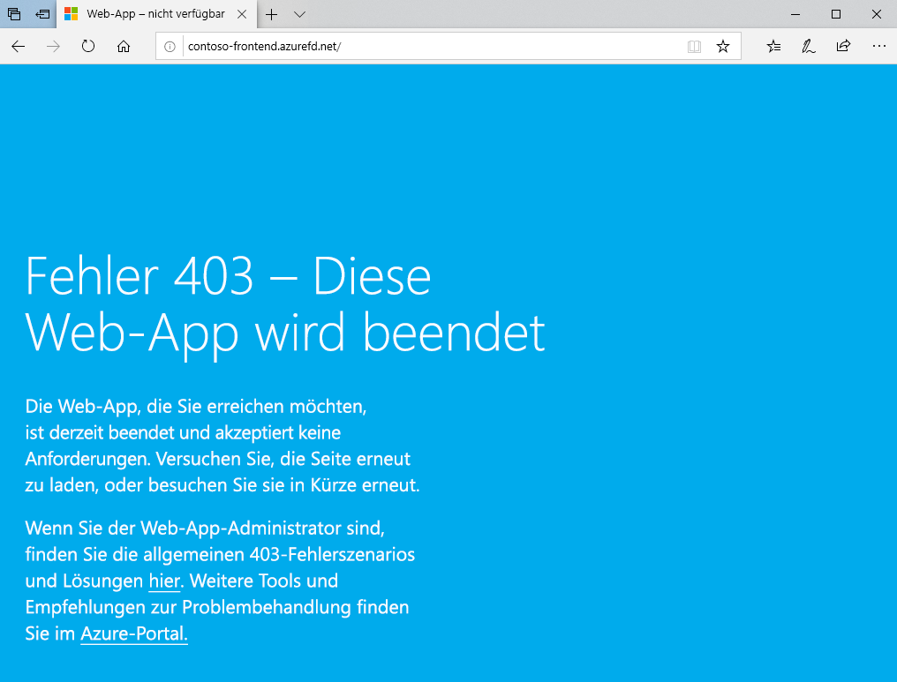

# Schnellstart: Erstellen Sie eine „Front Door“ für eine hoch verfügbare globale Webanwendung.

Führen Sie erste Schritte mit Azure Front Door aus, indem Sie Hochverfügbarkeit für eine Webanwendung über das Azure-Portal einrichten.

In dieser Schnellstartanleitung fasst Azure Front Door zwei Instanzen einer Webanwendung in einem Pool zusammen, die in verschiedenen Azure-Regionen ausgeführt werden. Sie erstellen eine Front Door-Konfiguration auf der Grundlage von Back-Ends mit gleicher Gewichtung und gleicher Priorität. Diese Konfiguration leitet Datenverkehr an den nächstgelegenen Standort weiter, an dem die Anwendung ausgeführt wird. Die Webanwendung wird von Azure Front Door ständig überwacht. Der Dienst bietet automatisches Failover auf den nächsten verfügbaren Standort, wenn der nächstgelegene Standort nicht verfügbar ist.

## Voraussetzungen

- Ein Azure-Konto mit einem aktiven Abonnement. Sie können [kostenlos ein Konto erstellen](https://azure.microsoft.com/free/?WT.mc_id=A261C142F).

## Erstellen von zwei Instanzen einer Web-App

Für diese Schnellstartanleitung sind zwei Instanzen einer Webanwendung erforderlich, die in verschiedenen Azure-Regionen ausgeführt werden. Beide Webanwendungsinstanzen werden im *Aktiv/Aktiv*-Modus ausgeführt, sodass jede von ihnen Datenverkehr annehmen kann. Diese Konfiguration unterscheidet sich von einer *Aktiv/Standby*-Konfiguration, bei der eine Instanz als Failover fungiert.

Wenn Sie noch nicht über eine Web-App verfügen, richten Sie anhand der folgenden Schritte Beispielwebanwendungen ein.

1. Melden Sie sich unter https://portal.azure.com beim Azure-Portal an.

1. Wählen Sie auf der Startseite oder im Azure-Menü die Option **Ressource erstellen** aus.

1. Wählen Sie **Web** > **Web-App** aus.

   

1. Wählen Sie unter **Web-App** das zu verwendende **Abonnement** aus.

1. Wählen Sie für **Ressourcengruppe** die Option **Neu erstellen** aus. Geben Sie unter **Name** den Namen *FrontDoorQS_rg1* ein, und wählen Sie **OK** aus.

1. Geben Sie unter **Instanzendetails** im Feld **Name** einen eindeutigen Namen für Ihre Web-App ein. In diesem Beispiel wird *WebAppContoso-1* verwendet.

1. Wählen Sie unter **Runtimestapel** eine Option aus. In diesem Beispiel wird *.NET Core 2.1 (LTS)* verwendet.

1. Wählen Sie eine Region aus, etwa *USA, Mitte*.

1. Wählen Sie unter **Windows-Plan** die Option **Neu erstellen** aus. Geben Sie unter **Name** den Namen *myAppServicePlanCentralUS* ein, und wählen Sie **OK** aus.

1. Legen Sie für **SKU und Größe** die Option **Standard S1, 100 ACU insgesamt, 1,75 GB Arbeitsspeicher** aus.

1. Wählen Sie **Überprüfen und erstellen** aus, überprüfen Sie die **Zusammenfassung**, und wählen Sie dann die Option **Erstellen** aus. Es kann mehrere Minuten dauern, bis die Bereitstellung abgeschlossen ist.

   

Erstellen Sie nach Abschluss der Bereitstellung eine zweite Web-App. Verwenden Sie dieselbe Prozedur mit denselben Werten, mit Ausnahme der folgenden Werte:

| Einstellung          | Wert     |
| ---              | ---  |
| **Ressourcengruppe**   | Wählen Sie **Neu** aus, und geben Sie *FrontDoorQS_rg2* ein. |
| **Name**             | Geben Sie einen eindeutigen Namen für Ihre Web-App ein. In diesem Beispiel wird *WebAppContoso-2* verwendet.  |
| **Region**           | Geben Sie eine andere Region ein. In diesem Beispiel wird *USA, Süden-Mitte* verwendet. |
| **App Service-Plan** > **Windows-Plan**         | Wählen Sie **Neu** aus, geben Sie *myAppServicePlanSouthCentralUS* ein, und wählen Sie dann **OK** aus. |

## Erstellen einer Front Door-Instanz für Ihre Anwendung

Konfigurieren Sie Azure Front Door zum Weiterleiten des Benutzerdatenverkehrs basierend auf der geringsten Wartezeit zwischen den beiden Web-App-Servern. Fügen Sie zunächst einen Front-End-Host für Azure Front Door hinzu.

1. Wählen Sie auf der Startseite oder im Azure-Menü die Option **Ressource erstellen** aus. Wählen Sie **Netzwerk** > **Front Door** aus.

1. Wählen Sie unter **Frontdoor-Instanz erstellen** ein **Abonnement** aus.

1. Wählen Sie unter **Ressourcengruppe** die Option **Neu** aus, geben Sie *FrontDoorQS_rg0* ein, und wählen Sie dann **OK** aus.  Sie können stattdessen eine vorhandene Ressourcengruppe verwenden.

1. Wenn Sie eine Ressourcengruppe erstellt haben, wählen Sie einen **Ressourcengruppenstandort** und anschließend **Weiter: Konfiguration** aus.

1. Wählen Sie unter **Front-Ends/Domänen** das Symbol **+** aus, um **Front-End-Host hinzufügen** auszuwählen.

1. Geben Sie unter **Hostname** einen global eindeutigen Hostnamen ein. In diesem Beispiel wird *contoso-frontend* verwendet. Wählen Sie **Hinzufügen**.

   

Erstellen Sie als Nächstes einen Back-End-Pool, der Ihre beiden Web-Apps enthält.

1. Wählen Sie unter **Frontdoor-Instanz erstellen** im Bereich **Back-End-Pools** das Symbol **+** aus, um **Back-End-Pool hinzufügen** zu öffnen.

1. Geben Sie *myBackendPool* als **Name** ein.

1. Wählen Sie **Back-End hinzufügen** aus. Wählen Sie unter **Back-End-Hosttyp** die Option *App Service* aus.

1. Wählen Sie Ihr Abonnement und dann unter **Back-End-Hostname** die erste Web-App aus, die Sie erstellt haben. In diesem Beispiel wurde die Web-App *WebAppContoso-1* verwendet. Wählen Sie **Hinzufügen**.

1. Wählen Sie erneut **Back-End hinzufügen** aus. Wählen Sie unter **Back-End-Hosttyp** die Option *App Service* aus.

1. Wählen Sie erneut Ihr Abonnement und dann unter **Back-End-Hostname** die zweite Web-App aus, die Sie erstellt haben. Wählen Sie **Hinzufügen**.

   

Fügen Sie zum Schluss eine Routingregel hinzu. Eine Routingregel ordnet Ihren Front-End-Host dem Back-End-Pool zu. Die Regel leitet eine Anforderung für `contoso-frontend.azurefd.net` an **myBackendPool** weiter.

1. Wählen Sie unter **Frontdoor-Instanz erstellen** im Bereich **Routingregeln** das Symbol **+** aus, um eine Routingregel zu konfigurieren.

1. Geben Sie unter **Regel hinzufügen** für **Name** den Namen *LocationRule* ein. Übernehmen Sie alle Standardwerte, und wählen Sie anschließend **Hinzufügen** aus, um die Routingregel hinzuzufügen.

   >[!WARNING]
   > Sie **müssen** sicherstellen, dass jeder Front-End-Host in Ihrer Front Door-Instanz eine Routingregel mit einem Standardpfad (`\*`) aufweist. Das bedeutet, dass für alle Ihre Routingregeln mindestens eine Routingregel für jeden Ihrer Front-End-Hosts unter dem Standardpfad (`\*`) definiert sein muss. Andernfalls wird der Datenverkehr Ihrer Endbenutzer möglicherweise nicht richtig weitergeleitet.

1. Wählen Sie **Überprüfen + erstellen** und danach **Erstellen** aus.

   

## Anzeigen von Azure Front Door in Aktion

Nachdem Sie eine Front Door-Instanz erstellt haben, dauert es einige Minuten, bis die Konfiguration global bereitgestellt ist. Greifen Sie nach Abschluss des Vorgangs auf den von Ihnen erstellten Front-End-Host zu. Navigieren Sie in einem Browser zu `contoso-frontend.azurefd.net`. Ihre Anforderung wird automatisch an den nächstgelegenen Server aus den angegebenen Servern im Back-End-Pool weitergeleitet.

Wenn Sie diese Apps in dieser Schnellstartanleitung erstellt haben, wird eine Seite mit Informationen angezeigt.

Führen Sie die folgenden Schritte aus, um das sofortige globale Failover in Aktion zu testen:

1. Öffnen Sie wie oben beschrieben einen Browser, und navigieren Sie zur Front-End-Adresse: `contoso-frontend.azurefd.net`.

1. Suchen Sie im Azure-Portal nach *App Services*, und wählen Sie den Eintrag aus. Scrollen Sie nach unten zu einer Ihrer Web-Apps. In diesem Beispiel wird **WebAppContoso-1** verwendet.

1. Wählen Sie Ihre Web-App und anschließend **Beenden** und zum Bestätigen **Ja** aus.

1. Aktualisieren Sie Ihren Browser. Die gleiche Seite mit Informationen sollte angezeigt werden.

   >[!TIP]
   >Bei diesen Aktionen tritt eine kleine Verzögerung auf. Möglicherweise müssen Sie den Browser erneut aktualisieren.

1. Navigieren Sie zur anderen Web-App, und beenden Sie sie ebenfalls.

1. Aktualisieren Sie Ihren Browser. Dieses Mal sollte eine Fehlermeldung angezeigt werden.

   

## Bereinigen von Ressourcen

Wenn Sie fertig sind, können Sie alle erstellten Elemente entfernen. Wenn eine Ressourcengruppe gelöscht wird, werden auch die darin befindlichen Inhalte gelöscht. Wenn Sie diese Front Door-Instanz nicht weiter verwenden möchten, sollten Sie Ressourcen entfernen, um unnötige Gebühren zu vermeiden.

1. Suchen Sie im Azure-Portal nach **Ressourcengruppen**, und wählen Sie den Eintrag aus, oder wählen Sie im Menü des Azure-Portals die Option **Ressourcengruppen** aus.

1. Zum Suchen einer Ressourcengruppe (etwa **FrontDoorQS_rg0**) können Sie filtern oder nach unten scrollen.

1. Wählen Sie die Ressourcengruppe und dann **Ressourcengruppe löschen** aus.

   >[!WARNING]
   >Diese Aktion kann nicht rückgängig gemacht werden.

1. Geben Sie zur Bestätigung den Ressourcengruppennamen ein, und wählen Sie dann **Löschen** aus.

Wiederholen Sie den Vorgang für die anderen beiden Gruppen.

## Nächste Schritte

Fahren Sie mit dem nächsten Artikel fort, um zu erfahren, wie Sie Ihrer Front Door-Instanz eine benutzerdefinierte Domäne hinzufügen.
> [!div class="nextstepaction"]
> [Hinzufügen einer benutzerdefinierten Domäne](front-door-custom-domain.md)

Weitere Informationen zum Weiterleiten von Datenverkehr finden unter [Datenverkehrsrouting in Azure Front Door Service](front-door-routing-methods.md).
