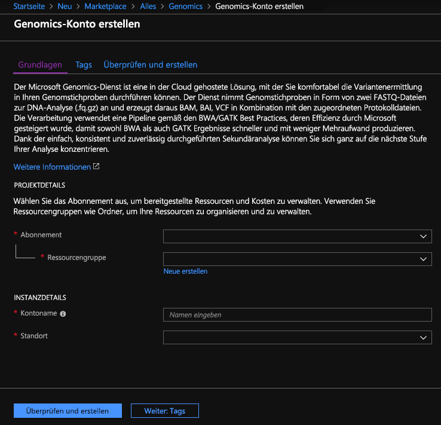
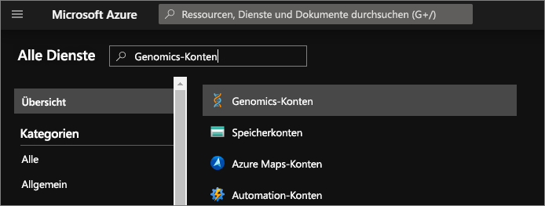
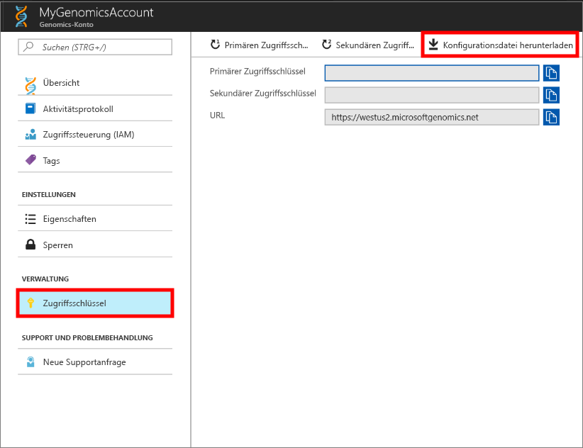
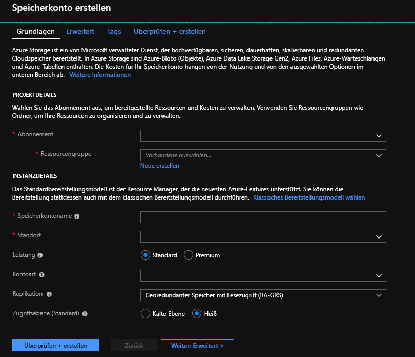

# <a name="quickstart-run-a-workflow-through-the-microsoft-genomics-service"></a>Schnellstart: Ausführen eines Workflows über den Microsoft Genomics-Dienst

In dieser Schnellstartanleitung laden Sie Eingabedaten in ein Azure Blob Storage-Konto hoch und führen über den Microsoft Genomics-Dienst einen Workflow aus, indem Sie den Python-Genomics-Client verwenden. Microsoft Genomics ist ein skalierbarer, sicherer Sekundäranalysedienst für die schnelle Verarbeitung eines Genoms – von unaufbereiteten Abschnitten zu aufbereiteten Abschnitten und Variantendetektierung. 

## <a name="prerequisites"></a>Voraussetzungen

- Ein Azure-Konto mit einem aktiven Abonnement. Sie können [kostenlos ein Konto erstellen](https://azure.microsoft.com/free/?ref=microsoft.com&utm_source=microsoft.com&utm_medium=docs&utm_campaign=visualstudio). 
- [Python 2.7.12+](https://www.python.org/downloads/release/python-2714/) mit Installation von `pip` und `python` in Ihrem Systempfad. Der Microsoft Genomics-Client ist mit Python 3 nicht kompatibel. 

## <a name="set-up-create-a-microsoft-genomics-account-in-the-azure-portal"></a>Einrichten: Erstellen eines Microsoft Genomics-Kontos über das Azure-Portal

Navigieren Sie zum Erstellen eines Microsoft Genomics-Kontos im Azure-Portal zur Option zum [Erstellen eines Genomics-Kontos](https://portal.azure.com/#create/Microsoft.Genomics). Sollten Sie noch nicht über ein Azure-Abonnement verfügen, erstellen Sie zunächst ein Azure-Abonnement und anschließend ein Microsoft Genomics-Kontos. 



Konfigurieren Sie Ihr Genomics-Konto mit den folgenden Informationen, wie in der obigen Abbildung zu sehen: 

 |**Einstellung**          |  **Empfohlener Wert**  | **Feldbeschreibung** |
 |:-------------       |:-------------         |:----------            |
 |Subscription         | Ihr Abonnementname|Hierbei handelt es sich um die Abrechnungseinheit für Ihre Azure-Dienste. Ausführliche Informationen zu Ihrem Abonnement finden Sie unter [Abonnements](https://account.azure.com/Subscriptions). |      
 |Resource group       | MyResourceGroup       |  Mit Ressourcengruppen können Sie mehrere Azure-Ressourcen (Speicherkonto, Genomics-Konto usw.) zur einfacheren Verwaltung in einer einzelnen Gruppe zusammenfassen. Weitere Informationen finden Sie unter [Ressourcengruppen](../azure-resource-manager/management/overview.md#resource-groups). Informationen zu gültigen Ressourcengruppennamen finden Sie unter [Benennungskonventionen](/azure/architecture/best-practices/resource-naming). |
 |Kontoname         | MyGenomicsAccount     |Wählen Sie einen eindeutigen Kontobezeichner. Informationen zu gültigen Namen finden Sie unter [Benennungskonventionen](/azure/architecture/best-practices/resource-naming). |
 |Position                   | USA, Westen 2                    |    Der Dienst steht an den Standorten „USA, Westen 2“, „Europa, Westen“ und „Asien, Südosten“ zur Verfügung. |

Sie können in der oberen Menüleiste die Option **Benachrichtigungen** auswählen, um den Bereitstellungsprozess zu überwachen.


Weitere Informationen zu Microsoft Genomics finden Sie unter [Was ist Microsoft Genomics?](overview-what-is-genomics.md).

## <a name="set-up-install-the-microsoft-genomics-python-client"></a>Einrichten: Installieren des Microsoft Genomics-Python-Clients

Sie müssen in Ihrer lokalen Umgebung sowohl Python als auch den Microsoft Genomics-Python-Client `msgen` installieren. 

### <a name="install-python"></a>Installieren von Python

Der Microsoft Genomics-Python-Client ist mit Python 2.7.12 oder einer höheren 2.7.xx-Version kompatibel. 2.7.14 ist die empfohlene Version. Den Download finden Sie [hier](https://www.python.org/downloads/release/python-2714/). 

> [!IMPORTANT]
> Python 3.x ist nicht mit Python 2.7.xx kompatibel.  `msgen` ist eine Python 2.7-Anwendung. Stellen Sie bei der Ausführung von `msgen` sicher, dass Ihre aktive Python-Umgebung eine 2.7.xx-Version von Python verwendet. Bei der Verwendung von `msgen` mit einer 3.x-Version von Python treten Fehler auf.

### <a name="install-the-microsoft-genomics-python-client-msgen"></a>Installieren des Microsoft Genomics-Python-Clients `msgen`

Verwenden Sie `pip` von Python, um den Microsoft Genomics-Client `msgen` zu installieren. Bei den folgenden Schritten wird vorausgesetzt, dass sich Python 2.x bereits in Ihrem Systempfad befindet. Sollte „`pip` install“ nicht erkannt werden, müssen Sie Python und den Unterordner „scripts“ Ihrem Systempfad hinzufügen.

```
pip install --upgrade --no-deps msgen
pip install msgen
```

Falls Sie `msgen` nicht als systemweite Binärdatei installieren und keine systemweiten Python-Pakete ändern möchten, können Sie `pip` mit dem Flag `–-user` verwenden.
Wenn Sie die paketbasierte Installation oder „setup.py“ verwenden, werden alle erforderlichen Pakete installiert.

### <a name="test-msgen-python-client"></a>Testen des Python-Clients `msgen`
Laden Sie zum Testen des Microsoft Genomics-Clients die Konfigurationsdatei aus Ihrem Genomics-Konto herunter. Navigieren Sie im Azure-Portal zu Ihrem Genomics-Konto, indem Sie oben links die Option **Alle Dienste** auswählen und dann nach Genomics-Konten suchen und diese auswählen.



Wählen Sie das kurz zuvor erstellte Genomics-Konto aus, navigieren Sie zu **Zugriffsschlüssel**, und laden Sie die Konfigurationsdatei herunter.



Vergewissern Sie sich mithilfe des folgenden Befehls, dass der Microsoft Genomics-Python-Client funktioniert:

```Python
msgen list -f "<full path where you saved the config file>"
```

## <a name="create-a-microsoft-azure-storage-account"></a>Erstellen eines Microsoft Azure Storage-Kontos 
Der Microsoft Genomics-Dienst erwartet, dass Eingaben als Blockblobs in einem Azure-Speicherkonto gespeichert werden. Außerdem schreibt er Ausgabedateien als Blockblobs in einen benutzerdefinierten Container in einem Azure-Speicherkonto. Die Eingaben und Ausgaben können sich in unterschiedlichen Speicherkonten befinden.
Wenn sich Ihre Daten bereits in einem Azure-Speicherkonto befinden, müssen Sie sich nur vergewissern, dass es sich am gleichen Standort befindet wie Ihr Genomics-Konto. Andernfalls fallen beim Ausführen des Microsoft Genomics-Diensts Gebühren für ausgehenden Datenverkehr an. Sollten Sie noch nicht über ein Azure Storage-Konto verfügen, müssen Sie eins erstellen und Ihre Daten hochladen. Weitere Informationen zu Azure-Speicherkonten finden Sie [hier](../storage/common/storage-account-create.md). In diesem Artikel erfahren Sie unter anderem, was ein Speicherkonto ist und welche Möglichkeiten Sie damit haben. Navigieren Sie zum Erstellen eines Azure-Speicherkontos im Azure-Portal zu [Erstellen eines Speicherkontos](https://portal.azure.com/#create/Microsoft.StorageAccount-ARM).  



Konfigurieren Sie Ihr Speicherkonto mit den folgenden Informationen wie in der obigen Abbildung. Geben Sie an, dass es sich um ein Blob Storage-Konto handelt (nicht um ein universelles Konto), und behalten Sie ansonsten die Standardoptionen bei. Blob Storage kann bei Downloads und Uploads zwei- bis fünfmal schneller sein.  Das Standardbereitstellungsmodell, Azure Resource Manager, wird empfohlen.  

 |**Einstellung**          |  **Empfohlener Wert**  | **Feldbeschreibung** |
 |:-------------------------       |:-------------         |:----------            |
 |Subscription         | Ihr Azure-Abonnement |Ausführliche Informationen zu Ihrem Abonnement finden Sie unter [Abonnements](https://account.azure.com/Subscriptions). |      
 |Resource group       | MyResourceGroup       |  Sie können die gleiche Ressourcengruppe wie bei Ihrem Genomics-Konto auswählen. Informationen zu gültigen Ressourcengruppennamen finden Sie unter [Benennungskonventionen](/azure/architecture/best-practices/resource-naming). |
 |Speicherkontoname         | MyStorageAccount     |Wählen Sie einen eindeutigen Kontobezeichner. Informationen zu gültigen Namen finden Sie unter [Benennungskonventionen](/azure/architecture/best-practices/resource-naming). |
 |Standort                  | USA, Westen 2                  | Verwenden Sie den gleichen Standort wie bei Ihrem Genomics-Konto, um die Gebühren für ausgehenden Datenverkehr und die Wartezeit zu verringern.  | 
 |Leistung                  | Standard                   | Die Standardeinstellung ist „Standard“. Ausführlichere Informationen zu Standard- und Premium-Speicherkonten finden Sie unter [Einführung in Microsoft Azure Storage](../storage/common/storage-introduction.md).    |
 |Kontoart       | BlobStorage       |  Im Vergleich zu einem universellen Konto kann Blob Storage bei Downloads und Uploads zwei- bis fünfmal schneller sein. |
 |Replikation                  | Lokal redundanter Speicher                  | Lokal redundanter Speicher repliziert Ihre Daten innerhalb des Datencenters in der Region, in der Sie Ihr Speicherkonto erstellt haben. Weitere Informationen finden Sie unter [Azure Storage-Replikation](../storage/common/storage-redundancy.md).    |
 |Zugriffsebene                  | Heiß                   | Heißer Zugriff bedeutet, dass auf Objekte im Speicherkonto häufiger zugegriffen wird.    |

Wählen Sie zum Erstellen Ihres Speicherkontos dann **Überprüfen + erstellen** aus. Wie auch bei der Erstellung Ihres Genomics-Kontos können Sie hier in der oberen Menüleiste die Option **Benachrichtigungen** auswählen, um den Bereitstellungsprozess zu überwachen. 

## <a name="upload-input-data-to-your-storage-account"></a>Hochladen von Eingabedaten in Ihr Speicherkonto

Der Microsoft Genomics-Dienst erwartet Abschnitte mit gepaarten Enden als Eingabedateien (FASTQ- oder BAM-Dateien). Sie können entweder eigene Daten hochladen oder mit öffentlich verfügbaren Beispieldaten experimentieren. Die öffentlich verfügbaren Beispieldaten finden Sie hier:

[https://msgensampledata.blob.core.windows.net/small/chr21_1.fq.gz](https://msgensampledata.blob.core.windows.net/small/chr21_1.fq.gz)
[https://msgensampledata.blob.core.windows.net/small/chr21_2.fq.gz](https://msgensampledata.blob.core.windows.net/small/chr21_2.fq.gz)

In Ihrem Speicherkonto müssen Sie einen Blobcontainer für Ihre Eingabedaten und einen zweiten Blobcontainer für Ihre Ausgabedaten erstellen.  Laden Sie die Eingabedaten in den entsprechenden Blobcontainer hoch. Hierzu können Sie verschiedene Tools verwenden – beispielsweise [Microsoft Azure Storage-Explorer](https://azure.microsoft.com/features/storage-explorer/), [BlobPorter](https://github.com/Azure/blobporter) oder [AzCopy](../storage/common/storage-use-azcopy-v10.md?toc=%2fazure%2fstorage%2fblobs%2ftoc.json). 

## <a name="run-a-workflow-through-the-microsoft-genomics-service-using-the-msgen-python-client"></a>Ausführen eines Workflows über den Microsoft Genomics-Dienst unter Verwendung des Python-Clients `msgen`

Wenn Sie einen Workflow über den Microsoft Genomics-Dienst ausführen möchten, geben Sie in der Datei *config.txt* den Eingabe- und den Ausgabespeichercontainer für Ihre Daten an.
Öffnen Sie die Datei *config.txt*, die Sie aus Ihrem Genomics-Konto heruntergeladen haben. Geben Sie unten Ihren Abonnementschlüssel und die sechs Elemente an (jeweils Speicherkontoname, Schlüssel und Containername für die Ein- und Ausgabe). Diese Informationen können Sie im Azure-Portal unter **Zugriffsschlüssel** für Ihr Speicherkonto oder direkt über den Azure Storage-Explorer ermitteln.  


Wenn Sie GATK4 ausführen möchten, legen Sie den Parameter `process_name` auf `gatk4` fest.

Standardmäßig werden vom Genomics-Dienst VCF-Dateien ausgegeben. Wenn Sie eine gVCF-Ausgabe statt einer VCF-Ausgabe (entspricht `-emitRefConfidence` in GATK 3.x und `emit-ref-confidence` in GATK 4.x) wünschen, fügen Sie der Datei *config.txt* den Parameter `emit_ref_confidence` hinzu und legen ihn auf `gvcf` fest (siehe Abbildung oben).  Wenn Sie wieder auf die VCF-Ausgabe umstellen möchten, entfernen Sie entweder den Parameter `emit_ref_confidence` aus der Datei *config.txt* oder legen ihn auf `none` fest. 

`bgzip` ist ein Tool, das die VCF-oder GVCF-Datei komprimiert, und `tabix` erstellt einen Index für die komprimierte Datei. Der Genomics-Dienst führt standardmäßig `bgzip` gefolgt von `tabix` für die Ausgabe vom Typ „.g.vcf“ aus. Diese Tools werden jedoch nicht standardmäßig für die Ausgabe vom Typ „.vcf“ ausgeführt. Beim Ausführen erzeugt der Dienst Dateien vom Typ „.gz“ (BGZIP-Ausgabe) und „.tbi“ (TABIX-Ausgabe). Das Argument ist ein boolescher Wert, der für die VCF-Ausgabe standardmäßig auf „false“ und für die GVCF-Ausgabe standardmäßig auf „true“ festgelegt ist. Wenn Sie die Befehlszeile verwenden möchten, geben Sie `-bz` oder `--bgzip-output` mit `true` (BGZIP und TABIX ausführen) oder `false` an. Wenn Sie dieses Argument in der Datei *config.txt* verwenden möchten, fügen Sie in der Datei die Angabe `bgzip_output: true` oder `bgzip_output: false` hinzu.

### <a name="submit-your-workflow-to-the-microsoft-genomics-service-using-the-msgen-python-client"></a>Übermitteln Ihres Workflows an den Microsoft Genomics-Dienst unter Verwendung des Python-Clients `msgen`

Verwenden Sie den folgenden Befehl, um Ihren Workflow über den Microsoft Genomics-Python-Client zu übermitteln:

```python
msgen submit -f [full path to your config file] -b1 [name of your first paired end read] -b2 [name of your second paired end read]
```

Den Status Ihres Workflows können Sie mithilfe des folgenden Befehls anzeigen: 
```python
msgen list -f c:\temp\config.txt 
```

Nach Abschluss des Workflows können Sie die Ausgabedateien im konfigurierten Ausgabecontainer Ihres Azure-Speicherkontos anzeigen. 

## <a name="next-steps"></a>Nächste Schritte

In diesem Artikel haben Sie Beispieleingabedaten in Azure Storage hochgeladen und einen Workflow über den `msgen`-Python-Client an den Microsoft Genomics-Dienst übermittelt. Weitere Informationen zu anderen Eingabedateitypen, die mit dem Microsoft Genomics-Dienst verwendet werden können, finden Sie auf den folgenden Seiten: [Übermitteln eines Workflows mit FASTQ-Eingabedateien](quickstart-input-pair-FASTQ.md) | [Übermitteln eines Workflows mit einer BAM-Eingabedatei](quickstart-input-BAM.md) | [Übermitteln eines Workflows mit mehreren Eingaben aus dem gleichen Beispiel](quickstart-input-multiple.md). 
