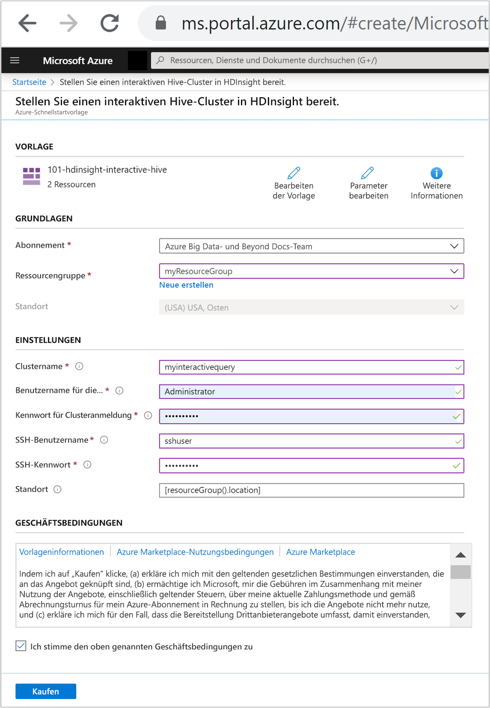
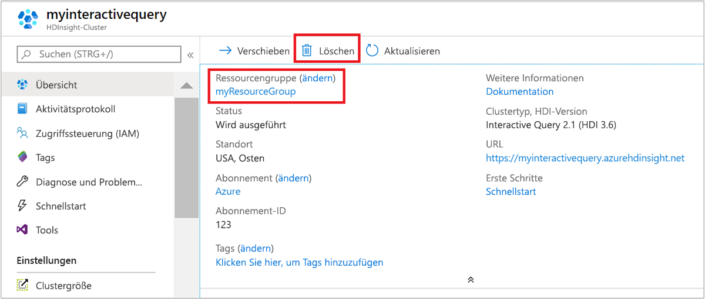

# Schnellstart: Erstellen eines Interactive Query-Clusters in Azure HDInsight mit einer ARM-Vorlage

In dieser Schnellstartanleitung verwenden Sie eine Azure Resource Manager-Vorlage (ARM-Vorlage), um einen [Interactive Query](./apache-interactive-query-get-started.md)-Cluster in Azure HDInsight zu erstellen. Interactive Query (auch Apache Hive LLAP oder [Low Latency Analytical Processing](https://cwiki.apache.org/confluence/display/Hive/LLAP) genannt) ist ein Azure HDInsight-[Clustertyp](../hdinsight-hadoop-provision-linux-clusters.md#cluster-type).

[!INCLUDE [About Azure Resource Manager](../../../includes/resource-manager-quickstart-introduction.md)]

Wenn Ihre Umgebung die Voraussetzungen erfüllt und Sie mit der Verwendung von ARM-Vorlagen vertraut sind, klicken Sie auf die Schaltfläche **In Azure bereitstellen**. Die Vorlage wird im Azure-Portal geöffnet.

## Voraussetzungen

Wenn Sie kein Azure-Abonnement besitzen, können Sie ein [kostenloses Konto](https://azure.microsoft.com/free/?WT.mc_id=A261C142F) erstellen, bevor Sie beginnen.

## Überprüfen der Vorlage

Die in dieser Schnellstartanleitung verwendete Vorlage stammt von der Seite mit den [Azure-Schnellstartvorlagen](https://azure.microsoft.com/resources/templates/101-hdinsight-interactive-hive/).

:::code language="json" source="~/quickstart-templates/101-hdinsight-interactive-hive/azuredeploy.json" range="1-158" highlight="49-82":::

Zwei Azure-Ressourcen sind in der Vorlage definiert:

* [Microsoft.Storage/storageAccounts](/azure/templates/microsoft.storage/storageaccounts): Erstellen eines Azure Storage-Kontos
* [Microsoft.HDInsight/cluster](/azure/templates/microsoft.hdinsight/clusters): Erstellen eines HDInsight-Clusters

### Bereitstellen der Vorlage

1. Wählen Sie unten die Schaltfläche **In Azure bereitstellen** aus, um sich bei Azure anzumelden und die ARM-Vorlage zu öffnen.

    

1. Geben Sie folgende Werte ein bzw. wählen diese aus:

    |Eigenschaft |BESCHREIBUNG |
    |---|---|
    |Subscription|Wählen Sie in der Dropdownliste das Azure-Abonnement aus, das für den Cluster verwendet wird.|
    |Resource group|Wählen Sie in der Dropdownliste Ihre vorhandene Ressourcengruppe oder die Option **Neu erstellen** aus.|
    |Standort|Als Wert wird automatisch der Speicherort für die Ressourcengruppe eingefügt.|
    |Clustername|Geben Sie einen global eindeutigen Namen ein. Verwenden Sie für diese Vorlage nur Kleinbuchstaben und Zahlen.|
    |Benutzername für Clusteranmeldung|Geben Sie den Benutzernamen an, der Standardwert ist **admin**.|
    |Kennwort für Clusteranmeldung|Geben Sie ein Kennwort an. Das Kennwort muss mindestens zehn Zeichen lang sein und mindestens eine Ziffer, einen Groß- und einen Kleinbuchstaben sowie ein nicht alphanumerisches Zeichen enthalten (mit Ausnahme folgender Zeichen: ' " `). |
    |SSH-Benutzername|Geben Sie den Benutzernamen an. Der Standardwert ist „sshuser“.|
    |SSH-Kennwort|Geben Sie das Kennwort an.|

    

1. Sehen Sie sich die **GESCHÄFTSBEDINGUNGEN** an. Wählen Sie anschließend **Ich stimme den oben genannten Geschäftsbedingungen zu** und dann **Kaufen** aus. Sie erhalten eine Benachrichtigung, dass die Bereitstellung derzeit durchgeführt wird. Das Erstellen eines Clusters dauert ca. 20 Minuten.

## Überprüfen der bereitgestellten Ressourcen

Nachdem der Cluster erstellt wurde, erhalten Sie die Benachrichtigung **Bereitstellung erfolgreich** mit dem Link **Zu Ressource wechseln**. Auf der Seite „Ressourcengruppe“ sind der neue HDInsight-Cluster und der mit dem Cluster verbundene Standardspeicher aufgeführt. Jeder Cluster verfügt über eine Abhängigkeit von einem [Azure Storage-Konto](../hdinsight-hadoop-use-blob-storage.md) oder einem [Azure Data Lake Storage-Konto](../hdinsight-hadoop-use-data-lake-store.md). Dieses wird als Standardspeicherkonto bezeichnet. Der HDInsight-Cluster und das zugehörige Speicherkonto müssen sich in derselben Azure-Region befinden. Beim Löschen von Clustern wird das Speicherkonto nicht gelöscht.

## Bereinigen von Ressourcen

Nachdem Sie den Schnellstart abgeschlossen haben, können Sie den Cluster löschen. Mit HDInsight werden Ihre Daten in Azure Storage gespeichert, sodass Sie einen Cluster problemlos löschen können, wenn er nicht verwendet wird. Für einen HDInsight-Cluster fallen auch dann Gebühren an, wenn er nicht verwendet wird. Da die Gebühren für den Cluster erheblich höher sind als die Kosten für den Speicher, ist es sinnvoll, nicht verwendete Cluster zu löschen.

Navigieren Sie im Azure-Portal zu Ihrem Cluster, und wählen Sie **Löschen** aus.

Sie können auch den Namen der Ressourcengruppe auswählen, um die Seite für die Ressourcengruppe zu öffnen, und dann **Ressourcengruppe löschen** auswählen. Indem Sie die Ressourcengruppe löschen, löschen Sie sowohl den HDInsight-Cluster als auch das Standardspeicherkonto.

## Nächste Schritte

In dieser Schnellstartanleitung wurde beschrieben, wie Sie einen Interactive Query-Cluster in HDInsight mit einer ARM-Vorlage erstellen. Im nächsten Artikel wird beschrieben, wie Sie Apache Hive-Abfragen mit Apache Zeppelin ausführen.

> [!div class="nextstepaction"]
> [Ausführen von Apache Hive-Abfragen in Azure HDInsight mit Apache Zeppelin](./hdinsight-connect-hive-zeppelin.md)
