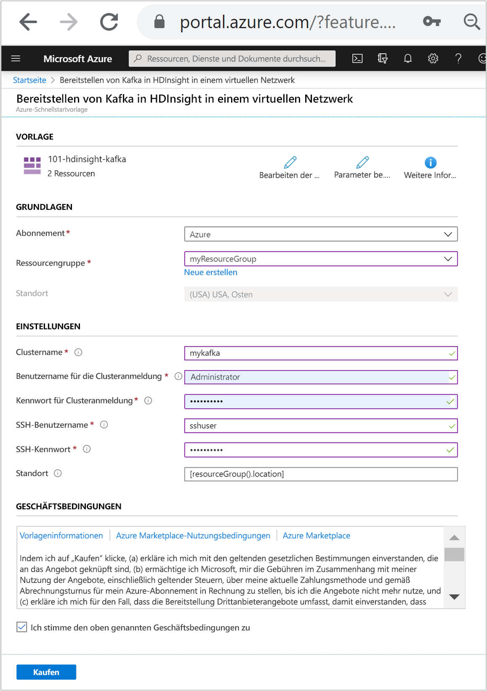
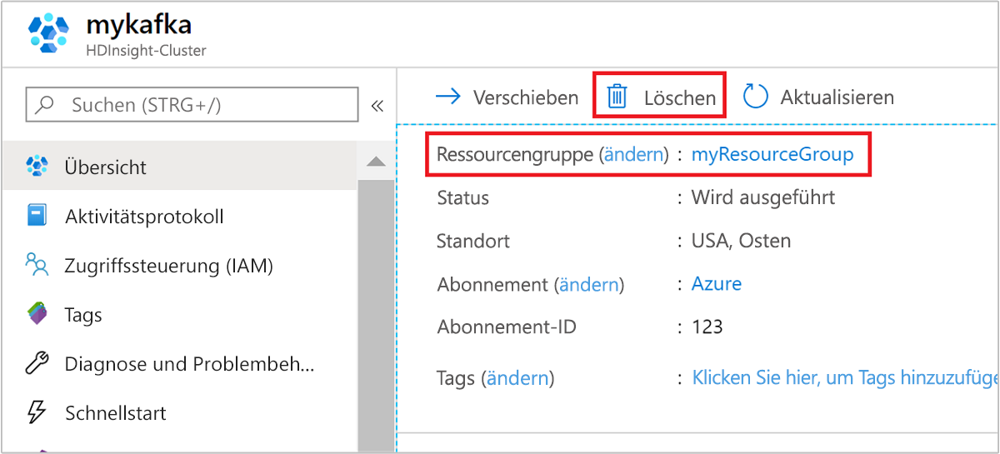

# <a name="quickstart-create-apache-kafka-cluster-in-azure-hdinsight-using-resource-manager-template"></a>Schnellstart: Erstellen eines Apache Kafka-Clusters in Azure HDInsight mit einer Resource Manager-Vorlage

In dieser Schnellstartanleitung verwenden Sie eine Azure Resource Manager-Vorlage, um einen [Apache Kafka](./apache-kafka-introduction.md)-Cluster in Azure HDInsight zu erstellen. Kafka ist eine verteilte Open Source-Streamingplattform. Sie wird häufig als Nachrichtenbroker eingesetzt, da sie eine ähnliche Funktionalität wie eine Veröffentlichen-Abonnieren-Nachrichtenwarteschlange aufweist.

[!INCLUDE [About Azure Resource Manager](../../../includes/resource-manager-quickstart-introduction.md)]

Auf die Kafka-API kann nur von Ressourcen im gleichen virtuellen Netzwerk zugegriffen werden. In dieser Schnellstartanleitung greifen Sie über SSH direkt auf den Cluster zu. Wenn Sie eine Verbindung zwischen anderen Diensten, Netzwerken und virtuellen Computern und Kafka herstellen möchten, müssen Sie zunächst ein virtuelles Netzwerk und anschließend die Ressourcen in diesem Netzwerk erstellen. Weitere Informationen finden Sie im Dokument [Herstellen einer Verbindung mit Apache Kafka in HDInsight über ein virtuelles Azure-Netzwerk](apache-kafka-connect-vpn-gateway.md).

Wenn Sie kein Azure-Abonnement besitzen, können Sie ein [kostenloses Konto](https://azure.microsoft.com/free/?WT.mc_id=A261C142F) erstellen, bevor Sie beginnen.

## <a name="create-an-apache-kafka-cluster"></a>Erstellen eines Apache Kafka-Clusters

### <a name="review-the-template"></a>Überprüfen der Vorlage

Die in dieser Schnellstartanleitung verwendete Vorlage stammt von der Seite mit den [Azure-Schnellstartvorlagen](https://github.com/Azure/azure-quickstart-templates/tree/master/101-hdinsight-kafka).

:::code language="json" source="~/quickstart-templates/101-hdinsight-kafka/azuredeploy.json" range="1-150":::

Zwei Azure-Ressourcen sind in der Vorlage definiert:

* [Microsoft.Storage/storageAccounts](https://docs.microsoft.com/azure/templates/microsoft.storage/storageaccounts): Erstellen eines Azure Storage-Kontos
* [Microsoft.HDInsight/cluster](https://docs.microsoft.com/azure/templates/microsoft.hdinsight/clusters): Erstellen eines HDInsight-Clusters

### <a name="deploy-the-template"></a>Bereitstellen der Vorlage

1. Wählen Sie unten die Schaltfläche **In Azure bereitstellen** aus, um sich bei Azure anzumelden und die Resource Manager-Vorlage zu öffnen.

    <a href="https://portal.azure.com/#create/Microsoft.Template/uri/https%3A%2F%2Fraw.githubusercontent.com%2FAzure-Samples%2Fhdinsight-kafka-java-get-started%2Fmaster%2Fazuredeploy.json" target="_blank"></a>

1. Geben Sie folgende Werte ein bzw. wählen diese aus:

    |Eigenschaft |BESCHREIBUNG |
    |---|---|
    |Subscription|Wählen Sie in der Dropdownliste das Azure-Abonnement aus, das für den Cluster verwendet wird.|
    |Resource group|Wählen Sie in der Dropdownliste Ihre vorhandene Ressourcengruppe oder die Option **Neu erstellen** aus.|
    |Position|Als Wert wird automatisch der Speicherort für die Ressourcengruppe eingefügt.|
    |Clustername|Geben Sie einen global eindeutigen Namen ein. Verwenden Sie für diese Vorlage nur Kleinbuchstaben und Zahlen.|
    |Benutzername für Clusteranmeldung|Geben Sie den Benutzernamen an, der Standardwert ist **admin**.|
    |Kennwort für Clusteranmeldung|Geben Sie ein Kennwort an. Das Kennwort muss mindestens zehn Zeichen lang sein und mindestens eine Ziffer, einen Groß- und einen Kleinbuchstaben sowie ein nicht alphanumerisches Zeichen enthalten (mit Ausnahme folgender Zeichen: ' " `). |
    |SSH-Benutzername|Geben Sie den Benutzernamen an, der Standardwert ist **sshuser**.|
    |SSH-Kennwort|Geben Sie das Kennwort an.|

    

1. Sehen Sie sich die **GESCHÄFTSBEDINGUNGEN** an. Wählen Sie anschließend **Ich stimme den oben genannten Geschäftsbedingungen zu** und dann **Kaufen** aus. Sie erhalten eine Benachrichtigung, dass die Bereitstellung derzeit durchgeführt wird. Das Erstellen eines Clusters dauert ca. 20 Minuten.

## <a name="review-deployed-resources"></a>Überprüfen der bereitgestellten Ressourcen

Nachdem der Cluster erstellt wurde, erhalten Sie die Benachrichtigung **Bereitstellung erfolgreich** mit dem Link **Zu Ressource wechseln**. Auf der Seite „Ressourcengruppe“ sind der neue HDInsight-Cluster und der mit dem Cluster verbundene Standardspeicher aufgeführt. Jeder Cluster verfügt über eine Abhängigkeit von einem [Azure Storage-Konto](../hdinsight-hadoop-use-blob-storage.md) oder einem [Azure Data Lake Storage-Konto](../hdinsight-hadoop-use-data-lake-store.md). Dieses wird als Standardspeicherkonto bezeichnet. Der HDInsight-Cluster und das zugehörige Speicherkonto müssen sich in derselben Azure-Region befinden. Beim Löschen von Clustern wird das Speicherkonto nicht gelöscht.

## <a name="get-the-apache-zookeeper-and-broker-host-information"></a>Beschaffen der Apache Zookeeper- und Broker-Hostinformationen

Bei der Verwendung von Kafka müssen Ihnen die *Apache Zookeeper*- und die *Broker*-Hosts bekannt sein. Diese Hosts werden zusammen mit der Kafka-API und vielen Hilfsprogrammen verwendet, die in Kafka enthalten sind.

In diesem Abschnitt rufen Sie die Hostinformationen aus der Ambari-REST-API im Cluster ab.

1. Verwenden Sie einen [ssh-Befehl](../hdinsight-hadoop-linux-use-ssh-unix.md) zum Herstellen der Verbindung mit dem Cluster. Bearbeiten Sie den folgenden Befehl, indem Sie CLUSTERNAME durch den Namen Ihres Clusters ersetzen, und geben Sie den Befehl dann ein:

    ```cmd
    ssh sshuser@CLUSTERNAME-ssh.azurehdinsight.net
    ```

1. Verwenden Sie für die SSH-Verbindung den folgenden Befehl, um das Hilfsprogramm `jq` zu installieren. Dieses Hilfsprogramm wird verwendet, um JSON-Dokumente zu analysieren, und es ist beim Beschaffen der Hostinformationen hilfreich:

    ```bash
    sudo apt -y install jq
    ```

1. Verwenden Sie den folgenden Befehl, um eine Umgebungsvariable auf den Namen des Clusters festzulegen:

    ```bash
    read -p "Enter the Kafka on HDInsight cluster name: " CLUSTERNAME
    ```

    Geben Sie bei entsprechender Aufforderung den Namen des Kafka-Clusters ein.

1. Verwenden Sie den folgenden Befehl, um eine Umgebungsvariable mit Zookeeper-Hostinformationen festzulegen. Dieser Befehl ruft alle Zookeeper-Hosts ab und gibt dann nur die ersten beiden Einträge zurück. Diese Redundanz ist hilfreich, wenn ein Host nicht erreichbar ist.

    ```bash
    export KAFKAZKHOSTS=`curl -sS -u admin -G https://$CLUSTERNAME.azurehdinsight.net/api/v1/clusters/$CLUSTERNAME/services/ZOOKEEPER/components/ZOOKEEPER_SERVER | jq -r '["\(.host_components[].HostRoles.host_name):2181"] | join(",")' | cut -d',' -f1,2`
    ```

    Geben Sie das Kennwort des Anmeldekontos für den Cluster (nicht des SSH-Kontos) ein, wenn Sie dazu aufgefordert werden.

1. Vergewissern Sie sich mithilfe des folgenden Befehls, dass die Umgebungsvariable korrekt festgelegt ist:

    ```bash
     echo '$KAFKAZKHOSTS='$KAFKAZKHOSTS
    ```

    Die Ausgabe dieses Befehls sieht in etwa wie folgt aus:

    `zk0-kafka.eahjefxxp1netdbyklgqj5y1ud.ex.internal.cloudapp.net:2181,zk2-kafka.eahjefxxp1netdbyklgqj5y1ud.ex.internal.cloudapp.net:2181`

1. Verwenden Sie den folgenden Befehl, um eine Umgebungsvariable mit Kafka-Brokerhostinformationen festzulegen:

    ```bash
    export KAFKABROKERS=`curl -sS -u admin -G https://$CLUSTERNAME.azurehdinsight.net/api/v1/clusters/$CLUSTERNAME/services/KAFKA/components/KAFKA_BROKER | jq -r '["\(.host_components[].HostRoles.host_name):9092"] | join(",")' | cut -d',' -f1,2`
    ```

    Geben Sie das Kennwort des Anmeldekontos für den Cluster (nicht des SSH-Kontos) ein, wenn Sie dazu aufgefordert werden.

1. Vergewissern Sie sich mithilfe des folgenden Befehls, dass die Umgebungsvariable korrekt festgelegt ist:

    ```bash
    echo '$KAFKABROKERS='$KAFKABROKERS
    ```

    Die Ausgabe dieses Befehls sieht in etwa wie folgt aus:

    `wn1-kafka.eahjefxxp1netdbyklgqj5y1ud.cx.internal.cloudapp.net:9092,wn0-kafka.eahjefxxp1netdbyklgqj5y1ud.cx.internal.cloudapp.net:9092`

## <a name="manage-apache-kafka-topics"></a>Verwalten von Apache Kafka-Themen

Kafka speichert Datenströme in *Themen*. Mit dem Hilfsprogramm `kafka-topics.sh` können Sie Themen verwalten.

* Führen Sie folgenden Befehl in der SSH-Verbindung aus, **um ein Thema zu erstellen**:

    ```bash
    /usr/hdp/current/kafka-broker/bin/kafka-topics.sh --create --replication-factor 3 --partitions 8 --topic test --zookeeper $KAFKAZKHOSTS
    ```

    Mit diesem Befehl wird unter Verwendung der in `$KAFKAZKHOSTS` gespeicherten Informationen eine Verbindung mit Zookeeper hergestellt. Anschließend wird ein Kafka-Thema mit dem Namen **test** erstellt.

    * In diesem Thema gespeicherte Daten werden auf acht Partitionen aufgeteilt.

    * Jede Partition wird auf drei Workerknoten im Cluster repliziert.

        Wenn Sie den Cluster in einer Azure-Region mit drei Fehlerdomänen erstellt haben, verwenden Sie den Replikationsfaktor 3. Verwenden Sie andernfalls den Replikationsfaktor 4.
        
        In Regionen mit drei Fehlerdomänen ermöglicht der Replikationsfaktor 3 die Verteilung von Replikaten auf die Fehlerdomänen. In Regionen mit zwei Fehlerdomänen ermöglicht der Replikationsfaktor 4 die gleichmäßige Verteilung von Replikaten auf die Domänen.
        
        Informationen zur Anzahl von Fehlerdomänen in einer Region finden Sie im Dokument [Verwalten der Verfügbarkeit virtueller Linux-Computer](../../virtual-machines/windows/manage-availability.md#use-managed-disks-for-vms-in-an-availability-set).

        Azure-Fehlerdomänen sind Kafka nicht bekannt. Beim Erstellen von Partitionsreplikaten für Themen kann es daher vorkommen, dass die Replikate nicht ordnungsgemäß für Hochverfügbarkeit verteilt werden.

        Verwenden Sie das [Tool zum Ausgleichen von Apache Kafka-Partitionen](https://github.com/hdinsight/hdinsight-kafka-tools), um Hochverfügbarkeit zu gewährleisten. Dieses Tool muss über eine SSH-Verbindung mit dem Hauptknoten des Kafka-Clusters ausgeführt werden.

        Um die höchste Verfügbarkeit Ihrer Kafka-Daten sicherzustellen, sollten Sie in folgenden Fällen die Partitionsreplikate für Ihr Thema ausgleichen:

        * Wenn ein neues Thema oder eine neue Partition erstellt wird

        * Wenn Sie einen Cluster hochskalieren

* Verwenden Sie den folgenden Befehl, **um Themen aufzulisten**:

    ```bash
    /usr/hdp/current/kafka-broker/bin/kafka-topics.sh --list --zookeeper $KAFKAZKHOSTS
    ```

    Dieser Befehl listet die für den Kafka-Cluster verfügbaren Themen auf.

* Verwenden Sie zum **Löschen eines Themas** den folgenden Befehl:

    ```bash
    /usr/hdp/current/kafka-broker/bin/kafka-topics.sh --delete --topic topicname --zookeeper $KAFKAZKHOSTS
    ```

    Dieser Befehl löscht das Thema `topicname`.

    > [!WARNING]  
    > Wenn Sie das zuvor erstellte Thema `test` löschen, müssen Sie es neu erstellen. Es wird weiter unten in diesem Dokument verwendet.

Wenn Sie weitere Informationen zu den mit dem Hilfsprogramm `kafka-topics.sh` verfügbaren Befehlen anzeigen möchten, verwenden Sie den folgenden Befehl:

```bash
/usr/hdp/current/kafka-broker/bin/kafka-topics.sh
```

## <a name="produce-and-consume-records"></a>Erstellen und Nutzen von Datensätzen

Bei Kafka werden *Datensätze* in Themen gespeichert. Datensätze werden von *Producern* erstellt und von *Consumern* genutzt. Producer und Consumer kommunizieren mit dem *Kafka-Brokerdienst*. Jeder Workerknoten in Ihrem HDInsight-Cluster ist ein Kafka-Brokerhost.

Gehen Sie wie folgt vor, um Datensätze im zuvor erstellten Testthema zu speichern und sie anschließend mithilfe eines Consumers zu lesen:

1. Verwenden Sie zum Schreiben von Datensätzen in das Thema das Hilfsprogramm `kafka-console-producer.sh` über die SSH-Verbindung:

    ```bash
    /usr/hdp/current/kafka-broker/bin/kafka-console-producer.sh --broker-list $KAFKABROKERS --topic test
    ```

    Nach diesem Befehl erreichen Sie eine leere Zeile.

1. Geben Sie eine Textnachricht in die leere Zeile ein, und drücken Sie die EINGABETASTE. Geben Sie auf diese Weise mehrere Nachrichten ein, und drücken Sie anschließend **STRG+C**, um zur normalen Eingabeaufforderung zurückzukehren. Die einzelnen Zeilen werden jeweils als separater Datensatz an das Kafka-Thema gesendet.

1. Verwenden Sie zum Lesen von Datensätzen aus dem Thema das Hilfsprogramm `kafka-console-consumer.sh` über die SSH-Verbindung:

    ```bash
    /usr/hdp/current/kafka-broker/bin/kafka-console-consumer.sh --bootstrap-server $KAFKABROKERS --topic test --from-beginning
    ```

    Die Datensätze werden mit dem Befehl aus dem Thema abgerufen und angezeigt. Mit `--from-beginning` wird der Consumer angewiesen, am Anfang des Datenstroms zu beginnen, damit alle Datensätze abgerufen werden.

    Falls Sie eine ältere Version von Kafka verwenden, sollten Sie `--bootstrap-server $KAFKABROKERS` durch `--zookeeper $KAFKAZKHOSTS` ersetzen.

1. Drücken Sie __STRG+C__, um den Consumer zu beenden.

Sie können Producer und Consumer auch programmgesteuert erstellen. Ein Beispiel für die Verwendung dieser API finden Sie im Dokument [Tutorial: Verwenden der Apache Kafka Producer- und Consumer-APIs](apache-kafka-producer-consumer-api.md).

## <a name="clean-up-resources"></a>Bereinigen von Ressourcen

Nachdem Sie den Schnellstart abgeschlossen haben, können Sie den Cluster löschen. Mit HDInsight werden Ihre Daten in Azure Storage gespeichert, sodass Sie einen Cluster problemlos löschen können, wenn er nicht verwendet wird. Für einen HDInsight-Cluster fallen auch dann Gebühren an, wenn er nicht verwendet wird. Da die Gebühren für den Cluster erheblich höher sind als die Kosten für den Speicher, ist es sinnvoll, nicht verwendete Cluster zu löschen.

Navigieren Sie im Azure-Portal zu Ihrem Cluster, und wählen Sie **Löschen** aus.



Sie können auch den Namen der Ressourcengruppe auswählen, um die Seite für die Ressourcengruppe zu öffnen, und dann **Ressourcengruppe löschen** auswählen. Indem Sie die Ressourcengruppe löschen, löschen Sie sowohl den HDInsight-Cluster als auch das Standardspeicherkonto.

## <a name="next-steps"></a>Nächste Schritte

In dieser Schnellstartanleitung wurde beschrieben, wie Sie einen Apache Kafka-Cluster in HDInsight mit einer Resource Manager-Vorlage erstellen. Im nächsten Artikel wird beschrieben, wie Sie eine Anwendung erstellen, die die Apache Kafka Streams-API verwendet, und diese mit Kafka in HDInsight ausführen.

> [!div class="nextstepaction"]
> [Verwenden der Apache Kafka Streams-API in Azure HDInsight](./apache-kafka-streams-api.md)
