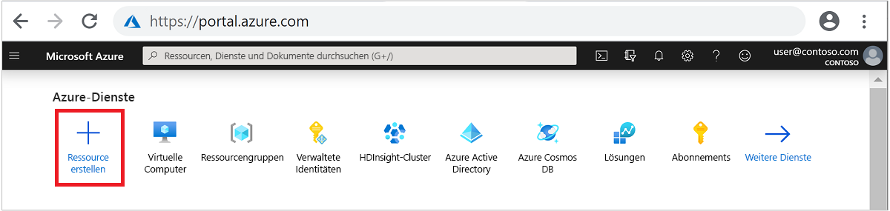
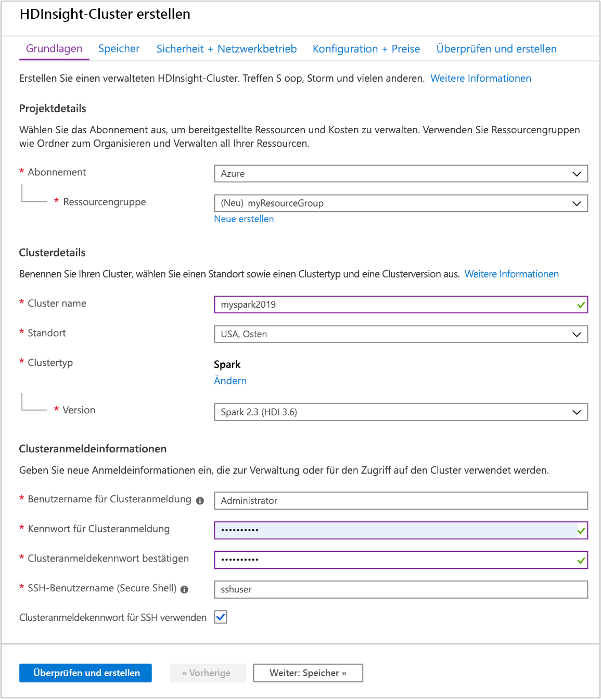
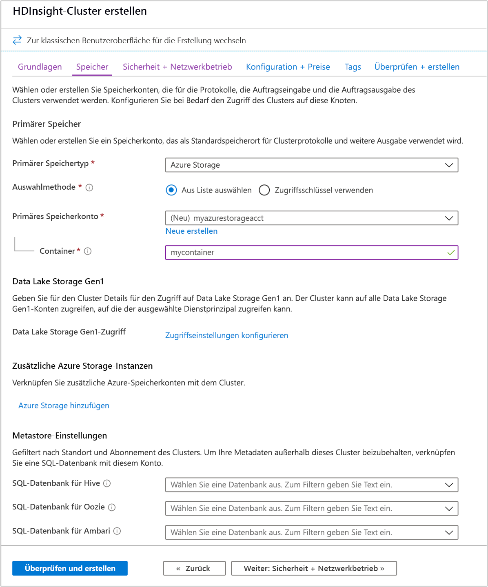
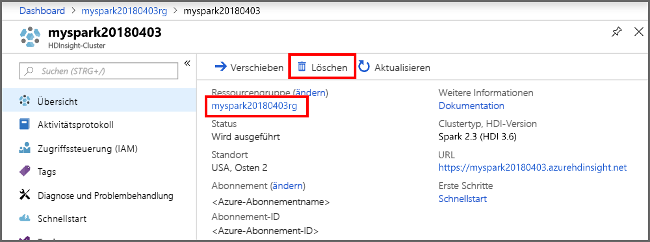

# <a name="quickstart-create-apache-spark-cluster-in-azure-hdinsight-using-azure-portal"></a>Schnellstart: Erstellen eines Apache Spark-Clusters in Azure HDInsight im Azure-Portal

In dieser Schnellstartanleitung verwenden Sie das Azure-Portal zum Erstellen eines Apache Spark-Clusters in Azure HDInsight. Anschließend erstellen Sie eine Jupyter Notebook-Instanz und führen damit Spark SQL-Abfragen für Apache Hive-Tabellen aus. Azure HDInsight ist ein umfassender, verwalteter Open-Source-Analysedienst für Unternehmen. Das Apache Spark-Framework für HDInsight ermöglicht schnelle Datenanalysen und Clustercomputing mit In-Memory-Verarbeitung. Die Jupyter Notebook-Instanz ermöglicht es Ihnen, mit Ihren Daten zu interagieren, Code mit Markdowntext zu kombinieren und einfache Visualisierungen durchzuführen.

Eine ausführliche Beschreibung der verfügbaren Konfigurationen finden Sie unter [Einrichten von Clustern in HDInsight](../hdinsight-hadoop-provision-linux-clusters.md). Weitere Informationen zur Nutzung des Portals zum Erstellen von Clustern finden Sie unter [Erstellen von Clustern im Portal](../hdinsight-hadoop-create-linux-clusters-portal.md).

Bei gemeinsamer Verwendung mehrerer Cluster empfiehlt sich die Erstellung eines virtuellen Netzwerks. Bei Verwendung eines Spark-Clusters sollten Sie den Hive Warehouse Connector verwenden. Weitere Informationen finden Sie unter [Planen eines virtuellen Netzwerks für Azure HDInsight](../hdinsight-plan-virtual-network-deployment.md) sowie unter [Integrieren von Apache Spark und Apache Hive per Hive Warehouse Connector](../interactive-query/apache-hive-warehouse-connector.md).

> [!IMPORTANT]  
> Die Abrechnung für die HDInsight-Cluster erfolgt anteilsmäßig auf Minutenbasis und ist unabhängig von der Verwendung. Daher sollten Sie Ihren Cluster nach der Verwendung unbedingt wieder löschen. Weitere Informationen finden Sie im Abschnitt [Bereinigen von Ressourcen](#clean-up-resources) in diesem Artikel.

## <a name="prerequisites"></a>Voraussetzungen

Ein Azure-Konto mit einem aktiven Abonnement. Sie können [kostenlos ein Konto erstellen](https://azure.microsoft.com/free/?ref=microsoft.com&utm_source=microsoft.com&utm_medium=docs&utm_campaign=visualstudio).

## <a name="create-an-apache-spark-cluster-in-hdinsight"></a>Erstellen eines Apache Spark-Clusters in HDInsight

Sie verwenden das Azure-Portal zum Erstellen eines HDInsight-Clusters, der Azure Storage-Blobs als Clusterspeicher einsetzt. Weitere Informationen zur Verwendung von Data Lake Storage Gen2 finden Sie unter [Schnellstart: Einrichten von Clustern in HDInsight](../../storage/data-lake-storage/quickstart-create-connect-hdi-cluster.md).

1. Melden Sie sich beim [Azure-Portal](https://portal.azure.com/) an.

1. Klicken Sie im oberen Menü auf **+ Ressource erstellen**.

    

1. Wählen Sie **Analytics** > **Azure HDInsight** aus, um die Seite **HDInsight-Cluster erstellen** zu öffnen.

1. Geben Sie auf der Registerkarte **Grundlagen** die folgenden Informationen an:

    |Eigenschaft  |BESCHREIBUNG  |
    |---------|---------|
    |Subscription  | Wählen Sie in der Dropdownliste das Azure-Abonnement aus, das für den Cluster verwendet wird. |
    |Resource group | Wählen Sie in der Dropdownliste Ihre vorhandene Ressourcengruppe oder die Option **Neu erstellen** aus.|
    |Clustername | Geben Sie einen global eindeutigen Namen ein.|
    |Region   | Wählen Sie in der Dropdownliste eine Region für die Erstellung des Clusters aus. |
    |Clustertyp| Wählen Sie „Clustertyp auswählen“ aus, um eine Liste zu öffnen. Wählen Sie in der Liste die Option **Spark** aus.|
    |Clusterversion|Nach Auswahl des Clustertyps wird dieses Feld automatisch mit der Standardversion gefüllt.|
    |Benutzername für Clusteranmeldung| Geben Sie den Anmeldebenutzernamen für den Cluster ein.  Der Standardname lautet **admin**. Sie verwenden dieses Konto später in dieser Schnellstartanleitung für die Anmeldung bei Jupyter Notebook. |
    |Kennwort für Clusteranmeldung| Geben Sie das Kennwort für die Clusteranmeldung ein. |
    |SSH-Benutzername (Secure Shell)| Geben Sie den SSH-Benutzernamen ein. Für diesen Schnellstart wird der SSH-Benutzername **sshuser** verwendet. Standardmäßig gilt für dieses Konto dasselbe Kennwort wie für das Konto mit dem *Benutzernamen für die Clusteranmeldung*. |

    

    Klicken Sie auf **Weiter: Speicher >>** , um zur Seite **Speicher** zu wechseln.

1. Geben Sie unter **Speicher** die folgenden Werte an:

    |Eigenschaft  |BESCHREIBUNG  |
    |---------|---------|
    |Primärer Speichertyp|Übernehmen Sie den Standardwert **Azure Storage**.|
    |Auswahlmethode|Übernehmen Sie den Standardwert **Aus Liste auswählen**.|
    |Primäres Speicherkonto|Verwenden Sie den automatisch ausgefüllten Wert.|
    |Container|Verwenden Sie den automatisch ausgefüllten Wert.|

    

    Wählen Sie zum Fortfahren **Überprüfen + erstellen** aus.

1. Wählen Sie unter **Überprüfen + erstellen** die Option **Erstellen** aus. Das Erstellen des Clusters dauert ca. 20 Minuten. Der Cluster muss erstellt werden, bevor Sie mit dem nächsten Abschnitt fortfahren können.

Sollte bei der HDInsight-Clustererstellung ein Problem auftreten, verfügen Sie unter Umständen nicht über die erforderlichen Berechtigungen. Weitere Informationen finden Sie unter [Voraussetzungen für die Zugriffssteuerung](../hdinsight-hadoop-customize-cluster-linux.md#access-control).

## <a name="create-a-jupyter-notebook"></a>Erstellen eines Jupyter Notebooks

Jupyter Notebook ist eine interaktive Notebook-Umgebung, die verschiedene Programmiersprachen unterstützt. Das Notebook ermöglicht Ihnen, mit Ihren Daten zu interagieren, Code mit Markdowntext zu kombinieren und einfache Visualisierungen durchzuführen.

1. Navigieren Sie in einem Webbrowser zu `https://CLUSTERNAME.azurehdinsight.net/jupyter`, wobei `CLUSTERNAME` der Name Ihres Clusters ist. Geben Sie die Anmeldeinformationen für den Cluster ein, wenn Sie dazu aufgefordert werden.

1. Wählen Sie **Neu** > **PySpark** aus, um ein Notebook zu erstellen.

   

   Ein neues Notebook mit dem Namen „Untitled“ (Untitled.pynb) wird erstellt und geöffnet.

## <a name="run-apache-spark-sql-statements"></a>Ausführen von Apache Spark-SQL-Anweisungen

SQL (Structured Query Language) ist die gängigste und am häufigsten verwendete Sprache zum Abfragen und Definieren von Daten. Spark SQL fungiert als Erweiterung von Apache Spark für die Verarbeitung strukturierter Daten mit der vertrauten SQL-Syntax.

1. Überprüfen Sie, ob der Kernel bereit ist. Der Kernel ist bereit, wenn im Notebook neben dem Kernelnamen ein leerer Kreis angezeigt wird. Ein ausgefüllter Kreis gibt an, dass der Kernel ausgelastet ist.

    

    Wenn Sie das Notebook zum ersten Mal starten, führt der Kernel im Hintergrund einige Aufgaben durch. Warten Sie, bis der Kernel bereit ist.

1. Fügen Sie den folgenden Code in eine leere Zelle ein, und drücken Sie **UMSCHALT+EINGABE** , um den Code auszuführen. Der Befehl listet die Hive-Tabellen im Cluster auf:

    ```PySpark
    %%sql
    SHOW TABLES
    ```

    Wenn Sie eine Jupyter Notebook-Instanz mit Ihrem HDInsight-Cluster verwenden, erhalten Sie ein vordefiniertes `sqlContext`-Element, das Sie zum Ausführen von Hive-Abfragen mit Spark SQL verwenden können. `%%sql` weist Jupyter Notebook an, den vordefinierten `sqlContext` für die Ausführung der Hive-Abfrage zu verwenden. Die Abfrage ruft die ersten zehn Zeilen aus einer Hive-Tabelle (**hivesampletable**) ab, die standardmäßig in allen HDInsight-Clustern enthalten ist. Es dauert ungefähr 30 Sekunden, bis die Ergebnisse angezeigt werden. Die Ausgabe sieht wie folgt aus:

    

    Bei jeder Ausführung einer Abfrage in Jupyter wird auf der Titelleiste Ihres Webbrowserfensters neben dem Notebooktitel der Status **(Beschäftigt)** angezeigt. Außerdem sehen Sie in der rechten oberen Ecke einen ausgefüllten Kreis neben dem Text **PySpark**.

1. Führen Sie eine weitere Abfrage aus, um die Daten in `hivesampletable` anzuzeigen.

    ```PySpark
    %%sql
    SELECT * FROM hivesampletable LIMIT 10
    ```

    Der Bildschirm wird aktualisiert, und die Ausgabe der Abfrage wird angezeigt.

    

1. Wählen Sie im Menü **Datei** des Notebooks die Option **Schließen und Anhalten** aus. Durch Herunterfahren des Notebooks werden die Clusterressourcen freigegeben.

## <a name="clean-up-resources"></a>Bereinigen von Ressourcen

HDInsight speichert Ihre Daten in Azure Storage oder Azure Data Lake Storage, sodass Sie einen Cluster ohne Weiteres löschen können, wenn er nicht verwendet wird. Für einen HDInsight-Cluster fallen auch dann Gebühren an, wenn er nicht verwendet wird. Da die Gebühren für den Cluster erheblich höher sind als die Kosten für den Speicher, ist es sinnvoll, nicht verwendete Cluster zu löschen. Wenn Sie vorhaben, sofort mit dem Tutorial unter [Nächste Schritte](#next-steps) fortzufahren, können Sie den Cluster beibehalten.

Wechseln Sie zurück zum Azure-Portal, und wählen Sie **Löschen** aus.



Sie können auch den Namen der Ressourcengruppe auswählen, um die Seite für die Ressourcengruppe zu öffnen, und dann **Ressourcengruppe löschen** auswählen. Indem Sie die Ressourcengruppe löschen, löschen Sie sowohl den HDInsight-Cluster als auch das Standardspeicherkonto.

## <a name="next-steps"></a>Nächste Schritte

In dieser Schnellstartanleitung haben Sie erfahren, wie Sie einen Apache Spark-Cluster in HDInsight erstellen und eine einfache Spark SQL-Abfrage ausführen. Im nächsten Tutorial erfahren Sie, wie Sie mithilfe eines HDInsight-Clusters interaktive Abfragen für Beispieldaten ausführen.

> [!div class="nextstepaction"]
> [Ausführen von interaktiven Abfragen für Apache Spark](./apache-spark-load-data-run-query.md)
