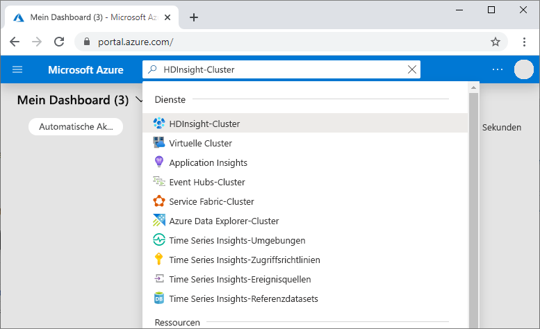
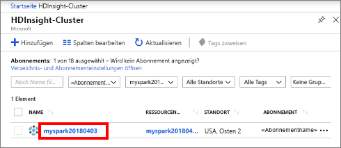
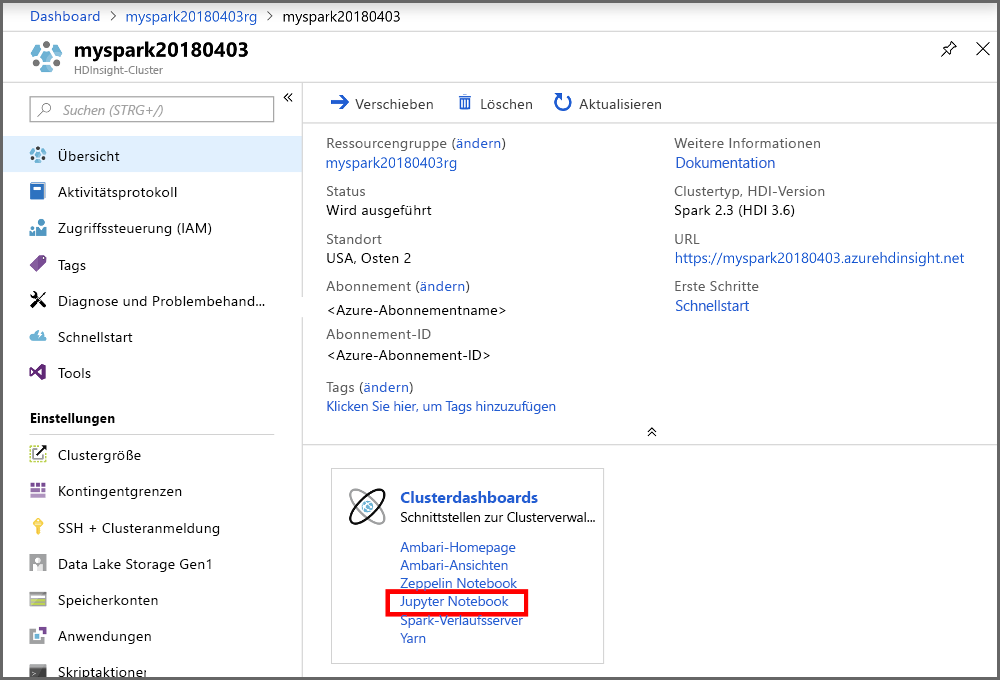
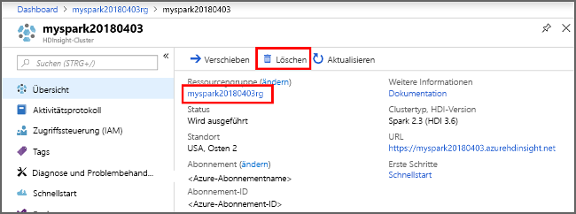

# <a name="quickstart-create-apache-spark-cluster-in-azure-hdinsight-using-powershell"></a>Schnellstart: Erstellen eines Apache Spark-Clusters in Azure HDInsight mithilfe von PowerShell

In dieser Schnellstartanleitung verwenden Sie Azure PowerShell zum Erstellen eines Apache Spark-Clusters in Azure HDInsight. Anschließend erstellen Sie eine Jupyter Notebook-Instanz und führen damit Spark SQL-Abfragen für Apache Hive-Tabellen aus. Azure HDInsight ist ein umfassender, verwalteter Open-Source-Analysedienst für Unternehmen. Das Apache Spark-Framework für Azure HDInsight ermöglicht schnelle Datenanalysen und Clustercomputing mit In-Memory-Verarbeitung. Die Jupyter Notebook-Instanz ermöglicht es Ihnen, mit Ihren Daten zu interagieren, Code mit Markdowntext zu kombinieren und einfache Visualisierungen durchzuführen.

[Übersicht: Apache Spark in Azure HDInsight](apache-spark-overview.md) | [Apache Spark](https://spark.apache.org/) | [Apache Hive](https://hive.apache.org/) | [Jupyter Notebook](https://jupyter.org/)

Bei gemeinsamer Verwendung mehrerer Cluster empfiehlt sich die Erstellung eines virtuellen Netzwerks. Bei Verwendung eines Spark-Clusters sollten Sie den Hive Warehouse Connector verwenden. Weitere Informationen finden Sie unter [Planen eines virtuellen Netzwerks für Azure HDInsight](../hdinsight-plan-virtual-network-deployment.md) sowie unter [Integrieren von Apache Spark und Apache Hive per Hive Warehouse Connector](../interactive-query/apache-hive-warehouse-connector.md).

## <a name="prerequisite"></a>Voraussetzung

- Ein Azure-Konto mit einem aktiven Abonnement. Sie können [kostenlos ein Konto erstellen](https://azure.microsoft.com/free/?ref=microsoft.com&utm_source=microsoft.com&utm_medium=docs&utm_campaign=visualstudio).
- Das [PowerShell Az-Modul](https://docs.microsoft.com/powershell/azure/install-az-ps)

## <a name="create-an-apache-spark-cluster-in-hdinsight"></a>Erstellen eines Apache Spark-Clusters in HDInsight

> [!IMPORTANT]  
> Die Abrechnung für die HDInsight-Cluster erfolgt anteilsmäßig auf Minutenbasis und ist unabhängig von der Verwendung. Daher sollten Sie Ihren Cluster nach der Verwendung unbedingt wieder löschen. Weitere Informationen finden Sie im Abschnitt [Bereinigen von Ressourcen](#clean-up-resources) in diesem Artikel.

Die Erstellung eines HDInsight-Clusters umfasst die Erstellung der folgenden Azure-Objekte und -Ressourcen:

- Eine Azure-Ressourcengruppe. Eine Azure-Ressourcengruppe ist ein Container für Azure-Ressourcen.
- Ein Azure-Speicherkonto oder einen Azure Data Lake Store.  Jeder HDInsight-Cluster erfordert einen abhängigen Datenspeicher. In dieser Schnellstartanleitung wird ein Cluster erstellt, der Azure Storage-Blobs als Clusterspeicher einsetzt. Weitere Informationen zur Verwendung von Data Lake Storage Gen2 finden Sie unter [Schnellstart: Einrichten von Clustern in HDInsight](../../storage/data-lake-storage/quickstart-create-connect-hdi-cluster.md).
- Ein Cluster mit verschiedenen Clustertypen in HDInsight.  In diesem Schnellstarttutorial erstellen Sie einen Spark 2.3-Cluster.

Sie verwenden ein PowerShell-Skript, um die Ressourcen zu erstellen. 

[!INCLUDE [updated-for-az](../../../includes/updated-for-az.md)]

Wenn Sie das PowerShell-Skript ausführen, werden Sie zur Eingabe der folgenden Werte aufgefordert:

|Parameter|Wert|
|------|------|
|Azure-Ressourcengruppenname | Geben Sie einen eindeutigen Namen für die Ressourcengruppe an.|
|Standort| Geben Sie die Azure-Region an, z.B. „USA, Mitte“. |
|Name des Standard-Speicherkontos | Geben Sie einen eindeutigen Namen für das Speicherkonto an. |
|Clustername | Geben Sie einen eindeutigen Namen für den HDInsight-Cluster an.|
|Clusteranmeldeinformation | Sie verwenden dieses Konto später in diesem Schnellstarttutorial, um eine Verbindung zum Clusterdashboard herzustellen.|
|SSH-Benutzeranmeldeinformationen | Die SSH-Clients können verwendet werden, um eine Remote-Befehlszeilensitzung mit den Clustern in HDInsight zu erstellen.|

1. Wählen Sie in der rechten oberen Ecke **Ausprobieren** aus, damit der folgende Codeblock [Azure Cloud Shell](../../cloud-shell/overview.md) öffnet. Folgen Sie dann den Anweisungen, um eine Verbindung mit Azure herzustellen.

2. Kopieren Sie das folgende PowerShell-Skript, und fügen Sie es in Cloud Shell ein.

    ```azurepowershell-interactive
    ### Create a Spark 2.3 cluster in Azure HDInsight

    # Default cluster size (# of worker nodes), version, and type
    $clusterSizeInNodes = "1"
    $clusterVersion = "3.6"
    $clusterType = "Spark"

    # Create the resource group
    $resourceGroupName = Read-Host -Prompt "Enter the resource group name"
    $location = Read-Host -Prompt "Enter the Azure region to create resources in, such as 'Central US'"
    $defaultStorageAccountName = Read-Host -Prompt "Enter the default storage account name"

    New-AzResourceGroup -Name $resourceGroupName -Location $location

    # Create an Azure storage account and container
    # Note: Storage account kind BlobStorage can only be used as secondary storage for HDInsight clusters.
    New-AzStorageAccount `
        -ResourceGroupName $resourceGroupName `
        -Name $defaultStorageAccountName `
        -Location $location `
        -SkuName Standard_LRS `
        -Kind StorageV2 `
        -EnableHttpsTrafficOnly 1

    $defaultStorageAccountKey = (Get-AzStorageAccountKey `
                                    -ResourceGroupName $resourceGroupName `
                                    -Name $defaultStorageAccountName)[0].Value

    $defaultStorageContext = New-AzStorageContext `
                                    -StorageAccountName $defaultStorageAccountName `
                                    -StorageAccountKey $defaultStorageAccountKey

    # Create a Spark 2.3 cluster
    $clusterName = Read-Host -Prompt "Enter the name of the HDInsight cluster"

    # Cluster login is used to secure HTTPS services hosted on the cluster
    $httpCredential = Get-Credential -Message "Enter Cluster login credentials" -UserName "admin"

    # SSH user is used to remotely connect to the cluster using SSH clients
    $sshCredentials = Get-Credential -Message "Enter SSH user credentials" -UserName "sshuser"

    # Set the storage container name to the cluster name
    $defaultBlobContainerName = $clusterName

    # Create a blob container. This holds the default data store for the cluster.
    New-AzStorageContainer `
        -Name $clusterName `
        -Context $defaultStorageContext

    $sparkConfig = New-Object "System.Collections.Generic.Dictionary``2[System.String,System.String]"
    $sparkConfig.Add("spark", "2.3")

    # Create the cluster in HDInsight
    New-AzHDInsightCluster `
        -ResourceGroupName $resourceGroupName `
        -ClusterName $clusterName `
        -Location $location `
        -ClusterSizeInNodes $clusterSizeInNodes `
        -ClusterType $clusterType `
        -OSType "Linux" `
        -Version $clusterVersion `
        -ComponentVersion $sparkConfig `
        -HttpCredential $httpCredential `
        -DefaultStorageAccountName "$defaultStorageAccountName.blob.core.windows.net" `
        -DefaultStorageAccountKey $defaultStorageAccountKey `
        -DefaultStorageContainer $clusterName `
        -SshCredential $sshCredentials

    Get-AzHDInsightCluster `
        -ResourceGroupName $resourceGroupName `
        -ClusterName $clusterName
    ```

   Das Erstellen des Clusters dauert ca. 20 Minuten. Der Cluster muss erstellt werden, bevor Sie mit dem nächsten Abschnitt fortfahren können.

Sollte bei der HDInsight-Clustererstellung ein Problem auftreten, verfügen Sie unter Umständen nicht über die erforderlichen Berechtigungen. Weitere Informationen finden Sie unter [Voraussetzungen für die Zugriffssteuerung](../hdinsight-hadoop-customize-cluster-linux.md#access-control).

## <a name="create-a-jupyter-notebook"></a>Erstellen eines Jupyter Notebooks

[Jupyter Notebook](https://jupyter.org/) ist eine interaktive Notebook-Umgebung, die verschiedene Programmiersprachen unterstützt. Das Notebook ermöglicht Ihnen, mit Ihren Daten zu interagieren, Code mit Markdowntext zu kombinieren und einfache Visualisierungen durchzuführen.

1. Suchen Sie im [Azure-Portal](https://portal.azure.com) nach dem Eintrag **HDInsight-Cluster**, und wählen Sie ihn aus.
   
   
   
1. Wählen Sie in der Liste den von Ihnen erstellten Cluster aus.
   
   
   
1. Wählen Sie auf der Seite **Übersicht** des Clusters die Option **Clusterdashboards** und dann **Jupyter Notebook** aus. Geben Sie die Anmeldeinformationen für den Cluster ein, wenn Sie dazu aufgefordert werden.

   

1. Wählen Sie **Neu** > **PySpark** aus, um ein Notebook zu erstellen.

   

   Ein neues Notebook mit dem Namen „Untitled“ (Untitled.pynb) wird erstellt und geöffnet.

## <a name="run-apache-spark-sql-statements"></a>Ausführen von Apache Spark-SQL-Anweisungen

SQL (Structured Query Language) ist die gängigste und am häufigsten verwendete Sprache zum Abfragen und Definieren von Daten. Spark SQL fungiert als Erweiterung von Apache Spark für die Verarbeitung strukturierter Daten mit der vertrauten SQL-Syntax.

1. Überprüfen Sie, ob der Kernel bereit ist. Der Kernel ist bereit, wenn im Notebook neben dem Kernelnamen ein leerer Kreis angezeigt wird. Ein ausgefüllter Kreis gibt an, dass der Kernel ausgelastet ist.

    

    Wenn Sie das Notebook zum ersten Mal starten, führt der Kernel im Hintergrund einige Aufgaben durch. Warten Sie, bis der Kernel bereit ist. 
1. Fügen Sie den folgenden Code in eine leere Zelle ein, und drücken Sie **UMSCHALT+EINGABE** , um den Code auszuführen. Der Befehl listet die Hive-Tabellen im Cluster auf:

    ```PySpark
    %%sql
    SHOW TABLES
    ```

    Wenn Sie eine Jupyter Notebook-Instanz mit Ihrem Spark-Cluster in HDInsight verwenden, erhalten Sie ein vordefiniertes `sqlContext`-Element, das Sie zum Ausführen von Hive-Abfragen mit Spark SQL verwenden können. `%%sql` weist Jupyter Notebook an, den vordefinierten `sqlContext` für die Ausführung der Hive-Abfrage zu verwenden. Die Abfrage ruft die ersten zehn Zeilen aus einer Hive-Tabelle (**hivesampletable**) ab, die standardmäßig in allen HDInsight-Clustern enthalten ist. Es dauert ungefähr 30 Sekunden, bis die Ergebnisse angezeigt werden. Die Ausgabe sieht wie folgt aus:

    

    Bei jeder Ausführung einer Abfrage in Jupyter wird auf der Titelleiste Ihres Webbrowserfensters neben dem Notebooktitel der Status **(Beschäftigt)** angezeigt. Außerdem sehen Sie in der rechten oberen Ecke einen ausgefüllten Kreis neben dem Text **PySpark**.

1. Führen Sie eine weitere Abfrage aus, um die Daten in `hivesampletable` anzuzeigen.

    ```PySpark
    %%sql
    SELECT * FROM hivesampletable LIMIT 10
    ```

    Der Bildschirm wird aktualisiert, und die Ausgabe der Abfrage wird angezeigt.

    

1. Wählen Sie im Menü **Datei** des Notebooks die Option **Schließen und Anhalten** aus. Durch Herunterfahren des Notebooks werden die Clusterressourcen freigegeben.

## <a name="clean-up-resources"></a>Bereinigen von Ressourcen

HDInsight speichert Ihre Daten in Azure Storage oder Azure Data Lake Storage, sodass Sie einen Cluster ohne Weiteres löschen können, wenn er nicht verwendet wird. Für einen HDInsight-Cluster fallen auch dann Gebühren an, wenn er nicht verwendet wird. Da die Gebühren für den Cluster erheblich höher sind als die Kosten für den Speicher, ist es sinnvoll, nicht verwendete Cluster zu löschen. Wenn Sie vorhaben, sofort mit dem Tutorial unter [Nächste Schritte](#next-steps) fortzufahren, können Sie den Cluster beibehalten.

Wechseln Sie zurück zum Azure-Portal, und wählen Sie **Löschen** aus.



Sie können auch den Namen der Ressourcengruppe auswählen, um die Seite für die Ressourcengruppe zu öffnen, und dann **Ressourcengruppe löschen** auswählen. Indem Sie die Ressourcengruppe löschen, löschen Sie sowohl den HDInsight-Cluster als auch das Standardspeicherkonto.

### <a name="piecemeal-clean-up-with-powershell-az-module"></a>Schrittweise Bereinigung mit dem PowerShell Az-Modul

```powershell
# Removes the specified HDInsight cluster from the current subscription.
Remove-AzHDInsightCluster `
    -ResourceGroupName $resourceGroupName `
    -ClusterName $clusterName

# Removes the specified storage container.
Remove-AzStorageContainer `
    -Name $clusterName `
    -Context $defaultStorageContext

# Removes a Storage account from Azure.
Remove-AzStorageAccount `
    -ResourceGroupName $resourceGroupName `
    -Name $defaultStorageAccountName

# Removes a resource group.
Remove-AzResourceGroup `
    -Name $resourceGroupName
```

## <a name="next-steps"></a>Nächste Schritte

In dieser Schnellstartanleitung haben Sie erfahren, wie Sie einen Apache Spark-Cluster in HDInsight erstellen und eine einfache Spark SQL-Abfrage ausführen. Im nächsten Tutorial erfahren Sie, wie Sie mithilfe eines HDInsight-Clusters interaktive Abfragen für Beispieldaten ausführen.

> [!div class="nextstepaction"]
> [Ausführen von interaktiven Abfragen für Apache Spark](./apache-spark-load-data-run-query.md)
