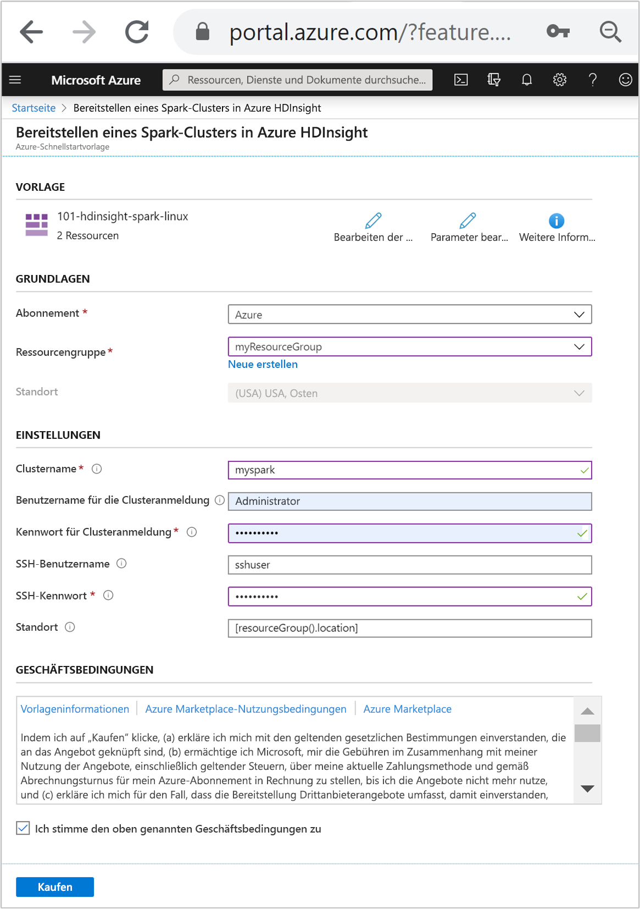
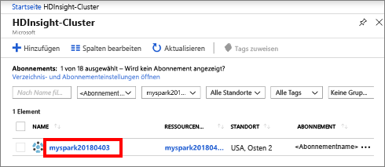

# <a name="quickstart-create-apache-spark-cluster-in-azure-hdinsight-using-resource-manager-template"></a>Schnellstart: Erstellen eines Apache Spark-Clusters in Azure HDInsight mit einer Resource Manager-Vorlage

In dieser Schnellstartanleitung verwenden Sie eine Azure Resource Manager-Vorlage, um einen [Apache Spark](./apache-spark-overview.md)-Cluster in Azure HDInsight zu erstellen. Anschließend erstellen Sie eine Jupyter Notebook-Instanz und führen damit Spark SQL-Abfragen für Apache Hive-Tabellen aus. Azure HDInsight ist ein umfassender, verwalteter Open-Source-Analysedienst für Unternehmen. Das Apache Spark-Framework für HDInsight ermöglicht schnelle Datenanalysen und Clustercomputing mit In-Memory-Verarbeitung. Die Jupyter Notebook-Instanz ermöglicht es Ihnen, mit Ihren Daten zu interagieren, Code mit Markdowntext zu kombinieren und einfache Visualisierungen durchzuführen.

[!INCLUDE [About Azure Resource Manager](../../../includes/resource-manager-quickstart-introduction.md)]

Wenn Sie kein Azure-Abonnement besitzen, können Sie ein [kostenloses Konto](https://azure.microsoft.com/free/?WT.mc_id=A261C142F) erstellen, bevor Sie beginnen.

## <a name="create-an-apache-spark-cluster"></a>Erstellen eines Apache Spark-Clusters

### <a name="review-the-template"></a>Überprüfen der Vorlage

Die in dieser Schnellstartanleitung verwendete Vorlage stammt von der Seite mit den [Azure-Schnellstartvorlagen](https://github.com/Azure/azure-quickstart-templates/tree/master/101-hdinsight-spark-linux).

:::code language="json" source="~/quickstart-templates/101-hdinsight-spark-linux/azuredeploy.json" range="1-143":::

Zwei Azure-Ressourcen sind in der Vorlage definiert:

* [Microsoft.Storage/storageAccounts](https://docs.microsoft.com/azure/templates/microsoft.storage/storageaccounts): Erstellen eines Azure Storage-Kontos
* [Microsoft.HDInsight/cluster](https://docs.microsoft.com/azure/templates/microsoft.hdinsight/clusters): Erstellen eines HDInsight-Clusters

### <a name="deploy-the-template"></a>Bereitstellen der Vorlage

1. Wählen Sie unten die Schaltfläche **In Azure bereitstellen** aus, um sich bei Azure anzumelden und die Resource Manager-Vorlage zu öffnen.

    [](https://portal.azure.com/#create/Microsoft.Template/uri/https%3A%2F%2Fraw.githubusercontent.com%2FAzure%2Fazure-quickstart-templates%2Fmaster%2F101-hdinsight-spark-linux%2Fazuredeploy.json)

1. Geben Sie folgende Werte ein bzw. wählen diese aus:

    |Eigenschaft |BESCHREIBUNG |
    |---|---|
    |Subscription|Wählen Sie in der Dropdownliste das Azure-Abonnement aus, das für den Cluster verwendet wird.|
    |Resource group|Wählen Sie in der Dropdownliste Ihre vorhandene Ressourcengruppe oder die Option **Neu erstellen** aus.|
    |Position|Als Wert wird automatisch der Speicherort für die Ressourcengruppe eingefügt.|
    |Clustername|Geben Sie einen global eindeutigen Namen ein. Verwenden Sie für diese Vorlage nur Kleinbuchstaben und Zahlen.|
    |Benutzername für Clusteranmeldung|Geben Sie den Benutzernamen an, der Standardwert ist **admin**.|
    |Kennwort für Clusteranmeldung|Geben Sie ein Kennwort an. Das Kennwort muss mindestens zehn Zeichen lang sein und mindestens eine Ziffer, einen Groß- und einen Kleinbuchstaben sowie ein nicht alphanumerisches Zeichen enthalten (mit Ausnahme folgender Zeichen: ' " `). |
    |SSH-Benutzername|Geben Sie den Benutzernamen an, der Standardwert ist **sshuser**.|
    |SSH-Kennwort|Geben Sie das Kennwort an.|

    

1. Sehen Sie sich die **GESCHÄFTSBEDINGUNGEN** an. Wählen Sie anschließend **Ich stimme den oben genannten Geschäftsbedingungen zu** und dann **Kaufen** aus. Sie erhalten eine Benachrichtigung, dass die Bereitstellung derzeit durchgeführt wird. Das Erstellen eines Clusters dauert ca. 20 Minuten.

Sollte bei der HDInsight-Clustererstellung ein Problem auftreten, verfügen Sie unter Umständen nicht über die erforderlichen Berechtigungen. Weitere Informationen finden Sie unter [Voraussetzungen für die Zugriffssteuerung](../hdinsight-hadoop-customize-cluster-linux.md#access-control).

## <a name="review-deployed-resources"></a>Überprüfen der bereitgestellten Ressourcen

Nachdem der Cluster erstellt wurde, erhalten Sie die Benachrichtigung **Bereitstellung erfolgreich** mit dem Link **Zu Ressource wechseln**. Auf der Seite „Ressourcengruppe“ sind der neue HDInsight-Cluster und der mit dem Cluster verbundene Standardspeicher aufgeführt. Jeder Cluster verfügt über eine Abhängigkeit von einem [Azure Storage-Konto](../hdinsight-hadoop-use-blob-storage.md) oder einem [Azure Data Lake Storage-Konto](../hdinsight-hadoop-use-data-lake-store.md). Dieses wird als Standardspeicherkonto bezeichnet. Der HDInsight-Cluster und das zugehörige Speicherkonto müssen sich in derselben Azure-Region befinden. Beim Löschen von Clustern wird das Speicherkonto nicht gelöscht.

## <a name="create-a-jupyter-notebook"></a>Erstellen eines Jupyter Notebooks

[Jupyter Notebook](https://jupyter.org/) ist eine interaktive Notebook-Umgebung, die verschiedene Programmiersprachen unterstützt. Das Notebook ermöglicht es Ihnen, mit Ihren Daten zu interagieren, Code mit Markdowntext zu kombinieren und einfache Visualisierungen durchzuführen.

1. Öffnen Sie das [Azure-Portal](https://portal.azure.com).

2. Wählen Sie **HDInsight-Cluster** und dann den von Ihnen erstellten Cluster aus.

    

3. Wählen Sie im Portal im Abschnitt **Clusterdashboards** die Option **Jupyter Notebook** aus. Geben Sie die Anmeldeinformationen für den Cluster ein, wenn Sie dazu aufgefordert werden.

   

4. Wählen Sie **Neu** > **PySpark** aus, um ein Notebook zu erstellen.

   

   Ein neues Notebook mit dem Namen „Untitled“ (Untitled.pynb) wird erstellt und geöffnet.

## <a name="run-apache-spark-sql-statements"></a>Ausführen von Apache Spark-SQL-Anweisungen

SQL (Structured Query Language) ist die gängigste und am häufigsten verwendete Sprache zum Abfragen und Transformieren von Daten. Spark SQL fungiert als Erweiterung von Apache Spark für die Verarbeitung strukturierter Daten mit der vertrauten SQL-Syntax.

1. Überprüfen Sie, ob der Kernel bereit ist. Der Kernel ist bereit, wenn im Notebook neben dem Kernelnamen ein leerer Kreis angezeigt wird. Ein ausgefüllter Kreis gibt an, dass der Kernel ausgelastet ist.

    

    Wenn Sie das Notebook zum ersten Mal starten, führt der Kernel im Hintergrund einige Aufgaben durch. Warten Sie, bis der Kernel bereit ist.

1. Fügen Sie den folgenden Code in eine leere Zelle ein, und drücken Sie **UMSCHALT+EINGABE** , um den Code auszuführen. Der Befehl listet die Hive-Tabellen im Cluster auf:

    ```sql
    %%sql
    SHOW TABLES
    ```

    Wenn Sie eine Jupyter Notebook-Instanz mit Ihrem HDInsight-Cluster verwenden, erhalten Sie eine vordefinierte `spark`-Sitzung, die Sie zum Ausführen von Hive-Abfragen mit Spark SQL verwenden können. `%%sql` weist Jupyter Notebook an, die vordefinierte `spark`-Sitzung für die Ausführung der Hive-Abfrage zu verwenden. Die Abfrage ruft die ersten zehn Zeilen aus einer Hive-Tabelle (**hivesampletable**) ab, die standardmäßig in allen HDInsight-Clustern enthalten ist. Wenn Sie die Abfrage erstmals übermitteln, erstellt Jupyter eine Spark-Anwendung für das Notebook. Dieser Vorgang dauert ungefähr 30 Sekunden. Sobald die Spark-Anwendung bereit ist, wird die Abfrage innerhalb etwa einer Sekunde ausgeführt, und die Ergebnisse werden zurückgegeben. Die Ausgabe sieht wie folgt aus:

    

    Bei jeder Ausführung einer Abfrage in Jupyter wird auf der Titelleiste Ihres Webbrowserfensters neben dem Notebooktitel der Status **(Beschäftigt)** angezeigt. Außerdem sehen Sie in der rechten oberen Ecke einen ausgefüllten Kreis neben dem Text **PySpark**.

1. Führen Sie eine weitere Abfrage aus, um die Daten in `hivesampletable` anzuzeigen.

    ```sql
    %%sql
    SELECT * FROM hivesampletable LIMIT 10
    ```

    Der Bildschirm wird aktualisiert, und die Ausgabe der Abfrage wird angezeigt.

    

1. Wählen Sie im Menü **Datei** des Notebooks die Option **Schließen und Anhalten** aus. Durch Herunterfahren des Notebooks werden die Clusterressourcen freigegeben (einschließlich der Spark-Anwendung).

## <a name="clean-up-resources"></a>Bereinigen von Ressourcen

Nachdem Sie den Schnellstart abgeschlossen haben, können Sie den Cluster löschen. Mit HDInsight werden Ihre Daten in Azure Storage gespeichert, sodass Sie einen Cluster problemlos löschen können, wenn er nicht verwendet wird. Für einen HDInsight-Cluster fallen auch dann Gebühren an, wenn er nicht verwendet wird. Da die Gebühren für den Cluster erheblich höher sind als die Kosten für den Speicher, ist es sinnvoll, nicht verwendete Cluster zu löschen.

Navigieren Sie im Azure-Portal zu Ihrem Cluster, und wählen Sie **Löschen** aus.


Sie können auch den Namen der Ressourcengruppe auswählen, um die Seite für die Ressourcengruppe zu öffnen, und dann **Ressourcengruppe löschen** auswählen. Indem Sie die Ressourcengruppe löschen, löschen Sie sowohl den HDInsight-Cluster als auch das Standardspeicherkonto.

## <a name="next-steps"></a>Nächste Schritte

In dieser Schnellstartanleitung haben Sie erfahren, wie Sie einen Apache Spark-Cluster in HDInsight erstellen und eine einfache Spark SQL-Abfrage ausführen. Im nächsten Tutorial erfahren Sie, wie Sie mithilfe eines HDInsight-Clusters interaktive Abfragen für Beispieldaten ausführen.

> [!div class="nextstepaction"]
> [Ausführen von interaktiven Abfragen für Apache Spark](./apache-spark-load-data-run-query.md)
