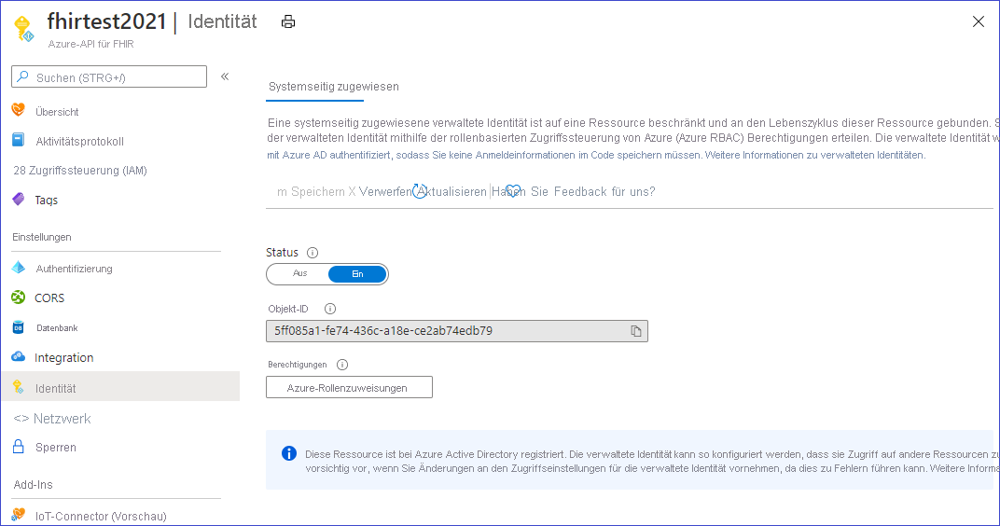
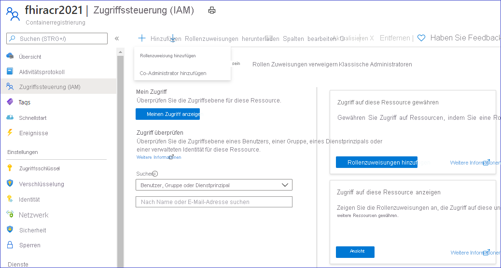
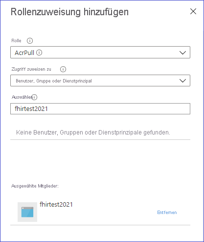

# <a name="how-to-convert-data-to-fhir"></a>Konvertieren von Daten in FHIR

Der benutzerdefinierte Endpunkt „$convert-data“ in Azure API for FHIR ist für die Datenkonvertierung aus verschiedenen Formaten in FHIR vorgesehen. Er verwendet die Liquid-Vorlagen-Engine und die Vorlagen aus dem Projekt [FHIR Converter](https://github.com/microsoft/FHIR-Converter) als Standardvorlagen. Diese Konvertierungsvorlagen können nach Bedarf angepasst werden. Aktuell wird die Konvertierung von HL7v2 in FHIR unterstützt.

## <a name="use-the-convert-data-endpoint"></a>Verwenden des Endpunkts „$convert-data“

`https://<<FHIR service base URL>>/$convert-data`

Von „$convert-data“ wird eine Ressource vom Typ [Parameter](http://hl7.org/fhir/parameters.html) im Anforderungstext akzeptiert, wie im Anschluss beschrieben:

**Parameterressource:**

| Parametername      | Beschreibung | Zulässige Werte |
| ----------- | ----------- | ----------- |
| inputData      | Die zu konvertierenden Daten. | Ein gültiger Wert in Form einer JSON-Zeichenfolge.|
| inputDataType   | Der Datentyp der Eingabe. | ```HL7v2``` |
| templateCollectionReference | Ein Verweis auf eine Vorlagensammlung. Dabei kann entweder auf die **Standardvorlagen** oder auf ein benutzerdefiniertes Vorlagenimage verwiesen werden, das bei Azure API for FHIR registriert ist. Weiter unten erfahren Sie, wie Sie die Vorlagen anpassen, in ACR hosten und bei Azure API for FHIR registrieren.  | ```microsofthealth/fhirconverter:default```, \<RegistryServer\>/\<imageName\>@\<imageDigest\> |
| rootTemplate | Die Stammvorlage, die beim Transformieren der Daten verwendet werden soll. | ```ADT_A01```, ```OML_O21```, ```ORU_R01```, ```VXU_V04``` |  

> [!WARNING]
> Standardvorlagen erleichtern den Einstieg. Sie werden jedoch möglicherweise im Zuge eines Upgrades für Azure API for FHIR aktualisiert. Damit die Datenkonvertierung über verschiedene Versionen von Azure API for FHIR hinweg konsistent bleibt, müssen Sie eine eigene Kopie der Vorlagen in einer Azure Container Registry-Instanz hosten, sie bei Azure API for FHIR registrieren und wie weiter unten beschrieben in Ihren API-Aufrufen verwenden.

**Beispiel für eine Anforderung:**

```json
{
    "resourceType": "Parameters",
    "parameter": [
        {
            "name": "inputData",
            "valueString": "MSH|^~\\&|SIMHOSP|SFAC|RAPP|RFAC|20200508131015||ADT^A01|517|T|2.3|||AL||44|ASCII\nEVN|A01|20200508131015|||C005^Whittingham^Sylvia^^^Dr^^^DRNBR^PRSNL^^^ORGDR|\nPID|1|3735064194^^^SIMULATOR MRN^MRN|3735064194^^^SIMULATOR MRN^MRN~2021051528^^^NHSNBR^NHSNMBR||Kinmonth^Joanna^Chelsea^^Ms^^CURRENT||19870624000000|F|||89 Transaction House^Handmaiden Street^Wembley^^FV75 4GJ^GBR^HOME||020 3614 5541^HOME|||||||||C^White - Other^^^||||||||\nPD1|||FAMILY PRACTICE^^12345|\nPV1|1|I|OtherWard^MainRoom^Bed 183^Simulated Hospital^^BED^Main Building^4|28b|||C005^Whittingham^Sylvia^^^Dr^^^DRNBR^PRSNL^^^ORGDR|||CAR|||||||||16094728916771313876^^^^visitid||||||||||||||||||||||ARRIVED|||20200508131015||"
        },
        {
            "name": "inputDataType",
            "valueString": "Hl7v2"
        },
        {
            "name": "templateCollectionReference",
            "valueString": "microsofthealth/fhirconverter:default"
        },
        {
            "name": "rootTemplate",
            "valueString": "ADT_A01"
        }
    ]
}
```

**Beispielantwort:**

```json
{
  "resourceType": "Bundle",
  "type": "transaction",
  "entry": [
    {
      "fullUrl": "urn:uuid:9d697ec3-48c3-3e17-db6a-29a1765e22c6",
      "resource": {
        "resourceType": "Patient",
        "id": "9d697ec3-48c3-3e17-db6a-29a1765e22c6",
        ...
        ...
      "request": {
        "method": "PUT",
        "url": "Location/50becdb5-ff56-56c6-40a1-6d554dca80f0"
      }
    }
  ]
}
```

## <a name="customize-templates"></a>Anpassen von Vorlagen

Sie können die [Erweiterung „FHIR Converter“](https://marketplace.visualstudio.com/items?itemName=ms-azuretools.vscode-health-fhir-converter) für Visual Studio Code verwenden, um die Vorlagen gemäß Ihren Anforderungen anzupassen. Die Erweiterung bietet eine interaktive Bearbeitungsumgebung und ermöglicht das mühelose Herunterladen von Vorlagen und Beispieldaten, die von Microsoft veröffentlicht wurden. Ausführliche Informationen finden Sie in der Dokumentation der Erweiterung.

## <a name="host-and-use-templates"></a>Hosten und Verwenden von Vorlagen

Es wird dringend empfohlen, Ihre eigene Vorlagenkopien in ACR zu hosten. Führen Sie die vier folgenden Schritte aus, um Ihre eigenen Vorlagenkopien zu hosten und im Vorgang „$convert-data“ zu verwenden:

1. Pushen Sie die Vorlagen in Ihre Azure Container Registry-Instanz.
1. Aktivieren Sie die verwaltete Identität für Ihre Azure API for FHIR-Instanz.
1. Gewähren Sie ACR-Zugriff auf die verwaltete Identität von Azure API for FHIR.
1. Registrieren Sie die ACR-Server in Azure API for FHIR.

### <a name="push-templates-to-azure-container-registry"></a>Pushen von Vorlagen an Azure Container Registry

Nachdem Sie eine ACR-Instanz erstellt haben, können Sie den Befehl _FHIR Converter: Push Templates_ in der [Erweiterung „FHIR Converter“](https://marketplace.visualstudio.com/items?itemName=ms-azuretools.vscode-health-fhir-converter) verwenden, um die angepassten Vorlagen an ACR zu pushen. Alternativ können Sie auch das [CLI-Tool für die Vorlagenverwaltung](https://github.com/microsoft/FHIR-Converter/blob/main/docs/TemplateManagementCLI.md) verwenden.

### <a name="enable-managed-identity-on-azure-api-for-fhir"></a>Aktivieren der verwalteten Identität für Azure API for FHIR

Navigieren Sie im Azure-Portal zu Ihrer Instanz des Azure API for FHIR-Diensts, und wählen Sie das Blatt **Identität** aus.
Ändern Sie den Status in **Ein**, um die verwaltete Identität in Azure API for FHIR zu aktivieren.



### <a name="provide-access-of-the-acr-to-azure-api-for-fhir"></a>Gewähren von ACR-Zugriff auf Azure API for FHIR

Navigieren Sie in Ihrer ACR-Instanz zum Blatt „Zugriffssteuerung (IAM)“, und wählen Sie _Rollenzuweisung hinzufügen_ aus.



Erteilen Sie Ihrer Instanz des Azure API for FHIR-Diensts die Rolle „AcrPull“.



### <a name="register-the-acr-servers-in-azure-api-for-fhir"></a>Registrieren der ACR-Server in Azure API for FHIR

In Azure API for FHIR können bis zu 20 ACR-Server registriert werden.

Installieren Sie bei Bedarf die CLI „healthcareapis“ über Azure PowerShell:

```powershell
az extension add -n healthcareapis
```

Registrieren Sie die ACR-Server bei Azure API for FHIR, wie in den folgenden Beispielen gezeigt:

#### <a name="register-a-single-acr-server"></a>Registrieren eines einzelnen ACR-Servers

```powershell
az healthcareapis acr add --login-servers "fhiracr2021.azurecr.io" --resource-group fhir-test --resource-name fhirtest2021
```

#### <a name="register-multiple-acr-servers"></a>Registrieren mehrerer ACR-Server

```powershell
az healthcareapis acr add --login-servers "fhiracr2021.azurecr.io fhiracr2020.azurecr.io" --resource-group fhir-test --resource-name fhirtest2021
```

### <a name="verify"></a>Überprüfung

Rufen Sie die API „$convert-data“ auf, und geben Sie dabei im Parameter „templateCollectionReference“ Ihren Vorlagenverweis an.

`<RegistryServer>/<imageName>@<imageDigest>`

## <a name="known-issues-and-workarounds"></a>Bekannte Probleme und Umgehungen

- Einige Standardvorlagendateien enthalten das Format „UTF-8 BOM“. In diesem Fall enthalten die generierten ID-Werte ein BOM-Zeichen. Dies kann zu einem Problem mit dem FHIR-Server führen. Dieses Problem lässt sich wie folgt umgehen: Pullen Sie Microsoft-Vorlagen mithilfe der VS Code-Erweiterung, und pushen Sie sie in Ihre eigene ACR-Instanz, nachdem Sie die BOM-Zeichen aus „_ID/_Procedure.liquid_“, „_ID/_Provenance.liquid_“ und „_ID/_Immunization.liquid_“ entfernt haben.

