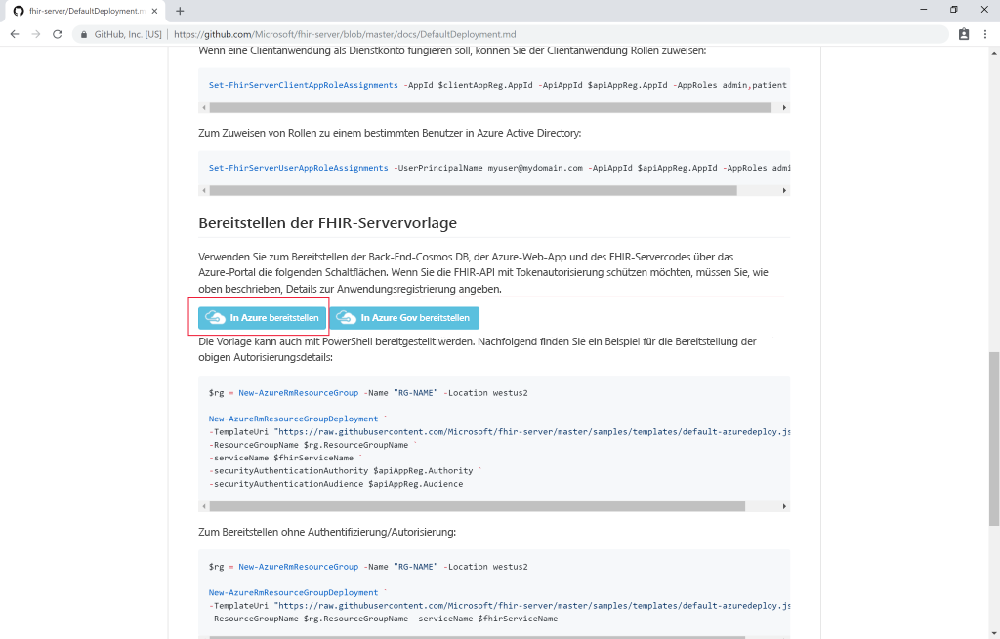

# Schnellstart: Bereitstellen des Open-Source-FHIR-Servers über das Azure-Portal

In dieser Schnellstartanleitung erfahren Sie, wie Sie einen Open-Source-FHIR-Server in Azure über das Azure-Portal bereitstellen. Hierzu werden Links für die einfache Bereitstellung im [Open-Source-Repository](https://github.com/Microsoft/fhir-server) verwendet.

Wenn Sie kein Azure-Abonnement besitzen, können Sie ein [kostenloses Konto](https://azure.microsoft.com/free/?WT.mc_id=A261C142F) erstellen, bevor Sie beginnen.

## Open-Source-Repository auf GitHub

Navigieren Sie zur [Bereitstellungsseite auf GitHub](https://github.com/Microsoft/fhir-server/blob/master/docs/DefaultDeployment.md), und suchen Sie die Schaltfläche „Bereitstellung in Azure“:

Klicken Sie auf die Schaltfläche für die Bereitstellung, und das Azure-Portal wird geöffnet.

## Ausfüllen von Bereitstellungsparametern

Wählen Sie das Erstellen eine neuen Ressourcengruppe aus, und geben Sie ihr einen Namen. Der einzige andere erforderliche Parameter ist ein Name für den Dienst.

Beachten Sie, dass bei der Bereitstellung der Quellcode direkt aus dem Open-Source-Repository auf GitHub abgerufen wird. Wenn Sie das Repository verzweigt haben, können Sie auf Ihre eigene Verzweigung und einen bestimmten Branch zeigen.

Nachdem Sie die Details ausgefüllt haben, können Sie die Bereitstellung starten.

## Überprüfen, ob der FHIR-Server ausgeführt wird

Sobald die Bereitstellung abgeschlossen ist, können Sie in Ihrem Browser zu `https://SERVICENAME.azurewebsites.net/metadata` navigieren, um eine Funktionsbestätigung abzurufen. Es dauert etwa eine Minute, bis der Server zum ersten Mal antwortet.

## Bereinigen von Ressourcen

Wenn die Ressourcengruppe und alle zugehörigen Ressourcen nicht mehr benötigt werden, können Sie sie löschen. Wählen Sie dazu die Ressourcengruppe mit den bereitgestellten Ressourcen und anschließend **Ressourcengruppe löschen** aus. Dann bestätigen Sie den Namen der zu löschenden Ressourcengruppe.

## Nächste Schritte

In diesem Tutorial haben Sie den Microsoft Open-Source-FHIR-Server für Azure in Ihrem Abonnement bereitgestellt. Informationen zum Zugriff auf die FHIR-API mit Postman finden Sie im Tutorial zu Postman.
 
>[!div class="nextstepaction"]
>[Zugriff auf die FHIR-API mit Postman](access-fhir-postman-tutorial.md)