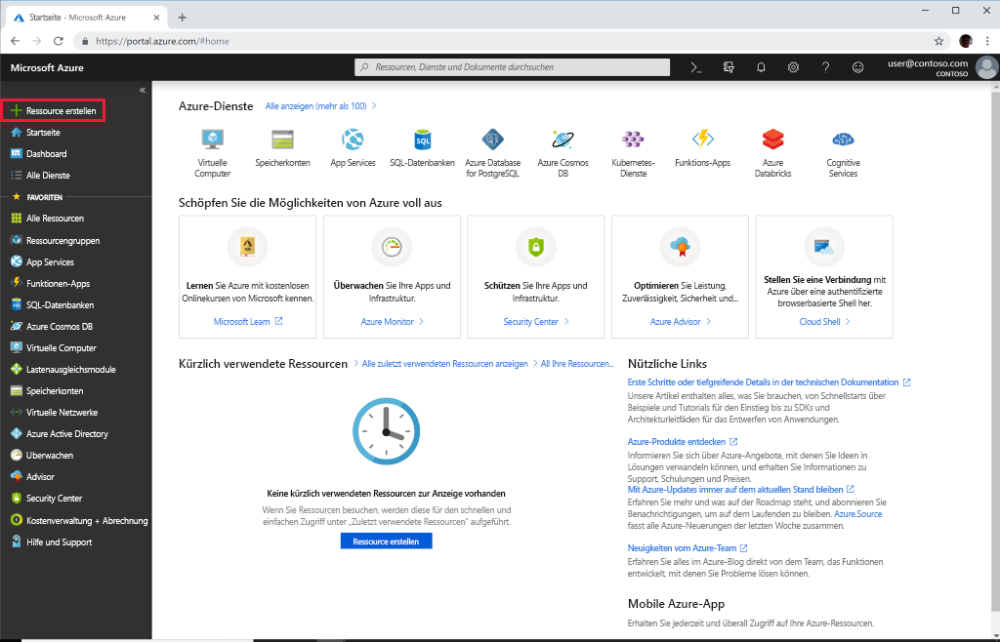
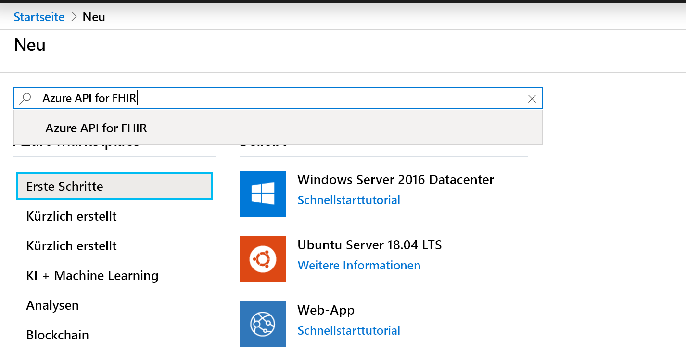
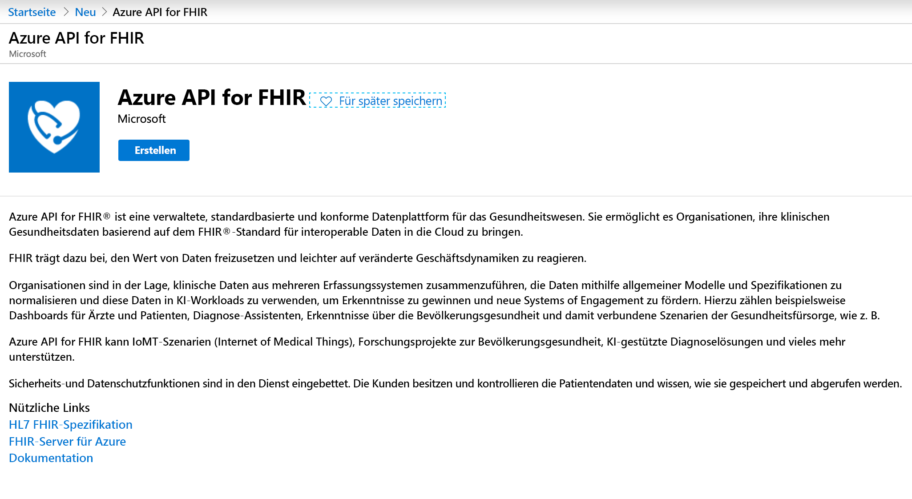
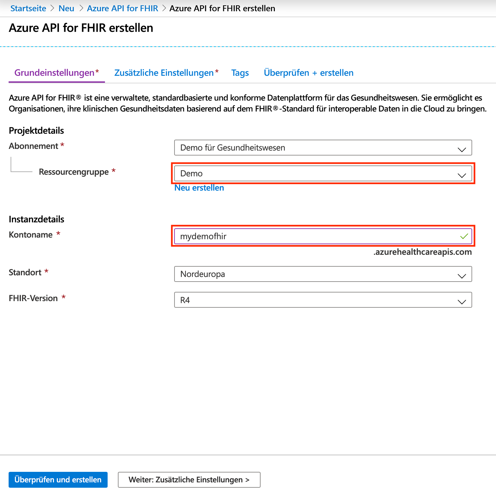

# Schnellstart: Bereitstellen von Azure API for FHIR mithilfe des Azure-Portals

In dieser Schnellstartanleitung erfahren Sie, wie Sie Azure API for FHIR mithilfe des Azure-Portals bereitstellen.

Wenn Sie kein Azure-Abonnement besitzen, können Sie ein [kostenloses Konto](https://azure.microsoft.com/free/?WT.mc_id=A261C142F) erstellen, bevor Sie beginnen.

## Neue Ressource erstellen

Öffnen Sie das [Azure-Portal](https://portal.azure.com), und klicken Sie auf **Ressource erstellen**.

## Suchen nach Azure API for FHIR

Sie können nach Azure API for FHIR suchen, indem Sie „FHIR“ ins Suchfeld eingeben:

## Erstellen eines Azure API for FHIR-Kontos

Wählen Sie **Erstellen** aus, um ein neues Azure API for FHIR-Konto zu erstellen:

## Eingeben der Kontodetails

Wählen Sie eine vorhandene Ressourcengruppe aus, oder erstellen Sie eine neue Ressourcengruppe, wählen Sie einen Namen für das Konto aus, und klicken Sie abschließend auf **Überprüfen + erstellen**:

Bestätigen Sie die Erstellung, und warten Sie auf die Bereitstellung der FHIR-API.

## Zusätzliche Einstellungen

Klicken Sie auf **Weiter: Zusätzliche Einstellungen**, um die Autorität, die Zielgruppe und die Identitätsobjekt-IDs zu konfigurieren, für die der Zugriff auf diese Azure API for FHIR-Instanz zugelassen werden soll. So können Sie bei Bedarf SMART in FHIR aktivieren und den Datenbankdurchsatz konfigurieren:

- **Autorität:** Sie können einen anderen Azure AD-Mandanten als Authentifizierungsautorität für den Dienst angeben als den, bei dem Sie angemeldet sind.
- **Audience:** Es wird empfohlen, die Zielgruppe auf die URL des FHIR-Servers festzulegen (Standardeinstellung). Sie können diese Einstellung hier ändern. Die Zielgruppe gibt den Empfänger an, für den das Token vorgesehen ist. In diesem Kontext sollte sie auf einen Wert festgelegt werden, der die FHIR-API selbst darstellt.
- **Zulässige Objekt-IDs**: Sie können Identitätsobjekt-IDs angeben, für die der Zugriff auf diese Azure API for FHIR-Instanz zugelassen werden sollte. Weitere Informationen zum Ermitteln der Objekt-ID für Benutzer und Dienstprinzipale finden Sie in der Schrittanleitung [Ermitteln von Identitätsobjekt-IDs](find-identity-object-ids.md).  
- **SMART on FHIR-Proxy**: Sie können den SMART on FHIR-Proxy aktivieren. Ausführliche Informationen zum Konfigurieren des SMART on FHIR-Proxys finden Sie unter [Tutorial: SMART on FHIR-Proxy für Azure Active Directory](https://docs.microsoft.com/azure/healthcare-apis/use-smart-on-fhir-proxy).  
- **Bereitgestellter Durchsatz (RU/s)** : Hier können Sie Durchsatzeinstellungen für die zugrunde liegende Datenbank für Ihre Azure API for FHIR-Instanz angeben. Sie können diese Einstellung später auf dem Blatt „Datenbank“ ändern. Weitere Informationen finden Sie auf der Seite [Konfigurieren der Datenbankeinstellungen](configure-database.md).

## Abrufen der FHIR-API-Funktionsbestätigung

Um zu überprüfen, ob das neue FHIR-API-Konto bereitgestellt wurde, rufen Sie eine Funktionsbestätigung ab, indem Sie in einem Browser zu `https://<ACCOUNT-NAME>.azurehealthcareapis.com/metadata` navigieren.

## Bereinigen von Ressourcen

Wenn die Ressourcengruppe, die Azure API for FHIR-Instanz und alle zugehörigen Ressourcen nicht mehr benötigt werden, können Sie sie löschen. Wählen Sie dazu die Ressourcengruppe mit dem Azure API for FHIR-Konto und anschließend **Ressourcengruppe löschen** aus. Dann bestätigen Sie den Namen der zu löschenden Ressourcengruppe.

## Nächste Schritte

In dieser Schnellstartanleitung haben Sie Azure API for FHIR in Ihrem Abonnement bereitgestellt. Wenn Sie zusätzliche Einstellungen in Azure API for FHIR festlegen möchten, fahren Sie mit der Schrittanleitung für zusätzliche Einstellungen fort.

>[!div class="nextstepaction"]
>[Zusätzliche Einstellungen in Azure API for FHIR](azure-api-for-fhir-additional-settings.md)
