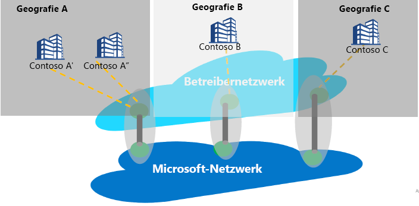

# Internetpeering und Peering Service

Internetpeering bezieht sich auf Verbindungen zwischen dem globalen Netzwerk von Microsoft (AS8075) und dem Netzwerk von Netzbetreibern oder Dienstanbietern. Ein Dienstanbieter kann zum Peeringdienstanbieter werden, indem er die weiter unten erläuterten Voraussetzungen für die Peering Service-Partnerschaft implementiert, um zuverlässige und hochleistungsfähige öffentliche Konnektivität mit optimalem Routing vom Kunden zum Microsoft-Netzwerk bereitzustellen.

## Informationen zu Peering Service
Peering Service ist ein Partnerschaftsprogramm mit wichtigen Dienstanbietern, das dazu dient, erstklassige öffentliche Internetkonnektivität für Unternehmensbenutzer bereitzustellen. Die Programmteilnehmer profitieren von direkten, hochverfügbaren, georedundanten Verbindungen mit Microsoft sowie von optimiertem Routing. Peering Service ergänzt das Konnektivitätsportfolio von Microsoft:
*   ExpressRoute für private Konnektivität mit IAAS- oder PaaS-Ressourcen (Unterstützung für privaten IP-Adressraum)
    *   Partnerbasierte Konnektivität
    *   Direkte 100G-Konnektivität mit Microsoft
*   IPsec über das Internet für VPN-Konnektivität mit der Cloud
*   SD-WAN-Konnektivität mit Azure per Virtual WAN

Das Zielsegment für Peering Service umfasst SaaS-Konnektivität, SD-WAN-Kunden, die bereit sind, einen Internetübergang an der Verzweigung zu verwenden, sowie Kunden, die über MPLS mit Doppelstrategie sowie über professionelles Internet verfügen.

Das Hauptziel der Verbindungsherstellung mit Microsoft Cloud sollte darin bestehen, die Wartezeit zu minimieren, indem die Roundtripzeit (Round-Trip Time, RTT) von einer Benutzerwebsite zum globalen Microsoft-Netzwerk verringert wird. Das globale Microsoft-Netzwerk ist der öffentliche Netzwerkbackbone von Microsoft, über den alle Rechenzentren von Microsoft sowie mehrere Einstiegspunkte für Cloudanwendungen miteinander verbunden sind. Weitere Informationen finden Sie unter [Erzielen der besten Konnektivität und Leistung in Office 365](https://techcommunity.microsoft.com/t5/Office-365-Blog/Getting-the-best-connectivity-and-performance-in-Office-365/ba-p/124694).

> [!div class="mx-imgBorder"]
> 

In der obigen Abbildung ist jede Zweigstelle eines globalen Unternehmens über das Netzwerk des Partners mit dem nächstgelegenen Microsoft-Edgestandort verbunden.

**Kundenvorteile von Peering Service:**
* Bestes öffentliches Routing über das Internet zu Microsoft Cloud Services für optimale Leistung und Zuverlässigkeit
* Möglichkeit, den bevorzugten Dienstanbieter für die Verbindung mit Microsoft Cloud auszuwählen.
* Datenverkehrsbezogene Informationen wie Wartezeitberichte und Präfixüberwachung
* Optimale Netzwerkhops (AS-Hops) von Microsoft Cloud
* Routenanalyse und -statistik: Ereignisse für BGP-Routenanomalien ([Border Gateway Protocol](https://en.wikipedia.org/wiki/Border_Gateway_Protocol)) (Leck-/Hijacking-Erkennung) und suboptimales Routing

## Voraussetzungen für die Peering Service-Partnerschaft
* Konnektivität mit Microsoft Cloud an einem Standort in Kundennähe. Ein Partnerdienstanbieter leitet Benutzerdatenverkehr an einen Microsoft-Edgestandort in der Nähe des Benutzers weiter. Analog dazu wird an den Benutzer gerichteter Datenverkehr von Microsoft unter Verwendung des BGP-Tags an den Edgestandort weitergeleitet, der dem Benutzer am nächsten ist, und der Dienstanbieter übermittelt den Datenverkehr an den Benutzer.
* Der Partner erhält Konnektivität mit dem globalen Netzwerk von Microsoft mit hoher Verfügbarkeit, hohem Durchsatz und Georedundanz.
* Der Partner kann sein bereits vorhandenes Peering zur Unterstützung von Peering Service verwenden, sofern es die Anforderung erfüllt.

## Häufig gestellte Fragen
Häufig gestellte Fragen finden Sie unter [Peering Service: Häufig gestellte Fragen](service-faqs.md).

## Nächste Schritte

* Weitere Informationen zu Kundenvorteilen mit Peering Service finden Sie [hier](https://docs.microsoft.com/azure/peering-service/).
* Informationen zum Aktivieren eines direkten Peerings für Peering Service finden Sie in der [exemplarischen Vorgehensweise für Peering Service-Partner](walkthrough-peering-service-all.md).
