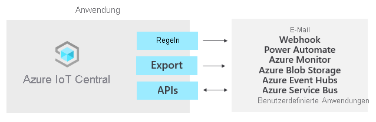

# Was ist Azure IoT Central?

IoT Central ist eine IoT-Anwendungsplattform, die Aufwand und Kosten für die Entwicklung, Verwaltung und Wartung von IoT-Lösungen auf Unternehmensniveau verringert. Die Entscheidung zur Entwicklung mit IoT Central gibt Ihnen die Möglichkeit, Zeit, Geld und Energie auf die Transformation Ihres Unternehmens mit IoT-Daten zu konzentrieren, anstatt sich lediglich mit der Wartung und Aktualisierung einer komplexen und sich ständig weiterentwickelnden IoT-Infrastruktur zu beschäftigen.

Mit der Webbenutzeroberfläche können Sie Gerätebedingungen überwachen, Regeln erstellen und Millionen von Geräten und zugehöriger Daten über ihren gesamten Lebenszyklus hinweg verwalten. Darüber hinaus können Sie auf Geräteerkenntnisse reagieren, indem Sie die IoT-Intelligenz auf Branchenanwendungen erweitern.

In diesem Artikel werden folgende Punkte für IoT Central behandelt:

- Typische Personas eines Projekts
- Erstellung einer Anwendung
- Herstellung einer Verbindung zwischen Ihren Geräten und Ihrer Anwendung
- Verwaltung Ihrer Anwendung
- Azure IoT Edge-Funktionen in IoT Central
- Vorgehensweise zum Verbinden Ihrer auf der Azure IoT Edge-Runtime basierenden Geräte mit Ihrer Anwendung

## Personas

In der Dokumentation von IoT Central werden vier Personas verwendet, die mit einer IoT Central-Anwendung interagieren:

- Ein _Lösungsentwickler_ definiert die Arten von Geräten, die eine Verbindung mit der Anwendung herstellen, und passt die Anwendung für den Bediener an.
- Ein _Bediener_ verwaltet die mit der Anwendung verbundenen Geräte.
- Ein _Administrator_ kümmert sich um administrative Aufgaben – etwa um die [Verwaltung von Benutzern und Rollen](howto-administer.md) innerhalb der Anwendung.
- Ein _Geräteentwickler_ erstellt den Code, der auf einem mit der Anwendung verbundenen Gerät oder IoT Edge-Modul ausgeführt wird.

## Erstellen der IoT Central-Anwendung

Als Lösungsentwickler verwenden Sie IoT Central, um eine benutzerdefinierte, in der Cloud gehostete IoT-Lösung für Ihre Organisation zu erstellen. Eine benutzerdefinierte IoT-Lösung umfasst in der Regel Folgendes:

- Eine cloudbasierte Anwendung, die Telemetriedaten von Ihren Geräten empfängt und die Verwaltung dieser Geräte ermöglicht
- Mehrere Geräte, auf denen benutzerdefinierter Code ausgeführt wird und die mit Ihrer cloudbasierten Anwendung verbunden sind

Sie können eine neue IoT Central-Anwendung schnell bereitstellen und anschließend in Ihrem Browser an Ihre spezifischen Anforderungen anpassen. Sie können mit einer generischen _Anwendungsvorlage_ oder mit einer der branchenspezifischen Anwendungsvorlagen für [Einzelhandel](../retail/overview-iot-central-retail.md), [Energiebranche](../energy/overview-iot-central-energy.md), [Behörden](../government/overview-iot-central-government.md) oder [Gesundheitswesen](../healthcare/overview-iot-central-healthcare.md) beginnen.

Als Lösungsentwickler können Sie mithilfe der webbasierten Tools eine _Gerätevorlage_ für die Geräte erstellen, die eine Verbindung mit Ihrer Anwendung herstellen. Eine Gerätevorlage ist die Blaupause zum Definieren der Merkmale und des Verhaltens eines Gerätetyps. Hierzu zählt beispielsweise Folgendes:

- Telemetriedaten, die das Gerät sendet
- Geschäftliche Eigenschaften, die ein Bediener ändern kann
- Geräteeigenschaften, die von einem Gerät festgelegt werden und in der Anwendung schreibgeschützt sind
- Vom Bediener festgelegte Eigenschaften, die das Verhalten des Geräts bestimmen

Diese Gerätevorlage enthält Folgendes:

- Ein _Gerätefunktionsmodell_, das die Funktionen beschreibt, die ein Gerät implementieren soll, z. B. die gesendeten Telemetriedaten und die gemeldeten Eigenschaften.
- Cloudeigenschaften, die nicht auf dem Gerät gespeichert werden
- Anpassungen, Dashboards und Formulare, die Teil der IoT Central-Anwendung sind

### Erstellen von Gerätevorlagen

[IoT Plug & Play (Vorschau)](../../iot-pnp/overview-iot-plug-and-play.md) ermöglicht IoT Central die Integration von Geräten, ohne dass Sie eingebetteten Gerätecode schreiben müssen. Das Herzstück von IoT Plug & Play (Vorschau) ist ein Gerätefunktionsmodell-Schema, das Gerätefunktionen beschreibt. In einer IoT Central-Anwendung verwenden Gerätevorlagen diese Gerätefunktionsmodelle von IoT Plug & Play (Vorschau).

Als Lösungsentwickler haben Sie mehrere Möglichkeiten zum Erstellen von Gerätevorlagen:

- Importieren Sie ein Gerätefunktionsmodell aus dem [Azure Certified for IoT-Gerätekatalog](https://aka.ms/iotdevcat), und fügen Sie dann alle Cloudeigenschaften, Anpassungen und Dashboards hinzu, die ihre IoT Central-Anwendung benötigt.
- Entwerfen Sie die Gerätevorlage in IoT Central, und implementieren Sie dann das entsprechende Gerätefunktionsmodell in Ihrem Gerätecode.
- Erstellen Sie ein Gerätefunktionsmodell mit Visual Studio-Code, und veröffentlichen Sie das Modell in einem Repository. Implementieren Sie den Gerätecode aus dem Modell, und verbinden Sie Ihr Gerät mit Ihrer IoT Central-Anwendung. IoT Central verwendet das Gerätefunktionsmodell aus dem Repository und erstellt eine einfache Gerätevorlage für Sie.
- Erstellen Sie ein Gerätefunktionsmodell mit Visual Studio Code. Implementieren Sie Ihren Gerätecode aus dem Modell. Importieren Sie das Gerätefunktionsmodell manuell in Ihre IoT Central-Anwendung, und fügen Sie dann alle Cloudeigenschaften, Anpassungen und Dashboards hinzu, die ihre IoT Central-Anwendung benötigt.

Als Lösungsentwickler können Sie mit IoT Central Code für Testgeräte generieren, um Ihre Gerätevorlagen zu überprüfen.

Wenn Sie ein Geräteentwickler sind, finden Sie unter [Übersicht über die Geräteentwicklung für IoT Central](./overview-iot-central-developer.md) eine Einführung in die Implementierung von Geräten, bei denen diese Gerätevorlagen verwendet werden.

### Anpassen der Benutzeroberfläche

Als Lösungsentwickler können Sie auch die Benutzeroberfläche der IoT Central-Anwendung für die Bediener anpassen, die die Anwendung tagtäglich verwenden. Die Anpassungsmöglichkeiten für Lösungsentwickler umfassen Folgendes:

- Definieren des Layouts von Eigenschaften und Einstellungen für eine Gerätevorlage
- Konfigurieren benutzerdefinierter Dashboards, um Bediener bei der Gewinnung von Erkenntnissen sowie bei der schnelleren Behebung von Problemen zu unterstützen
- Konfigurieren benutzerdefinierter Analysen zur Untersuchung von Zeitreihendaten Ihrer verbundenen Geräte

## Verwalten von Geräten

Als Bediener verwenden Sie die Benutzeroberfläche der IoT Central-Anwendung, um die Geräte in Ihrer IoT Central-Lösung zu verwalten. Bediener führen Aufgaben wie die folgenden aus:

- Überwachen der mit der Anwendung verbundenen Geräte
- Behandeln und Beheben von Problemen mit Geräten
- Bereitstellen neuer Geräte

Als Lösungsentwickler können Sie benutzerdefinierte Regeln und Aktionen definieren, die über Datenstreaming von verbundenen Geräten ausgeführt werden. Bediener können diese Regeln auf der Geräteebene aktivieren oder deaktivieren, um Aufgaben innerhalb der Anwendung zu steuern und zu automatisieren.

Für jede skalierbare IoT-Lösung ist eine strukturierte Geräteverwaltung unverzichtbar. Es reicht nicht aus, Ihre Geräte einfach nur mit der Cloud zu verbinden. Sie müssen auch die Konnektivität und die Integrität Ihrer Geräte gewährleisten. Operatoren stehen folgende IoT Central-Funktionen zur Verfügung, um Ihre Geräte über den gesamten Anwendungslebenszyklus hinweg zu verwalten:

### Dashboards

Integrierte [Dashboards](./howto-set-up-template.md#generate-default-views) bieten eine anpassbare Benutzeroberfläche für die Überwachung von Geräteintegrität und -telemetrie. Beginnen Sie mit einem vorgefertigten Dashboard aus einer [Anwendungsvorlage](howto-use-app-templates.md), oder erstellen Sie eigene Dashboards, die auf die Anforderungen Ihrer Operatoren zugeschnitten sind. Dashboards können für alle Benutzer in Ihrer Anwendung freigegeben oder als privat konfiguriert werden.

### Regeln und Aktionen

Erstellen Sie [benutzerdefinierte Regeln](tutorial-create-telemetry-rules.md) auf der Grundlage von Gerätestatus und -telemetrie, um schnell Geräte zu erkennen, für die Maßnahmen erforderlich sind. Konfigurieren Sie Aktionen, um die richtigen Personen zu benachrichtigen und somit sicherzustellen, dass zeitnah Korrekturmaßnahmen ergriffen werden.

### Aufträge

[Aufträge](howto-run-a-job.md) ermöglichen die Anwendung von Einzel- oder Massenupdates auf Geräte durch Festlegen von Eigenschaften oder Aufrufen von Befehlen.

## Integration in andere Dienste

Als Anwendungsplattform ermöglicht IoT Central die Transformierung Ihrer IoT-Daten in geschäftliche Erkenntnisse, die zu verwertbaren Ergebnissen führen. [Regeln](./tutorial-create-telemetry-rules.md), [Datenexport](./howto-export-data.md) und die [öffentliche REST-API](https://docs.microsoft.com/learn/modules/manage-iot-central-apps-with-rest-api/) sind Beispiele für Möglichkeiten zur Integration von IoT Central in Branchenanwendungen:

Sie können geschäftliche Erkenntnisse generieren, indem Sie beispielsweise Computereffizienztrends ermitteln oder den künftigen Energieverbrauch auf der Werksebene vorhersagen. Hierzu können Sie benutzerdefinierte Analysepipelines erstellen, um Telemetriedaten von Ihren Geräten zu verarbeiten und die Ergebnisse zu speichern. Konfigurieren Sie Datenexporte in Ihrer IoT Central-Anwendung, um Telemetriedaten sowie Änderungen an Geräteeigenschaften und -vorlagen in andere Dienste zu exportieren, wo Sie sie dann mit Ihren bevorzugten Tools analysieren, speichern und visualisieren können.

### Erstellen benutzerdefinierter IoT-Lösungen und -Integrationen in APIs

Erstellen Sie IoT-Lösungen wie etwa:

- Mobile Begleit-Apps zur Remoteeinrichtung und -steuerung von Geräten
- Benutzerdefinierte Integrationen, die es bereits vorhandenen Branchenanwendungen ermöglichen, mit Ihren IoT-Geräten und -Daten zu interagieren
- Geräteverwaltungsanwendungen für Gerätemodellierung, Onboarding, Verwaltung und Datenzugriff

## Verwalten Ihrer Anwendung

IoT Central-Anwendungen werden vollständig von Microsoft gehostet, was den Verwaltungsaufwand für Ihre Anwendungen verringert. Administratoren verwalten über [Benutzerrollen und Berechtigungen](howto-administer.md) den Zugriff auf Ihre Anwendung.

## Preise

Sie können eine IoT Central-Anwendung mit einer kostenlosen siebentägigen Testversion erstellen oder einen Standard-Tarif verwenden.

- Im Tarif *Free* erstellte Anwendungen sind sieben Tage lang kostenlos und unterstützen bis zu fünf Geräte. Sie können bis zum Ablauftermin jederzeit in Anwendungen mit Standard-Tarif konvertiert werden.
- Anwendungen, die mit dem Tarif *Standard* erstellt werden, werden pro Gerät abgerechnet. Sie können entweder den Tarif **Standard 1** oder den Tarif **Standard 2** auswählen. Die ersten zwei Geräte sind dabei kostenlos. Weitere Informationen finden Sie unter [IoT Central – Preise](https://aka.ms/iotcentral-pricing).

## Kontingente

Für jedes Azure-Abonnement gelten Standardkontingente, die den Umfang Ihrer IoT-Lösung beeinträchtigen könnten. Derzeit ist die Anzahl der Anwendungen, die Sie in einem Abonnement bereitstellen können, in IoT Central auf 10 begrenzt. Wenn Sie diesen Grenzwert erhöhen möchten, wenden Sie sich an den [Microsoft-Support](https://azure.microsoft.com/support/options/).

## Bekannte Probleme

- Der fortlaufende Datenexport unterstützt das Avro-Format nicht (Inkompatibilität).
- GeoJSON wird derzeit nicht unterstützt.
- Kartenkachel wird derzeit nicht unterstützt.
- Array-Schematypen werden nicht unterstützt.
- Nur das C-Geräte-SDK und die Node.js-Geräte-SDKs und -Dienst-SDKs werden unterstützt.
- IoT Central ist derzeit in den Regionen USA, Europa, Asien-Pazifik, Australien, Vereinigtes Königreich und Japan verfügbar.
- Sie können die Anwendungsvorlage **Benutzerdefinierte Anwendung (veraltet)** nicht in den Regionen Vereinigtes Königreich und Japan nutzen.
- Für die Gerätefunktionsmodelle müssen alle Schnittstellen inline in derselben Datei definiert werden.
- Die Unterstützung für [IoT Plug & Play](../../iot-pnp/overview-iot-plug-and-play.md) befindet sich in der Vorschauphase und ist nur in ausgewählten Regionen verfügbar.

## Nächste Schritte

Nachdem Sie sich nun einen Überblick über IoT Central verschafft haben, können Sie als Nächstes mit folgenden Schritten fortfahren:

- Lernen Sie die verfügbaren [Azure-Technologien und -Dienste für die Erstellung von IoT-Lösungen](../../iot-fundamentals/iot-services-and-technologies.md) kennen.
- Machen Sie sich mit der [Benutzeroberfläche von Azure IoT Central](overview-iot-central-tour.md) vertraut.
- [Erstellen Sie eine Azure IoT Central-Anwendung.](quick-deploy-iot-central.md)
- Informieren Sie sich ausführlicher über [IoT Plug & Play (Vorschau)](../../iot-pnp/overview-iot-plug-and-play.md).
- Erfahren Sie, wie Sie [eine Verbindung für ein Azure IoT Edge-Gerät herstellen](./tutorial-add-edge-as-leaf-device.md).
- Machen Sie sich eingehender mit [Azure IoT-Technologien und -Diensten](../../iot-fundamentals/iot-services-and-technologies.md) vertraut.

Wenn Sie Geräteentwickler sind und sich näher mit dem Code beschäftigen möchten, wird als nächster Schritt das [Erstellen und Verbinden einer Clientanwendung mit Ihrer Azure IoT Central-Anwendung](./tutorial-connect-device-nodejs.md) empfohlen.
