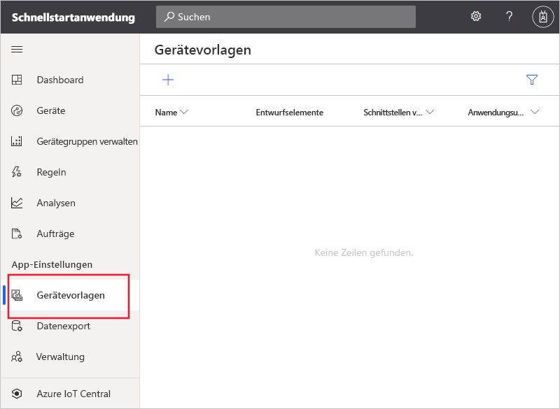
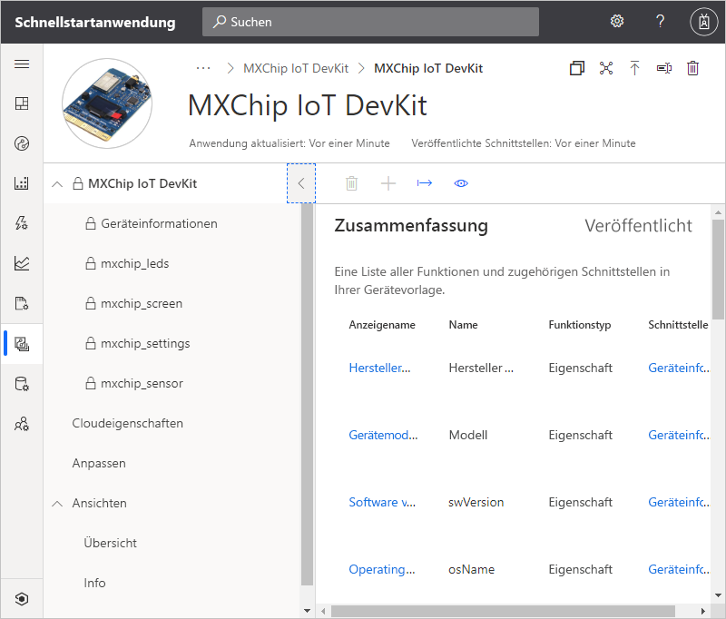
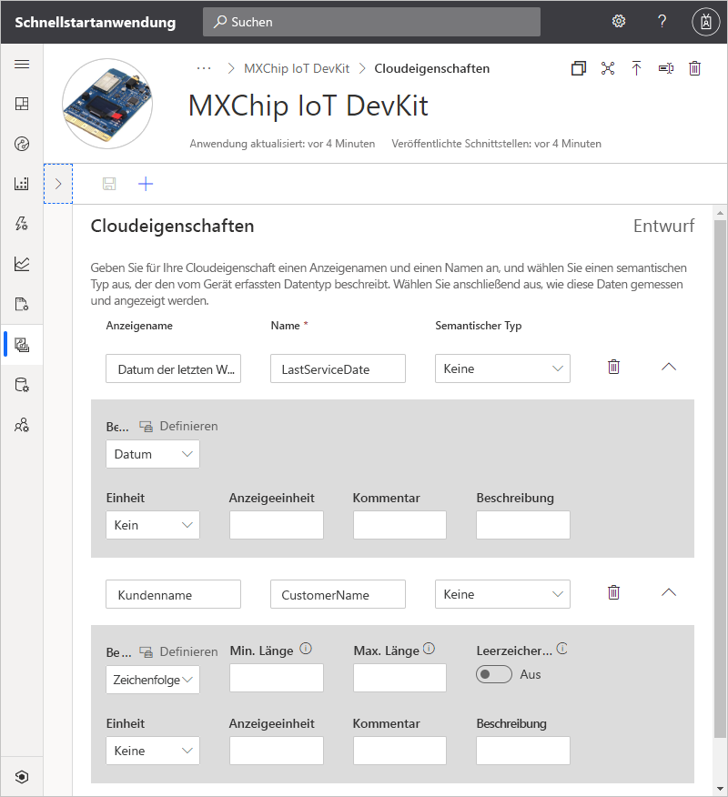
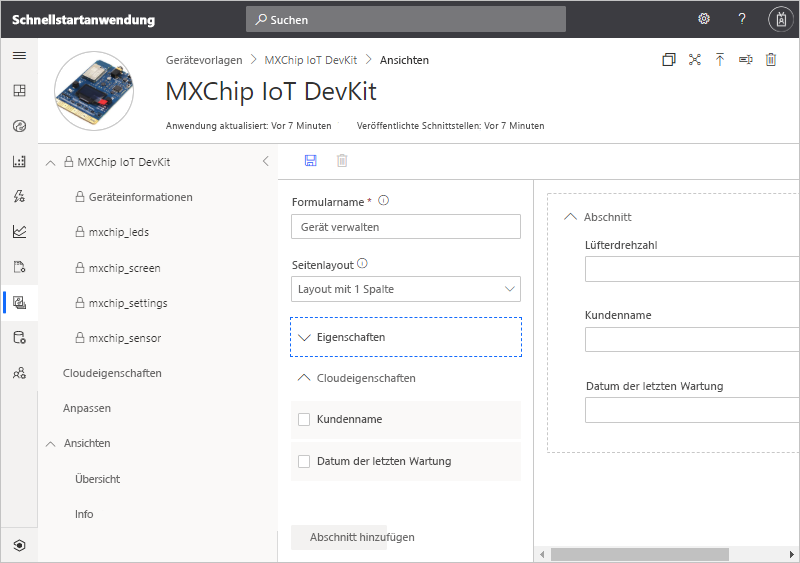
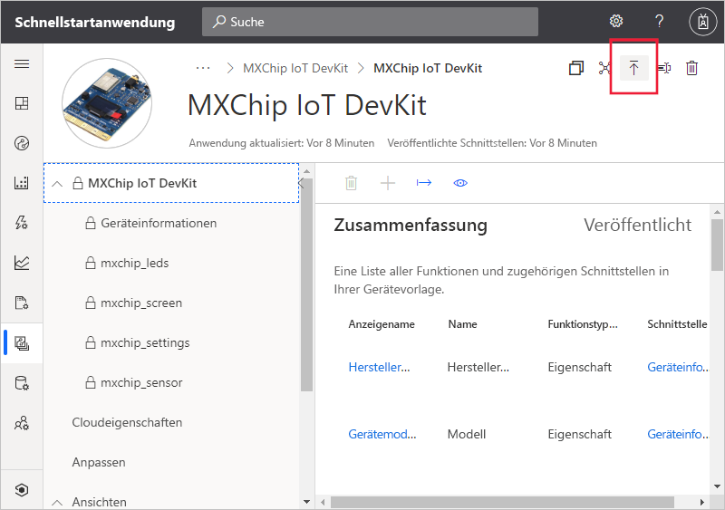
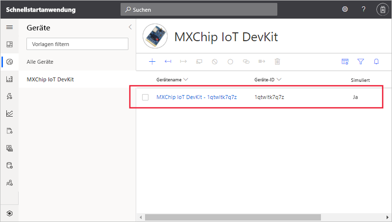
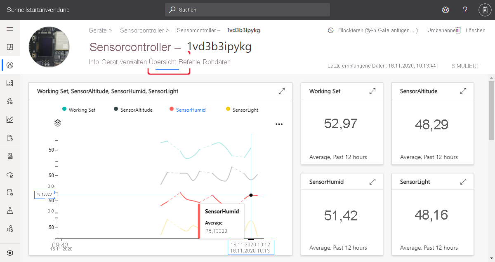
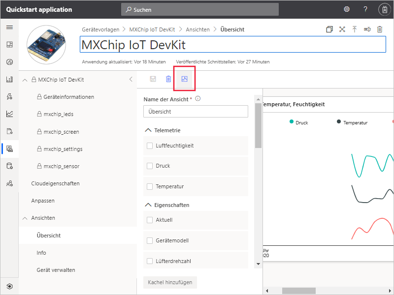

# Schnellstart: Hinzufügen eines simulierten Geräts zu Ihrer IoT Central-Anwendung

*Dieser Artikel gilt für Betreiber, Ersteller und Administratoren.*

Eine Gerätevorlage definiert die Funktionen eines Geräts, das eine Verbindung mit Ihrer IoT Central-Anwendung herstellt. Zu den Funktionen zählen die vom Gerät gesendeten Telemetriedaten, Geräteeigenschaften und die Befehle, auf die ein Gerät reagiert. Auf der Grundlage einer Gerätevorlage kann ein Ersteller oder Bediener sowohl echte als auch simulierte Geräte zu einer Anwendung hinzufügen. Mithilfe von simulierten Geräten können Sie das Verhalten Ihrer IoT Central-Anwendung testen, bevor Sie eine Verbindung mit echten Geräten herstellen.

In dieser Schnellstartanleitung wird eine Gerätevorlage für ein DevKit-Board (*MXChip IoT DevKit*) hinzugefügt und ein simuliertes Gerät erstellt. Für diese Schnellstartanleitung wird kein echtes Gerät benötigt. Stattdessen wird mit einer Simulation des Geräts gearbeitet. Von einem DevKit-Gerät werden folgende Aktionen ausgeführt:

* Senden von Telemetriedaten, z. B. Temperatur
* Melden von gerätespezifischen Eigenschaften, z. B. Helligkeitsstufe
* Reagieren auf Befehle, z. B. Aktivieren und Deaktivieren
* Melden von generischen Geräteeigenschaften, z. B. Firmwareversion und Seriennummer

## Voraussetzungen

Führen Sie die Schritte der Schnellstartanleitung [Erstellen einer Azure IoT Central-Anwendung](./quick-deploy-iot-central.md) aus, um mit der Vorlage **Benutzerdefinierte App > Benutzerdefinierte Anwendung** eine IoT Central-Anwendung zu erstellen.

## Erstellen einer Vorlage

Als Ersteller können Sie die Gerätevorlagen in Ihrer IoT Central-Anwendung erstellen und bearbeiten. Nachdem Sie eine Gerätevorlage veröffentlicht haben, können Sie simulierte Geräte generieren oder über die Gerätevorlage eine Verbindung mit echten Geräten herstellen. Mit simulierten Geräten können Sie das Verhalten Ihrer Anwendung testen, bevor Sie eine Verbindung mit einem echten Gerät herstellen.

Wählen Sie im linken Bereich die Registerkarte **Gerätevorlagen** aus, um Ihrer Anwendung eine neue Gerätevorlage hinzuzufügen.

Eine Gerätevorlage enthält ein Gerätefunktionsmodell, das die vom Gerät gesendeten Telemetriedaten und die Geräteeigenschaften sowie die Befehle definiert, auf die das Gerät reagiert.

### Hinzufügen eines Gerätefunktionsmodells

Ein Gerätefunktionsmodell kann Ihrer IoT Central-Anwendung auf unterschiedliche Weise hinzugefügt werden. Sie können ein von Grund auf neues Modell erstellen, ein Modell aus einer Datei importieren oder ein Gerät aus dem Gerätekatalog auswählen. IoT Central unterstützt auch einen Ansatz mit *Gerätepriorisierung*. Dabei wird automatisch ein Modell aus einem Repository importiert, wenn ein Gerät erstmals eine Verbindung herstellt. In dieser Schnellstartanleitung wird ein Gerät aus dem Gerätekatalog ausgewählt, um das zugehörige Gerätefunktionsmodell zu importieren.

In den folgenden Schritten wird gezeigt, wie Sie den Gerätekatalog verwenden, um das Funktionsmodell für ein Gerät vom Typ **MXChip IoT DevKit** zu importieren. Diese Geräte senden Telemetriedaten, z. B. die Temperatur, an Ihre Anwendung:

1. Wählen Sie zum Hinzufügen einer neuen Gerätevorlage auf der Seite **Gerätevorlagen** die Option **+** aus.

1. Scrollen Sie auf der Seite **Vorlagentyp auswählen** nach unten zur Kachel **MXChip IoT DevKit**.

1. Wählen Sie die Kachel **MXChip IoT DevKit** und anschließend **Weiter: Anpassen**.

1. Wählen Sie auf der Seite **Überprüfen** die Option **Erstellen** aus.

1. Nach einigen Sekunden wird Ihre neue Gerätevorlage angezeigt:

    

    Das Funktionsmodell „MXChip IoT DevKit“ enthält Schnittstellen wie **mxchip_sensor**, **mxchip_settings** und **Device Information**. Schnittstellen definieren die Funktionen eines MXChip IoT DevKit-Geräts. Zu den Funktionen gehören die von einem Gerät gesendeten Telemetriedaten, die von einem Gerät gemeldeten Eigenschaften und die Befehle, auf die ein Gerät antwortet.

### Hinzufügen von Cloudeigenschaften

Eine Gerätevorlage kann Cloudeigenschaften enthalten. Cloudeigenschaften sind nur in der IoT Central-Anwendung vorhanden und werden niemals an ein Gerät gesendet bzw. von einem Gerät empfangen. So fügen Sie eine Cloud-Eigenschaft hinzu:

1. Wählen Sie **Cloudeigenschaften** und dann **+ Cloudeigenschaft hinzufügen** aus. Verwenden Sie die Informationen in der folgenden Tabelle, um Ihrer Gerätevorlage zwei Cloudeigenschaften hinzuzufügen:

    | Anzeigename      | Semantischer Typ | Schema |
    | ----------------- | ------------- | ------ |
    | Datum der letzten Wartung | Keine          | Date   |
    | Customer Name     | Keine          | String |

1. Wählen Sie **Speichern**, um Ihre Änderungen zu speichern:

    

## Sichten

Als Ersteller können Sie die Anwendung so anpassen, dass einem Operator relevante Informationen zum Gerät angezeigt werden. Ihre Anpassungen ermöglichen dem Operator die Verwaltung der mit der Anwendung verbundenen Geräte. Sie können zwei Arten von Ansichten erstellen, die von einem Bediener zum Interagieren mit Geräten verwendet werden:

* Formulare zum Anzeigen und Bearbeiten von Geräte- und Cloudeigenschaften
* Dashboards zum Visualisieren von Geräten und der von ihnen gesendeten Telemetriedaten

### Standardansichten

Standardansichten ermöglichen einen schnellen Einstieg in die Visualisierung wichtiger Geräteinformationen. Sie können für Ihre Gerätevorlage bis zu drei Standardansichten generieren:

* Über die Ansicht **Befehle** kann der Bediener Befehle an Ihr Gerät senden.
* In der Ansicht **Übersicht** werden Diagramme und Metriken verwendet, um Gerätetelemetriedaten anzuzeigen.
* In der Ansicht **Info** werden Geräteeigenschaften angezeigt.

Wählen Sie in der Gerätevorlage den Knoten **Ansichten** aus. Wie Sie sehen, hat IoT Central beim Hinzufügen der Vorlage eine **Übersicht** und eine Ansicht vom Typ **Info** generiert.

So fügen Sie ein neues Formular namens **Manage device** hinzu, mit dessen Hilfe ein Operator das Gerät verwalten kann:

1. Wählen Sie den Knoten **Ansichten** und anschließend die Kachel **Geräte- und Clouddaten bearbeiten** aus, um eine neue Ansicht hinzuzufügen.

1. Ändern Sie den Formularnamen in **Manage device**.

1. Wählen Sie die Cloudeigenschaften **Kundenname** und **Datum der letzten Wartung** sowie die Eigenschaft **Lüftergeschwindigkeit** aus. Wählen Sie anschließend **Abschnitt hinzufügen** aus:

    

1. Wählen Sie **Speichern** aus, um Ihr neues Formular zu speichern.

## Veröffentlichen der Gerätevorlage

Um ein simuliertes Gerät erstellen oder eine Verbindung für ein echtes Gerät herstellen zu können, müssen Sie zunächst Ihre Gerätevorlage veröffentlichen. Die Vorlage wurde zwar im Zuge der ursprünglichen Erstellung bereits von IoT Central veröffentlicht, nun muss allerdings die aktualisierte Version veröffentlicht werden.

Veröffentlichen Sie wie folgt eine Gerätevorlage:

1. Navigieren Sie über die Seite **Gerätevorlagen** zu Ihrer Gerätevorlage.

1. Wählen Sie **Veröffentlichen** aus:

    

1. Wählen Sie im Dialogfeld **Diese Gerätevorlage für die Anwendung veröffentlichen** die Option **Veröffentlichen** aus. 

Veröffentlichte Gerätevorlagen werden auf der Seite **Geräte** angezeigt. In einer veröffentlichten Gerätevorlage können Sie ein Gerätefunktionsmodell nicht bearbeiten, ohne eine neue Versionsnummer zu erstellen. Sie können aber Aktualisierungen für Cloudeigenschaften, Anpassungen und Ansichten in einer veröffentlichten Gerätevorlage ohne Versionsvergabe durchführen. Wählen Sie nach dem Vornehmen von Änderungen die Option **Veröffentlichen**, um diese Änderungen für Ihren Bediener bereitzustellen.

## Hinzufügen eines simulierten Geräts

Verwenden Sie die von Ihnen erstellte Gerätevorlage **MXChip IoT DevKit**, um Ihrer Anwendung ein simuliertes Gerät hinzuzufügen.

1. Wählen Sie als Bediener im linken Bereich die Option **Geräte** aus, um ein neues Gerät hinzuzufügen. Auf der Registerkarte **Geräte** werden die Option **Alle Geräte** und die Gerätevorlage **MXChip IoT DevKit** angezeigt. Wählen Sie **MXChip IoT DevKit** aus.

1. Wählen Sie **+** aus, um ein simuliertes DevKit-Gerät hinzuzufügen. Verwenden Sie die vorgeschlagene **Geräte-ID**, oder geben Sie Ihre eigene **Geräte-ID** (in Kleinbuchstaben) ein. Sie können auch einen Namen für Ihr neues Gerät eingeben. Achten Sie darauf, dass die Umschaltfläche **Simuliert** auf **Ein** festgelegt ist, und wählen Sie anschließend **Erstellen** aus.

    

Sie können nun mit den Ansichten interagieren, die vom Ersteller für die Gerätevorlage mit simulierten Daten erstellt wurden:

1. Wählen Sie auf der Seite **Geräte** Ihr simuliertes Gerät aus.

    * Die **Übersicht** enthält einen Plot der simulierten Telemetriedaten:

        

    * Die Ansicht **Info** enthält Eigenschaftswerte (einschließlich der Cloudeigenschaften, die Sie der Ansicht hinzugefügt haben).

    * In der Ansicht **Befehle** können Sie Befehle für das Gerät ausführen (beispielsweise **blink**).

    * Bei der Ansicht **Manage device** handelt es sich um das Formular, das Sie erstellt haben, um dem Operator die Verwaltung des Geräts zu ermöglichen.

    * In der Ansicht **Rohdaten** können Sie die vom Gerät gesendeten unformatierten Telemetriedaten und Eigenschaftswerte anzeigen. Diese Ansicht ist nützlich für das Debuggen von Geräten.

## Verwenden eines simulierten Geräts zum Verbessern von Ansichten

Nach der Erstellung eines neuen simulierten Geräts kann der Ersteller dieses Gerät verwenden, um die Ansichten für die Gerätevorlage weiter zu verbessern und darauf aufzubauen.

1. Wählen Sie im linken Bereich die Option **Gerätevorlagen** und anschließend die Vorlage **MXChip IoT DevKit** aus.

1. Wählen Sie eine der Ansichten aus, die Sie bearbeiten möchten, oder erstellen Sie eine neue Ansicht. Wählen Sie **Vorschaugerät konfigurieren** und anschließend **Ausgeführtes Gerät auswählen** aus. Hier können Sie wählen, ob Sie kein Vorschaugerät, ein echtes, zu Testzwecken konfiguriertes Gerät oder ein bereits vorhandenes Gerät verwenden möchten, das Sie in IoT Central hinzugefügt haben.

1. Wählen Sie in der Liste Ihr simuliertes Gerät aus. Wählen Sie anschließend **Anwenden** aus. Nun sehen Sie das gleiche simulierte Gerät auf der Erstellungsoberfläche für Gerätevorlagenansichten. Diese Ansicht ist nützlich für Diagramme und andere Visualisierungen.

    

## Nächste Schritte

In dieser Schnellstartanleitung haben Sie gelernt, wie Sie eine Gerätevorlage vom Typ **MXChip IoT DevKit** erstellen und Ihrer Anwendung ein simuliertes Gerät hinzufügen.

Weitere Informationen zur Überwachung von Geräten, die mit Ihrer Anwendung verbunden sind, finden Sie in der folgenden Schnellstartanleitung:

> [!div class="nextstepaction"]
> [Konfigurieren von Regeln und Aktionen für Ihr Gerät in Azure IoT Central (Previewfunktionen)](./quick-configure-rules.md)
