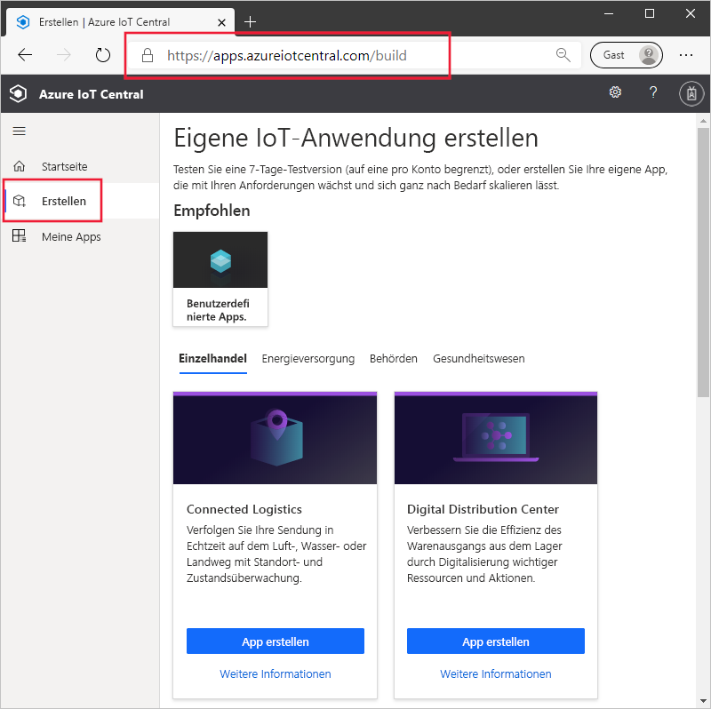
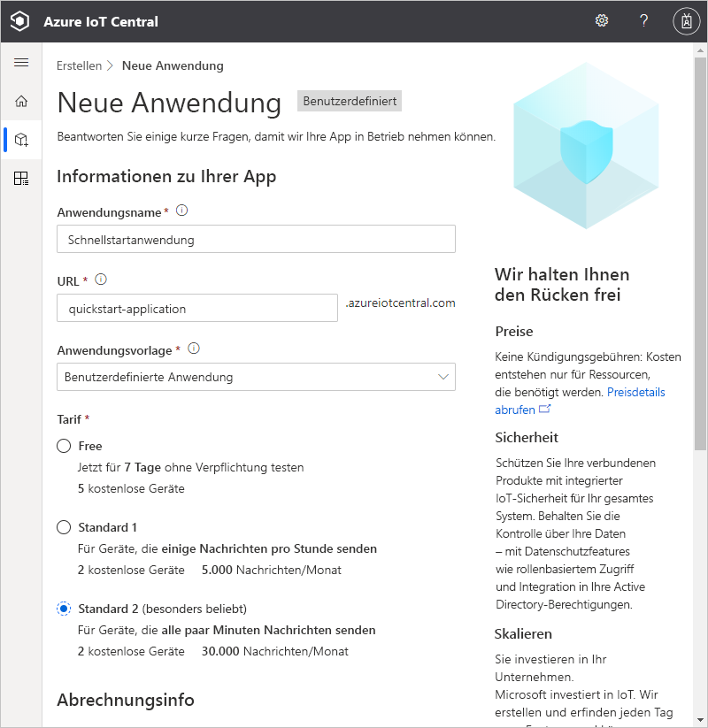
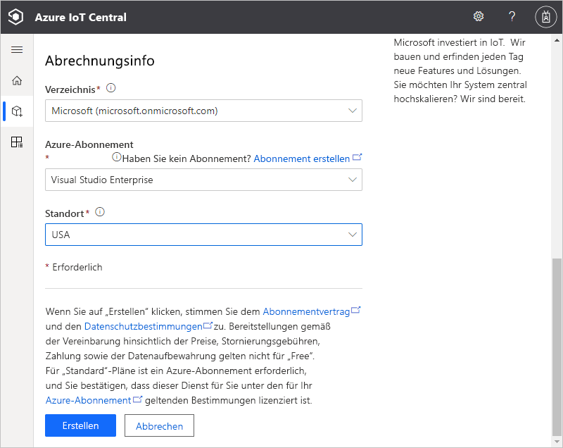
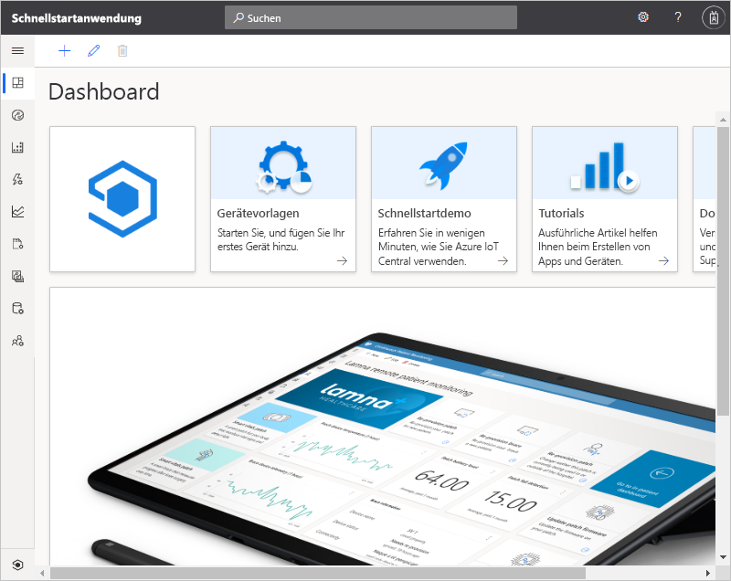

# Erstellen einer Azure IoT Central-Anwendung

In dieser Schnellstartanleitung wird gezeigt, wie Sie eine Azure IoT Central-Anwendung erstellen.

## Erstellen einer Anwendung

Navigieren Sie zur Buildwebsite für [Azure IoT Central](https://aka.ms/iotcentral). Melden Sie sich dann mit einem persönlichen Microsoft-Konto oder mit einem Geschäfts-, Schul- oder Unikonto an.

Sie erstellen eine neue Anwendung entweder anhand der Liste mit den branchenrelevanten IoT Central-Vorlagen, um schnell einzusteigen, oder Sie starten von Grund auf neu, indem Sie eine Vorlage für **benutzerdefinierte Apps** verwenden. In dieser Schnellstartanleitung verwenden Sie die Vorlage **Benutzerdefinierte Anwendung**.

So erstellen Sie eine neue Azure IoT Central-Anwendung über die Vorlage **Benutzerdefinierte Anwendung**:

1. Navigieren Sie zur Seite **Erstellen**:

    

1. Wählen Sie **Benutzerdefinierte Apps** aus, und vergewissern Sie sich, dass die Vorlage **Benutzerdefinierte Anwendung** ausgewählt ist.

1. Azure IoT Central schlägt automatisch einen **Anwendungsnamen** entsprechend der von Ihnen ausgewählten Anwendungsvorlage vor. Sie können diesen Namen übernehmen oder einen eigenen aussagekräftigen Namen eingeben.

1. Azure IoT Central generiert außerdem für Sie entsprechend dem Anwendungsnamen ein Präfix mit einer eindeutigen **Anwendungs-URL**. Über diese URL können Sie auf Ihre Anwendung zugreifen. Sie können dieses URL-Präfix in einen einprägsameren Wert ändern.

    

    

    > [!NOTE]
    > Wenn Sie auf der vorherigen Seite **Benutzerdefinierte App** ausgewählt haben, wird das Dropdownmenü **Anwendungsvorlage** angezeigt. Im Dropdownmenü werden unter Umständen andere Vorlagen angezeigt, die von Ihrer Organisation für Sie zur Verfügung gestellt wurden. 

    >[!IMPORTANT]
    >Die Vorlage **Benutzerdefinierte Anwendung (veraltet)** (V2) wurde eingestellt, da alle Funktionen, die zuvor in der Legacyanwendungsvorlage verfügbar waren, nun in der aktuellen Vorlage **Benutzerdefinierte Anwendung** (V3) zur Verfügung stehen. 
    
1. Erstellen Sie die Anwendung entweder im Tarif für die kostenlose 7-Tage-Testversion oder in einem der Standard-Tarife.

    - Im Tarif *Free* erstellte Anwendungen sind sieben Tage lang kostenlos und unterstützen bis zu fünf Geräte. Sie können bis zum Ablauftermin jederzeit in Anwendungen mit Standard-Tarif konvertiert werden.
    - Anwendungen, die mit einem *Standard*-Tarif erstellt werden, werden pro Gerät abgerechnet. Sie können entweder den Tarif **Standard 1** oder den Tarif **Standard 2** auswählen. Die ersten zwei Geräte sind dabei kostenlos. Weitere Informationen zu den Tarifen „Free“ und „Standard“ finden Sie auf der Seite [Azure IoT Central – Preise](https://azure.microsoft.com/pricing/details/iot-central/). Wenn Sie eine Anwendung im Standard-Tarif erstellen, müssen Sie Ihr *Verzeichnis*, Ihr *Azure-Abonnement* und Ihren *Standort* auswählen:
        - Bei *Verzeichnis* handelt es sich um die Azure Active Directory-Instanz, in der Sie Ihre Anwendung erstellen. Eine Azure Active Directory-Instanz enthält Benutzeridentitäten, Anmeldeinformationen und andere organisatorische Informationen. Wenn Sie keine Azure Active Directory-Instanz besitzen, wird beim Erstellen eines Azure-Abonnements eine für Sie angelegt.
        - Mit einem *Azure-Abonnement* können Sie Instanzen von Azure-Diensten erstellen. IoT Central stellt Ressourcen in Ihrem Abonnement bereit. Wenn Sie kein Azure-Abonnement besitzen, können Sie auf der [Azure-Anmeldeseite](https://aka.ms/createazuresubscription) kostenlos eines erstellen. Nachdem Sie das Azure-Abonnement erstellt haben, navigieren Sie zurück zur Seite **Neue Anwendung**. Ihr neues Abonnement wird nun in der Dropdownliste **Azure-Abonnement** angezeigt.
        - Der *Standort* beschreibt die [geografische Region](https://azure.microsoft.com/global-infrastructure/geographies/), in der Sie Ihre Anwendung erstellen möchten. Normalerweise wählen Sie den Standort aus, der Ihren Geräten physisch am nächsten liegt, um eine optimale Leistung zu erzielen. Nachdem Sie einen Standort ausgewählt haben, können Sie Ihre Anwendung nicht zu einem späteren Zeitpunkt an einen anderen Standort verschieben.

1. Lesen Sie die Geschäftsbedingungen, und wählen Sie **Erstellen** im unteren Bereich der Seite aus. Die IoT Central-Anwendung kann nach einigen Minuten verwendet werden.

    

## Nächste Schritte

In dieser Schnellstartanleitung haben Sie eine IoT Central-Anwendung erstellt. Wenn Sie sich weiter über IoT Central informieren möchten, sehen Sie sich die folgende Schnellstartanleitung an:

> [!div class="nextstepaction"]
> [Hinzufügen eines simulierten Geräts zu Ihrer IoT Central-Anwendung](./quick-create-simulated-device.md)

Wenn Sie Geräteentwickler sind und sich ausführlicher mit dem Code beschäftigen möchten, sehen Sie sich das folgende Tutorial an:
> [!div class="nextstepaction"]
> [Tutorial: Erstellen einer Node.js-Clientanwendung und Verbinden der Anwendung mit Ihrer Azure IoT Central-Anwendung (Node.js)](./tutorial-connect-device-nodejs.md)
