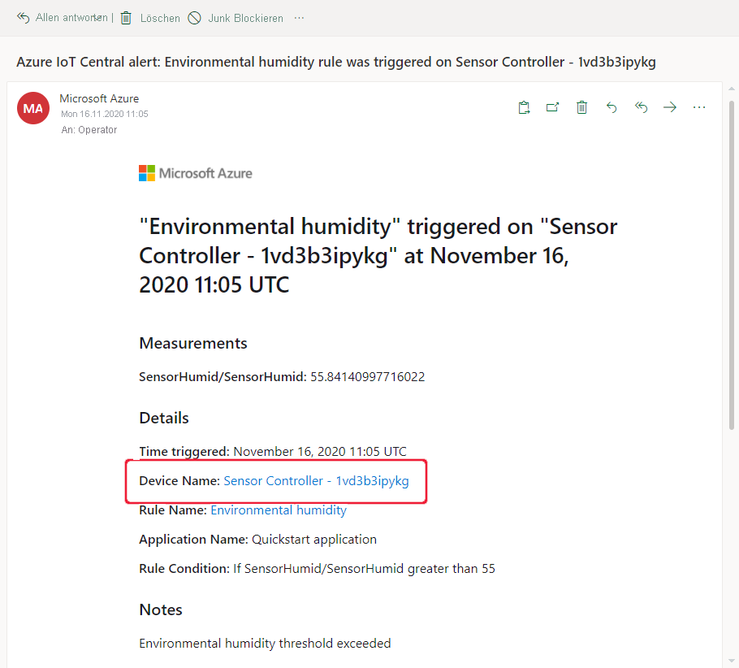
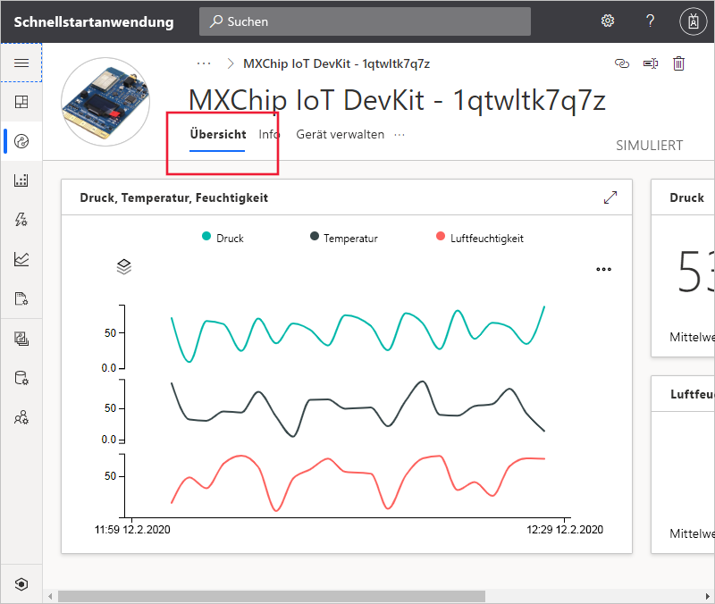
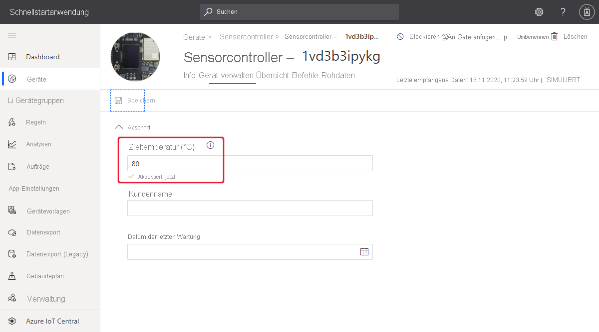

# Schnellstart: Überwachen Ihrer Geräte mithilfe von Azure IoT Central

*Dieser Artikel gilt für Betreiber, Ersteller und Administratoren.*

Diese Schnellstartanleitung richtet sich an Bediener und erläutert, wie Sie mithilfe Ihrer Microsoft Azure IoT Central-Anwendung Ihre Geräte überwachen und Einstellungen ändern.

## Voraussetzungen

Bevor Sie beginnen, sollten Sie die drei vorherigen Schnellstartanleitungen durcharbeiten: [Erstellen einer Azure IoT Central-Anwendung (Previewfunktionen)](./quick-deploy-iot-central.md), [Schnellstart: Hinzufügen eines simulierten Geräts zu Ihrer IoT Central-Anwendung (Previewfunktionen)](./quick-create-pnp-device.md) und [Schnellstart: Konfigurieren von Regeln und Aktionen für Ihr Gerät in Azure IoT Central (Previewfunktionen)](quick-configure-rules.md).

## Empfangen einer Benachrichtigung

Azure IoT Central sendet Benachrichtigungen für Geräte in Form von E-Mails. Der Ersteller hat eine Regel hinzugefügt, die dafür sorgt, dass eine Benachrichtigung gesendet wird, wenn die Temperatur in einem verbundenen Gerätesensor einen Schwellenwert übersteigt. Überprüfen Sie die E-Mails, die an das Konto gesendet wurden, das der Ersteller für den Empfang von Benachrichtigungen ausgewählt hat.

Öffnen Sie die E-Mail, die Sie am Ende der Schnellstartanleitung [Konfigurieren von Regeln und Aktionen für Ihr Gerät in Azure IoT Central](quick-configure-rules.md) erhalten haben. Wählen Sie in der E-Mail den Link zum Gerät aus:

Die Ansicht **Übersicht** für das simulierte Gerät, das Sie in den vorherigen Schnellstartanleitungen erstellt haben, wird in Ihrem Browser geöffnet:

## Untersuchen eines Problems

Als Bediener können Sie in den Ansichten **Übersicht**, **Info** und **Befehle** Informationen zum Gerät anzeigen. Der Ersteller hat die Ansicht **Gerät verwalten** erstellt, damit Sie Geräteinformationen bearbeiten und Geräteeigenschaften festlegen können.

Wählen Sie die Ansicht **Übersicht** aus, um Informationen zum Gerät anzuzeigen.

Das Diagramm auf dem Dashboard zeigt einen Plot der Gerätetemperatur. Sie entscheiden, dass die Gerätetemperatur zu hoch ist.

## Beheben eines Problems

Eine Änderung am Gerät können Sie über die Seite **Gerät verwalten** vornehmen.

Ändern Sie die Angabe für **Lüfterdrehzahl** in „500“, um das Gerät zu kühlen. Wählen Sie **Speichern** aus, um das Gerät zu aktualisieren. Wenn das Gerät die Einstellungsänderung bestätigt, ändert sich der Status der Eigenschaft in **Synchronisiert**:

## Nächste Schritte

In diesem Schnellstart haben Sie Folgendes gelernt:

* Empfangen einer Benachrichtigung
* Untersuchen eines Problems
* Beheben eines Problems

Nachdem Sie nun wissen, wie Sie Ihr Gerät überwachen, wird als Nächstes der folgende Schritt empfohlen:

> [!div class="nextstepaction"]
> [Einrichten und Verwalten einer Gerätevorlage (Previewfunktionen)](howto-set-up-template.md)
