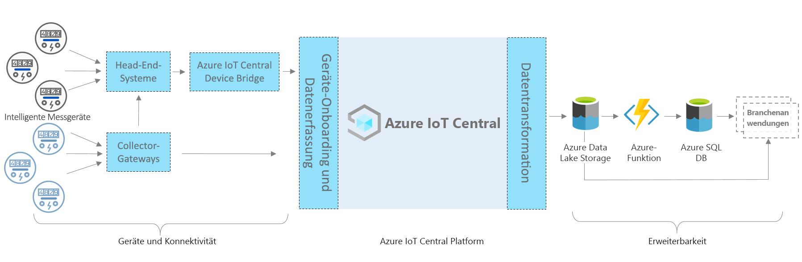

# Azure IoT Central – Architektur der Intelligenter Stromzähler-Anwendung

Dieser Artikel bietet eine Übersicht der Architektur der Vorlage der Überwachungs-App für intelligente Stromzähler. Das nachstehende Diagramm zeigt eine häufig verwendete Architektur für die Intelligenter Stromzähler-App in Azure unter Verwendung der IoT Central-Plattform.

> [!div class="mx-imgBorder"]
> 

Diese Architektur umfasst die folgenden Komponenten. Für einige Lösungen sind möglicherweise nicht alle der hier aufgeführten Komponenten erforderlich.

## Intelligente Stromzähler und Konnektivität 

Ein intelligenter Stromzähler zählt unter den Energieressourcen zu den wichtigsten Geräten. Er zeichnet Daten zum Energieverbrauch auf und kommuniziert sie an Hilfsprogramme zur Überwachung und für andere Anwendungen, wie etwa Abrechnung und Reaktion auf die Nachfrage. Der Stromzähler kann je nach Typ entweder über Gateways oder über andere zwischengeschaltete Geräte oder Systeme (z. B. Edgegeräte und Head-End-Systeme) eine Verbindung mit IoT Central herstellen. Erstellen Sie eine IoT Central-Geräte-Bridge, um Geräte zu verbinden, die nicht direkt verbunden werden können. Bei der IoT Central-Gerätebridge handelt es sich um eine Open-Source-Lösung. Die Details finden Sie [hier](https://docs.microsoft.com/azure/iot-central/core/howto-build-iotc-device-bridge). 

## IoT Central-Plattform

Azure IoT Central ist eine Plattform, die das Erstellen Ihrer IoT-Lösungen vereinfacht und den Aufwand und die Kosten für die Verwaltung, den Betrieb und die Entwicklung von IoT-Lösungen senkt. Mit IoT Central können Sie Ihre IoT-Ressourcen (Internet of Things) einfach und in jeder Größenordnung verbinden, überwachen und verwalten. Nachdem Sie Ihre intelligenten Stromzähler mit IoT Central verbunden haben, verwendet die App-Vorlage integrierte Features wie Gerätemodelle, Befehle und Dashboards. Die App-Vorlage verwendet außerdem den IoT Central-Speicher für Szenarien mit warmen Pfaden, z. B. Datenüberwachung nahezu in Echtzeit, Analysen, Regeln und Visualisierung. 

## Erweiterbarkeitsoptionen für die Erstellung mit IoT Central
Die IoT Central-Plattform bietet zwei Erweiterbarkeitsoptionen: Kontinuierlichen Datenexport (Continuous Data Export, CDE) und APIs. Die Kunden und Partner können zwischen diesen Optionen auswählen, um ihre Lösungen an bestimmte Anforderungen anzupassen. Beispielsweise konfigurierte einer unserer Partner CDE mit Azure Data Lake Storage (ADLS). Er verwendet ADLS für die langfristige Datenaufbewahrung und andere Speicherszenarien mit kalten Pfaden, z.B. Batchverarbeitung, Überwachung und Berichterstellung. 

## Nächste Schritte

* Nachdem Sie sich nun mit der Architektur vertraut gemacht haben, [erstellen Sie die Intelligenter Stromzähler-App kostenlos](https://apps.azureiotcentral.com/build/new/smart-meter-monitoring).
* Weitere Informationen zu IoT Central finden Sie in der [Übersicht über IoT Central](https://docs.microsoft.com/azure/iot-central/).
