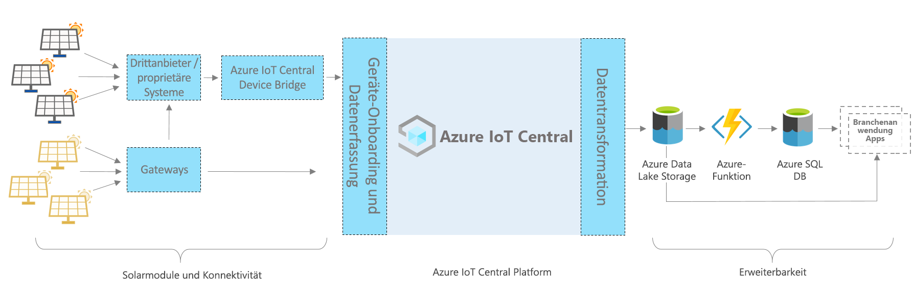

# Azure IoT Central – App-Architektur für Solarpanel

Dieser Artikel bietet eine Übersicht über die Vorlagenarchitektur der Überwachungs-App für Solarpanel. Das nachstehende Diagramm zeigt eine häufig verwendete Architektur für die Solarpanel-App in Azure mithilfe der IoT Central-Plattform.

> [!div class="mx-imgBorder"]
> 

Diese Architektur umfasst die folgenden Komponenten. Einige Anwendungen erfordern möglicherweise nicht alle der hier aufgeführten Komponenten.

## Solarpanels und Konnektivität

Solarpanels sind eine wichtige Quelle für erneuerbare Energien. Je nach Art und Aufbau der Solarpanels können Sie eine Verbindung entweder über Gateways oder über andere zwischengeschaltete Geräte und proprietäre Systeme herstellen. Unter Umständen wird eine IoT Central-Geräte-Bridge benötigt, um Geräte zu verbinden, die nicht direkt verbunden werden können. Bei der IoT Central-Gerätebridge handelt es sich um eine Open-Source-Lösung. Die Details finden Sie [hier](../core/howto-build-iotc-device-bridge.md). 

## IoT Central-Plattform
Azure IoT Central ist eine Plattform, die das Erstellen Ihrer IoT-Lösungen vereinfacht und den Aufwand und die Kosten für die Verwaltung, den Betrieb und die Entwicklung von IoT-Lösungen senkt. Mit IoT Central können Sie Ihre IoT-Ressourcen (Internet of Things) einfach und in jeder Größenordnung verbinden, überwachen und verwalten. Nachdem Sie Ihre Solarpanels mit IoT Central verbunden haben, verwendet die App-Vorlage integrierte Features wie Gerätemodelle, Befehle und Dashboards. Die App-Vorlage verwendet außerdem den IoT Central-Speicher für Szenarien mit warmen Pfaden, z. B. Datenüberwachung nahezu in Echtzeit, Analysen, Regeln und Visualisierung.

## Erweiterbarkeitsoptionen für die Erstellung mit IoT Central
Die IoT Central-Plattform bietet zwei Erweiterbarkeitsoptionen: Kontinuierlichen Datenexport (Continuous Data Export, CDE) und APIs. Die Kunden und Partner können zwischen diesen Optionen auswählen, um ihre Lösungen an bestimmte Anforderungen anzupassen. Beispielsweise konfigurierte einer unserer Partner CDE mit Azure Data Lake Storage (ADLS). Er verwendet ADLS für die langfristige Datenaufbewahrung und andere Speicherszenarien mit kalten Pfaden, z. B. Batchverarbeitung, Überwachung und Berichterstellung. 

## Nächste Schritte

* Nachdem Sie sich nun mit der Architektur vertraut gemacht haben, [erstellen Sie kostenlos eine Solarpanel-App](https://apps.azureiotcentral.com/build/new/solar-panel-monitoring).
* Weitere Informationen zu IoT Central finden Sie in der [Übersicht über IoT Central](../index.yml).
