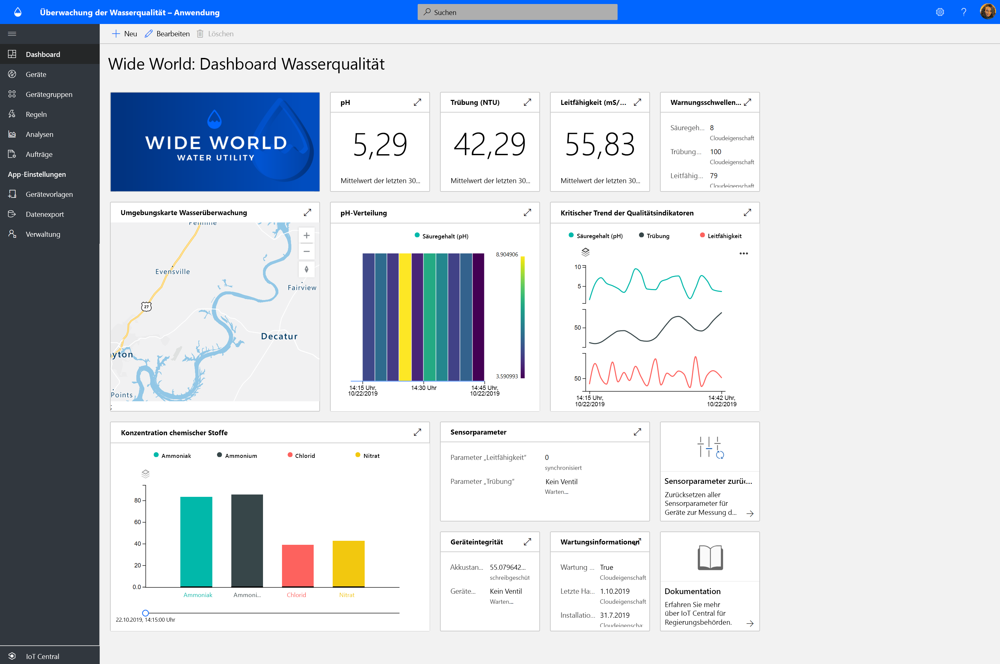
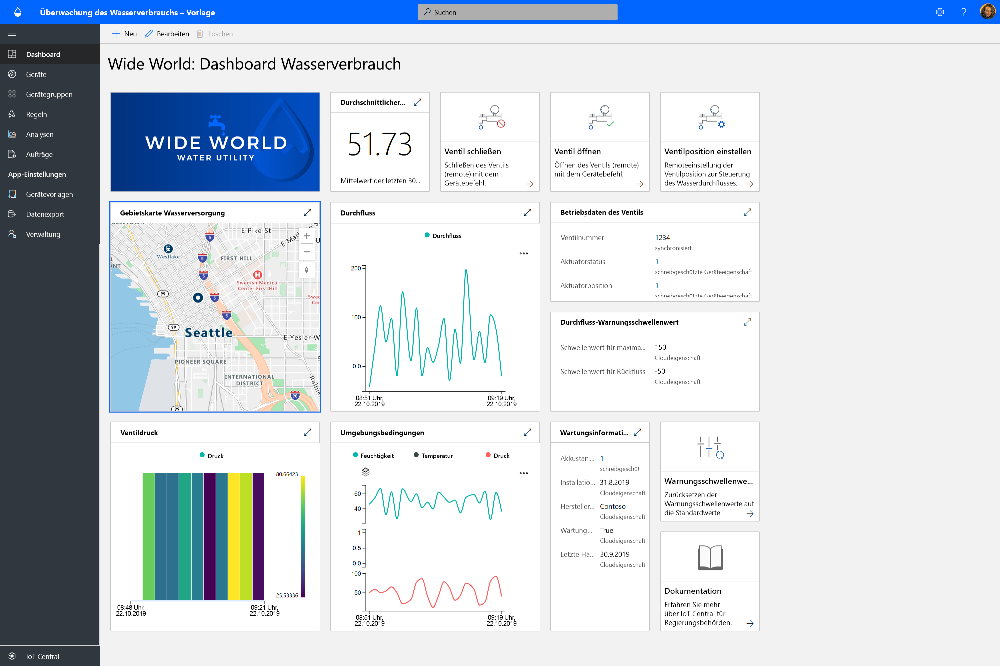
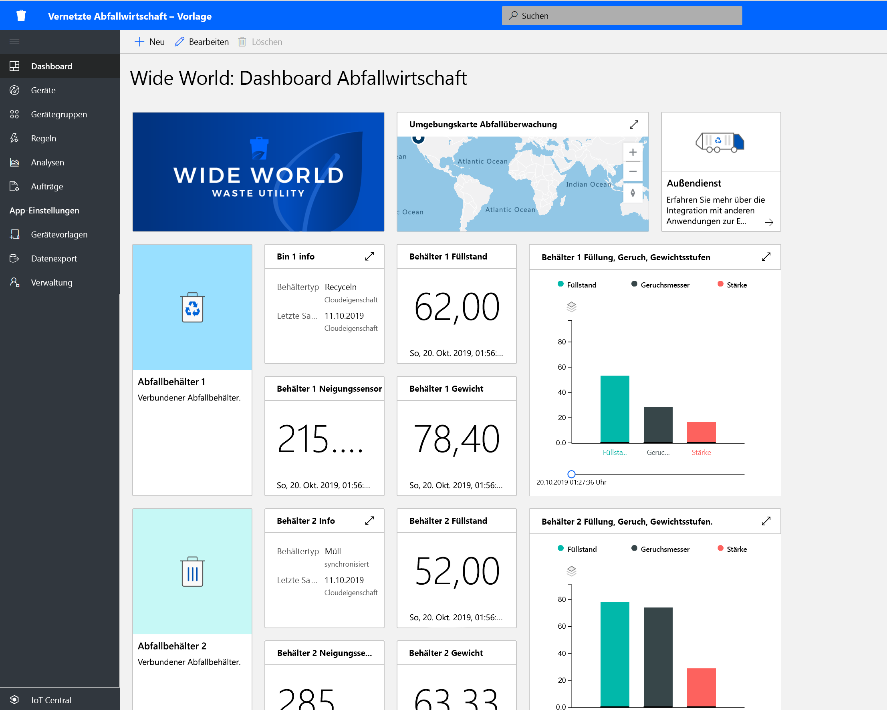

# Welche IoT Central-Lösungen für Behörden gibt es?

Nutzen Sie Azure IoT Central-Anwendungsvorlagen zur Erstellung von Smart-City-Lösungen. Starten Sie mit **water quality monitoring** (Überwachung der Wasserqualität), **water consumption monitoring** (Überwachung des Wasserverbrauchs) und **connected waste management** (Vernetzte Abfallwirtschaft).

## Was ist die Anwendungsvorlage „Water Quality Monitoring“ (Überwachung der Wasserqualität)?   

Die herkömmliche Überwachung der Wasserqualität basiert auf manuellen Stichproben und Laboranalysen vor Ort, was zeitaufwendig und teuer ist. Durch eine Remoteüberwachung der Wasserqualität in Echtzeit können Probleme behandelt werden, bevor sich diese auf die Bürger auswirken. Darüber hinaus können Wasserversorger und Umweltbehörden dank fortschrittlicher Analysen und Vorwarnungen frühzeitig auf potenzielle Probleme mit der Wasserqualität reagieren und Wasserreinigungen im Voraus planen.  

Die App zur Überwachung der Wasserqualität ist eine IoT Central-App-Vorlage, die Ihnen den Einstieg in die Entwicklung Ihrer IoT-Lösung erleichtert und Wasserversorgern die digitale Überwachung der Wasserqualität in Smart Citys ermöglicht. 

Die App-Vorlage umfasst Folgendes:
* Beispieldashboards für Bediener
* Beispielvorlagen für Geräte zur Überwachung der Wasserqualität
* Simulierte Geräte zur Überwachung der Wasserqualität
* Vorkonfigurierten Regeln und Aufträgen
* White Label-Branding 

Das Tutorial für die Anwendung zur Überwachung der Wasserqualität finden Sie [hier](./tutorial-water-quality-monitoring.md).

## Was ist die Anwendungsvorlage „Water Consumption Monitoring“ (Überwachung des Wasserverbrauchs)? 

Bei der herkömmlichen Überwachung des Wasserverbrauchs müssen Wasserzähler vor Ort abgelesen werden. Immer mehr Städte ersetzen herkömmliche Zähler durch fortschrittliche intelligente Zähler, um die Remoteüberwachung des Verbrauchs sowie die Remotesteuerung von Ventilen und somit die Steuerung des Wasserflusses zu ermöglichen. Die Überwachung des Wasserverbrauchs kann in Verbindung mit digitalem Feedback für Bürger das Bewusstsein stärken und zur Senkung des Wasserverbrauchs beitragen. 

Die App zur Überwachung des Wasserverbrauchs ist eine IoT Central-App-Vorlage, die Ihnen den Einstieg in die Entwicklung Ihrer IoT-Lösung erleichtert und Wasserversorgern und Städten die Remoteüberwachung und -steuerung des Wasserflusses und somit die Senkung des Wasserverbrauchs ermöglicht. 

  

Die App-Vorlage zur Überwachung des Wasserverbrauchs umfasst folgende vorkonfigurierte Komponenten:
* Beispieldashboards für Bediener
* Beispielvorlagen für Geräte zur Überwachung der Wasserqualität
* Simulierte Geräte zur Überwachung der Wasserqualität
* Vorkonfigurierten Regeln und Aufträgen
* White Label-Branding 

 Das Tutorial für die Anwendung zur Überwachung des Wasserverbrauchs finden Sie [hier](./tutorial-water-consumption-monitoring.md).

## Was ist die Anwendungsvorlage „Connected Waste Management“ (Vernetzte Abfallwirtschaft)? 

Die App für die vernetzte Abfallwirtschaft ist eine IoT Central-App-Vorlage, die Ihnen den Einstieg in die Entwicklung Ihrer IoT-Lösung erleichtert und Smart Citys die Remoteüberwachung der Müllabfuhr ermöglicht, um sie effizienter zu machen. 

 

Die App-Vorlage für eine vernetzte Abfallwirtschaft umfasst folgende vorkonfigurierte Komponenten:
* Beispieldashboards für Bediener
* Beispielvorlagen für Geräte für vernetzte Abfallbehälter
* Simulierte Geräte für vernetzte Abfallbehälter
* Vorkonfigurierten Regeln und Aufträgen
* White Label-Branding 

Das Tutorial für die Anwendung für eine vernetzte Abfallwirtschaft finden Sie [hier](./tutorial-connected-waste-management.md).

## Nächste Schritte

* Machen Sie sich mit [Konzepten im Zusammenhang mit der Überwachung der Wasserqualität](./concepts-waterqualitymonitoring-architecture.md) vertraut.
* Machen Sie sich mit [Konzepten im Zusammenhang mit der Überwachung des Wasserverbrauchs](./concepts-waterconsumptionmonitoring-architecture.md) vertraut.
* Machen Sie sich mit [Konzepten im Zusammenhang mit der vernetzten Abfallwirtschaft](./concepts-connectedwastemanagement-architecture.md) vertraut.  
