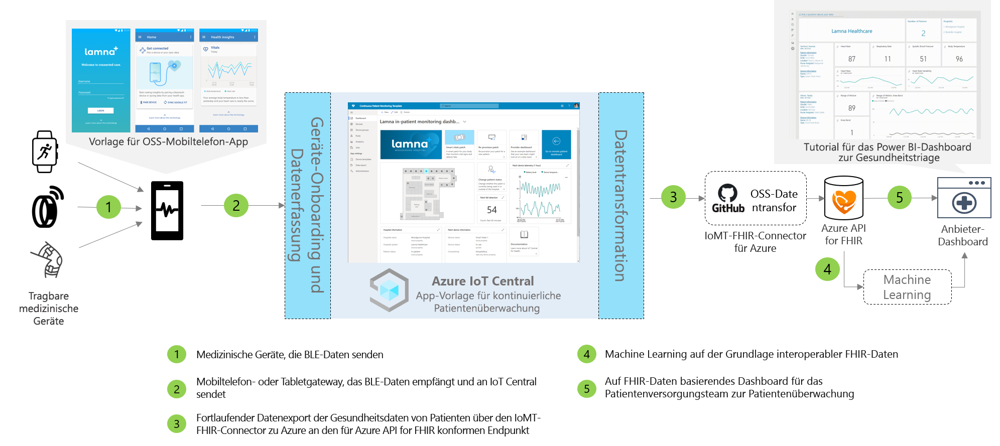

# Architektur für die ständige Überwachung von Patienten

Lösungen für die kontinuierliche Patientenüberwachung können mithilfe der bereitgestellten App-Vorlage sowie anhand der weiter unten skizzierten Architektur erstellt werden.

>[!div class="mx-imgBorder"] 
>

1. Medizinische Geräte, die über BLE (Bluetooth Low Energy) kommunizieren
1. Mobiltelefongateway, das BLE-Daten empfängt und an IoT Central sendet
1. Kontinuierlicher Datenexport von Patientengesundheitsdaten nach Azure API for FHIR&reg;
1. Machine Learning auf der Grundlage interoperabler Daten
1. Auf FHIR-Daten basierendes Dashboard für das Patientenversorgungsteam

## Details
In diesem Abschnitt werden die einzelnen Teile des Architekturdiagramms ausführlicher erläutert.

### Medizinische BLE-Geräte
Viele medizinische Wearables im IoT-Gesundheitsbereich sind BLE-Geräte (Bluetooth Low Energy). Diese Geräte können nicht direkt mit der Cloud kommunizieren und benötigen daher ein Gateway. In dieser Architektur wird als Gateway eine Mobiltelefonanwendung verwendet. 

### Mobiltelefongateway
Die Hauptfunktion der Mobiltelefonanwendung besteht darin, BLE-Daten von medizinischen Geräten zu erfassen und an Azure IoT Central weiterzugeben. Darüber hinaus kann die App Patienten bei der Geräteeinrichtung und -bereitstellung unterstützen und ihre persönlichen Gesundheitsdaten anzeigen. Bei anderen Lösungen kann auch ein Tabletgateway oder ein statisches Gateway innerhalb eines Krankenzimmers verwendet werden, um diesen Kommunikationsfluss zu implementieren. Wir haben eine für Android und iOS verfügbare mobile Open-Source-Beispielanwendung erstellt, die Sie als Ausgangspunkt für den Einstieg in die Entwicklung von Anwendungen verwenden können. Weitere Informationen zum Beispiel einer mobilen IoT Central-App für die kontinuierliche Patientenüberwachung finden Sie unter [Azure-Beispiele](https://docs.microsoft.com/samples/iot-for-all/iotc-cpm-sample/iotc-cpm-sample/).

### Exportieren nach Azure API for FHIR&reg;
Azure IoT Central ist zwar HIPAA-konform und HITRUST&reg;-zertifiziert, unter Umständen möchten Sie jedoch auch Patientengesundheitsdaten an Azure API for FHIR senden. [Azure API for FHIR](../../healthcare-apis/overview.md) ist eine vollständig verwaltete, standardbasierte, konforme API für Gesundheitsdaten von Kliniken, mit der Sie neue Systems of Engagement für Ihre Gesundheitsdaten entwickeln können. Sie ermöglicht einen schnellen Datenaustausch über FHIR-APIs und basiert auf einem verwalteten PaaS-Angebot (Platform-as-a-Service) in der Cloud. Daten können über den [Azure IoT-Connector for FHIR](https://docs.microsoft.com/azure/healthcare-apis/iot-fhir-portal-quickstart) mithilfe der Funktion „Kontinuierlicher Datenexport“ von IoT Central an die Azure API for FHIR gesendet werden.

### Machine Learning
Nachdem Sie Ihre Daten aggregiert und in das FHIR-Format konvertiert haben, können Sie Machine Learning-Modelle erstellen, um bessere Erkenntnisse zu gewinnen und es Ihrem Patientenversorgungsteam zu ermöglichen, intelligentere Entscheidungen zu treffen. Für das Erstellen, Trainieren und Bereitstellen von Machine Learning-Modellen stehen verschiedene Dienste zur Verfügung. Weitere Informationen zur Verwendung der Machine Learning-Angebote von Azure finden Sie in unserer [Machine Learning-Dokumentation](../../machine-learning/index.yml).

### Anbieterdashboard
Die Daten in Azure API for FHIR können zur Erstellung eines Dashboards mit Patienteninformationen verwendet oder direkt in eine EPA integriert werden, um Patientenversorgungsteams bei der Visualisierung des Patientenstatus zu unterstützen. Patientenversorgungsteams können dieses Dashboard nutzen, um Maßnahmen für Patienten zu ergreifen, die Unterstützung benötigen. Außerdem lassen sich damit frühzeitig Anzeichen für eine Verschlechterung erkennen. Informationen zum Erstellen eines Power BI-Echtzeitanbieterdashboards finden Sie in unserer [Schrittanleitung](howto-health-data-triage.md).

## Nächste Schritte
* [Tutorial: Bereitstellen einer App für die ständige Überwachung von Patienten und exemplarische Vorgehensweise für die zugehörige Vorlage](tutorial-continuous-patient-monitoring.md)