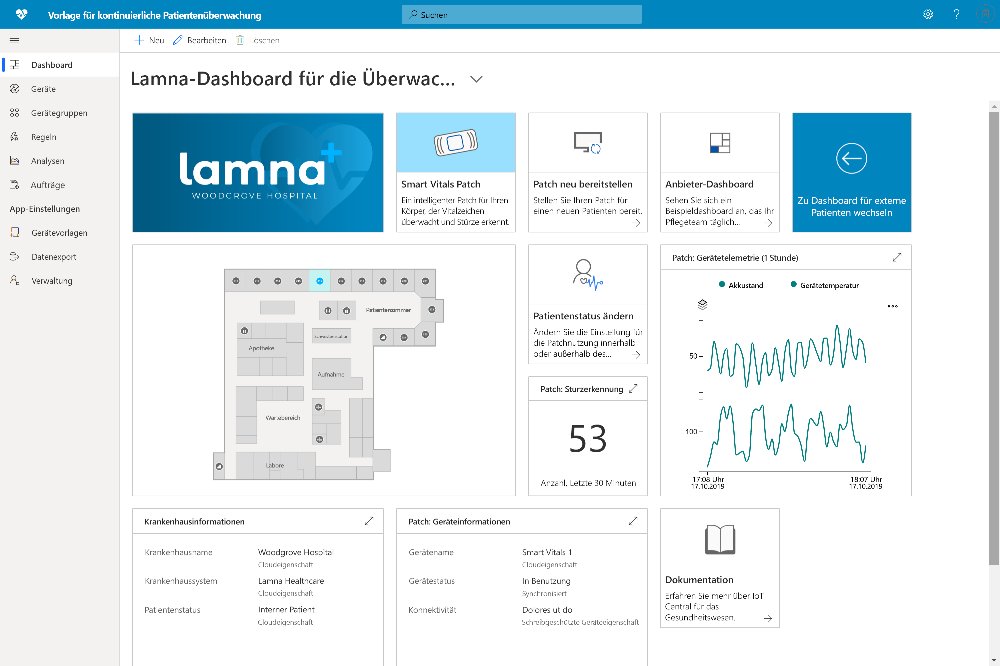

# Welche IoT Central-Lösungen für das Gesundheitswesen gibt es?

Hier erfahren Sie, wie Sie Azure IoT Central und Anwendungsvorlagen verwenden, um Lösungen für das Gesundheitswesen zu erstellen.

## Was ist die Vorlage für die kontinuierliche Patientenüberwachung?

Im Bereich der IoT-Lösungen für das Gesundheitswesen ist die kontinuierliche Patientenüberwachung eines der wichtigsten Hilfsmittel zur Verringerung erneuter Krankenhausaufenthalte, zur effektiveren Behandlung chronischer Erkrankungen sowie zur Verbesserung der Ergebnisse für die Patienten. Die kontinuierliche Patientenüberwachung kann in zwei Hauptkategorien unterteilt werden:

1. **Überwachung stationärer Patienten:** Mithilfe medizinischer Wearables und anderer Krankenhausgeräte können Patientenversorgungsteams die Vitalparameter und Erkrankungen von Patienten überwachen, ohne dass eine Pflegekraft mehrmals täglich nach dem Patienten sehen muss. Dank Benachrichtigung wissen Patientenversorgungsteams sofort, wann ein Patient dringend medizinische Hilfe benötigt, und können sich ihre Zeit somit besser einteilen.
1. **Remote-Patientenüberwachung:** Außerhalb des Krankenhauses können Patienten mithilfe von medizinischen Wearables und Patientenberichten überwacht werden, um das Risiko eines erneuten Krankenhausaufenthalts zu senken. Daten von chronisch Erkrankten und Reha-Patienten können gesammelt werden, um sicherzustellen, dass sich Patienten an Pflegepläne halten und Patientenversorgungsteams frühzeitig auf Anzeichen für eine Verschlechterung des Patientenzustands aufmerksam werden.

Mit dieser Anwendungsvorlage können Lösungen für beide Kategorien der kontinuierlichen Patientenüberwachung erstellt werden. Es ergeben sich folgende Vorteile:

* Nahtlose Verbindung verschiedener Arten von medizinischen Wearables mit einer IoT Central-Instanz
* Überwachung und Verwaltung der Geräte, um sicherzustellen, dass Sie einwandfrei funktionieren
* Erstellung benutzerdefinierter Regeln für Gerätedaten, um geeignete Warnungen auszulösen
* Export der Patientengesundheitsdaten nach Azure API for FHIR (kompatibler Datenspeicher)
* Export der aggregierten Erkenntnisse in vorhandene oder neue Geschäftsanwendungen

>[!div class="mx-imgBorder"] 
>

## Nächste Schritte

Die folgenden Artikel enthalten Informationen zu den ersten Schritten bei der Erstellung einer Lösung für die kontinuierliche Patientenüberwachung:

* [Bereitstellen einer App für die ständige Überwachung von Patienten und exemplarische Vorgehensweise für die zugehörige Vorlage](tutorial-continuous-patient-monitoring.md)
* [Architektur für die kontinuierliche Patientenüberwachung](concept-continuous-patient-monitoring-architecture.md)