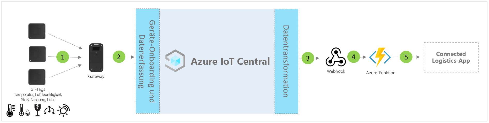

# Architektur der IoT Central-Anwendungsvorlage für vernetzte Logistik

Partner und Kunden können die App-Vorlage verwenden und die unten angegebenen Anweisungen befolgen, um **End-to-End-Lösungen für vernetzte Logistik** zu entwickeln.

> [!div class="mx-imgBorder"]
> 

1. Ein Satz aus IoT-Tags zum Senden von Telemetriedaten an ein Gatewaygerät
2. Gatewaygeräte senden Telemetrie und aggregierte Erkenntnisse an IoT Central
3. Daten werden zur Bearbeitung an den gewünschten Azure-Dienst geroutet
4. Mithilfe von Azure-Diensten wie ASA oder Azure Functions können Datenströme neu formatiert und an die gewünschten Speicherkonten gesendet werden 
5. Verschiedene Geschäftsworkflows können durch Endbenutzer-Geschäftsanwendungen unterstützt werden

## Details
In den folgenden Abschnitten werden die einzelnen Komponenten der Architektur für die Telemetrieerfassung aus IoT-Tags und Gateways erläutert.

## IoT-Tags
IoT-Tags bieten Sensorfunktionen zur Übermittlung von physikalischen, umweltspezifischen und umgebungsbezogenen Informationen wie Temperatur, Luftfeuchtigkeit, Erschütterung, Neigung und Licht. IoT-Tags sind in der Regel über Zigbee (802.15.4) mit einem Gatewaygerät verbunden. Tags sind kostengünstigere Sensoren und können daher nach Beendigung eines typischen Logistikprojekts entsorgt werden, um Probleme bei der Retourenlogistik zu vermeiden.

## Gateway
Gateways können mit ihren Umgebungssensorfunktionen ebenfalls als IoT-Tags fungieren. Ein Gateway ermöglicht über Mobilfunk- oder WLAN-Kanäle die Upstreamkonnektivität mit der Azure IoT-Cloud (MQTT).  Für die Kommunikation mit nachgeschalteten IoT-Tags werden Bluetooth-, NFC- und 802.15.4 WSN-Modi (Wireless Sensor Network) verwendet. Gateways bieten sichere End-to-End-Cloudkonnektivität und unterstützen die Kopplung von IoT-Tags, das Aggregieren von Sensordaten, die Aufbewahrung von Daten sowie die Möglichkeit, Alarmschwellenwerte zu konfigurieren.

## Geräteverwaltung mit IoT Central 
Azure IoT Central ist eine Plattform für die Lösungsentwicklung, die die Konnektivität, Konfiguration und Verwaltung von IoT-Geräten vereinfacht. Die Plattform verringert Aufwand und Kosten von Entwicklungen für IoT-Geräteverwaltung, -betrieb und verwandte Entwicklungen erheblich. Kunden und Partner können eine End-to-End-Enterprise-Lösung aufbauen, um eine digitale Feedbackschleife in der Logistik zu realisieren.

## Geschäftliche Erkenntnisse und Aktionen über ausgehende Daten 
Die IoT Central-Plattform bietet umfassende Optionen zur Erweiterbarkeit über CDE (Continuous Data Export) und APIs. Geschäftserkenntnisse, die auf der Verarbeitung von Telemetriedaten oder auf unverarbeiteter Telemetrie basieren, werden normalerweise in eine bevorzugte Branchenanwendung exportiert. Dies kann per Webhook, Service Bus, Event Hub oder Blobspeicher erreicht werden, um Machine Learning-Modelle zu erstellen, zu trainieren, bereitzustellen und weitere Erkenntnisse zu gewinnen.

## Nächste Schritte
* Informieren Sie sich über die Bereitstellung der [Lösungsvorlage für vernetzte Logistik](./tutorial-iot-central-connected-logistics.md).
* Weitere Informationen zu [IoT Central-Einzelhandelsvorlagen](./overview-iot-central-retail.md)
* Lesen Sie die [Übersicht über IoT Central](../core/overview-iot-central.md).
