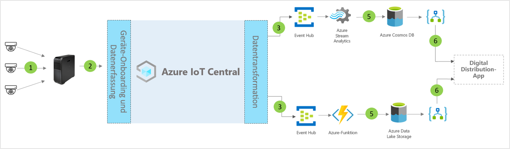

# Architektur der IoT Central-Anwendungsvorlage für digitale Verteilzentren

Partner und Kunden können die App-Vorlage nutzen und die unten angegebenen Anweisungen befolgen, um End-to-End-Lösungen für **digitale Verteilzentren** zu entwickeln.

> [!div class="mx-imgBorder"]
> 

1. Ein Satz von IoT-Sensoren zum Senden von Telemetriedaten an ein Gatewaygerät
2. Gatewaygeräte senden Telemetrie und aggregierte Erkenntnisse an IoT Central
3. Daten werden zur Bearbeitung an den gewünschten Azure-Dienst geroutet
4. Mithilfe von Azure-Diensten wie ASA oder Azure Functions können Datenströme neu formatiert und an die gewünschten Speicherkonten gesendet werden
5. Verarbeitete Daten werden in der heißen Speicherebene für Aktionen in Quasi-Echtzeit oder in der kalten Zugriffsebene zur weiteren Erkenntnisverbesserung auf Grundlage von ML oder Batchanalyse gespeichert. 
6. Logik-Apps können verwendet werden, um verschiedene Geschäftsworkflows in Endbenutzer-Geschäftsanwendungen zu unterstützen

## Details
Im folgenden Abschnitt werden die einzelnen Teile der konzeptionellen Architektur erläutert

## Videokameras 
Videokameras sind die Hauptsensoren in diesem digital verbundenen Ökosystem im Enterprise-Maßstab. Verbesserungen in Machine Learning und künstlicher Intelligenz, die es ermöglichen, Videodaten in strukturierte Daten umzuwandeln, die am Edge verarbeitet werden, bevor sie in die Cloud gesendet werden. Wir können IP-Kameras verwenden, um Bilder zu erfassen, sie in der Kamera zu komprimieren und die komprimierten Daten anschließend über Edge-Compute an die Pipeline zur Videoanalyse zu senden, oder GigE-Vision-Kameras verwenden, um die Bilder im Sensor zu erfassen und sie direkt an den Azure IoT Edge zu senden, der sie dann vor der Verarbeitung in der Pipeline zur Videoanalyse komprimiert. 

## Azure IoT Edge Gateway
Die „Kameras-als-Sensoren“ und die Edge-Workloads werden lokal von Azure IoT Edge verwaltet, und der Kameradatenstrom wird von der Analysepipeline verarbeitet. Die Pipeline zur Verarbeitung der Videoanalyse in Azure IoT Edge bringt viele Vorteile mit sich, z. B. kürzere Reaktionszeit und niedriger Bandbreitenverbrauch, und dies führt zu geringer Latenz und somit zu einer schnelleren Datenverarbeitung. Nur die wichtigsten Metadaten, Erkenntnisse oder Aktionen werden für weitere Maßnahmen oder zur Untersuchung an die Cloud gesendet. 

## Geräteverwaltung mit IoT Central 
Azure IoT Central ist eine Entwicklungsplattform für Lösungen, die die Konnektivität, Konfiguration und Verwaltung von IoT-Geräten und Azure IoT Edge-Gateways vereinfacht. Die Plattform verringert Aufwand und Kosten von Entwicklungen für IoT-Geräteverwaltung, -betrieb und verwandte Entwicklungen erheblich. Kunden und Partner können eine End-to-End-Enterprise-Lösung aufbauen, um eine digitale Feedbackschleife in Verteilzentren zu verwirklichen.

## Geschäftliche Erkenntnisse und Aktionen über ausgehende Daten 
Die IoT Central-Plattform bietet umfassende Optionen zur Erweiterbarkeit über CDE (Continuous Data Export) und APIs. Geschäftserkenntnisse, die auf der Verarbeitung von Telemetriedaten oder auf unverarbeiteter Telemetrie basieren, werden normalerweise in eine bevorzugte Branchenanwendung exportiert. Dies kann per Webhook, Service Bus, Event Hub oder Blobspeicher erreicht werden, um Machine Learning-Modelle zu erstellen, zu trainieren, bereitzustellen und weitere Erkenntnisse zu gewinnen.

## Nächste Schritte
* Informieren Sie sich über die Bereitstellung der [Vorlage für digitale Verteilzentren](./tutorial-iot-central-digital-distribution-center.md).
* Weitere Informationen zu [IoT Central-Einzelhandelsvorlagen](./overview-iot-central-retail.md)
* Lesen Sie die [Übersicht über IoT Central](../core/overview-iot-central.md).
