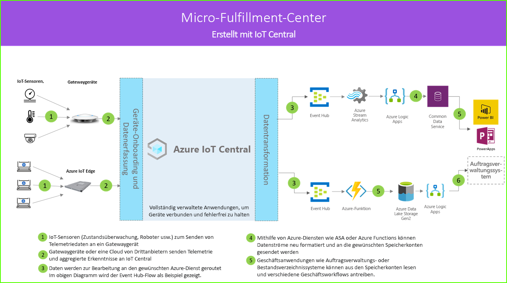

# Micro-Fulfillment-Center-Architektur

Micro-Fulfillment-Center-Lösungen ermöglichen die digitale Verbindung, Überwachung und Verwaltung sämtlicher Aspekte eines vollständig automatisierten Fulfillment-Centers mit dem Ziel, die Kosten zu senken, indem Sie Downtime beseitigen und gleichzeitig die Sicherheit und die Gesamteffizienz erhöhen. Diese Lösungen können erstellt werden, indem eine der Anwendungsvorlagen in Azure IoT Central und die unten dargestellte Architektur als Richtschnur genutzt werden.

- Ein Satz von IoT-Sensoren zum Senden von Telemetriedaten an ein Gatewaygerät
- Gatewaygeräte senden Telemetrie und aggregierte Erkenntnisse an IoT Central
- Kontinuierlicher Datenexport an den gewünschten Azure-Dienst zur Bearbeitung
- Daten können im gewünschten Format strukturiert und an einen Speicherdienst gesendet werden
- Geschäftsanwendungen können Daten abfragen und Erkenntnisse generieren, die Einzelhandelsvorgänge stützen
 
Als Nächstes beschäftigen wir uns mit allgemeinen Schlüsselkomponenten einer Micro-Fulfillment-Center-Lösung.

## Transportroboter

Eine Micro-Fulfillment-Center-Lösung verfügt wahrscheinlich über zahlreiche Transportroboter, die verschiedene Telemetriesignale generieren. Diese Signale können von einem Gatewaygerät erfasst, aggregiert und anschließend an IoT Central gesendet werden, wie auf der linken Seite des Architekturdiagramms zu sehen.  

## Sensoren zur Zustandsüberwachung

Eine IoT-Lösung beginnt mit einer Reihe von Sensoren, die aussagekräftige Signale aus Ihrem Fulfillment-Center erfassen. Dies wird durch verschiedene Arten von Sensoren ganz am linken Rand des Architekturdiagramms oben wiedergegeben.

## Gatewaygeräte

Viele IoT-Sensoren können unformatierte Signale direkt in die Cloud oder in ein Gatewaygerät in ihrer Nähe einspeisen. Das Gatewaygerät führt vor dem Senden von zusammengefassten Einblicken an eine IoT Central-Anwendung eine Datenaggregation auf dem Edge aus. Die Gatewaygeräte sind ggf. außerdem für die Weiterleitung von Befehls- und Steuerungsvorgängen an die Sensorgeräte zuständig. 

## IoT Central-Anwendung

Die Azure IoT Central-Anwendung erfasst Daten von verschiedenen IoT-Sensoren, Robotern und Gatewaygeräten innerhalb der Fulfillment-Center-Umgebung und generiert eine Reihe aussagekräftiger Erkenntnisse.

Azure IoT Central bietet darüber hinaus eine maßgeschneiderte Benutzeroberfläche für den Betreiber des Geschäfts, die ihm die Überwachung und Verwaltung der Infrastrukturgeräte aus der Ferne erlaubt.

## Datentransformation
Die Azure IoT Central-Anwendung kann in einer Lösung so konfiguriert werden, dass sie unformatierte oder aggregierte Erkenntnisse an eine Reihe von Azure-PaaS-Diensten (Platform-as-a-Service) exportiert, die die Daten bearbeiten und die Erkenntnisse anreichern können, bevor sie in einer Geschäftsanwendung landen. 

## Geschäftsanwendung
Die IoT-Daten können die Basis verschiedener Geschäftsanwendungen bilden, die in einer Einzelhandelsumgebung bereitgestellt sind. Ein Manager oder Mitarbeiter eines Fulfillment-Centers kann diese Anwendungen nutzen, um geschäftliche Erkenntnisse zu visualisieren und in Echtzeit zielgerichtete Maßnahmen zu ergreifen. Informationen zum Erstellen eines Power BI-Echtzeit-Dashboards für Ihr Einzelhandelsteam finden Sie in [diesem Tutorial](./tutorial-in-store-analytics-create-app-pnp.md).

## Nächste Schritte
* Führen Sie die ersten Schritte mit der Anwendungsvorlage für [Micro-Fulfillment-Center](https://aka.ms/checkouttemplate) aus. 
* Sehen Sie sich [dieses Tutorial](https://aka.ms/mfc-tutorial) an. Darin erfahren Sie Schritt für Schritt, wie Sie eine Lösung mit der Vorlage für Micro-Fulfillment-Center-Apps erstellen.
