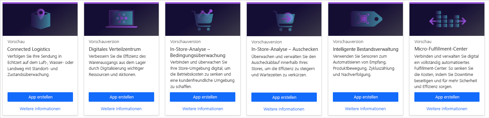
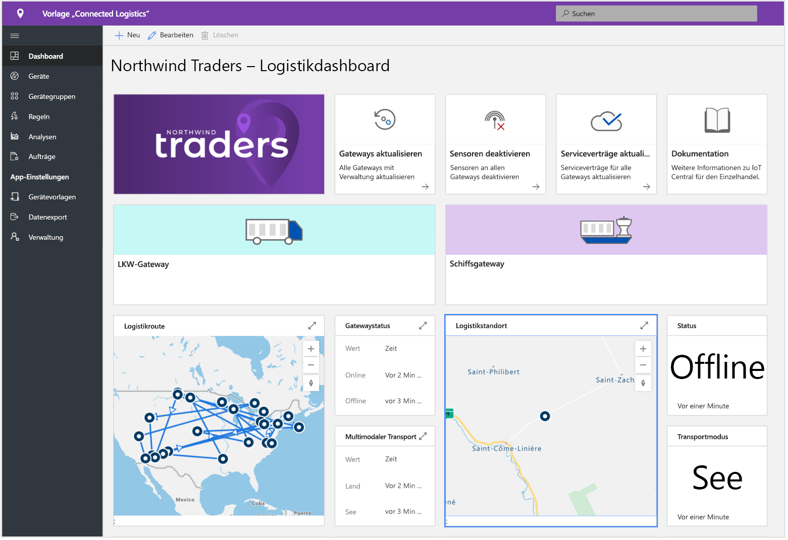
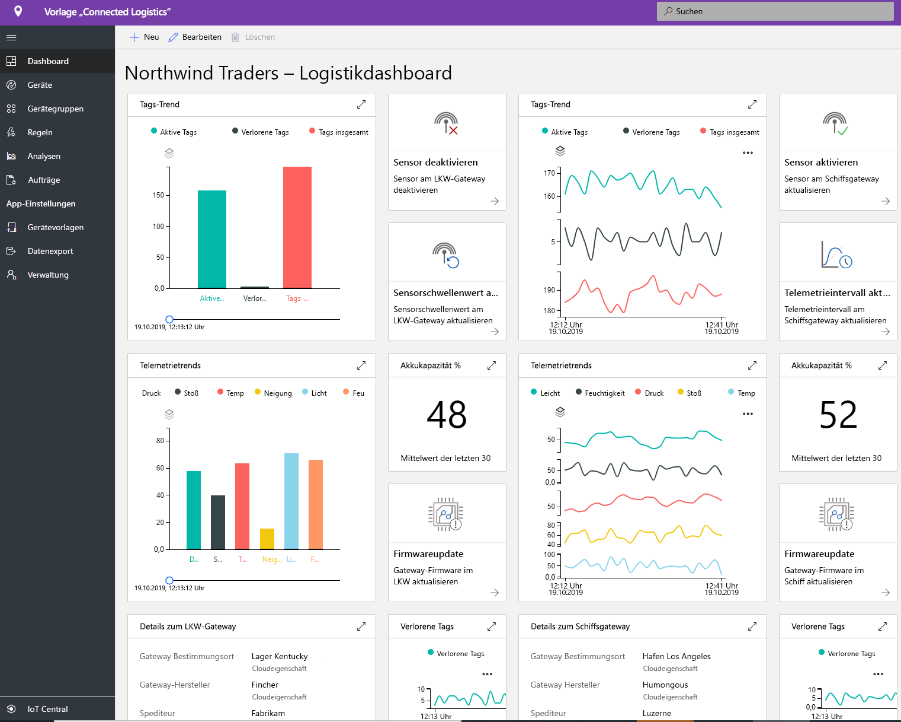
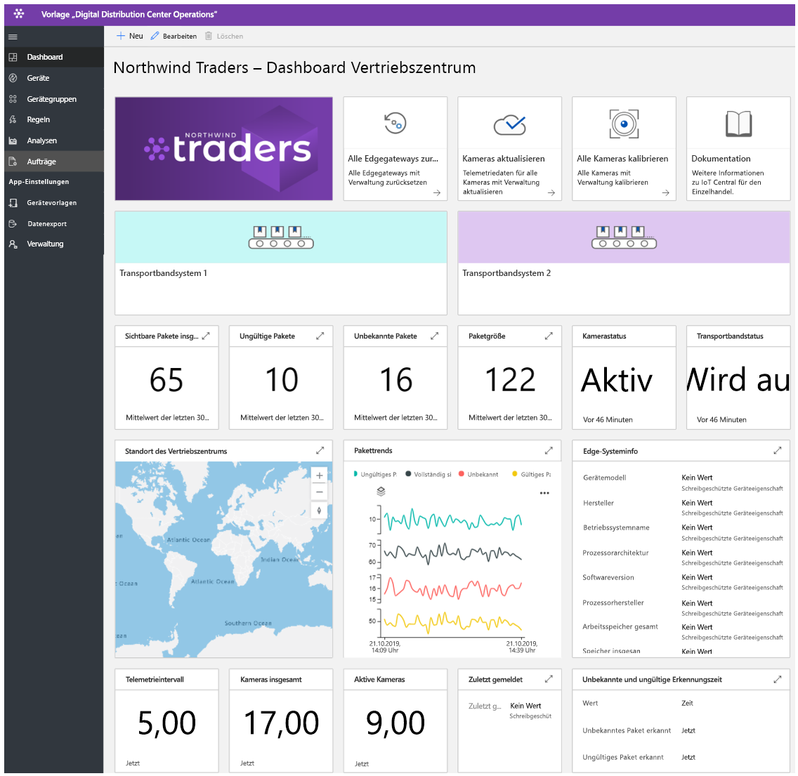
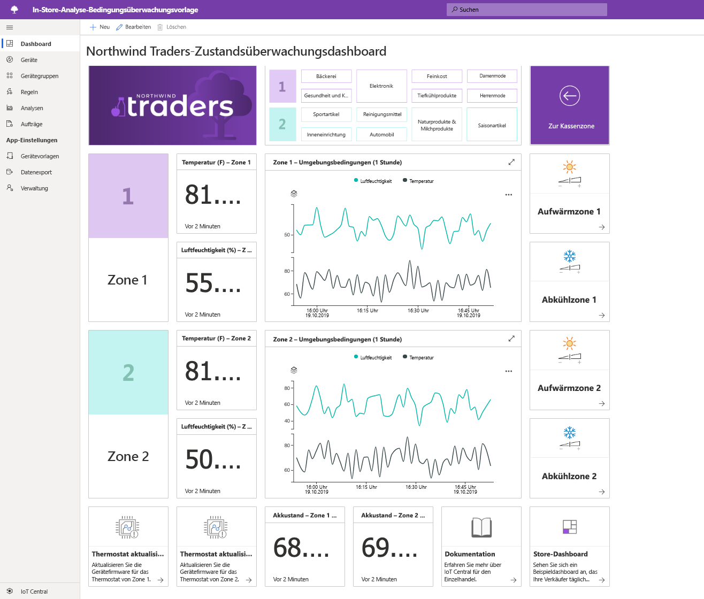
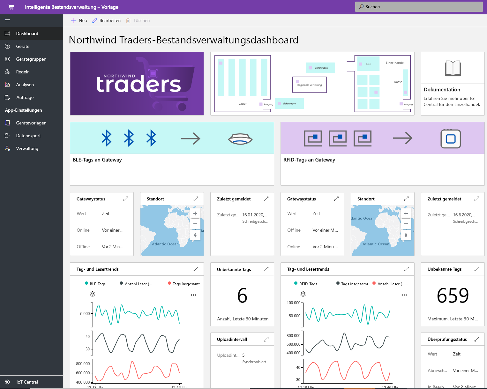

# Erstellen von Lösungen für den Einzelhandel mit Azure IoT Central

[!INCLUDE [iot-central-pnp-original](../../../includes/iot-central-pnp-original-note.md)]

Azure IoT Central ist eine IoT-App-Plattform, die Aufwand und Kosten im Zusammenhang mit der Entwicklung, Verwaltung und Wartung von IoT-Lösungen auf Unternehmensniveau verringert. Die Entscheidung zur Entwicklung mit Azure IoT Central gibt Ihnen die Möglichkeit, Zeit, Geld und Energie auf die Transformation Ihres Unternehmens mit IoT-Daten zu konzentrieren, anstatt sich lediglich mit der Wartung und Aktualisierung einer komplexen und sich ständig weiterentwickelnden IoT-Infrastruktur zu beschäftigen.

In diesem Artikel werden verschiedene einzelhandelsspezifische IoT Central-Anwendungsvorlagen beschrieben. Mithilfe dieser Vorlagen können Lösungsentwickler IoT-Lösungen zur Optimierung der Lieferkette, zur Verbesserung des Einkaufserlebnisses für Kunden sowie zur effizienteren Nachverfolgung des Bestands erstellen.

> [!div class="mx-imgBorder"]
> 

In den folgenden Abschnitten werden die Funktionen dieser Anwendungsvorlagen beschrieben:

## Vernetzte Logistik

Für die weltweiten Ausgaben im Bereich Logistik wird für 2020 eine Summe von 10,6 Billionen US-Dollar erwartet. Der Großteil dieser Ausgaben entfällt auf den Warentransport, und Transportdienstleister stehen unter enormem Wettbewerbsdruck.

Mithilfe von IoT-Sensoren können Umgebungsbedingungen wie Temperatur, Luftfeuchtigkeit, Neigung, Erschütterung, Licht und Standort einer Sendung erfasst und überwacht werden. Von IoT-Sensoren und -Geräten gesammelte Telemetriedaten können mit anderen Datenquellen wie etwa Wetter- und Verkehrsinformationen in cloudbasierten Business Intelligence-Systemen kombiniert werden.

Eine Lösung für vernetzte Logistik hat unter anderem folgende Vorteile:

* Sendungsüberwachung mit Nachverfolgung in Echtzeit 
* Sendungsintegrität mit Echtzeitüberwachung von Umgebungsbedingungen
* Schutz vor Diebstahl, Verlust oder Beschädigung von Sendungen
* Geofencing, Routenoptimierung, Flottenmanagement und Fahrzeuganalyse
* Vorhersagen für planbare Versand- und Ankunftszeiten von Sendungen

Die folgenden Screenshots zeigen das Standarddashboard in der Anwendungsvorlage. Das Dashboard kann vollständig an Ihre individuellen Lösungsanforderungen angepasst werden:

> [!div class="mx-imgBorder"]
> 

> [!div class="mx-imgBorder"]
> 

Weitere Informationen finden Sie im Tutorial [Bereitstellung und exemplarische Vorgehensweise für eine Anwendungsvorlage für vernetzte Logistik](./tutorial-iot-central-connected-logistics-pnp.md).

## Digitales Verteilzentrum

Die Lieferketten weltweit präsenter Hersteller und Einzelhändler werden mit der Zeit immer verzweigter und komplexer. Die Konsumenten erwarten mittlerweile ein breit gefächertes Produktangebot, das innerhalb von ein bis zwei Tagen nach dem Kauf geliefert werden kann. Verteilzentren sind gezwungen, sich an diese Trends anzupassen und die bestehenden Ineffizienzen zu beseitigen. 

Handarbeit bedeutet heutzutage, dass 55 bis 65 Prozent der Kosten eines Verteilzentrums auf die Zusammenstellung und Verpackung von Sendungen entfallen. Die manuelle Zusammenstellung und Verpackung ist außerdem in der Regel langsamer als automatisierte Systeme, und die Bewältigung des Versandvolumens wird durch einen stark schwankenden Personalbedarf zusätzlich erschwert. Diese saisonale Schwankung führt zu einer hohen Mitarbeiterfluktuation und erhöht die Wahrscheinlichkeit kostspieliger Fehler.

Lösungen, die auf IoT-fähigen Kameras basieren, können Vorteile in Bezug auf die Transformation ergeben, indem eine digitale Feedbackschleife ermöglicht wird. Daten aus dem gesamten Verteilzentrum führen zu verwertbaren Erkenntnissen, die wiederum zu besseren Daten führen.

Ein digitales Verteilzentrum hat unter anderem folgende Vorteile:

* Kameraüberwachung der Waren beim Eingang und beim Durchlaufen des Fördersystems
* Automatische Erkennung fehlerhafter Waren
* Effiziente Auftragsnachverfolgung
* Geringere Kosten, höhere Produktivität und optimierte Auslastung

Der folgende Screenshot zeigt das Standarddashboard in der Anwendungsvorlage. Das Dashboard kann vollständig an Ihre individuellen Lösungsanforderungen angepasst werden: 

> [!div class="mx-imgBorder"]
> 

Weitere Informationen finden Sie im Tutorial [Bereitstellen und Durchlaufen einer Anwendungsvorlage für digitale Verteilzentren](./tutorial-iot-central-digital-distribution-center-pnp.md).

## In-Store-Analyse – Bedingungsüberwachung

Die Umgebungsbedingungen in Geschäften sind für viele Einzelhändler eine wichtige Möglichkeit, sich von der Konkurrenz abzuheben. Einzelhändler möchten den Kunden in ihren Geschäften eine angenehme Umgebung bieten.  

Mithilfe der IoT Central-Anwendungsvorlage „In-Store-Analyse – Bedingungsüberwachung“ können Lösungsentwickler eine End-to-End-Lösung erstellen. Die Anwendungsvorlage ermöglicht die Herstellung einer digitalen Verbindung mit einer Einzelhandelsumgebung sowie deren digitale Überwachung mithilfe verschiedener Sensorgeräte. Diese Sensorgeräte generieren Telemetriedaten, aus denen Sie geschäftliche Erkenntnisse gewinnen können, die den Einzelhändler dabei unterstützen, seine Betriebskosten zu senken und eine erstklassige Kundenerfahrung zu bieten.

Verwenden Sie die Anwendungsvorlage für Folgendes:

* Verbinden verschiedenster IoT-Sensoren mit einer IoT Central-Anwendungsinstanz
* Überwachen und Verwalten der Integrität des Sensornetzwerks sowie der Gatewaygeräte in der Umgebung
* Erstellen benutzerdefinierter Regeln für die Umgebungsbedingungen in einem Geschäft, um Warnungen für Filialleiter auszulösen
* Gewinnen von Erkenntnissen auf der Grundlage der Umgebungsbedingungen, die von den Mitarbeitern des Einzelhandelsgeschäfts zur Verbesserung der Kundenerfahrung genutzt werden können
* Exportieren der aggregierten Erkenntnisse in vorhandene oder neue Geschäftsanwendungen, um den Mitarbeitern zeitnah hilfreiche Informationen zur Verfügung zu stellen

Die Anwendungsvorlage verfügt über eine Reihe von Gerätevorlagen und nutzt mehrere simulierte Geräte, um das Dashboard aufzufüllen. 

Der folgende Screenshot zeigt das Standarddashboard in der Anwendungsvorlage. Das Dashboard kann vollständig an Ihre individuellen Lösungsanforderungen angepasst werden: 

> [!div class="mx-imgBorder"]
> 

Weitere Informationen finden Sie im Tutorial [Erstellen einer Anwendung für die In-Store-Analyse in Azure IoT Central](./tutorial-in-store-analytics-create-app-pnp.md).

## In-Store-Analyse – Auschecken

Einige Einzelhändler nutzen die Kassenumgebung (Checkout) in ihren Geschäften, um sich von der Konkurrenz abzuheben. Einzelhändler möchten Kunden in ihren Geschäften durch einen reibungslosen Ablauf an der Kasse dazu animieren, erneut bei ihnen einzukaufen.  

Mithilfe der IoT Central-Anwendungsvorlage „In-Store-Analyse – Auschecken“ können Lösungsentwickler eine Lösung erstellen, die Mitarbeiter mit Erkenntnissen aus dem Kassenbereich eines Geschäfts versorgt. So können beispielsweise Sensoren Informationen zur Länge von Warteschlangen sowie zur durchschnittlichen Wartezeit an den einzelnen Kassen liefern.

Verwenden Sie die Anwendungsvorlage für Folgendes:

* Verbinden verschiedenster IoT-Sensoren mit einer IoT Central-Anwendungsinstanz
* Überwachen und Verwalten der Integrität des Sensornetzwerks sowie der Gatewaygeräte in der Umgebung
* Erstellen benutzerdefinierter Regeln für die Kassenbedingungen in einem Geschäft, um Warnungen für Mitarbeiter auszulösen
* Gewinnen von Erkenntnissen auf der Grundlage der Kassenbedingungen, die von den Mitarbeitern des Einzelhandelsgeschäfts zur Verbesserung der Kundenerfahrung genutzt werden können
* Exportieren der aggregierten Erkenntnisse in vorhandene oder neue Geschäftsanwendungen, um den Mitarbeitern zeitnah hilfreiche Informationen zur Verfügung zu stellen

Die Anwendungsvorlage verfügt über eine Reihe von Gerätevorlagen und nutzt mehrere simulierte Geräte, um das Dashboard mit Daten zur Länge von Kassenwarteschlangen aufzufüllen. 

Der folgende Screenshot zeigt das Standarddashboard in der Anwendungsvorlage. Das Dashboard kann vollständig an Ihre individuellen Lösungsanforderungen angepasst werden: 

> [!div class="mx-imgBorder"]
> 

Weitere Informationen finden Sie im Tutorial [Erstellen einer Anwendung für die In-Store-Analyse in Azure IoT Central](./tutorial-in-store-analytics-create-app-pnp.md).

## Intelligente Bestandsverwaltung

Bestand sind die Waren, über die ein Einzelhändler verfügt. Mithilfe der Bestandsverwaltung wird sichergestellt, dass sich das richtige Produkt zur richtigen Zeit am richtigen Ort befindet. Ein Einzelhändler muss die Kosten für die Lagerung von Überbestand gegen die Kosten abwägen, die entstehen, wenn er nicht über genügend Bestand verfügt, um die Nachfrage zu decken.

Die Bestandsverwaltung lässt sich mithilfe von IoT-Daten optimieren, die durch RFID-Tags, Beacons und Kameras generiert werden. Von IoT-Sensoren und -Geräten gesammelte Telemetriedaten können mit anderen Datenquellen wie etwa Wetter- und Verkehrsinformationen in cloudbasierten Business Intelligence-Systemen kombiniert werden.

Eine intelligente Bestandsverwaltung hat unter anderem folgende Vorteile:

* Geringeres Risiko, dass Artikel nicht vorrätig sind, und Gewährleistung der angestrebten Kundenservicequalität 
* Ausführliche Analyse und Erkenntnisse zur Bestandsgenauigkeit nahezu in Echtzeit
* Hilfreiche Tools zur Bestimmung der passenden Bestandsmenge für Kundenbestellungen

Bei dieser Anwendungsvorlage stehen die Gerätekonnektivität sowie die Konfiguration und Verwaltung von RFID- und BLE-Lesegeräten (Bluetooth Low Energy) im Mittelpunkt.

Der folgende Screenshot zeigt das Standarddashboard in der Anwendungsvorlage. Das Dashboard kann vollständig an Ihre individuellen Lösungsanforderungen angepasst werden:

> [!div class="mx-imgBorder"]
> 

Weitere Informationen finden Sie im Tutorial [Bereitstellen und Durchlaufen einer Anwendungsvorlage für intelligente Bestandsverwaltung](./tutorial-iot-central-smart-inventory-management-pnp.md).

## Micro-Fulfillment-Center

Aufgrund des stetig wachsenden Wettbewerbsdrucks im Einzelhandel müssen Einzelhändler kontinuierlich versuchen, die Lücke zwischen Nachfrage und Deckung zu schließen. Ein neuer Trend zur Deckung der steigenden Kundennachfrage besteht darin, den Bestand in der Nähe der Endkunden und der von ihnen besuchten Geschäfte vorzuhalten.

Mithilfe der IoT Central-Anwendungsvorlage „Micro-Fulfillment-Center“ können Lösungsentwickler sämtliche Aspekte ihrer vollständig automatisierten Fulfillment-Center überwachen und verwalten. Die Vorlage enthält eine Reihe simulierter Sensoren für die Bedingungsüberwachung sowie simulierte Transportroboter, um die Lösungsentwicklung zu beschleunigen. Diese Sensorgeräte erfassen aussagekräftige Signale, aus denen geschäftliche Erkenntnisse gewonnen werden können, auf deren Grundlage Einzelhändler ihre Betriebskosten senken und Kundenerfahrungen generieren können.

Die Anwendungsvorlage ermöglicht Folgendes: 

- Nahtloses Verbinden einer Vielzahl von IoT-Sensoren (etwa Roboter oder Bedingungsüberwachungssensoren) mit einer IoT Central-Anwendungsinstanz
- Überwachen und Verwalten der Integrität des Sensornetzwerks sowie der Gatewaygeräte in der Umgebung
- Erstellen benutzerdefinierter Regeln für die Umgebungsbedingungen in einem Fulfillment-Center, um geeignete Warnungen auszulösen
- Gewinnen von Erkenntnissen auf der Grundlage der Umgebungsbedingungen in Ihrem Fulfillment-Center, die von den Lagermitarbeitern genutzt werden können
- Exportieren der aggregierten Erkenntnisse in vorhandene oder neue Geschäftsanwendungen, um die Mitarbeiter bei ihrer Arbeit zu unterstützen

Der folgende Screenshot zeigt das Standarddashboard in der Anwendungsvorlage. Das Dashboard kann vollständig an Ihre individuellen Lösungsanforderungen angepasst werden:

> [!div class="mx-imgBorder"]
> 

Weitere Informationen finden Sie im Tutorial [Bereitstellen und Durchlaufen einer Anwendungsvorlage für intelligente Bestandsverwaltung](./tutorial-iot-central-smart-inventory-management-pnp.md).

## Nächste Schritte

Gehen Sie wie folgt vor, um eine Lösung für den Einzelhandel zu erstellen:

* Beginnen Sie mit dem Tutorial [Erstellen einer Anwendung für die In-Store-Analyse in Azure IoT Central](./tutorial-in-store-analytics-create-app-pnp.md). Darin erfahren Sie Schritt für Schritt, wie Sie eine Lösung mit einer der Anwendungsvorlagen für die In-Store-Analyse erstellen.
* [Bereitstellung und exemplarische Vorgehensweise für eine Anwendungsvorlage für vernetzte Logistik](./tutorial-iot-central-connected-logistics-pnp.md)
* [Bereitstellen und Durchlaufen einer Anwendungsvorlage für digitale Verteilzentren](./tutorial-iot-central-digital-distribution-center-pnp.md)
* [Bereitstellen und Durchlaufen einer Anwendungsvorlage für intelligente Bestandsverwaltung](./tutorial-iot-central-smart-inventory-management-pnp.md)
* [Bereitstellen und Durchlaufen einer Anwendungsvorlage für intelligente Bestandsverwaltung](./tutorial-iot-central-smart-inventory-management-pnp.md)
* Weitere Informationen zu IoT Central finden Sie in der [Übersicht über IoT Central](../preview/overview-iot-central.md).
