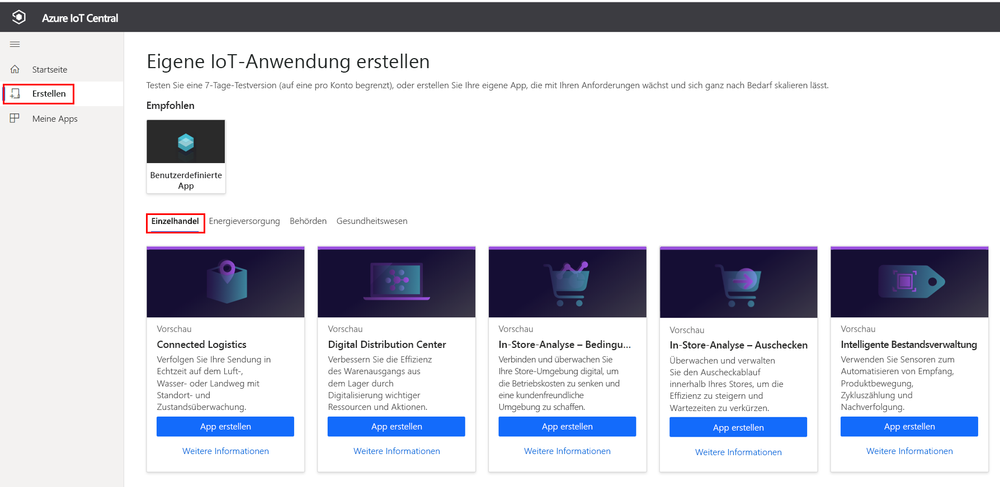
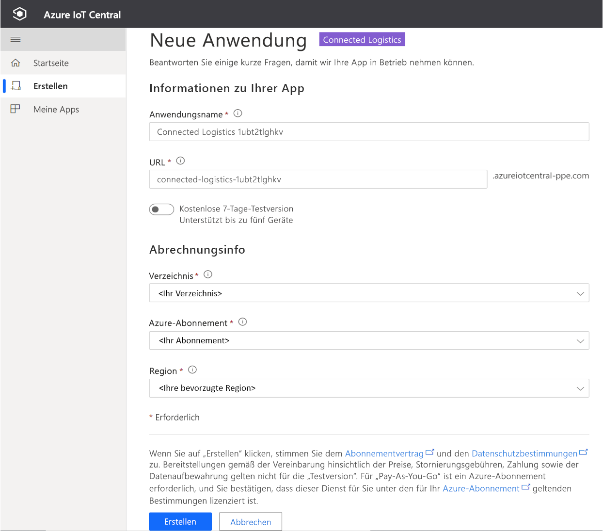
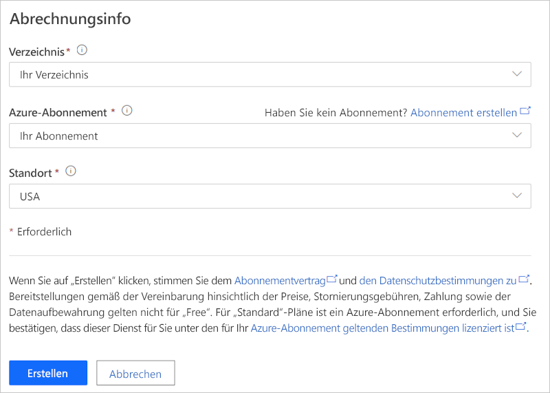
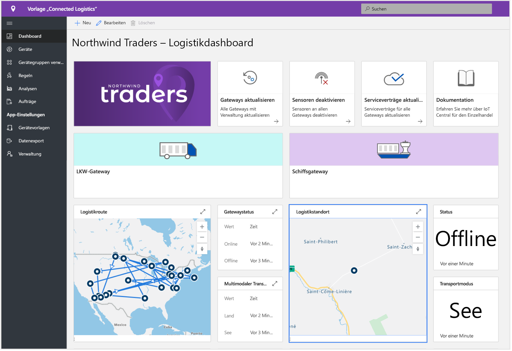
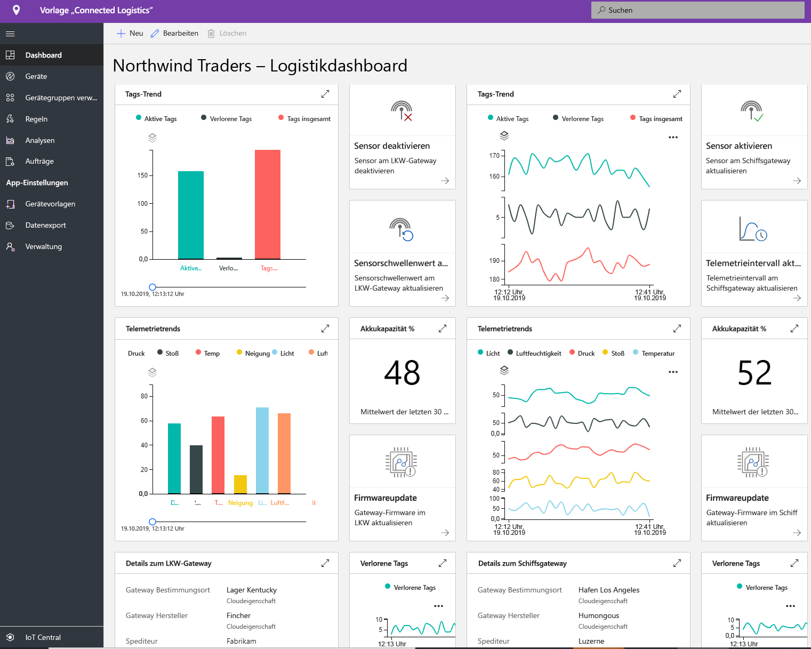
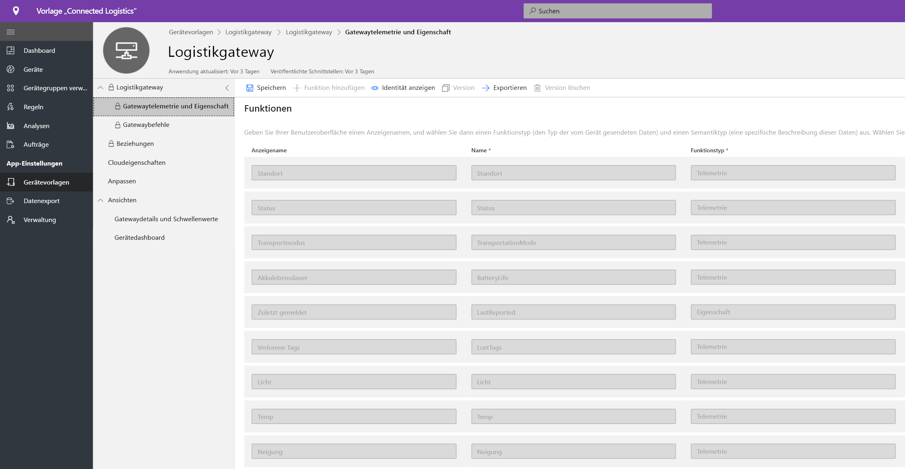
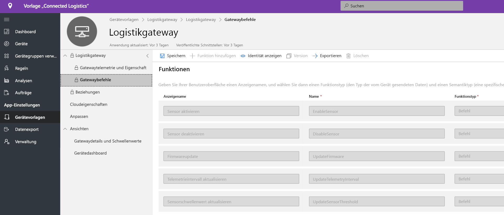
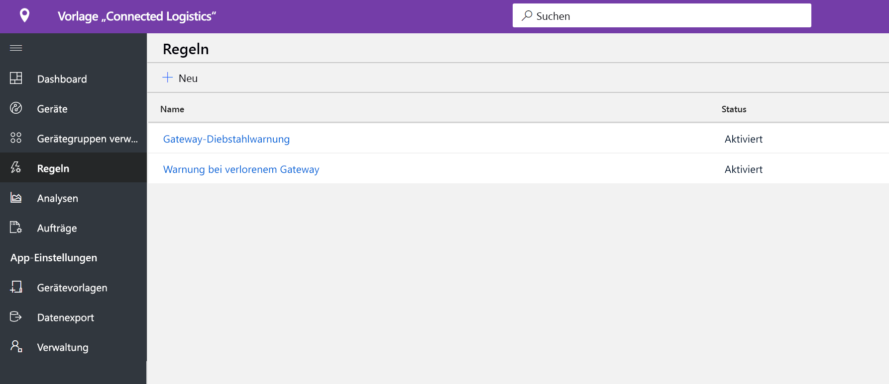
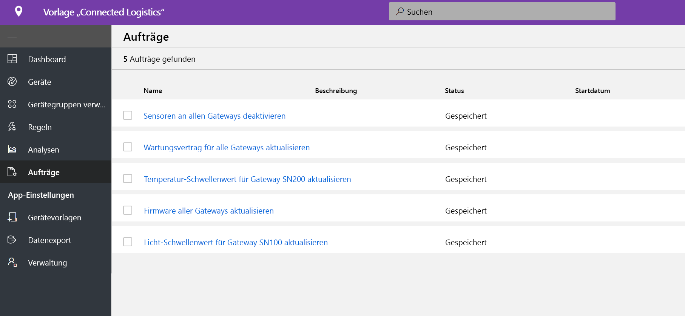
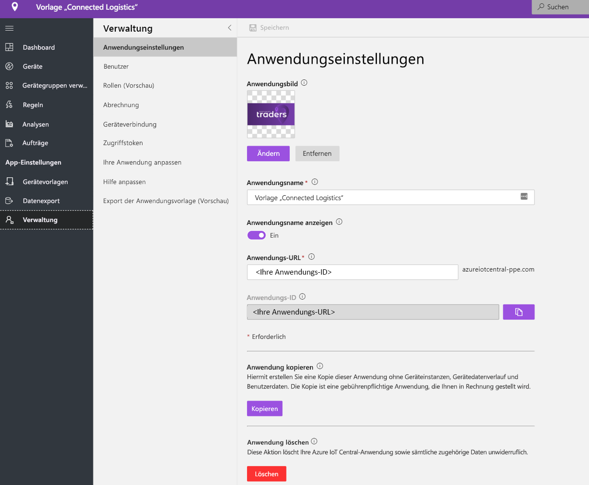

# Tutorial: Bereitstellung und exemplarische Vorgehensweise für eine Anwendungsvorlage für vernetzte Logistik

Dieses Tutorial zeigt, wie Sie durch Bereitstellen einer IoT Central-Vorlage Ihren Einstieg in **vernetzte Logistik** machen. Sie erfahren, wie Sie die Vorlage bereitstellen, was im Lieferumfang enthalten ist und welche nächsten Schritte sinnvoll sind.

In diesem Tutorial lernen Sie Folgendes:

* Erstellen einer Anwendung für vernetzte Logistik
* Einführung in die Anwendung 

## Voraussetzungen

* Zum Bereitstellen dieser App sind keine besonderen Voraussetzungen erforderlich.
* Ein Azure-Abonnement ist empfehlenswert, Sie können es aber auch ohne versuchen.

## Erstellen einer Anwendungsvorlage für vernetzte Logistik

Mithilfe der folgenden Schritte können Sie eine Anwendung erstellen.

1. Navigieren Sie zur Anwendungs-Manager-Website von Azure IoT Central. Wählen Sie auf der linken Navigationsleiste **Erstellen** aus, und klicken Sie dann auf die Registerkarte **Einzelhandel**.

    > [!div class="mx-imgBorder"]
    > 

2. Wählen Sie unter **Connected Logistics-Anwendung** die Option **App erstellen** aus.

3. Mit **App erstellen** wird ein neues Anwendungsformular geöffnet, wobei die erforderlichen Details wie unten dargestellt ausgefüllt werden.
   * **Anwendungsname:** Sie können den vorgeschlagenen Standardnamen verwenden oder einen eigenen Anwendungsnamen eingeben.
   * **URL:** Sie können die vorgeschlagene Standard-URL verwenden oder eine eigene, einfach merkbare und benutzerfreundliche URL eingeben. Als Nächstes wird die Standardeinstellung empfohlen, wenn Sie bereits über ein Azure-Abonnement verfügen. Sie können mit dem Tarif für die kostenlose 7-Tage-Testversion beginnen und jederzeit vor Ablauf der kostenlosen Testversion auf einen Standard-Tarif umstellen.
   * **Abrechnungsinfo**: Die Detailangaben zum Verzeichnis, dem Azure-Abonnement und der Region sind für die Bereitstellung der Ressourcen erforderlich.
   * **Erstellen**: Wählen Sie unten auf der Seite „Erstellen“ aus, um Ihre Anwendung bereitzustellen.

    > [!div class="mx-imgBorder"]
    > 

    > [!div class="mx-imgBorder"]
    > 

## Einführung in die Anwendung 

## Dashboard

Nach erfolgreicher Bereitstellung der App ist Ihr Standard-Dashboard ein Operatorportal mit dem Schwerpunkt vernetzte Logistik. Northwind Trader ist ein fiktiver Logistikanbieter, der eine Frachtflotte zur See und an Land verwaltet. Auf diesem Dashboard sehen Sie zwei verschiedene Gateways, die Telemetrie zu Sendungen zusammen mit zugeordneten Befehlen, Aufträgen und Aktionen bereitstellen, die Sie ausführen können. Dieses Dashboard ist vorkonfiguriert, um die Aktivität von kritischen Vorgängen bei Logistikgeräten darzustellen.
Das Dashboard ist logisch in zwei verschiedene Gateway-Geräteverwaltungsvorgänge unterteilt. 
   * Logistikrouten für Transport per LKW und Standortdetails für den Schiffstransport sind ein wesentliches Element für jede Art von multimodalem Transport
   * Gatewaystatus und relevante Informationen anzeigen 

> [!div class="mx-imgBorder"]
> 

   * Sie können die Gesamtanzahl der Gateways, der aktiven und der unbekannten Tags einfach nachverfolgen.
   * Sie können Vorgänge der Geräteverwaltung durchführen, beispielsweise Firmwareupdates, Deaktivieren und Aktivieren von Sensoren sowie Aktualisieren von Sensorschwellenwerten, Telemetrieintervallen und Geräteserviceverträgen.
   * Anzeigen des Geräteakkuverbrauchs

> [!div class="mx-imgBorder"]
> 

## Gerätevorlage

Klicken Sie auf die Registerkarte „Gerätevorlagen“, dann wird das Gatewayfunktionsmodell angezeigt. Ein Funktionsmodell ist um zwei unterschiedliche Schnittstellen strukturiert: **Gatewaytelemetrie und -eigenschaften** und **Gatewaybefehle**.

**Gatewaytelemetrie und -eigenschaft**: Diese Oberfläche stellt die gesamte Telemetrie im Zusammenhang mit Sensor-, Standort- und Geräteinformationen sowie Gerätezwillings-Eigenschaftsfunktionen wie Sensorschwellenwerte und Aktualisierungsintervalle dar.

> [!div class="mx-imgBorder"]
> 

**Gatewaybefehle:** Diese Schnittstelle organisiert alle Gatewaybefehlsfunktionen.

> [!div class="mx-imgBorder"]
> 

## Regeln
Wählen Sie die Registerkarte „Regeln“ aus, um zwei verschiedene Regeln anzuzeigen, die in dieser Anwendungsvorlage vorhanden sind. Diese Regeln sind so konfiguriert, dass sie zwecks weiterer Untersuchungen E-Mail-Benachrichtigungen an die Operatoren senden.
 
**Gateway-Diebstahlwarnung**: Diese Regel wird ausgelöst, wenn von den Sensoren während des Transports unerwarteter Lichteinfall erkannt wird. Operatoren müssen schnellstmöglich benachrichtigt werden, um einen möglichen Diebstahl zu untersuchen.
 
**Nicht reagierendes Gateway**: Diese Regel wird ausgelöst, wenn das Gateway für einen längeren Zeitraum keine Meldung an die Cloud sendet. Das Gateway reagiert möglicherweise aufgrund eines niedrigen Akkuladestands, eines Verbindungsverlusts oder des Gerätezustands nicht.

> [!div class="mx-imgBorder"]
> 

## Aufträge
Wählen Sie die Registerkarte „Aufträge“ aus, um fünf verschiedene Aufträge in dieser Anwendungsvorlage anzuzeigen:

> [!div class="mx-imgBorder"]
> 

Sie können die Funktion für Aufträge nutzen, um lösungsweite Vorgänge auszuführen. Hier verwenden die Aufträge die Gerätebefehle und die Zwillingsfunktion, um Aufgaben wie das Deaktivieren bestimmter Sensoren für das gesamte Gateway oder das Ändern von Sensorschwellenwerten abhängig von der Transportart und -route durchzuführen. 
   * Es ist ein Standardvorgang, Aufprallsensoren beim Transport auf See zu deaktivieren, um Akkukapazität zu sparen, oder die Temperaturschwelle bei Kühlkettentransporten abzusenken. 
 
   * Mithilfe von Aufträgen können Sie systemweite Vorgänge wie das Updaten der Gatewayfirmware oder das Aktualisieren des Dienstvertrags durchführen, um bei Wartungsaktivitäten auf dem aktuellen Stand zu bleiben.

## Bereinigen von Ressourcen
Wenn Sie diese Anwendung nicht mehr verwenden möchten, löschen Sie die Anwendungsvorlage, indem Sie **Verwaltung** > **Anwendungseinstellungen** besuchen und auf **Löschen** klicken.

> [!div class="mx-imgBorder"]
> 

## Nächste Schritte
* Weitere Informationen zum [Konzept der vernetzten Logistik](./architecture-connected-logistics-pnp.md)
* Weitere Informationen zu anderen [IoT Central-Einzelhandelsvorlagen](./overview-iot-central-retail-pnp.md)
* Erfahren Sie mehr in der [IoT Central-Übersicht](../core/overview-iot-central.md)
