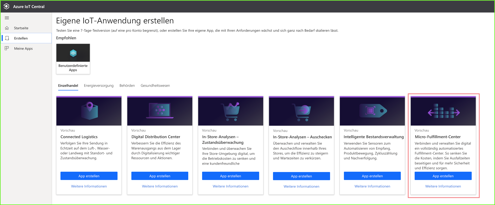
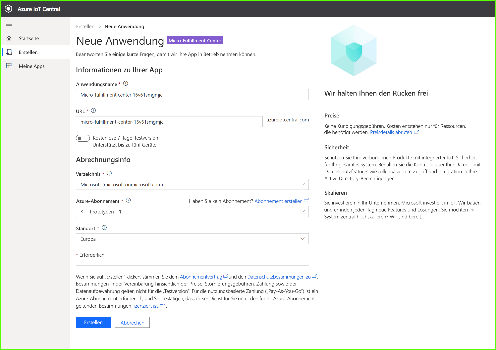
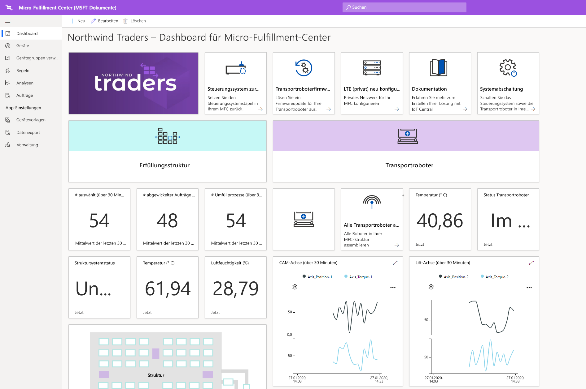
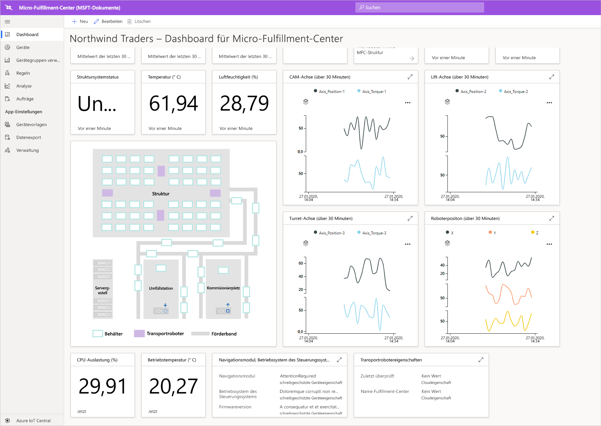
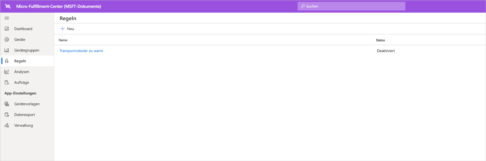
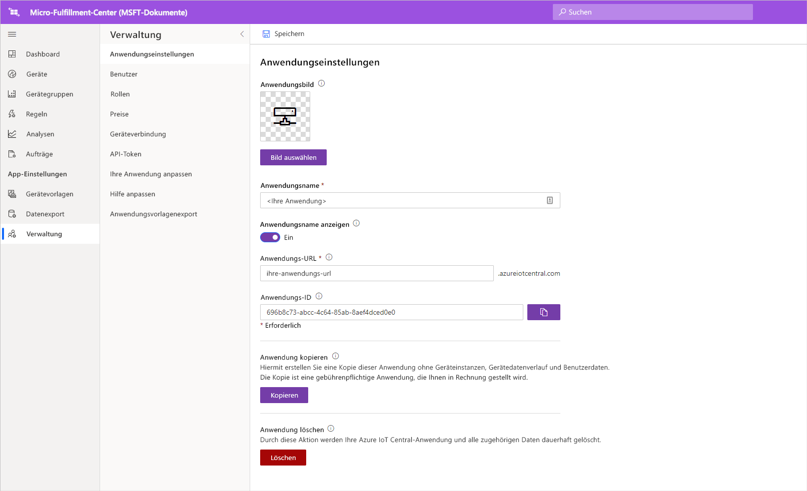

# Tutorial: Bereitstellen und Durchlaufen einer Anwendungsvorlage für Micro-Fulfillment-Center

In diesem Tutorial wird mithilfe der Micro-Fulfillment-Center-Anwendungsvorlage für Azure IoT Central eine Einzelhandelslösung erstellt. Dabei erfahren Sie, wie Sie die Vorlage bereitstellen, was in der Vorlage enthalten ist und welche nächsten Schritte sinnvoll sind.

## Voraussetzungen
Für diese Tutorialreihe benötigen Sie ein Azure-Abonnement. Optional können Sie eine kostenlose 7-Tage-Testversion verwenden. Wenn Sie kein Azure-Abonnement besitzen, können Sie auf der Seite [Azure-Anmeldeseite](https://aka.ms/createazuresubscription) eines erstellen.

## Erstellen einer Anwendung 
In diesem Abschnitt erstellen Sie eine neue Azure IoT Central-Anwendung aus einer Vorlage. Sie verwenden diese Anwendung in der gesamten Tutorialreihe, um eine umfassende Lösung zu erstellen.

So erstellen Sie eine neue Azure IoT Central-Anwendung:

1. Navigieren Sie zur [Anwendungs-Manager-Website von Azure IoT Central](https://aka.ms/iotcentral).
1. Wenn Sie über ein Azure-Abonnement verfügen, können Sie sich mit den zugehörigen Anmeldeinformationen anmelden. Melden Sie sich andernfalls mit einem Microsoft-Konto an:

   

1. Wählen Sie **Neue Anwendung** aus, um mit der Erstellung einer neuen Azure IoT Central-Anwendung zu beginnen.

1. Wählen Sie **Einzelhandel** aus.  Auf der Seite „Einzelhandel“ werden verschiedene Vorlagen für Einzelhandelsanwendungen angezeigt.

So erstellen Sie eine neue Micro-Fulfillment-Center-Anwendung mit Previewfunktionen:  
1. Wählen Sie die Anwendungsvorlage **Micro-Fulfillment-Center** aus. Diese Vorlage enthält Gerätevorlagen für alle im Tutorial verwendeten Geräte. Darüber hinaus stellt die Vorlage ein Operatordashboard zur Überwachung von Bedingungen innerhalb Ihres Fulfillment-Centers sowie zur Überwachung der Bedingungen für Ihre Transportroboter bereit. 

    
    
1. Wählen Sie optional einen benutzerfreundlichen **Anzeigenamen** aus. Die Anwendungsvorlage basiert auf dem fiktiven Unternehmen Northwind Traders. 

    >[!NOTE]
    >Wenn Sie einen benutzerfreundlichen Anwendungsnamen verwenden, müssen Sie trotzdem einen eindeutigen Wert für die Anwendungs-URL angeben.

1. Falls Sie über ein Azure-Abonnement verfügen, geben Sie Ihr Verzeichnis, Ihr Azure-Abonnement und Ihre Region ein. Andernfalls können Sie eine siebentägige kostenlose Testversion aktivieren und die erforderlichen Kontaktinformationen eingeben.  

    Weitere Informationen zu Verzeichnissen und Abonnements finden Sie in der Schnellstartanleitung unter [Erstellen einer Azure IoT Central-Anwendung](../preview/quick-deploy-iot-central.md).

1. Klicken Sie auf **Erstellen**.

    

## Einführung in die Anwendung 

Nach erfolgreicher Bereitstellung der App-Vorlage wird das **Micro-Fulfillment-Center-Dashboard für Northwind Traders** angezeigt. Northwind Traders ist ein fiktiver Einzelhändler, der über ein in dieser Azure IoT Central-Anwendung verwaltetes Micro-Fulfillment-Center verfügt. Dieses Operatordashboard enthält Informationen und Telemetriedaten zu den Geräten in dieser Vorlage sowie die verfügbaren Befehle, Aufträge und Aktionen. Das Dashboard ist logisch in zwei Abschnitte unterteilt. Auf der linken Seite können Sie die Umgebungsbedingungen innerhalb der Fulfillment-Struktur und auf der rechten Seite den Status eines Transportroboters in Ihrer Einrichtung überwachen.  

Das Dashboard ermöglicht Folgendes:
   * Anzeigen von Gerätetelemetriedaten (etwa die Anzahl von Entnahmen und verarbeiteten Aufträgen) und Eigenschaften (etwa den Struktursystemstatus)  
   * Anzeigen des Grundrisses und der Position der Transportroboter innerhalb der Fulfillment-Struktur
   * Auslösen von Befehlen – etwa zum Zurücksetzen des Steuerungssystems, zum Aktualisieren der Firmwareversion eines Transportroboters oder zum Ändern der Netzwerkkonfiguration

     
   * Betrachten eines Beispiels für das Dashboard, über das ein Operator die Bedingungen innerhalb des Fulfillment-Centers überwachen kann 
   * Überwachen der Integrität der Nutzlasten, die auf dem Gatewaygerät innerhalb des Fulfillment-Centers ausgeführt werden    

     

## Gerätevorlage
Wenn Sie die Registerkarte „Gerätevorlagen“ auswählen, werden für die Vorlage zwei unterschiedliche Gerätetypen angezeigt: 
   * **Robotic Carrier** (Transportroboter): Diese Gerätevorlage stellt die Definition eines funktionierenden Transportroboters dar, der in der Fulfillment-Struktur eingesetzt wird und ordnungsgemäß funktioniert. Wenn Sie die Vorlage auswählen, sehen Sie, dass von dem Roboter Gerätedaten wie Temperatur und Achsenposition sowie Eigenschaften wie etwa der Status des Transportroboters gesendet werden. 
   * **Structure Condition Monitoring** (Überwachung der Strukturbedingungen): Diese Gerätevorlage stellt eine Sammlung von Geräten dar, mit deren Hilfe Sie sowohl Umgebungsbedingungen als auch das Gatewaygerät überwachen können, von dem verschiedene Edgeworkloads für den Betrieb Ihres Fulfillment-Centers gehostet werden. Das Gerät sendet Telemetriedaten wie etwa die Temperatur, die Anzahl von Entnahmen und die Anzahl von Aufträgen. Darüber hinaus sendet es Informationen zum Zustand und zur Integrität der in Ihrer Umgebung ausgeführten Computeworkloads. 

     

Wenn Sie die Registerkarte „Gerätegruppen“ auswählen, sehen Sie auch, dass für diese Gerätevorlagen automatisch Gerätegruppen erstellt werden.

## Regeln
Auf der Registerkarte **Regeln** sehen Sie eine Beispielregel, die in der Anwendungsvorlage vorhanden ist, um die Temperaturbedingungen für den Transportroboter zu überwachen. Diese Regel kann verwendet werden, um den Operator zu benachrichtigen, wenn ein bestimmter Roboter in der Einrichtung zu heiß wird und zu Wartungszwecken offline geschaltet werden muss. 

Nutzen Sie die Beispielregel als Orientierungshilfe, um Regeln zu definieren, die besser zu Ihren geschäftlichen Funktionen passen.

## Bereinigen von Ressourcen

Falls Sie diese Anwendung nicht mehr benötigen, löschen Sie die Anwendungsvorlage. Navigieren Sie zu **Verwaltung** > **Anwendungseinstellungen**, und wählen Sie **Löschen** aus.

## Nächste Schritte
* Informieren Sie sich ausführlicher über die [Lösungsarchitektur von Micro-Fulfillment-Centern](./architecture-micro-fulfillment-center-pnp.md).
* Machen Sie sich mit anderen [Azure IoT Central-Einzelhandelsvorlagen](./overview-iot-central-retail-pnp.md) vertraut.
* Sehen Sie sich die [Übersicht über Azure IoT Central](../preview/overview-iot-central.md) an.
