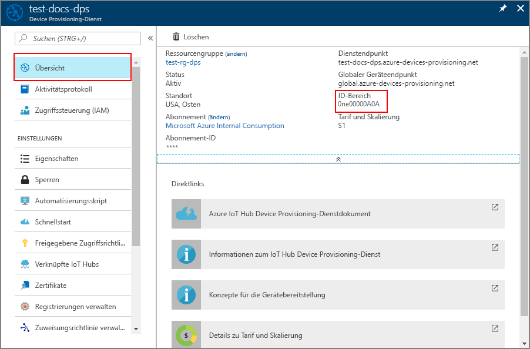

# <a name="how-to-use-custom-allocation-policies"></a>Verwenden benutzerdefinierter Zuweisungsrichtlinien

Mit einer Zuweisungsrichtlinie können Sie genauer steuern, wie Geräte einem IoT-Hub zugewiesen werden. Dazu werden Geräte mithilfe von benutzerdefiniertem Code in einer [Azure-Funktion](../azure-functions/functions-overview.md) einem IoT-Hub zugewiesen. Device Provisioning Service ruft Ihren Azure-Funktionscode auf und stellt alle relevanten Informationen zum Gerät und zur Registrierung bereit. Der Funktionscode wird ausgeführt und gibt die IoT Hub-Informationen für die Bereitstellung des Geräts zurück.

Sie definieren eigene benutzerdefinierte Zuweisungsrichtlinien, wenn die vom Device Provisioning Service bereitgestellten Richtlinien nicht die Anforderungen Ihres Szenarios erfüllen.

Beispielsweise möchten Sie eventuell das Zertifikat überprüfen, das während der Bereitstellung von einem Gerät verwendet wird, und das Gerät basierend auf einer Zertifikateigenschaft einem IoT-Hub zuweisen. Oder möglicherweise sind in einer Datenbank Informationen für die Geräte gespeichert, und Sie müssen die Datenbank abfragen, um zu bestimmen, welchem IOT-Hub ein Gerät zugewiesen werden soll.

In diesem Artikel wird eine benutzerdefinierte Zuweisungsrichtlinie mithilfe einer in C# geschriebenen Azure-Funktion veranschaulicht. Es werden zwei neue IoT-Hubs werden erstellt, die die *Contoso-Abteilung „Toaster“* und die *Contoso-Abteilung „Wärmepumpen“* darstellen. Für Geräte, deren Bereitstellung angefordert wird, ist eine Registrierungs-ID mit einem der folgenden Suffixe erforderlich, damit die Bereitstellung möglich ist:

* **-contoso-tstrsd-007**: Contoso-Abteilung „Toaster“
* **-contoso-hpsd-088**: Contoso-Abteilung „Wärmepumpen“

Die Geräte werden basierend auf einem dieser erforderlichen Suffixe der Registrierungs-ID bereitgestellt. Diese Geräte werden mit einem Bereitstellungsbeispiel simuliert, das im [Azure IoT C SDK](https://github.com/Azure/azure-iot-sdk-c) enthalten ist.

In diesem Artikel führen Sie die folgenden Schritte aus:

* Verwenden der Azure CLI zum Erstellen der beiden IoT-Hubs für die Contoso-Abteilungen (**Contoso-Abteilung „Toaster“** und **Contoso-Abteilung „Wärmepumpen“** )
* Erstellen einer neuen Gruppenregistrierung mithilfe einer Azure-Funktion für die benutzerdefinierte Zuweisungsrichtlinie
* Erstellen von Geräteschlüsseln für die beiden Gerätesimulationen
* Einrichten der Entwicklungsumgebung für das Azure IoT C SDK
* Simulieren der Geräte, um zu überprüfen, ob sie gemäß dem Beispielcode der benutzerdefinierten Zuweisungsrichtlinie bereitgestellt sind

[!INCLUDE [quickstarts-free-trial-note](../../includes/quickstarts-free-trial-note.md)]

## <a name="prerequisites"></a>Voraussetzungen

Die folgenden Voraussetzungen gelten für eine Windows-Entwicklungsumgebung. Informationen zu Linux oder macOS finden Sie in der SDK-Dokumentation im entsprechenden Abschnitt unter [Vorbereiten Ihrer Entwicklungsumgebung](https://github.com/Azure/azure-iot-sdk-c/blob/master/doc/devbox_setup.md).

* [Visual Studio](https://visualstudio.microsoft.com/vs/) 2019 mit der aktivierten Workload [„Desktopentwicklung mit C++“](https://docs.microsoft.com/cpp/?view=vs-2019#pivot=workloads). Visual Studio 2015 und Visual Studio 2017 werden ebenfalls unterstützt.

* Die neueste Version von [Git](https://git-scm.com/download/) ist installiert.

[!INCLUDE [cloud-shell-try-it.md](../../includes/cloud-shell-try-it.md)]

## <a name="create-the-provisioning-service-and-two-divisional-iot-hubs"></a>Erstellen des Bereitstellungsdiensts und zweier Abteilungs-IoT-Hubs

In diesem Abschnitt verwenden Sie Azure Cloud Shell zum Erstellen eines Bereitstellungsdiensts und von zwei IoT-Hubs, die die **Contoso-Abteilung „Toaster“** und die **Contoso-Abteilung „Wärmepumpen“** darstellen.

> [!TIP]
> Die in diesem Artikel verwendeten Befehle erstellen den Bereitstellungsdienst und andere Ressourcen am Standort „USA, Westen“. Es wird empfohlen, die Ressourcen in der nächstgelegenen Region zu erstellen, die den Device Provisioning-Dienst unterstützt. Sie können eine Liste mit den verfügbaren Standorten anzeigen. Führen Sie hierzu entweder den Befehl `az provider show --namespace Microsoft.Devices --query "resourceTypes[?resourceType=='ProvisioningServices'].locations | [0]" --out table` aus, oder navigieren Sie zur Seite [Azure-Status](https://azure.microsoft.com/status/), und suchen Sie nach „Device Provisioning-Dienst“. In Befehlen können Standorte entweder als einzelnes Wort oder mit mehreren Wörtern (beispielsweise „westus“, „West US“, „WEST US“ usw.) angegeben werden. Die Groß-/Kleinschreibung spielt hierbei keine Rolle. Wenn Sie den Standort in einem Format mit mehreren Wörtern angeben, müssen Sie den Wert in Anführungszeichen einschließen, wie im folgenden Beispiel zu sehen: `-- location "West US"`.
>

1. Erstellen Sie in Azure Cloud Shell mit dem Befehl [az group create](/cli/azure/group#az-group-create) eine Ressourcengruppe. Eine Azure-Ressourcengruppe ist ein logischer Container, in dem Azure-Ressourcen bereitgestellt und verwaltet werden.

    Im folgenden Beispiel wird eine Ressourcengruppe mit dem Namen *contoso-us-resource-group* in der Region *westus* erstellt. Es wird empfohlen, diese Gruppe für alle in diesem Artikel erstellten Ressourcen zu verwenden. Dies erleichtert das Bereinigen, nachdem Sie die Schritte in diesem Artikel ausgeführt haben.

    ```azurecli-interactive 
    az group create --name contoso-us-resource-group --location westus
    ```

2. Verwenden Sie Azure Cloud Shell zum Erstellen eines Device Provisioning-Diensts mit dem Befehl [az iot dps create](/cli/azure/iot/dps#az-iot-dps-create). Der Bereitstellungsdienst wird zu *contoso-us-resource-group* hinzugefügt.

    Im folgenden Beispiel wird am Standort *westus* ein Bereitstellungsdienst mit dem Namen *contoso-provisioning-service-1098* erstellt. Sie müssen einen eindeutigen Dienstnamen verwenden. Verwenden Sie im Dienstnamen ein eigenes Suffix anstelle von **1098**.

    ```azurecli-interactive 
    az iot dps create --name contoso-provisioning-service-1098 --resource-group contoso-us-resource-group --location westus
    ```

    Die Ausführung dieses Befehls kann einige Minuten in Anspruch nehmen.

3. Erstellen Sie in Azure Cloud Shell mit dem Befehl [az iot hub create](/cli/azure/iot/hub#az-iot-hub-create) den IoT-Hub für die **Contoso-Abteilung „Toaster“** . Der IoT-Hub wird zu *contoso-us-resource-group* hinzugefügt.

    Im folgenden Beispiel wird in der Region *westus* ein IoT-Hub mit dem Namen *contoso-toasters-hub-1098* erstellt. Sie müssen einen eindeutigen Hubnamen verwenden. Verwenden Sie im Hubnamen ein eigenes Suffix anstelle von **1098**. Im Beispielcode für die benutzerdefinierte Zuweisungsrichtlinie muss der Hubname `-toasters-` enthalten.

    ```azurecli-interactive 
    az iot hub create --name contoso-toasters-hub-1098 --resource-group contoso-us-resource-group --location westus --sku S1
    ```

    Die Ausführung dieses Befehls kann einige Minuten in Anspruch nehmen.

4. Erstellen Sie in Azure Cloud Shell mit dem Befehl [az iot hub create](/cli/azure/iot/hub#az-iot-hub-create) den IoT-Hub für die **Contoso-Abteilung „Wärmepumpen“** . Dieser IoT-Hub wird ebenfalls zu *contoso-us-resource-group* hinzugefügt.

    Im folgenden Beispiel wird in der Region *westus* ein IoT-Hub mit dem Namen *contoso-heatpumps-hub-1098* erstellt. Sie müssen einen eindeutigen Hubnamen verwenden. Verwenden Sie im Hubnamen ein eigenes Suffix anstelle von **1098**. Im Beispielcode für die benutzerdefinierte Zuweisungsrichtlinie muss der Hubname `-heatpumps-` enthalten.

    ```azurecli-interactive 
    az iot hub create --name contoso-heatpumps-hub-1098 --resource-group contoso-us-resource-group --location westus --sku S1
    ```

    Die Ausführung dieses Befehls kann einige Minuten in Anspruch nehmen.

## <a name="create-the-custom-allocation-function"></a>Erstellen der benutzerdefinierten Zuordnungsfunktion

In diesem Abschnitt erstellen Sie eine Azure-Funktion, die Ihre benutzerdefinierte Zuordnungsrichtlinie implementiert. Diese Funktion legt fest, bei welchem Abteilungs-IoT-Hub ein Gerät registriert werden soll, abhängig davon, ob die Registrierungs-ID die Zeichenfolge **-contoso-tstrsd-007** oder **-contoso-hpsd-088** enthält. Außerdem wird der Anfangszustand des Gerätezwillings festgelegt, je nachdem, ob es sich bei dem Gerät um einen Toaster oder eine Wärmepumpe handelt.

1. Melden Sie sich beim [Azure-Portal](https://portal.azure.com) an. Wählen Sie auf der Startseite **+ Ressource erstellen** aus.

2. Geben Sie im Suchfeld *Marketplace durchsuchen* „Funktions-App“ ein. Wählen Sie in der Dropdownliste **Funktions-App** aus, und wählen Sie dann **Erstellen**.

3. Geben Sie in **Funktions-App** auf der Seite „Erstellen“ auf der Registerkarte **Grundeinstellungen** die folgenden Einstellungen für die neue Funktions-App ein, und wählen Sie **Überprüfen + erstellen** aus:

    **Ressourcengruppe**: Wählen Sie **contoso-us-resource-group** aus, damit sich alle in diesem Artikel erstellten Ressourcen in derselben Gruppe befinden.

    **Name der Funktions-App**: Geben Sie einen eindeutigen Namen für die Funktions-App ein. In diesem Beispiel wird **contoso-function-app-1098** verwendet.

    **Veröffentlichen**: Vergewissern Sie sich, dass **Code** ausgewählt ist.

    **Laufzeitstapel**: Wählen Sie in der Dropdownliste **.NET Core** aus.

    **Region**: Wählen Sie die gleiche Region wie für Ihre Ressourcengruppe aus. In diesem Beispiel wird **USA, Westen** verwendet.

    > [!NOTE]
    > Application Insights ist standardmäßig aktiviert. Application Insights ist für diesen Artikel nicht erforderlich, kann jedoch hilfreich sein, um Probleme zu verstehen und zu untersuchen, die bei der benutzerdefinierten Zuordnung auftreten. Wenn Sie möchten, können Sie Application Insights deaktivieren, indem Sie die Registerkarte **Überwachung** auswählen und dann für **Application Insights aktivieren** die Option **Nein** wählen.

    

4. Wählen Sie auf der Seite **Zusammenfassung** die Option **Erstellen** aus, um die Funktions-App zu erstellen. Die Bereitstellung kann mehrere Minuten dauern. Wenn der Vorgang abgeschlossen ist, wählen Sie **Zu Ressource wechseln** aus.

5. Wählen Sie im linken Bereich der Seite **Zusammenfassung** für die Funktions-App **+** neben **Funktionen** aus, um eine neue Funktion hinzuzufügen.

    

6. Wählen Sie auf der Seite **Azure-Funktionen für .NET – Erste Schritte** für den Schritt **WÄHLEN SIE EINE BEREITSTELLUNGSUMGEBUNG AUS** die Kachel **Im Portal** aus, und wählen Sie dann **Weiter**.

    

7. Wählen Sie auf der nächsten Seite für den Schritt **FUNKTION ERSTELLEN** die Kachel **Webhook + API** aus, und wählen Sie dann **Erstellen**. Eine Funktion mit dem Namen **HttpTrigger1** wird erstellt, und im Portal wird der Inhalt der Codedatei **run.csx** angezeigt.

8. Verweisen Sie auf die erforderlichen NuGet-Pakete. Zum Erstellen des anfänglichen Gerätezwillings verwendet die benutzerdefinierte Zuordnungsfunktion Klassen, die in zwei NuGet-Paketen definiert sind, die in die Hostumgebung geladen werden müssen. In Azure Functions wird auf NuGet-Pakete mithilfe der Datei *function.host* verwiesen. In diesem Schritt speichern Sie die Datei *function.host* und laden sie hoch.

    1. Kopieren Sie die folgenden Zeilen in Ihren bevorzugten Editor, und speichern Sie die Datei unter dem Namen *function.host* auf Ihrem Computer.

        ```xml
        <Project Sdk="Microsoft.NET.Sdk">  
            <PropertyGroup>  
                <TargetFramework>netstandard2.0</TargetFramework>  
            </PropertyGroup>  
            <ItemGroup>  
                <PackageReference Include="Microsoft.Azure.Devices.Provisioning.Service" Version="1.5.0" />  
                <PackageReference Include="Microsoft.Azure.Devices.Shared" Version="1.16.0" />  
            </ItemGroup>  
        </Project>
        ```

    2. Erweitern Sie in der **HttpTrigger1**-Funktion auf der rechten Seite des Fensters die Registerkarte **Dateien anzeigen**.

        

    3. Wählen Sie **Hochladen** aus, navigieren Sie zur Datei **function.proj**, und wählen Sie **Öffnen**, um die Datei hochzuladen.

        

9. Ersetzen Sie den Code für die **HttpTrigger1**-Funktion durch den folgenden Code, und wählen Sie **Speichern** aus:

    ```csharp
    #r "Newtonsoft.Json"

    using System.Net;
    using Microsoft.AspNetCore.Mvc;
    using Microsoft.Extensions.Primitives;
    using Newtonsoft.Json;

    using Microsoft.Azure.Devices.Shared;               // For TwinCollection
    using Microsoft.Azure.Devices.Provisioning.Service; // For TwinState

    public static async Task<IActionResult> Run(HttpRequest req, ILogger log)
    {
        log.LogInformation("C# HTTP trigger function processed a request.");

        // Get request body
        string requestBody = await new StreamReader(req.Body).ReadToEndAsync();
        dynamic data = JsonConvert.DeserializeObject(requestBody);

        log.LogInformation("Request.Body:...");
        log.LogInformation(requestBody);

        // Get registration ID of the device
        string regId = data?.deviceRuntimeContext?.registrationId;

        string message = "Uncaught error";
        bool fail = false;
        ResponseObj obj = new ResponseObj();

        if (regId == null)
        {
            message = "Registration ID not provided for the device.";
            log.LogInformation("Registration ID : NULL");
            fail = true;
        }
        else
        {
            string[] hubs = data?.linkedHubs.ToObject<string[]>();

            // Must have hubs selected on the enrollment
            if (hubs == null)
            {
                message = "No hub group defined for the enrollment.";
                log.LogInformation("linkedHubs : NULL");
                fail = true;
            }
            else
            {
                // This is a Contoso Toaster Model 007
                if (regId.Contains("-contoso-tstrsd-007"))
                {
                    //Find the "-toasters-" IoT hub configured on the enrollment
                    foreach(string hubString in hubs)
                    {
                        if (hubString.Contains("-toasters-"))
                            obj.iotHubHostName = hubString;
                    }

                    if (obj.iotHubHostName == null)
                    {
                        message = "No toasters hub found for the enrollment.";
                        log.LogInformation(message);
                        fail = true;
                    }
                    else
                    {
                        // Specify the initial tags for the device.
                        TwinCollection tags = new TwinCollection();
                        tags["deviceType"] = "toaster";

                        // Specify the initial desired properties for the device.
                        TwinCollection properties = new TwinCollection();
                        properties["state"] = "ready";
                        properties["darknessSetting"] = "medium";

                        // Add the initial twin state to the response.
                        TwinState twinState = new TwinState(tags, properties);
                        obj.initialTwin = twinState;
                    }
                }
                // This is a Contoso Heat pump Model 008
                else if (regId.Contains("-contoso-hpsd-088"))
                {
                    //Find the "-heatpumps-" IoT hub configured on the enrollment
                    foreach(string hubString in hubs)
                    {
                        if (hubString.Contains("-heatpumps-"))
                            obj.iotHubHostName = hubString;
                    }

                    if (obj.iotHubHostName == null)
                    {
                        message = "No heat pumps hub found for the enrollment.";
                        log.LogInformation(message);
                        fail = true;
                    }
                    else
                    {
                        // Specify the initial tags for the device.
                        TwinCollection tags = new TwinCollection();
                        tags["deviceType"] = "heatpump";

                        // Specify the initial desired properties for the device.
                        TwinCollection properties = new TwinCollection();
                        properties["state"] = "on";
                        properties["temperatureSetting"] = "65";

                        // Add the initial twin state to the response.
                        TwinState twinState = new TwinState(tags, properties);
                        obj.initialTwin = twinState;
                    }
                }
                // Unrecognized device.
                else
                {
                    fail = true;
                    message = "Unrecognized device registration.";
                    log.LogInformation("Unknown device registration");
                }
            }
        }

        log.LogInformation("\nResponse");
        log.LogInformation((obj.iotHubHostName != null) ? JsonConvert.SerializeObject(obj) : message);

        return (fail)
            ? new BadRequestObjectResult(message) 
            : (ActionResult)new OkObjectResult(obj);
    }

    public class ResponseObj
    {
        public string iotHubHostName {get; set;}
        public TwinState initialTwin {get; set;}
    }
    ```

## <a name="create-the-enrollment"></a>Erstellen der Registrierung

In diesem Abschnitt erstellen Sie eine neue Registrierungsgruppe, von der die benutzerdefinierte Zuweisungsrichtlinie verwendet wird. Der Einfachheit halber wird in diesem Artikel ein [Nachweis des symmetrischen Schlüssels](concepts-symmetric-key-attestation.md) für die Registrierung verwendet. Für eine Lösung mit höherer Sicherheit empfiehlt sich die Verwendung eines [X.509-Zertifikatnachweises](concepts-security.md#x509-certificates) mit einer Kette von Vertrauensstellungen.

1. Öffnen Sie im [Azure-Portal](https://portal.azure.com) den Bereitstellungsdienst.

2. Wählen Sie im linken Bereich **Registrierungen verwalten** aus, und wählen Sie dann oben auf der Seite die Schaltfläche **Registrierungsgruppe hinzufügen**.

3. Geben Sie unter **Registrierungsgruppe hinzufügen** die folgenden Informationen ein, und wählen Sie die Schaltfläche **Speichern** aus.

    **Gruppenname**: Geben Sie **contoso-custom-allocated-devices** ein.

    **Nachweistyp**: Wählen Sie **Symmetrischer Schlüssel**.

    **Schlüssel automatisch generieren**: Dieses Kontrollkästchen sollte bereits aktiviert sein.

    **Wählen Sie, wie Geräte den Hubs zugewiesen werden sollen**: Wählen Sie **Benutzerdefiniert (Azure-Funktion verwenden)** .

    

4. Wählen Sie unter **Registrierungsgruppe hinzufügen** die Option **Neuen IoT-Hub verknüpfen** aus, um die beiden neuen IoT-Hubs für die Abteilungen zu verknüpfen.

    Führen Sie diesen Schritt für beide Abteilungs-IoT Hubs aus.

    **Abonnement**: Wenn Sie über mehrere Abonnements verfügen, sollten Sie das Abonnement auswählen, in dem Sie die IoT Hubs für die Abteilungen erstellt haben.

    **IoT-Hub**: Wählen Sie einen der von Ihnen erstellten Abteilungshubs aus.

    **Zugriffsrichtlinie**: Wählen Sie **iothubowner**.

    

5. Nachdem die beiden IoT-Hubs für die Abteilungen verknüpft wurden, müssen Sie sie unter **Registrierungsgruppe hinzufügen** wie unten gezeigt als IoT-Hub-Gruppe für die Registrierungsgruppe auswählen:

    

6. Scrollen Sie in **Registrierungsgruppe hinzufügen** nach unten zum Abschnitt **Azure-Funktions-App auswählen**, und wählen Sie die Funktions-App aus, die Sie im vorherigen Abschnitt erstellt haben. Wählen Sie dann die erstellte Funktion aus, und wählen Sie „Speichern“ aus, um die Registrierungsgruppe zu speichern.

    

7. Öffnen Sie die Registrierungsgruppe nach dem Speichern erneut, und notieren Sie sich den **Primärschlüssel**. Sie müssen die Registrierung speichern, damit die Schlüssel generiert werden. Mit diesem Schlüssel werden später eindeutige Geräteschlüssel für simulierte Geräte generiert.

## <a name="derive-unique-device-keys"></a>Ableiten eindeutiger Geräteschlüssel

In diesem Abschnitt erstellen Sie zwei eindeutige Geräteschlüssel. Ein Schlüssel wird für einen simulierten Toaster verwendet. Der andere Schlüssel wird für eine simulierte Wärmepumpe verwendet.

Sie verwenden zum Generieren des Geräteschlüssels den **Primärschlüssel**, den Sie zuvor notiert haben, um die [HMAC-SHA256](https://wikipedia.org/wiki/HMAC)-Verschlüsselung der Geräteregistrierungs-ID für jedes Gerät zu berechnen und das Ergebnis in das Base64-Format zu konvertieren. Weitere Informationen zum Erstellen von abgeleiteten Geräteschlüsseln mit Registrierungsgruppen finden Sie im Abschnitt Gruppenregistrierungen unter [Nachweis des symmetrischen Schlüssels](concepts-symmetric-key-attestation.md).

Verwenden Sie für das Beispiel in diesem Artikel die folgenden beiden Geräteregistrierungs-IDs, und berechnen Sie einen Geräteschlüssel für beide Geräte. Beide Registrierungs-IDs haben ein gültiges Suffix für den Beispielcode der benutzerdefinierten Zuweisungsrichtlinie:

* **breakroom499-contoso-tstrsd-007**
* **mainbuilding167-contoso-hpsd-088**

### <a name="linux-workstations"></a>Linux-Arbeitsstationen

Wenn Sie eine Linux-Arbeitsstation verwenden, können Sie die abgeleiteten Geräteschlüssel mit OpenSSL generieren, wie im folgenden Beispiel gezeigt.

1. Ersetzen Sie den Wert von **KEY** durch den **Primärschlüssel**, den Sie zuvor notiert haben.

    ```bash
    KEY=oiK77Oy7rBw8YB6IS6ukRChAw+Yq6GC61RMrPLSTiOOtdI+XDu0LmLuNm11p+qv2I+adqGUdZHm46zXAQdZoOA==

    REG_ID1=breakroom499-contoso-tstrsd-007
    REG_ID2=mainbuilding167-contoso-hpsd-088

    keybytes=$(echo $KEY | base64 --decode | xxd -p -u -c 1000)
    devkey1=$(echo -n $REG_ID1 | openssl sha256 -mac HMAC -macopt hexkey:$keybytes -binary | base64)
    devkey2=$(echo -n $REG_ID2 | openssl sha256 -mac HMAC -macopt hexkey:$keybytes -binary | base64)

    echo -e $"\n\n$REG_ID1 : $devkey1\n$REG_ID2 : $devkey2\n\n"
    ```

    ```bash
    breakroom499-contoso-tstrsd-007 : JC8F96eayuQwwz+PkE7IzjH2lIAjCUnAa61tDigBnSs=
    mainbuilding167-contoso-hpsd-088 : 6uejA9PfkQgmYylj8Zerp3kcbeVrGZ172YLa7VSnJzg=
    ```

### <a name="windows-based-workstations"></a>Windows-Arbeitsstationen

Wenn Sie eine Windows-Arbeitsstation verwenden, können Sie die abgeleiteten Geräteschlüssel mit PowerShell generieren, wie im folgenden Beispiel gezeigt.

1. Ersetzen Sie den Wert von **KEY** durch den **Primärschlüssel**, den Sie zuvor notiert haben.

    ```powershell
    $KEY='oiK77Oy7rBw8YB6IS6ukRChAw+Yq6GC61RMrPLSTiOOtdI+XDu0LmLuNm11p+qv2I+adqGUdZHm46zXAQdZoOA=='

    $REG_ID1='breakroom499-contoso-tstrsd-007'
    $REG_ID2='mainbuilding167-contoso-hpsd-088'

    $hmacsha256 = New-Object System.Security.Cryptography.HMACSHA256
    $hmacsha256.key = [Convert]::FromBase64String($key)
    $sig1 = $hmacsha256.ComputeHash([Text.Encoding]::ASCII.GetBytes($REG_ID1))
    $sig2 = $hmacsha256.ComputeHash([Text.Encoding]::ASCII.GetBytes($REG_ID2))
    $derivedkey1 = [Convert]::ToBase64String($sig1)
    $derivedkey2 = [Convert]::ToBase64String($sig2)

    echo "`n`n$REG_ID1 : $derivedkey1`n$REG_ID2 : $derivedkey2`n`n"
    ```

    ```powershell
    breakroom499-contoso-tstrsd-007 : JC8F96eayuQwwz+PkE7IzjH2lIAjCUnAa61tDigBnSs=
    mainbuilding167-contoso-hpsd-088 : 6uejA9PfkQgmYylj8Zerp3kcbeVrGZ172YLa7VSnJzg=
    ```

Die simulierten Geräte verwenden die abgeleiteten Geräteschlüssel mit der jeweiligen Registrierungs-ID für den Nachweis des symmetrischen Schlüssels.

## <a name="prepare-an-azure-iot-c-sdk-development-environment"></a>Vorbereiten einer Azure IoT C SDK-Entwicklungsumgebung

In diesem Abschnitt bereiten Sie die Entwicklungsumgebung vor, die zum Erstellen des [Azure IoT C SDK](https://github.com/Azure/azure-iot-sdk-c) verwendet wird. Das SDK enthält den Beispielcode für das simulierte Gerät. Dieses simulierte Gerät versucht, die Bereitstellung während seiner Startsequenz auszuführen.

In diesem Abschnitt wird eine Windows-Arbeitsstation vorausgesetzt. Ein Beispiel für Linux finden Sie in der Beschreibung der Einrichtung der virtuellen Computer in [Bereitstellen für Mehrinstanzenfähigkeit](how-to-provision-multitenant.md).

1. Laden Sie das [CMake-Buildsystem](https://cmake.org/download/) herunter.

    Wichtig: Die Voraussetzungen für Visual Studio (Visual Studio und die Workload „Desktopentwicklung mit C++“) müssen **vor** Beginn der Installation von `CMake` auf dem Computer installiert sein. Sobald die Voraussetzungen erfüllt sind und der Download überprüft wurde, installieren Sie das CMake-Buildsystem.

2. Suchen Sie den Tagnamen für das [aktuelle Release](https://github.com/Azure/azure-iot-sdk-c/releases/latest) des SDK.

3. Öffnen Sie eine Eingabeaufforderung oder die Git Bash-Shell. Führen Sie die folgenden Befehle zum Klonen des aktuellen Releases des [Azure IoT C SDK](https://github.com/Azure/azure-iot-sdk-c)-GitHub-Repositorys aus. Verwenden Sie das im vorherigen Schritt gefundene Tag als Wert für den Parameter `-b`:

    ```cmd/sh
    git clone -b <release-tag> https://github.com/Azure/azure-iot-sdk-c.git
    cd azure-iot-sdk-c
    git submodule update --init
    ```

    Sie sollten damit rechnen, dass die Ausführung dieses Vorgangs mehrere Minuten in Anspruch nimmt.

4. Erstellen Sie ein `cmake`-Unterverzeichnis im Stammverzeichnis des Git-Repositorys, und navigieren Sie zu diesem Ordner. Führen Sie die folgenden Befehle aus dem Verzeichnis `azure-iot-sdk-c` aus:

    ```cmd/sh
    mkdir cmake
    cd cmake
    ```

5. Erstellen Sie mithilfe des folgenden Befehls eine spezifische SDK-Version für Ihre Entwicklungsclientplattform: Im `cmake`-Verzeichnis wird eine Visual Studio-Projektmappe für das simulierte Gerät generiert. 

    ```cmd
    cmake -Dhsm_type_symm_key:BOOL=ON -Duse_prov_client:BOOL=ON  ..
    ```

    Wenn `cmake` Ihren C++-Compiler nicht findet, treten beim Ausführen des Befehls unter Umständen Buildfehler auf. Führen Sie den Befehl in diesem Fall an der [Visual Studio-Eingabeaufforderung](https://docs.microsoft.com/dotnet/framework/tools/developer-command-prompt-for-vs) aus.

    Nach erfolgreicher Erstellung ähneln die letzten Ausgabezeilen der folgenden Ausgabe:

    ```cmd/sh
    $ cmake -Dhsm_type_symm_key:BOOL=ON -Duse_prov_client:BOOL=ON  ..
    -- Building for: Visual Studio 15 2017
    -- Selecting Windows SDK version 10.0.16299.0 to target Windows 10.0.17134.
    -- The C compiler identification is MSVC 19.12.25835.0
    -- The CXX compiler identification is MSVC 19.12.25835.0

    ...

    -- Configuring done
    -- Generating done
    -- Build files have been written to: E:/IoT Testing/azure-iot-sdk-c/cmake
    ```

## <a name="simulate-the-devices"></a>Simulieren der Geräte

In diesem Abschnitt aktualisieren Sie ein Bereitstellungsbeispiel mit dem Namen **prov\_dev\_client\_sample** im Azure IoT C SDK, das Sie zuvor eingerichtet haben.

Dieser Beispielcode simuliert eine Gerätestartsequenz, von der die Bereitstellungsanforderung an die Instanz des Device Provisioning Service gesendet wird. Die Startsequenz bewirkt, dass der Toaster erkannt und mithilfe der benutzerdefinierten Zuweisungsrichtlinie dem IoT-Hub zugewiesen wird.

1. Navigieren Sie im Azure-Portal zur Registerkarte **Übersicht** für Ihren Device Provisioning Service, und notieren Sie sich den Wert unter **_ID-Bereich_** .

     

2. Öffnen Sie in Visual Studio die Projektmappendatei **azure_iot_sdks.sln**, die zuvor durch das Ausführen von CMake generiert wurde. Die Projektmappendatei befindet sich am folgenden Speicherort:

    ```
    azure-iot-sdk-c\cmake\azure_iot_sdks.sln
    ```

3. Navigieren Sie im Visual Studio-Fenster *Projektmappen-Explorer* zum Ordner **Provision\_Samples**. Erweitern Sie das Beispielprojekt mit dem Namen **prov\_dev\_client\_sample**. Erweitern Sie **Quelldateien**, und öffnen Sie **prov\_dev\_client\_sample.c**.

4. Suchen Sie die Konstante `id_scope`, und ersetzen Sie den Wert durch Ihren **ID-Bereich**-Wert, den Sie zuvor kopiert haben. 

    ```c
    static const char* id_scope = "0ne00002193";
    ```

5. Suchen Sie die Definition für die Funktion `main()` in der gleichen Datei. Stellen Sie sicher, dass die Variable `hsm_type` wie unten dargestellt auf `SECURE_DEVICE_TYPE_SYMMETRIC_KEY` festgelegt ist:

    ```c
    SECURE_DEVICE_TYPE hsm_type;
    //hsm_type = SECURE_DEVICE_TYPE_TPM;
    //hsm_type = SECURE_DEVICE_TYPE_X509;
    hsm_type = SECURE_DEVICE_TYPE_SYMMETRIC_KEY;
    ```

6. Klicken Sie mit der rechten Maustaste auf das Projekt **prov\_dev\_client\_sample**, und wählen Sie **Als Startprojekt festlegen** aus.

### <a name="simulate-the-contoso-toaster-device"></a>Simulieren des Contoso-Toasters

1. Suchen Sie zum Simulieren des Toasters nach dem Aufruf von `prov_dev_set_symmetric_key_info()` in **prov\_dev\_client\_sample.c**. Der Aufruf ist auskommentiert.

    ```c
    // Set the symmetric key if using they auth type
    //prov_dev_set_symmetric_key_info("<symm_registration_id>", "<symmetric_Key>");
    ```

    Heben Sie die Auskommentierung für den Funktionsaufruf auf, und ersetzen Sie die Platzhalterwerte (einschließlich der spitzen Klammern) durch die Registrierungs-ID für den Toaster und den von Ihnen zuvor generierten abgeleiteten Geräteschlüssel. Der unten angegebene Schlüsselwert **JC8F96eayuQwwz+PkE7IzjH2lIAjCUnAa61tDigBnSs=** dient nur als Beispiel.

    ```c
    // Set the symmetric key if using they auth type
    prov_dev_set_symmetric_key_info("breakroom499-contoso-tstrsd-007", "JC8F96eayuQwwz+PkE7IzjH2lIAjCUnAa61tDigBnSs=");
    ```

    Speichern Sie die Datei .

2. Wählen Sie im Visual Studio-Menü die Option **Debuggen** > **Starten ohne Debugging** aus, um die Projektmappe auszuführen. Wählen Sie in der Aufforderung zum erneuten Erstellen des Projekts **Ja** aus, um das Projekt vor der Ausführung neu zu erstellen.

    Die folgende Ausgabe ist ein Beispiel für einen erfolgreichen Start des Toasters und das Herstellen der Verbindung mit der Instanz des Bereitstellungsdiensts, die durch die benutzerdefinierte Zuweisungsrichtlinie dem IoT-Hub für den Toaster zugewiesen werden soll:

    ```cmd
    Provisioning API Version: 1.3.6

    Registering Device

    Provisioning Status: PROV_DEVICE_REG_STATUS_CONNECTED
    Provisioning Status: PROV_DEVICE_REG_STATUS_ASSIGNING
    Provisioning Status: PROV_DEVICE_REG_STATUS_ASSIGNING

    Registration Information received from service: contoso-toasters-hub-1098.azure-devices.net, deviceId: breakroom499-contoso-tstrsd-007

    Press enter key to exit:
    ```

### <a name="simulate-the-contoso-heat-pump-device"></a>Simulieren der Contoso-Wärmepumpe

1. Aktualisieren Sie zum Simulieren der Wärmepumpe den Aufruf von `prov_dev_set_symmetric_key_info()` in **prov\_dev\_client\_sample.c** erneut mit der Registrierungs-ID der Wärmepumpe und dem von Ihnen zuvor generierten abgeleiteten Geräteschlüssel. Der unten angegebene Schlüsselwert **6uejA9PfkQgmYylj8Zerp3kcbeVrGZ172YLa7VSnJzg=** dient ebenfalls nur als Beispiel.

    ```c
    // Set the symmetric key if using they auth type
    prov_dev_set_symmetric_key_info("mainbuilding167-contoso-hpsd-088", "6uejA9PfkQgmYylj8Zerp3kcbeVrGZ172YLa7VSnJzg=");
    ```

    Speichern Sie die Datei .

2. Wählen Sie im Visual Studio-Menü die Option **Debuggen** > **Starten ohne Debugging** aus, um die Projektmappe auszuführen. Wählen Sie in der Eingabeaufforderung zum Neuerstellen des Projekts **Ja**, um das Projekt vor der Ausführung neu zu erstellen.

    Die folgende Ausgabe ist ein Beispiel für einen erfolgreichen Start der Wärmepumpe und das Herstellen der Verbindung mit der Instanz des Bereitstellungsdiensts, die durch die benutzerdefinierte Zuweisungsrichtlinie dem IoT-Hub für die Contoso-Wärmepumpe zugewiesen werden soll:

    ```cmd
    Provisioning API Version: 1.3.6

    Registering Device

    Provisioning Status: PROV_DEVICE_REG_STATUS_CONNECTED
    Provisioning Status: PROV_DEVICE_REG_STATUS_ASSIGNING
    Provisioning Status: PROV_DEVICE_REG_STATUS_ASSIGNING

    Registration Information received from service: contoso-heatpumps-hub-1098.azure-devices.net, deviceId: mainbuilding167-contoso-hpsd-088

    Press enter key to exit:
    ```

## <a name="troubleshooting-custom-allocation-policies"></a>Behandeln von Problemen bei benutzerdefinierten Zuweisungsrichtlinien

Die folgende Tabelle enthält die erwarteten Szenarien und die resultierenden Fehlercodes, die Sie möglicherweise empfangen. Greifen Sie auf diese Tabelle zurück, um Fehler bei benutzerdefinierten Zuweisungsrichtlinien mit Azure Functions zu beheben.

| Szenario | Registrierungsergebnis des Provisioning Service | Ergebnisse des Bereitstellungs-SDK |
| -------- | --------------------------------------------- | ------------------------ |
| Der Webhook gibt „200 OK“ zurück, und „iotHubHostName“ ist auf einen gültigen IoT-Hub-Hostnamen festgelegt. | Ergebnisstatus: Zugewiesen  | Das SDK gibt „PROV_DEVICE_RESULT_OK“ zusammen mit Hubinformationen zurück. |
| Der Webhook gibt „200 OK“ zurück, und „iotHubHostName“ ist in der Antwort vorhanden, jedoch auf eine leere Zeichenfolge oder NULL festgelegt. | Ergebnisstatus: Fehler<br><br> Fehlercode: CustomAllocationIotHubNotSpecified (400208) | Das SDK gibt „PROV_DEVICE_RESULT_HUB_NOT_SPECIFIED“ zurück. |
| Der Webhook gibt „401 – Nicht autorisiert“ zurück. | Ergebnisstatus: Fehler<br><br>Fehlercode: CustomAllocationUnauthorizedAccess (400209) | Das SDK gibt „PROV_DEVICE_RESULT_UNAUTHORIZED“ zurück. |
| Es wurde eine individuelle Registrierung erstellt, um das Gerät zu deaktivieren. | Ergebnisstatus: Disabled | Das SDK gibt „PROV_DEVICE_RESULT_DISABLED“ zurück. |
| Der Webhook gibt einen Fehlercode > = 429 zurück. | Die Orchestrierung des DPS wird mehrmals wiederholt. Die Wiederholungsrichtlinie lautet derzeit:<br><br>&nbsp;&nbsp;– Wiederholungsanzahl: 10<br>&nbsp;&nbsp;– Anfängliches Intervall: 1 s<br>&nbsp;&nbsp;– Inkrement: 9 s | Das SDK ignoriert den Fehler und übermittelt im angegebenen Zeitraum eine weitere Statusabrufmeldung. |
| Der Webhook gibt einen anderen Statuscode zurück. | Ergebnisstatus: Fehler<br><br>Fehlercode: CustomAllocationFailed (400207) | Das SDK gibt „PROV_DEVICE_RESULT_DEV_AUTH_ERROR“ zurück. |

## <a name="clean-up-resources"></a>Bereinigen von Ressourcen

Wenn Sie die in diesem Artikel erstellten Ressourcen weiterverwenden möchten, können Sie sie beibehalten. Wenn Sie nicht beabsichtigen, die Ressourcen weiterzuverwenden, führen Sie die folgenden Schritte aus, um alle in diesem Artikel erstellten Ressourcen zu löschen und unnötige Kosten zu vermeiden.

Bei dieser Vorgehensweise wird davon ausgegangen, dass Sie alle in diesem Artikel verwendeten Ressourcen gemäß den Anweisungen in der Ressourcengruppe **contoso-us-resource-group** erstellt haben.

> [!IMPORTANT]
> Das Löschen einer Ressourcengruppe kann nicht rückgängig gemacht werden. Die Ressourcengruppe und alle darin enthaltenen Ressourcen werden unwiderruflich gelöscht. Achten Sie daher darauf, dass Sie nicht versehentlich die falsche Ressourcengruppe oder die falschen Ressourcen löschen. Wenn Sie die IoT Hub-Ressource in einer bereits vorhandenen Ressourcengruppe erstellt haben, die Ressourcen enthält, die Sie behalten möchten, löschen Sie nicht die Ressourcengruppe, sondern nur die IoT Hub-Ressource.
>

Löschen Sie die Ressourcengruppen wie folgt nach Namen:

1. Melden Sie sich beim [Azure-Portal](https://portal.azure.com) an, und klicken Sie auf **Ressourcengruppen**.

2. Geben Sie im Textfeld **Nach Name filtern...** den Namen der Ressourcengruppe ein, die Ihre Ressourcen enthält: **contoso-us-resource-group**. 

3. Wählen Sie in der Ergebnisliste rechts neben Ihrer Ressourcengruppe **...** und dann **Ressourcengruppe löschen** aus.

4. Sie werden aufgefordert, das Löschen der Ressourcengruppe zu bestätigen. Geben Sie den Namen Ihrer Ressourcengruppe zur Bestätigung erneut ein, und wählen Sie **Löschen** aus. Daraufhin werden die Ressourcengruppe und alle darin enthaltenen Ressourcen gelöscht.

## <a name="next-steps"></a>Nächste Schritte

* Weitere Informationen zur erneuten Bereitstellung finden Sie unter [IoT Hub Device-Konzepte für die erneute Bereitstellung](concepts-device-reprovision.md). 
* Weitere Informationen zum Aufheben der Bereitstellung finden Sie unter [Aufheben der Bereitstellung von Geräten, die zuvor automatisch bereitgestellt wurden](how-to-unprovision-devices.md). 
