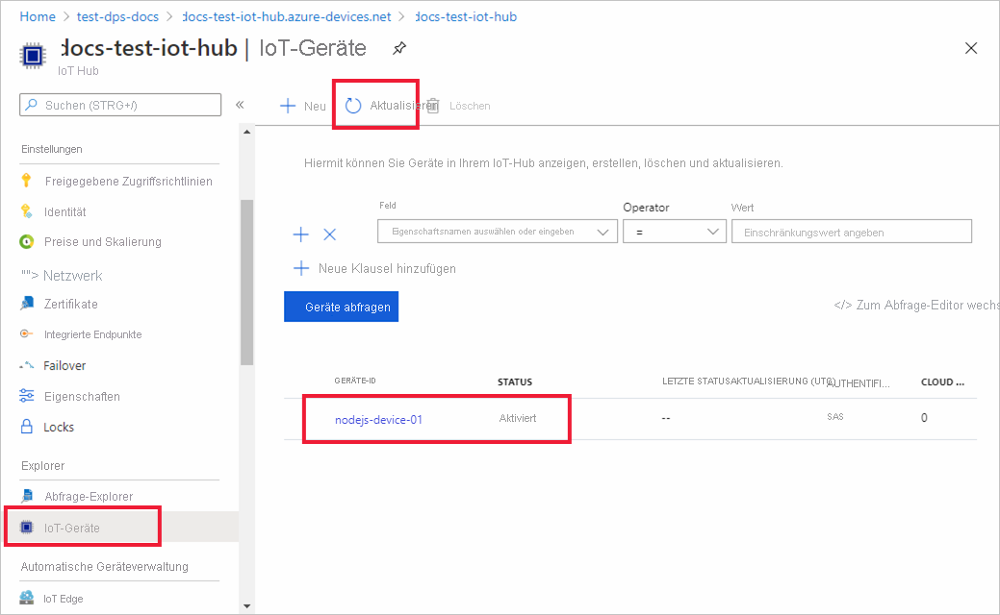

# <a name="quickstart-provision-a-symmetric-key-device-using-nodejs"></a>Schnellstart: Bereitstellen eines Geräts mit symmetrischem Schlüssel mithilfe von Node.js

In dieser Schnellstartanleitung erfahren Sie, wie Sie mithilfe von Node.js einen Windows-Entwicklungscomputer als Gerät für einen IoT-Hub bereitstellen. Dieses Gerät verwendet einen symmetrischen Schlüssel und eine individuelle Registrierung für die Authentifizierung bei einer Device Provisioning Service-Instanz (DPS-Instanz), damit es einem IoT-Hub zugewiesen werden kann. Zum Bereitstellen des Geräts wird Beispielcode aus dem [Azure IoT SDK für Node.js](https://github.com/Azure/azure-iot-sdk-node.git) verwendet. 

In diesem Artikel wird die Bereitstellung mit einer individuellen Registrierung erörtert. Sie können jedoch auch Registrierungsgruppen verwenden. Bei der Verwendung von Registrierungsgruppen gibt es einige Unterschiede. Sie müssen beispielsweise einen abgeleiteten Geräteschlüssel mit einer eindeutigen Registrierungs-ID für das Gerät verwenden. Unter [Bereitstellen von Geräten mit symmetrischen Schlüsseln für Registrierungsgruppen](how-to-legacy-device-symm-key.md) finden Sie ein Beispiel für eine Registrierungsgruppe. Weitere Informationen zu Registrierungsgruppen finden Sie unter [Gruppenregistrierungen](concepts-symmetric-key-attestation.md#group-enrollments).

Wenn Sie mit der automatischen Bereitstellung nicht vertraut sind, lesen Sie die Übersicht zur [Bereitstellung](about-iot-dps.md#provisioning-process). 

Vergewissern Sie sich außerdem, dass Sie die Schritte unter [Einrichten des IoT Hub Device Provisioning-Diensts über das Azure-Portal](./quick-setup-auto-provision.md) ausgeführt haben, bevor Sie mit dieser Schnellstartanleitung fortfahren. In dieser Schnellstartanleitung wird vorausgesetzt, dass Sie bereits eine Device Provisioning-Instanz erstellt haben.

In diesem Artikel wird von der Nutzung einer Windows-Arbeitsstation ausgegangen. Allerdings können Sie die Verfahren auch unter Linux ausführen. Ein Beispiel für Linux finden Sie unter [Bereitstellen für Mehrinstanzenfähigkeit](how-to-provision-multitenant.md).


[!INCLUDE [quickstarts-free-trial-note](../../includes/quickstarts-free-trial-note.md)]


## <a name="prerequisites"></a>Voraussetzungen

- Kenntnisse über [Bereitstellungskonzepte](about-iot-dps.md#provisioning-process)
- Ausführung der Schritte unter [Einrichten des IoT Hub Device Provisioning-Diensts über das Azure-Portal](./quick-setup-auto-provision.md).
- Ein Azure-Konto mit einem aktiven Abonnement. [Erstellen Sie ein kostenloses Konto.](https://azure.microsoft.com/free/?ref=microsoft.com&utm_source=microsoft.com&utm_medium=docs&utm_campaign=visualstudio)
- [Node.js v4.0+](https://nodejs.org).
- [Git](https://git-scm.com/download/).


## <a name="create-a-device-enrollment"></a>Erstellen einer Geräteregistrierung

1. Melden Sie sich beim [Azure-Portal](https://portal.azure.com) an, wählen Sie im Menü links die Schaltfläche **Alle Ressourcen** aus, und öffnen Sie Ihre Device Provisioning Service-Instanz (DPS).

2. Wählen Sie die Registerkarte **Registrierungen verwalten** und dann oben die Schaltfläche **Individuelle Registrierung hinzufügen** aus. 

3. Geben Sie im Bereich **Registrierung hinzufügen** die folgenden Informationen ein, und wählen Sie die Schaltfläche **Speichern** aus.

   - **Mechanismus** : Wählen Sie **Symmetrischer Schlüssel** als *Mechanismus* für den Nachweis der Identität aus.

   - **Schlüssel automatisch generieren:** Aktivieren Sie dieses Kontrollkästchen.

   - **Registrierungs-ID** : Geben Sie eine Registrierungs-ID ein, um die Registrierung zu identifizieren. Verwenden Sie nur Kleinbuchstaben und Bindestriche („-“). Beispiel: **symm-key-nodejs-device-01**

   - **IoT Hub-Geräte-ID** : Geben Sie einen Gerätebezeichner ein. Beispiel: **nodejs-device-01**

     

4. Nachdem Sie Ihre Registrierung gespeichert haben, werden der **Primärschlüssel** und der **Sekundärschlüssel** generiert und dem Registrierungseintrag hinzugefügt. Die Registrierung Ihres Geräts mit symmetrischem Schlüssel wird auf der Registerkarte *Individuelle Registrierungen* in der Spalte *Registrierungs-ID* als **symm-key-nodejs-device-01** angezeigt. 

5. Öffnen Sie die Registrierung, und kopieren Sie den Wert des von Ihnen generierten **Primärschlüssels**. Sie verwenden diesen Schlüsselwert und die **Registrierungs-ID** später, wenn Sie Umgebungsvariablen zur Verwendung mit dem Beispielcode für die Gerätebereitstellung hinzufügen.


## <a name="prepare-the-nodejs-environment"></a>Vorbereiten der Node.js-Umgebung 

1. Öffnen Sie eine Git CMD- oder Git Bash-Befehlszeilenumgebung. Klonen Sie mithilfe des folgenden Befehls das GitHub-Repository mit dem [Azure IoT SDK für Node.js](https://github.com/Azure/azure-iot-sdk-node.git):

    ```cmd
    git clone https://github.com/Azure/azure-iot-sdk-node.git --recursive
    ```


<a id="firstbootsequence"></a>

## <a name="prepare-the-device-provisioning-code"></a>Vorbereiten des Gerätebereitstellungscodes

In diesem Abschnitt fügen Sie die folgenden vier Umgebungsvariablen hinzu, die als Parameter für den Beispielcode der Gerätebereitstellung zum Bereitstellen Ihres Geräts mit symmetrischem Schlüssel verwendet werden. 

* `PROVISIONING_HOST`
* `PROVISIONING_IDSCOPE`
* `PROVISIONING_REGISTRATION_ID`
* `PROVISIONING_SYMMETRIC_KEY`

Der Bereitstellungscode kontaktiert die DPS-Instanz basierend auf diesen Variablen, um Ihr Gerät zu authentifizieren. Anschließend wird das Gerät basierend auf der Konfiguration der individuellen Registrierung einem bereits mit der DPS-Instanz verknüpften IoT-Hub zugewiesen. Nach der Bereitstellung sendet der Beispielcode einige Testtelemetriedaten an den IoT-Hub.

1. Wählen Sie im [Azure-Portal](https://portal.azure.com) im Device Provisioning Service-Menü die Option **Übersicht** aus, und kopieren Sie Ihren _Dienstendpunkt_ und den _ID-Bereich_. Sie verwenden diese Werte für die Umgebungsvariablen `PROVISIONING_HOST` und `PROVISIONING_IDSCOPE`.

    

2. Öffnen Sie eine Eingabeaufforderung für die Ausführung von Node.js-Befehlen, und navigieren Sie zum folgenden Verzeichnis *provisioning/device/samples*.

    ```cmd
    cd azure-iot-sdk-node/provisioning/device/samples
    ```

3. Öffnen Sie im Ordner *provisioning/device/samples* die Datei *register_symkey.js* , und überprüfen Sie den Code. 

    Beachten Sie, dass der Beispielcode benutzerdefinierte Nutzdaten festlegt:

    ```nodejs
    provisioningClient.setProvisioningPayload({a: 'b'});
    ```

    Dieser Code wird in dieser Schnellstartanleitung nicht benötigt. Der Code ist ein Beispiel für das Festlegen von benutzerdefinierten Nutzdaten, wenn Sie eine benutzerdefinierte Zuordnungsfunktion verwenden möchten, um Ihr Gerät einer IoT Hub-Instanz zuzuweisen. Weitere Informationen finden Sie im [Tutorial: Verwenden benutzerdefinierter Zuordnungsrichtlinien](tutorial-custom-allocation-policies.md).

    Mit der Methode `provisioningClient.register()` wird die Registrierung Ihres Geräts versucht.

    Zum Registrieren Ihres Geräts sind keine Änderungen am Beispielcode erforderlich.

4. Fügen Sie in der Eingabeaufforderung die Umgebungsvariablen für den Bereitstellungshost, den ID-Bereich, die Registrierungs-ID und den primären symmetrischen Schlüssel hinzu, die Sie im vorherigen Abschnitt aus der individuellen Registrierung kopiert haben.  

    Die folgenden Befehle dienen als Beispiele, um die Befehlssyntax aufzuzeigen. Stellen Sie sicher, dass Sie die richtigen Werte verwenden.

    ```console
    set PROVISIONING_HOST=test-dps-docs.azure-devices-provisioning.net
    ```

    ```console
    set PROVISIONING_IDSCOPE=0ne00000A0A
    ```

    ```console
    set PROVISIONING_REGISTRATION_ID=symm-key-nodejs-device-01
    ```

    ```console
    set PROVISIONING_SYMMETRIC_KEY=sbDDeEzRuEuGKag+kQKV+T1QGakRtHpsERLP0yPjwR93TrpEgEh/Y07CXstfha6dhIPWvdD1nRxK5T0KGKA+nQ==
    ```


4. Erstellen Sie den Code, und führen Sie ihn mithilfe der folgenden Befehle aus:

    ```console
    npm install
    ```

    ```console
    node register_symkey.js
    ```

5. Die erwartete Ausgabe sollte in etwa der im folgenden Screenshot dargestellten Ausgabe entsprechen. Darin ist der verknüpfte IoT-Hub enthalten, dem das Gerät basierend auf den Einstellungen der individuellen Registrierung zugewiesen wurde. Die Zeichenfolge „Hallo Welt“ wird als Testnachricht an den Hub gesendet:

    ```output
    D:\Docs\test\azure-iot-sdk-node\provisioning\device\samples>node register_symkey.js
    registration succeeded
    assigned hub=docs-test-iot-hub.azure-devices.net
    deviceId=nodejs-device-01
    payload=undefined
    Client connected
    send status: MessageEnqueued    
    ```
    
6. Navigieren Sie im Azure-Portal zu dem mit Ihrem Bereitstellungsdienst verknüpften IoT-Hub, und öffnen Sie das Blatt **IoT-Geräte**. Nach der erfolgreichen Bereitstellung des Geräts mit symmetrischen Schlüssel für den Hub wird die Geräte-ID mit dem *STATUS* **Aktiviert** angezeigt. Wenn Sie das Blatt bereits vor dem Ausführen des Gerätebeispielcodes geöffnet haben, müssen Sie möglicherweise im oberen Bereich auf die Schaltfläche **Aktualisieren** klicken. 

     

> [!NOTE]
> Wenn Sie den *anfänglichen Gerätezwillingsstatus* im Registrierungseintrag für Ihr Gerät gegenüber dem Standardwert geändert haben, kann der gewünschte Zwillingsstatus vom Hub abgerufen werden, und es können entsprechende Aktionen durchgeführt werden. Weitere Informationen finden Sie unter [Verstehen und Verwenden von Gerätezwillingen in IoT Hub](../iot-hub/iot-hub-devguide-device-twins.md).
>


## <a name="clean-up-resources"></a>Bereinigen von Ressourcen

Wenn Sie das Geräteclientbeispiel weiterhin verwenden und erkunden möchten, überspringen Sie die Bereinigung der in diesem Schnellstart erstellten Ressourcen. Falls Sie nicht fortfahren möchten, führen Sie die folgenden Schritte aus, um alle Ressourcen zu löschen, die im Rahmen dieses Schnellstarts erstellt wurden.

1. Wählen Sie im Azure-Portal im Menü links **Alle Ressourcen** und dann Ihren Gerätebereitstellungsdienst aus. Öffnen Sie **Registrierungen verwalten** für Ihren Dienst, und wählen Sie dann die Registerkarte **Individuelle Registrierungen** aus. Aktivieren Sie das Kontrollkästchen *REGISTRIERUNGS-ID* für das Gerät, das Sie in diesem Schnellstart registriert haben, und wählen Sie oben im Bereich die Schaltfläche **Löschen** aus. 
1. Wählen Sie im linken Menü im Azure-Portal **Alle Ressourcen** und dann Ihren IoT-Hub aus. Öffnen Sie **IoT-Geräte** für Ihren Hub, aktivieren Sie das Kontrollkästchen der *Geräte-ID* des Geräts, das Sie in diesem Schnellstart registriert haben, und wählen Sie dann die Schaltfläche **Löschen** am oberen Rand des Bereichs aus.

## <a name="next-steps"></a>Nächste Schritte

In diesem Schnellstart haben Sie mithilfe von IoT Hub Device Provisioning Service ein Windows-basiertes Gerät mit symmetrischem Schlüssel für Ihren IoT-Hub bereitgestellt. Wenn Sie erfahren möchten, wie Sie mithilfe von Node.js Geräte mit X.509-Zertifikat bereitstellen, lesen Sie die folgende Schnellstartanleitung für X.509-Geräte: 

> [!div class="nextstepaction"]
> [Schnellstart: Erstellen und Bereitstellen eines simulierten X.509-Geräts mithilfe des Node.js-Geräte-SDK für den IoT Hub Device Provisioning-Dienst](quick-create-simulated-device-x509-node.md)
