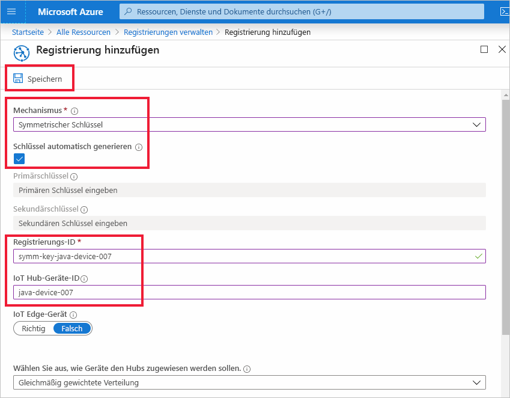
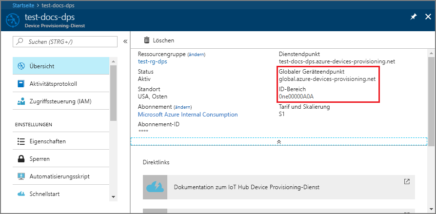
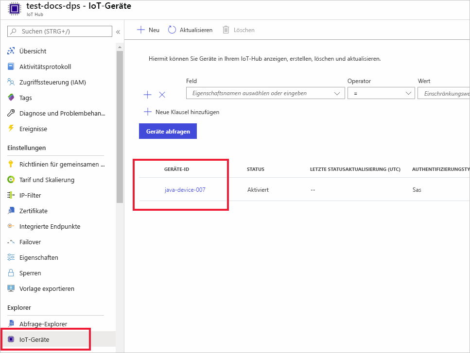

# <a name="quickstart-provision-a-simulated-device-to-iot-hub-with-symmetric-keys"></a>Schnellstart: Bereitstellen eines simulierten Geräts in IoT Hub mit symmetrischen Schlüsseln

In dieser Schnellstartanleitung erfahren Sie, wie Sie einen Gerätesimulator auf einem Windows-Entwicklungscomputer erstellen und ausführen. Sie konfigurieren dieses simulierte Gerät so, dass es zum Authentifizieren bei einer Device Provisioning Service-Instanz (DPS) einen symmetrischen Schlüssel verwendet und einem IoT Hub zugewiesen wird. Beispielcode aus den [Microsoft Azure IoT SDKs für Java](https://github.com/Azure/azure-iot-sdk-java) wird verwendet, um eine Startsequenz für das Gerät zu simulieren, mit der die Bereitstellung eingeleitet wird. Das Gerät wird anhand der individuellen Registrierung bei einer DPS-Instanz erkannt und einem IoT-Hub zugeordnet.

In diesem Artikel wird zwar die Bereitstellung mit einer individuellen Registrierung gezeigt, Sie können jedoch auch Registrierungsgruppen verwenden. Bei der Verwendung von Registrierungsgruppen gibt es einige Unterschiede. Sie müssen beispielsweise einen abgeleiteten Geräteschlüssel mit einer eindeutigen Registrierungs-ID für das Gerät verwenden. Obwohl Registrierungsgruppen mit symmetrischem Schlüssel nicht auf veraltete Geräte begrenzt sind, enthält [Bereitstellen veralteter Geräte mit Nachweis durch symmetrischen Schlüssel](how-to-legacy-device-symm-key.md) ein Beispiel für eine Registrierungsgruppe. Weitere Informationen finden Sie unter [Gruppenregistrierungen für Nachweis des symmetrischen Schlüssels](concepts-symmetric-key-attestation.md#group-enrollments).

Wenn Sie mit der automatischen Bereitstellung nicht vertraut sind, lesen Sie die Übersicht zur [Bereitstellung](about-iot-dps.md#provisioning-process). 

Vergewissern Sie sich außerdem, dass Sie die Schritte unter [Einrichten des IoT Hub Device Provisioning-Diensts über das Azure-Portal](./quick-setup-auto-provision.md) ausgeführt haben, bevor Sie mit dieser Schnellstartanleitung fortfahren. In dieser Schnellstartanleitung wird vorausgesetzt, dass Sie bereits eine Device Provisioning-Instanz erstellt haben.

In diesem Artikel wird von der Nutzung einer Windows-Arbeitsstation ausgegangen. Allerdings können Sie die Verfahren auch unter Linux ausführen. Ein Beispiel für Linux finden Sie unter [Bereitstellen für Mehrinstanzenfähigkeit](how-to-provision-multitenant.md).


[!INCLUDE [quickstarts-free-trial-note](../../includes/quickstarts-free-trial-note.md)]


## <a name="prerequisites"></a>Voraussetzungen

* Vergewissern Sie sich, dass das [Java SE Development Kit 8](/azure/developer/java/fundamentals/java-jdk-long-term-support) (oder höher) auf Ihrem Computer installiert ist.

* Laden Sie [Maven](https://maven.apache.org/install.html) herunter, und installieren Sie es.

* Die neueste Version von [Git](https://git-scm.com/download/) ist installiert.

<a id="setupdevbox"></a>

## <a name="prepare-the-java-sdk-environment"></a>Vorbereiten der Java-SDK-Umgebung 

1. Vergewissern Sie sich, dass Git auf Ihrem Computer installiert ist und den Umgebungsvariablen hinzugefügt wurde, auf die das Befehlsfenster Zugriff hat. Unter [Git-Clienttools von Software Freedom Conservancy](https://git-scm.com/download/) finden Sie die neueste Version der zu installierenden `git`-Tools. Hierzu zählt auch die Befehlszeilen-App **Git Bash**, über die Sie mit Ihrem lokalen Git-Repository interagieren können. 

2. Öffnen Sie eine Eingabeaufforderung. Klonen Sie das GitHub-Repository mit dem Codebeispiel für die Gerätesimulation:
    
    ```cmd/sh
    git clone https://github.com/Azure/azure-iot-sdk-java.git --recursive
    ```
3. Navigieren Sie zum Stammverzeichnis `azure-iot-sdk-java`, und erstellen Sie das Projekt, um alle erforderlichen Pakete herunterzuladen.
   
   ```cmd/sh
   cd azure-iot-sdk-java
   mvn install -DskipTests=true
   ```

## <a name="create-a-device-enrollment"></a>Erstellen einer Geräteregistrierung

1. Melden Sie sich beim [Azure-Portal](https://portal.azure.com) an, wählen Sie im Menü links die Schaltfläche **Alle Ressourcen** aus, und öffnen Sie Ihre Device Provisioning Service-Instanz (DPS).

2. Wählen Sie die Registerkarte **Registrierungen verwalten** und dann oben die Schaltfläche **Individuelle Registrierung hinzufügen** aus. 

3. Geben Sie im Bereich **Registrierung hinzufügen** die folgenden Informationen ein, und wählen Sie die Schaltfläche **Speichern** aus.

   - **Mechanismus**: Wählen Sie **Symmetrischer Schlüssel** als *Mechanismus* für den Nachweis der Identität aus.

   - **Schlüssel automatisch generieren:** Aktivieren Sie dieses Kontrollkästchen.

   - **Registrierungs-ID**: Geben Sie eine Registrierungs-ID ein, um die Registrierung zu identifizieren. Verwenden Sie nur Kleinbuchstaben und Bindestriche („-“). Beispiel: **symm-key-java-device-007**.

   - **IoT Hub-Geräte-ID**: Geben Sie einen Gerätebezeichner ein. Beispiel: **java-device-007**.

     

4. Nachdem Sie Ihre Registrierung gespeichert haben, werden der **Primärschlüssel** und der **Sekundärschlüssel** generiert und dem Registrierungseintrag hinzugefügt. Die Registrierung Ihres Geräts mit symmetrischem Schlüssel wird als **symm-key-java-device-007** auf der Registerkarte *Individuelle Registrierungen* in der Spalte *Registrierungs-ID* angezeigt. 

    Öffnen Sie die Registrierung, und kopieren Sie den Wert des von Ihnen generierten **Primärschlüssels**. Sie verwenden diesen Schlüsselwert und die **Registrierungs-ID** später, wenn Sie den Java-Code für das Gerät aktualisieren.


<a id="firstbootsequence"></a>

## <a name="simulate-device-boot-sequence"></a>Simulieren der Gerätestartsequenz

In diesem Abschnitt aktualisieren Sie den Beispielcode, um die Startsequenz des Geräts an Ihre DPS-Instanz zu senden. Diese Startsequenz bewirkt, dass das Gerät erkannt, authentifiziert und einem IoT-Hub zugewiesen wird, der mit der DPS-Instanz verknüpft ist.

1. Wählen Sie im Device Provisioning Service-Menü die Option **Übersicht** aus, und notieren Sie sich den _ID-Bereich_ und den _globalen Endpunkt für den Bereitstellungsdienst_.

    

2. Öffnen Sie den Beispielcode für das Java-Gerät zur Bearbeitung. Der vollständige Pfad zum Beispielcode für das Gerät lautet:

    `azure-iot-sdk-java/provisioning/provisioning-samples/provisioning-symmetrickey-sample/src/main/java/samples/com/microsoft/azure/sdk/iot/ProvisioningSymmetricKeySampleSample.java`

   - Fügen Sie Ihrer DPS-Instanz den _ID-Bereich_ und den _globalen Endpunkt für den Bereitstellungsdienst_ hinzu. Fügen Sie außerdem den primären symmetrischen Schlüssel und die Registrierungs-ID ein, die Sie für Ihre individuelle Registrierung ausgewählt haben. Speichern Sie die Änderungen. 

      ```java
        private static final String SCOPE_ID = "[Your scope ID here]";
        private static final String GLOBAL_ENDPOINT = "[Your Provisioning Service Global Endpoint here]";
        private static final String SYMMETRIC_KEY = "[Enter your Symmetric Key here]";
        private static final String REGISTRATION_ID = "[Enter your Registration ID here]";
      ```

3. Öffnen Sie eine Eingabeaufforderung für den Buildvorgang. Navigieren Sie zum Projektordner mit dem Bereitstellungsbeispiel im Java-SDK-Repository.

    ```cmd/sh
    cd azure-iot-sdk-java/provisioning/provisioning-samples/provisioning-symmetrickey-sample
    ```

4. Führen Sie den Buildvorgang für das Beispiel durch, und navigieren Sie dann zum Ordner `target`, um die erstellte JAR-Datei auszuführen.

    ```cmd/sh
    mvn clean install
    cd target
    java -jar ./provisioning-symmetrickey-sample-{version}-with-deps.jar
    ```

5. Die erwartete Ausgabe sollte in etwa wie folgt aussehen:

    ```cmd/sh
      Starting...
      Beginning setup.
      Waiting for Provisioning Service to register
      IotHUb Uri : <Your DPS Service Name>.azure-devices.net
      Device ID : java-device-007
      Sending message from device to IoT Hub...
      Press any key to exit...
      Message received! Response status: OK_EMPTY
    ```

6. Navigieren Sie im Azure-Portal zu der IoT Hub-Instanz, die mit Ihrem Bereitstellungsdienst verknüpft ist, und öffnen Sie das Blatt **Device Explorer**. Nach der erfolgreichen Bereitstellung des Geräts mit symmetrischem Schlüssel auf dem Hub wird die zugehörige Geräte-ID auf dem Blatt **Device Explorer** angezeigt, und der *STATUS* lautet **Aktiviert**.  Falls das Blatt bereits vor dem Ausführen der Beispielgeräteanwendung geöffnet war, müssen Sie unter Umständen im oberen Bereich auf die Schaltfläche **Aktualisieren** klicken. 

     

> [!NOTE]
> Wenn Sie den *anfänglichen Gerätezwillingsstatus* im Registrierungseintrag für Ihr Gerät gegenüber dem Standardwert geändert haben, kann der gewünschte Zwillingsstatus vom Hub abgerufen werden, und es können entsprechende Aktionen durchgeführt werden. Weitere Informationen finden Sie unter [Verstehen und Verwenden von Gerätezwillingen in IoT Hub](../iot-hub/iot-hub-devguide-device-twins.md).
>


## <a name="clean-up-resources"></a>Bereinigen von Ressourcen

Wenn Sie das Geräteclientbeispiel weiterhin verwenden und erkunden möchten, überspringen Sie die Bereinigung der in diesem Schnellstart erstellten Ressourcen. Falls Sie nicht fortfahren möchten, führen Sie die folgenden Schritte aus, um alle Ressourcen zu löschen, die im Rahmen dieses Schnellstarts erstellt wurden.

1. Schließen Sie auf Ihrem Computer das Ausgabefenster des Geräteclientbeispiels.
1. Wählen Sie im Azure-Portal im Menü links **Alle Ressourcen** und dann Ihren Gerätebereitstellungsdienst aus. Öffnen Sie **Registrierungen verwalten** für Ihren Dienst, und wählen Sie dann die Registerkarte **Individuelle Registrierungen** aus. Aktivieren Sie das Kontrollkästchen *REGISTRIERUNGS-ID* für das Gerät, das Sie in diesem Schnellstart registriert haben, und wählen Sie oben im Bereich die Schaltfläche **Löschen** aus. 
1. Wählen Sie im linken Menü im Azure-Portal **Alle Ressourcen** und dann Ihren IoT-Hub aus. Öffnen Sie **IoT-Geräte** für Ihren Hub, aktivieren Sie das Kontrollkästchen der *Geräte-ID* des Geräts, das Sie in diesem Schnellstart registriert haben, und wählen Sie dann die Schaltfläche **Löschen** am oberen Rand des Bereichs aus.

## <a name="next-steps"></a>Nächste Schritte

In diesem Schnellstart haben Sie auf Ihrem Windows-Computer ein simuliertes Gerät erstellt und im Portal mit dem symmetrischen Schlüssel mithilfe von Azure IoT Hub Device Provisioning Service für Ihren IoT-Hub bereitgestellt. Informationen zum programmgesteuerten Registrieren Ihres Geräts finden Sie im Schnellstart für die programmgesteuerte Registrierung von X.509-Geräten. 

> [!div class="nextstepaction"]
> [Azure-Schnellstart: Registrieren von X.509-Geräten bei Azure IoT Hub Device Provisioning Service](quick-enroll-device-x509-java.md)