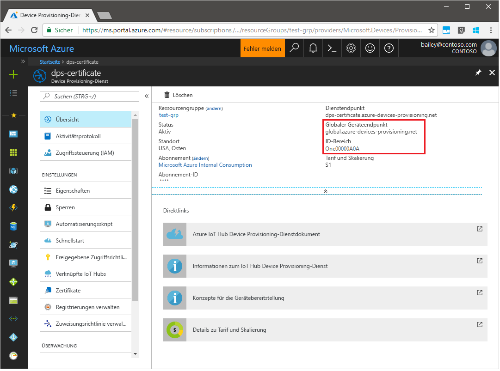
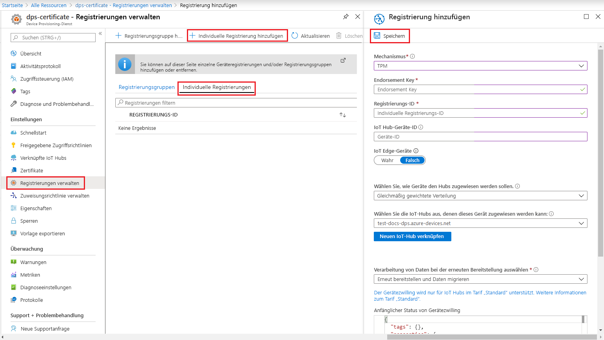

# <a name="quickstart-create-and-provision-a-simulated-tpm-device-using-java-device-sdk-for-azure-iot-hub-device-provisioning-service"></a>Schnellstart: Erstellen und Bereitstellen eines simulierten TPM-Geräts mithilfe des Java-Geräte-SDKs für den Azure IoT Hub Device Provisioning-Dienst

[!INCLUDE [iot-dps-selector-quick-create-simulated-device-tpm](../../includes/iot-dps-selector-quick-create-simulated-device-tpm.md)]

Die folgenden Schritte zeigen, wie Sie auf Ihrem Entwicklungscomputer unter dem Windows-Betriebssystem ein simuliertes Gerät erstellen, den Windows-TPM-Simulator als [Hardwaresicherheitsmodul (HSM)](https://azure.microsoft.com/blog/azure-iot-supports-new-security-hardware-to-strengthen-iot-security/) des Geräts ausführen und dieses simulierte Gerät mithilfe des Codebeispiels mit dem Device Provisioning-Dienst und Ihrer IoT Hub-Instanz verbinden. 

Sollten Sie mit der automatischen Bereitstellung nicht vertraut sein, lesen Sie auch die Informationen unter [Konzepte für die automatische Bereitstellung](concepts-auto-provisioning.md). Vergewissern Sie sich außerdem, dass Sie die Schritte unter [Einrichten des IoT Hub Device Provisioning-Diensts über das Azure-Portal](./quick-setup-auto-provision.md) ausgeführt haben, bevor Sie fortfahren. 

In Azure IoT Device Provisioning Service werden zwei Registrierungsarten unterstützt:
- [Registrierungsgruppen:](concepts-service.md#enrollment-group) Werden zum Registrieren mehrerer verwandter Geräte verwendet.
- [Individuelle Registrierungen](concepts-service.md#individual-enrollment): Werden zum Registrieren eines einzelnen Geräts verwendet.

In diesem Artikel werden individuelle Registrierungen veranschaulicht.

[!INCLUDE [IoT Device Provisioning Service basic](../../includes/iot-dps-basic.md)]

## <a name="prepare-the-environment"></a>Vorbereiten der Umgebung 

1. Vergewissern Sie sich, dass das [Java SE Development Kit 8](https://aka.ms/azure-jdks) auf Ihrem Computer installiert ist.

1. Laden Sie [Maven](https://maven.apache.org/install.html) herunter, und installieren Sie es.

1. Vergewissern Sie sich, dass `git` auf Ihrem Computer installiert ist und den Umgebungsvariablen hinzugefügt wurde, auf die das Befehlsfenster Zugriff hat. Unter [Git-Clienttools von Software Freedom Conservancy](https://git-scm.com/download/) finden Sie die neueste Version der zu installierenden `git`-Tools. Hierzu zählt auch die Befehlszeilen-App **Git Bash**, über die Sie mit Ihrem lokalen Git-Repository interagieren können. 

1. Öffnen Sie eine Eingabeaufforderung. Klonen Sie das GitHub-Repository mit dem Codebeispiel für die Gerätesimulation.
    
    ```cmd/sh
    git clone https://github.com/Azure/azure-iot-sdk-java.git --recursive
    ```

1. Führen Sie den [TPM](https://docs.microsoft.com/windows/device-security/tpm/trusted-platform-module-overview)-Simulator aus. Klicken Sie auf **Zugriff zulassen**, um Änderungen an den Einstellungen der _Windows-Firewall_ zuzulassen. Dieser lauscht über einen Socket an den Ports 2321 und 2322. Schließen Sie dieses Fenster nicht. Sie müssen diesen Simulator bis zum Ende dieses Schnellstarts ausführen. 

    ```cmd/sh
    .\azure-iot-sdk-java\provisioning\provisioning-tools\tpm-simulator\Simulator.exe
    ```

    

1. Navigieren Sie an einer separaten Eingabeaufforderung zum Stammordner, und erstellen Sie die Beispielabhängigkeiten.

    ```cmd/sh
    cd azure-iot-sdk-java
    mvn install -DskipTests=true
    ```

1. Navigieren Sie zum Beispielordner.

    ```cmd/sh
    cd provisioning/provisioning-samples/provisioning-tpm-sample
    ```

1. Melden Sie sich beim Azure-Portal an, wählen Sie im Menü links die Schaltfläche **Alle Ressourcen** aus, und öffnen Sie Ihren Gerätebereitstellungsdienst. Notieren Sie sich den _ID-Bereich_ und den _globalen Endpunkt für den Bereitstellungsdienst_.

    

1. Bearbeiten Sie `src/main/java/samples/com/microsoft/azure/sdk/iot/ProvisioningTpmSample.java`, um die zuvor notierten Werte für den _ID-Bereich_ und den _globalen Endpunkt für den Bereitstellungsdienst_ einzufügen.  

    ```java
    private static final String idScope = "[Your ID scope here]";
    private static final String globalEndpoint = "[Your Provisioning Service Global Endpoint here]";
    private static final ProvisioningDeviceClientTransportProtocol PROVISIONING_DEVICE_CLIENT_TRANSPORT_PROTOCOL = ProvisioningDeviceClientTransportProtocol.HTTPS;
    ```
    Speichern Sie die Datei .

1. Erstellen Sie das Projekt über die folgenden Befehle, navigieren Sie zum Zielordner, und führen Sie die erstellte JAR-Datei aus. Ersetzen Sie den Platzhalter `version` durch Ihre Java-Version.

    ```cmd/sh
    mvn clean install
    cd target
    java -jar ./provisioning-tpm-sample-{version}-with-deps.jar
    ```

1. Die Programmausführung beginnt. Notieren Sie sich den _Endorsement Key_ und die _Registrierungs-ID_ für den nächsten Abschnitt, und lassen Sie das Programm weiterhin ausgeführt.

    
    

## <a name="create-a-device-enrollment-entry"></a>Erstellen eines Geräteregistrierungseintrags

1. Melden Sie sich beim Azure-Portal an, wählen Sie im Menü links die Schaltfläche **Alle Ressourcen** aus, und öffnen Sie Ihren Gerätebereitstellungsdienst.

1. Wählen Sie im Menü von Device Provisioning Service die Option **Registrierungen verwalten** aus. Wählen Sie die Registerkarte **Individuelle Registrierungen** und dann oben die Schaltfläche **Individuelle Registrierung hinzufügen** aus. 

1. Geben Sie im Bereich **Registrierung hinzufügen** die folgenden Informationen ein:
   - Wählen Sie **TPM** als *Mechanismus* für den Nachweis der Identität.
   - Geben Sie die zuvor notierte *Registrierungs-ID* und den *Endorsement Key* für Ihr TPM-Gerät entsprechend den zuvor notierten Werten ein.
   - Wählen Sie einen IoT Hub aus, der mit Ihrem Bereitstellungsdienst verknüpft ist.
   - Optional können Sie die folgenden Informationen angeben:
       - Geben Sie eine eindeutige *Geräte-ID* ein. Achten Sie darauf, dass Sie beim Benennen Ihres Geräts keine sensiblen Daten angeben. Wenn Sie keine Angabe machen, wird das Gerät stattdessen über die Registrierungs-ID identifiziert.
       - Aktualisieren Sie **Initial device twin state** (Anfänglicher Gerätezwillingsstatus) mit der gewünschten Anfangskonfiguration für das Gerät.
   - Klicken Sie abschließend auf die Schaltfläche **Speichern**. 

       

   Nach erfolgreicher Registrierung wird die *Registrierungs-ID* Ihres Geräts in der Liste auf der Registerkarte *Individuelle Registrierungen* angezeigt. 


## <a name="simulate-the-device"></a>Simulieren des Geräts

1. Drücken Sie in dem Befehlsfenster, in dem der Java-Beispielcode auf Ihrem Computer ausgeführt wird, die *EINGABETASTE*, um die Ausführung der Anwendung fortzusetzen. Beachten Sie die Nachrichten, die den Start und die Verbindungsherstellung des Geräts mit dem Device Provisioning-Dienst simulieren, um Ihre IoT Hub-Informationen abzurufen.  

    

1. Nachdem das simulierte Gerät erfolgreich für den mit Ihrem Bereitstellungsdienst verknüpften IoT-Hub bereitgestellt wurde, wird die Geräte-ID auf dem Blatt **IoT-Geräte** des Hubs angezeigt.

     

    Wenn Sie den *anfänglichen Gerätezwillingsstatus* im Registrierungseintrag für Ihr Gerät gegenüber dem Standardwert geändert haben, kann der gewünschte Zwillingsstatus vom Hub abgerufen werden, und es können entsprechende Aktionen durchgeführt werden. Weitere Informationen finden Sie unter [Verstehen und Verwenden von Gerätezwillingen in IoT Hub](../iot-hub/iot-hub-devguide-device-twins.md).


## <a name="clean-up-resources"></a>Bereinigen von Ressourcen

Wenn Sie das Geräteclientbeispiel weiterhin verwenden und erkunden möchten, überspringen Sie die Bereinigung der in diesem Schnellstart erstellten Ressourcen. Falls Sie nicht fortfahren möchten, führen Sie die folgenden Schritte aus, um alle Ressourcen zu löschen, die im Rahmen dieses Schnellstarts erstellt wurden.

1. Schließen Sie auf Ihrem Computer das Ausgabefenster des Geräteclientbeispiels.
1. Schließen Sie auf Ihrem Computer das TPM-Simulatorfenster.
1. Wählen Sie im Azure-Portal im Menü links **Alle Ressourcen** und dann Ihren Gerätebereitstellungsdienst aus. Öffnen Sie das Blatt **Registrierungen verwalten** für Ihren Dienst, und wählen Sie die Registerkarte **Individuelle Registrierungen** aus. Aktivieren Sie das Kontrollkästchen *REGISTRIERUNGS-ID* für das Gerät, das Sie in diesem Schnellstart registriert haben, und wählen Sie oben im Bereich die Schaltfläche **Löschen** aus. 
1. Wählen Sie im linken Menü im Azure-Portal **Alle Ressourcen** und dann Ihren IoT-Hub aus. Öffnen Sie das Blatt **IoT-Geräte** für Ihren Hub, aktivieren Sie das Kontrollkästchen *GERÄTE-ID* für das Gerät, das Sie in diesem Schnellstart registriert haben, und wählen Sie dann oben im Bereich die Schaltfläche **Löschen** aus.

## <a name="next-steps"></a>Nächste Schritte

In diesem Schnellstart haben Sie auf Ihrem Computer ein simuliertes TPM-Gerät erstellt und mithilfe von IoT Hub Device Provisioning Service für Ihren IoT-Hub bereitgestellt. Informationen zum programmgesteuerten Registrieren Ihres TPM-Geräts finden Sie im Schnellstart für die programmgesteuerte Registrierung von TPM-Geräten. 

> [!div class="nextstepaction"]
> [Azure-Schnellstart: Registrieren eines TPM-Geräts bei Azure IoT Hub Device Provisioning Service](quick-enroll-device-tpm-java.md)
