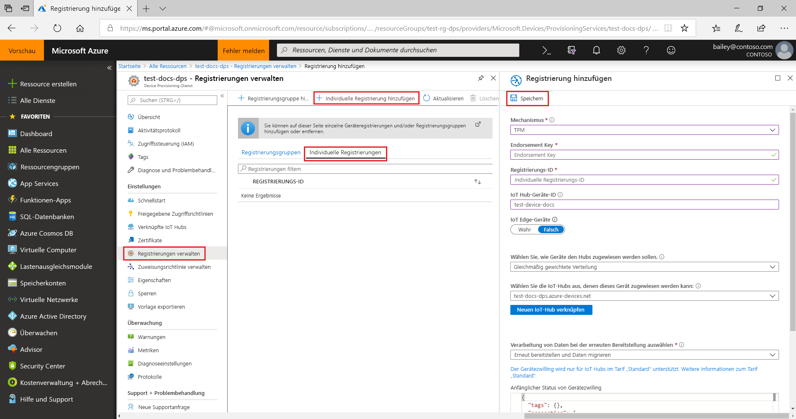
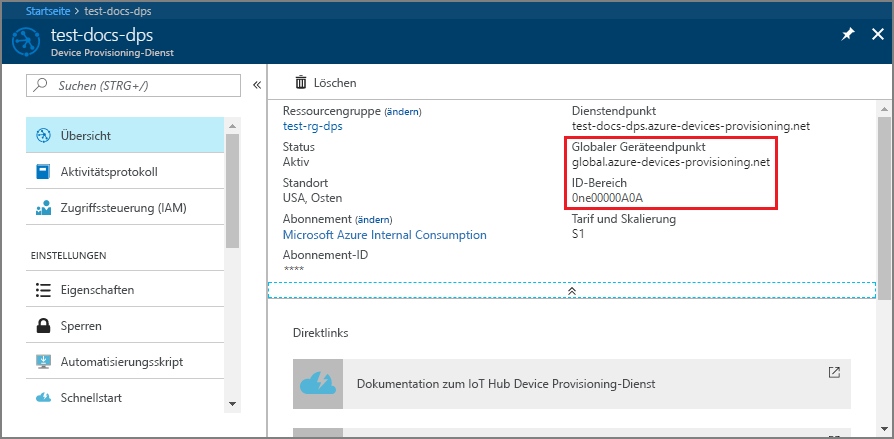

# <a name="quickstart-create-and-provision-a-simulated-tpm-device-using-python-device-sdk-for-iot-hub-device-provisioning-service"></a>Schnellstart: Erstellen und Bereitstellen eines simulierten TPM-Geräts mithilfe des Python-Geräte-SDK für den IoT Hub Device Provisioning-Dienst

[!INCLUDE [iot-dps-selector-quick-create-simulated-device-tpm](../../includes/iot-dps-selector-quick-create-simulated-device-tpm.md)]

In dieser Schnellstartanleitung erstellen Sie ein simuliertes IoT-Gerät auf einem Windows-Computer. Das simulierte Gerät enthält einen TPM-Simulator als Hardwaresicherheitsmodul (HSM). Sie verwenden Python-Beispielcode für das Gerät, um dieses simulierte Gerät mit Ihrem IoT-Hub zu verbinden, indem eine individuelle Registrierung beim Device Provisioning Service (DPS) verwendet wird.

## <a name="prerequisites"></a>Voraussetzungen

- Kenntnis der [Konzepte für die automatische Bereitstellung](concepts-auto-provisioning.md).
- Ausführung der Schritte unter [Einrichten des IoT Hub Device Provisioning-Diensts über das Azure-Portal](./quick-setup-auto-provision.md).
- Ein Azure-Konto mit einem aktiven Abonnement. [Erstellen Sie ein kostenloses Konto.](https://azure.microsoft.com/free/?ref=microsoft.com&utm_source=microsoft.com&utm_medium=docs&utm_campaign=visualstudio)
- [Visual Studio 2015+](https://visualstudio.microsoft.com/vs/) mit Desktopentwicklung mit C++.
- [CMake-Buildsystem](https://cmake.org/download/).
- [Git](https://git-scm.com/download/).

> [!IMPORTANT]
> Dieser Artikel gilt nur für das veraltete Python-SDK V1. Geräte- und Dienstclients für Iot Hub Device Provisioning Service sind in V2 noch nicht verfügbar. Das Team arbeitet zurzeit mit vollem Einsatz an der Featureparität für V2.

[!INCLUDE [IoT Device Provisioning Service basic](../../includes/iot-dps-basic.md)]

## <a name="prepare-the-environment"></a>Vorbereiten der Umgebung 

1. Stellen Sie sicher, dass [Visual Studio](https://visualstudio.microsoft.com/vs/) 2015 oder höher installiert und die Workload „Desktopentwicklung mit C++“ für Ihre Visual Studio-Installation aktiviert ist.

1. Laden Sie das [CMake-Buildsystem](https://cmake.org/download/) herunter, und installieren Sie es.

1. Vergewissern Sie sich, dass `git` auf Ihrem Computer installiert ist und den Umgebungsvariablen hinzugefügt wurde, auf die das Befehlsfenster Zugriff hat. Unter [Git-Clienttools von Software Freedom Conservancy](https://git-scm.com/download/) finden Sie die neueste Version der zu installierenden `git`-Tools. Hierzu zählt auch die Befehlszeilen-App **Git Bash**, über die Sie mit Ihrem lokalen Git-Repository interagieren können. 

1. Öffnen Sie eine Eingabeaufforderung oder Git Bash. Klonen Sie das GitHub-Repository mit dem Codebeispiel für die Gerätesimulation:
    
    ```cmd/sh
    git clone --single-branch --branch v1-deprecated https://github.com/Azure/azure-iot-sdk-python.git --recursive
    ```

1. Erstellen Sie in Ihrer lokalen Kopie des GitHub-Repositorys einen Ordner für den CMake-Buildprozess. 

    ```cmd/sh
    cd azure-iot-sdk-python/c
    mkdir cmake
    cd cmake
    ```

1. In dem Codebeispiel wird ein Windows-TPM-Simulator verwendet. Führen Sie den folgenden Befehl aus, um die SAS-Tokenauthentifizierung zu aktivieren. Der Befehl generiert auch eine Visual Studio-Projektmappe für das simulierte Gerät.

    ```cmd/sh
    cmake -Duse_prov_client:BOOL=ON -Duse_tpm_simulator:BOOL=ON ..
    ```

1. Navigieren Sie an einer separaten Eingabeaufforderung zum Ordner mit dem [TPM](https://docs.microsoft.com/windows/device-security/tpm/trusted-platform-module-overview)-Simulator, und führen Sie ihn aus. Er dient als [HSM](https://azure.microsoft.com/blog/azure-iot-supports-new-security-hardware-to-strengthen-iot-security/) für das simulierte Gerät. Klicken Sie auf **Zugriff zulassen**. Dieser lauscht über einen Socket an den Ports 2321 und 2322. Lassen Sie das Befehlsfenster geöffnet. Es wird benötigt, um den Simulator bis zum Ende dieses Schnellstarts auszuführen. 

    ```cmd/sh
    .\azure-iot-sdk-python\c\provisioning_client\deps\utpm\tools\tpm_simulator\Simulator.exe
    ```

    


## <a name="create-a-device-enrollment-entry"></a>Erstellen eines Geräteregistrierungseintrags

In Azure IoT Device Provisioning Service werden zwei Registrierungsarten unterstützt:

- [Registrierungsgruppen:](concepts-service.md#enrollment-group) Werden zum Registrieren mehrerer verwandter Geräte verwendet.
- [Individuelle Registrierungen](concepts-service.md#individual-enrollment): Werden zum Registrieren eines einzelnen Geräts verwendet.

In diesem Artikel werden individuelle Registrierungen veranschaulicht.

1. Öffnen Sie die im Ordner *cmake* generierte Projektmappe `azure_iot_sdks.sln`, und erstellen Sie sie in Visual Studio.

1. Klicken Sie mit der rechten Maustaste auf das Projekt **tpm_device_provision**, und wählen Sie **Als Startprojekt festlegen** aus. Führen Sie die Lösung aus. Im Ausgabefenster werden der **_Endorsement Key_** und die **_Registrierungs-ID_** für die Geräteregistrierung angezeigt. Notieren Sie sich diese Werte. 

    

1. Melden Sie sich beim Azure-Portal an, wählen Sie im Menü links die Schaltfläche **Alle Ressourcen** aus, und öffnen Sie Ihren Gerätebereitstellungsdienst.

1. Wählen Sie im Menü von Device Provisioning Service die Option **Registrierungen verwalten** aus. Wählen Sie die Registerkarte **Individuelle Registrierungen** und dann oben die Schaltfläche **Individuelle Registrierung hinzufügen** aus. 

1. Geben Sie im Bereich **Registrierung hinzufügen** die folgenden Informationen ein:
   - Wählen Sie **TPM** als *Mechanismus* für den Nachweis der Identität.
   - Geben Sie die zuvor notierte *Registrierungs-ID* und den *Endorsement Key* für Ihr TPM-Gerät entsprechend den zuvor notierten Werten ein.
   - Wählen Sie einen IoT Hub aus, der mit Ihrem Bereitstellungsdienst verknüpft ist.
   - Optional können Sie die folgenden Informationen angeben:
       - Geben Sie eine eindeutige *Geräte-ID* ein. Achten Sie darauf, dass Sie beim Benennen Ihres Geräts keine sensiblen Daten angeben. Wenn Sie keine Angabe machen, wird das Gerät stattdessen über die Registrierungs-ID identifiziert.
       - Aktualisieren Sie **Initial device twin state** (Anfänglicher Gerätezwillingsstatus) mit der gewünschten Anfangskonfiguration für das Gerät.
   - Klicken Sie abschließend auf die Schaltfläche **Speichern**. 

       

   Nach erfolgreicher Registrierung wird die *Registrierungs-ID* Ihres Geräts in der Liste auf der Registerkarte *Individual Enrollments* (Individuelle Registrierungen) angezeigt. 


## <a name="simulate-the-device"></a>Simulieren des Geräts

1. Laden Sie [Python 2.x oder 3.x](https://www.python.org/downloads/) herunter, und installieren Sie es. Stellen Sie je nach Einrichtung sicher, dass die 32-Bit- bzw. die 64-Bit-Installation verwendet wird. Fügen Sie Python Ihren plattformspezifischen Umgebungsvariablen hinzu, wenn Sie während der Installation dazu aufgefordert werden.
    - Bei Verwendung des Windows-Betriebssystems wird das [Visual C++ Redistributable Package](https://support.microsoft.com/help/2977003/the-latest-supported-visual-c-downloads) verwendet, um die Verwendung nativer DLLs aus Python zu ermöglichen.

1. Eine Anleitung für die Erstellung der Python-Pakete finden Sie [hier](https://github.com/Azure/azure-iot-sdk-python/blob/v1-deprecated/doc/python-devbox-setup.md).

   > [!NOTE]
   > Verwenden Sie bei Ausführung von `build_client.cmd` das Flag `--use-tpm-simulator`.
   > 
   > [!NOTE]
   > Bei Verwendung von `pip` muss auch das Paket `azure-iot-provisioning-device-client` installiert werden. Beachten Sie, dass die veröffentlichten PIP-Pakete nicht den Simulator, sondern das echte TPM verwenden. Zur Verwendung des Simulators muss bei der Kompilierung der Quelle das Flag `--use-tpm-simulator` verwendet werden.

1. Navigieren Sie zum Beispielordner.

    ```cmd/sh
    cd azure-iot-sdk-python/provisioning_device_client/samples
    ```

1. Bearbeiten Sie mithilfe Ihrer Python-IDE das Python-Skript **provisioning\_device\_client\_sample.py**. Legen Sie die Variablen *GLOBAL\_PROV\_URI* und *ID\_SCOPE* auf die zuvor notierten Werte fest. Stellen Sie außerdem sicher, dass *SECURITY\_DEVICE\_TYPE* auf `ProvisioningSecurityDeviceType.TPM` festgelegt ist.

    ```python
    GLOBAL_PROV_URI = "{globalServiceEndpoint}"
    ID_SCOPE = "{idScope}"
    SECURITY_DEVICE_TYPE = ProvisioningSecurityDeviceType.TPM
    PROTOCOL = ProvisioningTransportProvider.HTTP
    ```

    

1. Führen Sie das Beispiel aus. 

    ```cmd/sh
    python provisioning_device_client_sample.py
    ```

1. Beachten Sie die Nachrichten, die den Start und die Verbindungsherstellung des Geräts mit dem Device Provisioning-Dienst simulieren, um Ihre IoT Hub-Informationen abzurufen. 

    

1. Nachdem das simulierte Gerät erfolgreich für den mit Ihrem Bereitstellungsdienst verknüpften IoT-Hub bereitgestellt wurde, wird die Geräte-ID auf dem Blatt **IoT-Geräte** des Hubs angezeigt.

     

    Wenn Sie den *anfänglichen Gerätezwillingsstatus* im Registrierungseintrag für Ihr Gerät gegenüber dem Standardwert geändert haben, kann der gewünschte Zwillingsstatus vom Hub abgerufen werden, und es können entsprechende Aktionen durchgeführt werden. Weitere Informationen finden Sie unter [Verstehen und Verwenden von Gerätezwillingen in IoT Hub](../iot-hub/iot-hub-devguide-device-twins.md).


## <a name="clean-up-resources"></a>Bereinigen von Ressourcen

Wenn Sie das Geräteclientbeispiel weiterhin verwenden und erkunden möchten, überspringen Sie die Bereinigung der in diesem Schnellstart erstellten Ressourcen. Falls Sie nicht fortfahren möchten, führen Sie die folgenden Schritte aus, um alle Ressourcen zu löschen, die im Rahmen dieses Schnellstarts erstellt wurden.

1. Schließen Sie auf Ihrem Computer das Ausgabefenster des Geräteclientbeispiels.
1. Schließen Sie auf Ihrem Computer das TPM-Simulatorfenster.
1. Wählen Sie im Azure-Portal im Menü links **Alle Ressourcen** und dann Ihren Gerätebereitstellungsdienst aus. Öffnen Sie das Blatt **Registrierungen verwalten** für Ihren Dienst, und wählen Sie die Registerkarte **Individuelle Registrierungen** aus. Aktivieren Sie das Kontrollkästchen *REGISTRIERUNGS-ID* für das Gerät, das Sie in diesem Schnellstart registriert haben, und wählen Sie oben im Bereich die Schaltfläche **Löschen** aus. 
1. Wählen Sie im linken Menü im Azure-Portal **Alle Ressourcen** und dann Ihren IoT-Hub aus. Öffnen Sie das Blatt **IoT-Geräte** für Ihren Hub, aktivieren Sie das Kontrollkästchen *GERÄTE-ID* für das Gerät, das Sie in diesem Schnellstart registriert haben, und wählen Sie dann oben im Bereich die Schaltfläche **Löschen** aus.

## <a name="next-steps"></a>Nächste Schritte

In diesem Schnellstart haben Sie auf Ihrem Computer ein simuliertes TPM-Gerät erstellt und mithilfe von IoT Hub Device Provisioning Service für Ihren IoT-Hub bereitgestellt. Informationen zum programmgesteuerten Registrieren Ihres TPM-Geräts finden Sie im Schnellstart für die programmgesteuerte Registrierung von TPM-Geräten. 

> [!div class="nextstepaction"]
> [Azure-Schnellstart: Registrieren eines TPM-Geräts bei Azure IoT Hub Device Provisioning Service](quick-enroll-device-tpm-python.md)
