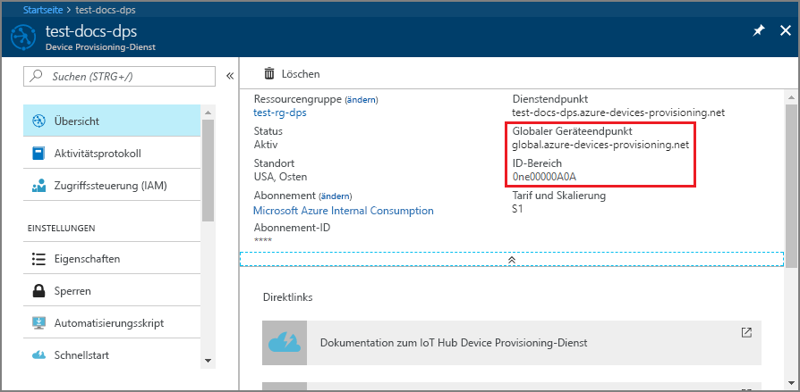

# <a name="quickstart-create-and-provision-a-simulated-x509-device-using-python-device-sdk-for-iot-hub-device-provisioning-service"></a>Schnellstart: Erstellen und Bereitstellen eines simulierten X.509-Geräts mithilfe des Python-Geräte-SDKs für den IoT Hub Device Provisioning-Dienst

[!INCLUDE [iot-dps-selector-quick-create-simulated-device-x509](../../includes/iot-dps-selector-quick-create-simulated-device-x509.md)]

In dieser Schnellstartanleitung stellen Sie einen Entwicklungscomputer als Python X.509-Gerät bereit. Sie verwenden Beispielgerätecode aus dem [Azure IoT Python SDK](https://github.com/Azure/azure-iot-sdk-python), um das Gerät mit Ihrem IoT-Hub zu verbinden. In diesem Beispiel wird eine individuelle Registrierung beim Device Provisioning Service (DPS) verwendet.

## <a name="prerequisites"></a>Voraussetzungen

- Kenntnisse über [Bereitstellungskonzepte](about-iot-dps.md#provisioning-process)
- Ausführung der Schritte unter [Einrichten des IoT Hub Device Provisioning-Diensts über das Azure-Portal](./quick-setup-auto-provision.md).
- Ein Azure-Konto mit einem aktiven Abonnement. [Erstellen Sie ein kostenloses Konto.](https://azure.microsoft.com/free/?ref=microsoft.com&utm_source=microsoft.com&utm_medium=docs&utm_campaign=visualstudio)
- [Python 3.5.3 oder höher](https://www.python.org/downloads/)
- [Git](https://git-scm.com/download/).


[!INCLUDE [IoT Device Provisioning Service basic](../../includes/iot-dps-basic.md)]

## <a name="prepare-the-environment"></a>Vorbereiten der Umgebung 

1. Vergewissern Sie sich, dass `git` auf Ihrem Computer installiert ist und den Umgebungsvariablen hinzugefügt wurde, auf die das Befehlsfenster Zugriff hat. Unter [Git-Clienttools von Software Freedom Conservancy](https://git-scm.com/download/) finden Sie die neueste Version der zu installierenden `git`-Tools. Hierzu zählt auch die Befehlszeilen-App **Git Bash**, über die Sie mit Ihrem lokalen Git-Repository interagieren können. 

2. Öffnen Sie eine Git Bash-Eingabeaufforderung. Klonen Sie das GitHub-Repository für das [Azure IoT Python SDK](https://github.com/Azure/azure-iot-sdk-python).
    
    ```cmd/sh
    git clone https://github.com/Azure/azure-iot-sdk-python.git --recursive
    ```


## <a name="create-a-self-signed-x509-device-certificate"></a>Erstellen eines selbstsignierten X.509-Gerätezertifikats 

In diesem Abschnitt erstellen Sie ein selbstsigniertes X.509-Zertifikat. Dabei sollten Sie unbedingt die folgenden Punkte berücksichtigen:

* Selbstsignierte Zertifikate dienen nur zu Testzwecken und sollten nicht in der Produktion verwendet werden.
* Die Standardgültigkeitsdauer für ein selbstsigniertes Zertifikat beträgt ein Jahr.

Falls Sie nicht bereits über Ihre Gerätezertifikate zum Authentifizieren eines Geräts verfügen, können Sie zu Testzwecken in diesem Artikel ein selbstsigniertes Zertifikat mit OpenSSL erstellen.  OpenSSL ist in der Git-Installation enthalten. 

1. Führen Sie an der Git Bash-Eingabeaufforderung den folgenden Befehl aus.

    # <a name="windows"></a>[Windows](#tab/windows)
    
    ```bash
    winpty openssl req -outform PEM -x509 -sha256 -newkey rsa:4096 -keyout ./python-device.key.pem -out ./python-device.pem -days 365 -extensions usr_cert -subj "//CN=Python-device-01"
    ```

    > [!IMPORTANT]
    > Der zusätzliche Schrägstrich für den Antragstellernamen (`//CN=Python-device-01`) ist nur erforderlich, um die Zeichenfolge für Git auf Windows-Plattformen mit einem Escapezeichen zu versehen. 

    # <a name="linux"></a>[Linux](#tab/linux)
    
    ```bash
    openssl req -outform PEM -x509 -sha256 -newkey rsa:4096 -keyout ./python-device.key.pem -out ./python-device.pem -days 365 -extensions usr_cert -subj "/CN=Python-device-01"
    ```
    
    ---
    
2. Wenn Sie zum **Eingeben der PEM-Passphrase** aufgefordert werden, können Sie zu Testzwecken in diesem Artikel die Passphrase `1234` verwenden.    

3. Geben Sie die Passphrase `1234` erneut ein, wenn Sie zum **Bestätigen der PEM-Passphrase** aufgefordert werden.    

Eine Testzertifikatdatei (*python-device.pem*) und eine Datei für den privaten Schlüssel (*python-device.key.pem*) werden in dem Verzeichnis generiert, in dem Sie den Befehl `openssl` ausgeführt haben.


## <a name="create-an-individual-enrollment-entry-in-dps"></a>Erstellen eines Eintrags für die individuelle Registrierung unter DPS


In Azure IoT Device Provisioning Service werden zwei Registrierungsarten unterstützt:

- [Registrierungsgruppen:](concepts-service.md#enrollment-group) Für die Registrierung mehrerer verbundener Geräte
- [Individuelle Registrierung:](concepts-service.md#individual-enrollment) Für die Registrierung eines einzelnen Geräts

In diesem Artikel wird veranschaulicht, wie eine individuelle Registrierung für ein einzelnes Gerät, das mit einem IoT-Hub bereitgestellt werden soll, durchgeführt wird.

1. Melden Sie sich beim Azure-Portal an, wählen Sie im Menü links die Schaltfläche **Alle Ressourcen** aus, und öffnen Sie Ihren Bereitstellungsdienst.

2. Wählen Sie im Menü von Device Provisioning Service die Option **Registrierungen verwalten** aus. Wählen Sie die Registerkarte **Individuelle Registrierungen** und dann oben die Schaltfläche **Individuelle Registrierung hinzufügen** aus. 

3. Geben Sie im Bereich **Registrierung hinzufügen** die folgenden Informationen ein:
   - Wählen Sie **X.509** als *Mechanismus* für den Nachweis der Identität.
   - Wählen Sie unter *Primäres Zertifikat (PEM- oder CER-Datei)* die Option *Datei auswählen* aus, um die Zertifikatdatei **python-device.pem** auszuwählen, sofern Sie das zuvor erstellte Testzertifikat nutzen.
   - Optional können Sie die folgenden Informationen angeben:
     - Wählen Sie einen IoT Hub aus, der mit Ihrem Bereitstellungsdienst verknüpft ist.
     - Aktualisieren Sie **Initial device twin state** (Anfänglicher Gerätezwillingsstatus) mit der gewünschten Anfangskonfiguration für das Gerät.
   - Klicken Sie abschließend auf die Schaltfläche **Speichern**. 

     [](./media/python-quick-create-simulated-device-x509/device-enrollment.png#lightbox)

   Nach der Registrierung wird Ihr X.509-Gerät auf der Registerkarte *Individuelle Registrierungen* in der Spalte *Registrierungs-ID* als **Python-device-01** angezeigt. Dieser Registrierungswert stammt aus dem Antragstellernamen des Gerätezertifikats. 

## <a name="simulate-the-device"></a>Simulieren des Geräts

Das Python-Bereitstellungsbeispiel [provision_x509.py](https://github.com/Azure/azure-iot-sdk-python/blob/master/azure-iot-device/samples/async-hub-scenarios/provision_x509.py) befindet sich im Verzeichnis `azure-iot-sdk-python/azure-iot-device/samples/async-hub-scenarios`. In diesem Beispiel werden sechs Umgebungsvariablen für die Authentifizierung und Bereitstellung eines IoT-Geräts per DPS genutzt. Dies sind die folgenden Umgebungsvariablen:

| Variablenname              | BESCHREIBUNG                                     |
| :------------------------- | :---------------------------------------------- |
| `PROVISIONING_HOST`        |  Dieser Wert steht für den globalen Endpunkt für die Verbindungsherstellung mit Ihrer DPS-Ressource. |    
| `PROVISIONING_IDSCOPE`     |  Dieser Wert steht für den ID-Bereich für Ihre DPS-Ressource. |    
| `DPS_X509_REGISTRATION_ID` |  Dieser Wert ist die ID für Ihr Gerät. Er muss auch mit dem Antragstellernamen auf dem Gerätezertifikat übereinstimmen. |    
| `X509_CERT_FILE`           |  Der Dateiname Ihres Gerätezertifikats. |    
| `X509_KEY_FILE`            |  Der Name Ihrer Datei mit dem privaten Schlüssel für Ihr Gerätezertifikat. |
| `PASS_PHRASE`              |  Die Passphrase, die Sie zum Verschlüsseln des Zertifikats und der Datei für den privaten Schlüssel (`1234`) verwendet haben. |    

1. Wählen Sie im Menü von Device Provisioning Service die Option **Übersicht** aus. Notieren Sie sich den _ID-Bereich_ und den _globalen Geräteendpunkt_.

    

2. Verwenden Sie an Ihrer Git Bash-Eingabeaufforderung die folgenden Befehle, um die Umgebungsvariablen für den globalen Geräteendpunkt und den ID-Bereich hinzuzufügen.

    ```bash
    $export PROVISIONING_HOST=global.azure-devices-provisioning.net
    $export PROVISIONING_IDSCOPE=<ID scope for your DPS resource>
    ```

3. Die Registrierungs-ID für das IoT-Gerät muss mit dem Antragstellernamen im Gerätezertifikat übereinstimmen. Wenn Sie ein selbstsigniertes Testzertifikat generiert haben, ist `Python-device-01` der Antragstellername und die Registrierungs-ID für das Gerät. 

    Falls Sie bereits über ein Gerätezertifikat verfügen, können Sie per `certutil` den allgemeinen Name des Antragstellers überprüfen, der für Ihr Gerät verwendet wird. Dies ist unten für ein selbstsigniertes Testzertifikat dargestellt:

    ```bash
    $ certutil python-device.pem
    X509 Certificate:
    Version: 3
    Serial Number: fa33152fe1140dc8
    Signature Algorithm:
        Algorithm ObjectId: 1.2.840.113549.1.1.11 sha256RSA
        Algorithm Parameters:
        05 00
    Issuer:
        CN=Python-device-01
      Name Hash(sha1): 1dd88de40e9501fb64892b698afe12d027011000
      Name Hash(md5): a62c784820daa931b9d3977739b30d12
    
     NotBefore: 1/29/2021 7:05 PM
     NotAfter: 1/29/2022 7:05 PM
    
    Subject:
        ===> CN=Python-device-01 <===
      Name Hash(sha1): 1dd88de40e9501fb64892b698afe12d027011000
      Name Hash(md5): a62c784820daa931b9d3977739b30d12
    ```

    Legen Sie an der Git Bash-Eingabeaufforderung die Umgebungsvariable für die Registrierungs-ID wie folgt fest:

    ```bash
    $export DPS_X509_REGISTRATION_ID=Python-device-01
    ```

4. Legen Sie an der Git Bash-Eingabeaufforderung die Umgebungsvariablen für die Zertifikatdatei, die Datei mit dem privaten Schlüssel und die Passphrase fest.

    ```bash
    $export X509_CERT_FILE=./python-device.pem
    $export X509_KEY_FILE=./python-device.key.pem
    $export PASS_PHRASE=1234
    ```

5. Sehen Sie sich den Code für [provision_x509.py](https://github.com/Azure/azure-iot-sdk-python/blob/master/azure-iot-device/samples/async-hub-scenarios/provision_x509.py) an. Falls Sie nicht **Python-Version 3.7** oder höher verwenden, müssen Sie [diese Codeänderung](https://github.com/Azure/azure-iot-sdk-python/tree/master/azure-iot-device/samples/async-hub-scenarios#advanced-iot-hub-scenario-samples-for-the-azure-iot-hub-device-sdk) durchführen, um `asyncio.run(main())` zu ersetzen, und Ihre Änderung anschließend speichern. 

6. Führen Sie das Beispiel aus. Im Beispiel wird eine Verbindung hergestellt und das Gerät auf einem Hub bereitgestellt, und anschließend werden einige Testnachrichten an den Hub gesendet.

    ```bash
    $ winpty python azure-iot-sdk-python/azure-iot-device/samples/async-hub-scenarios/provision_x509.py
    RegistrationStage(RequestAndResponseOperation): Op will transition into polling after interval 2.  Setting timer.
    The complete registration result is
    Python-device-01
    TestHub12345.azure-devices.net
    initialAssignment
    null
    Will send telemetry from the provisioned device
    sending message #4
    sending message #7
    sending message #2
    sending message #8
    sending message #5
    sending message #9
    sending message #1
    sending message #6
    sending message #10
    sending message #3
    done sending message #4
    done sending message #7
    done sending message #2
    done sending message #8
    done sending message #5
    done sending message #9
    done sending message #1
    done sending message #6
    done sending message #10
    done sending message #3
    ```

7. Navigieren Sie im Portal zu dem IoT-Hub, der mit Ihrem Bereitstellungsdienst verknüpft ist, und öffnen Sie das Blatt **IoT-Geräte**. Sie finden es im Abschnitt **Explorer** im Menü auf der linken Seite. Nach der erfolgreichen Bereitstellung des simulierten X.509-Geräts auf dem Hub wird die dazugehörige Geräte-ID auf dem Blatt **Device Explorer** mit dem *STATUS* **Aktiviert** angezeigt. Falls das Blatt bereits vor dem Ausführen der Beispielgeräteanwendung geöffnet war, müssen Sie unter Umständen im oberen Bereich auf die Schaltfläche **Aktualisieren** klicken. 

     

> [!NOTE]
> Wenn Sie den *anfänglichen Gerätezwillingsstatus* im Registrierungseintrag für Ihr Gerät gegenüber dem Standardwert geändert haben, kann der gewünschte Zwillingsstatus vom Hub abgerufen werden, und es können entsprechende Aktionen durchgeführt werden. Weitere Informationen finden Sie unter [Verstehen und Verwenden von Gerätezwillingen in IoT Hub](../iot-hub/iot-hub-devguide-device-twins.md).
>

## <a name="clean-up-resources"></a>Bereinigen von Ressourcen

Wenn Sie das Geräteclientbeispiel weiterhin verwenden und erkunden möchten, überspringen Sie die Bereinigung der in diesem Schnellstart erstellten Ressourcen. Falls Sie nicht fortfahren möchten, führen Sie die folgenden Schritte aus, um alle Ressourcen zu löschen, die im Rahmen dieses Schnellstarts erstellt wurden.

1. Schließen Sie auf Ihrem Computer das Ausgabefenster des Geräteclientbeispiels.
2. Wählen Sie im Azure-Portal im Menü links **Alle Ressourcen** und dann Ihren Gerätebereitstellungsdienst aus. Öffnen Sie das Blatt **Registrierungen verwalten** für Ihren Dienst, und wählen Sie die Registerkarte **Individuelle Registrierungen** aus. Aktivieren Sie das Kontrollkästchen *REGISTRIERUNGS-ID* für das Gerät, das Sie in diesem Schnellstart registriert haben, und wählen Sie oben im Bereich die Schaltfläche **Löschen** aus. 
3. Wählen Sie im linken Menü im Azure-Portal **Alle Ressourcen** und dann Ihren IoT-Hub aus. Öffnen Sie das Blatt **IoT-Geräte** für Ihren Hub, aktivieren Sie das Kontrollkästchen *GERÄTE-ID* für das Gerät, das Sie in diesem Schnellstart registriert haben, und wählen Sie dann oben im Bereich die Schaltfläche **Löschen** aus.

## <a name="next-steps"></a>Nächste Schritte

In dieser Schnellstartanleitung haben Sie auf Ihrem Entwicklungscomputer ein simuliertes X.509-Gerät erstellt und es im Portal mithilfe von Azure IoT Hub Device Provisioning Service für Ihren IoT-Hub bereitgestellt. Informationen zum programmgesteuerten Registrieren Ihres X.509-Geräts finden Sie im Schnellstart für die programmgesteuerte Registrierung von X.509-Geräten. 

> [!div class="nextstepaction"]
> [Azure-Schnellstart: Registrieren von X.509-Geräten bei Azure IoT Hub Device Provisioning Service](quick-enroll-device-x509-python.md)
