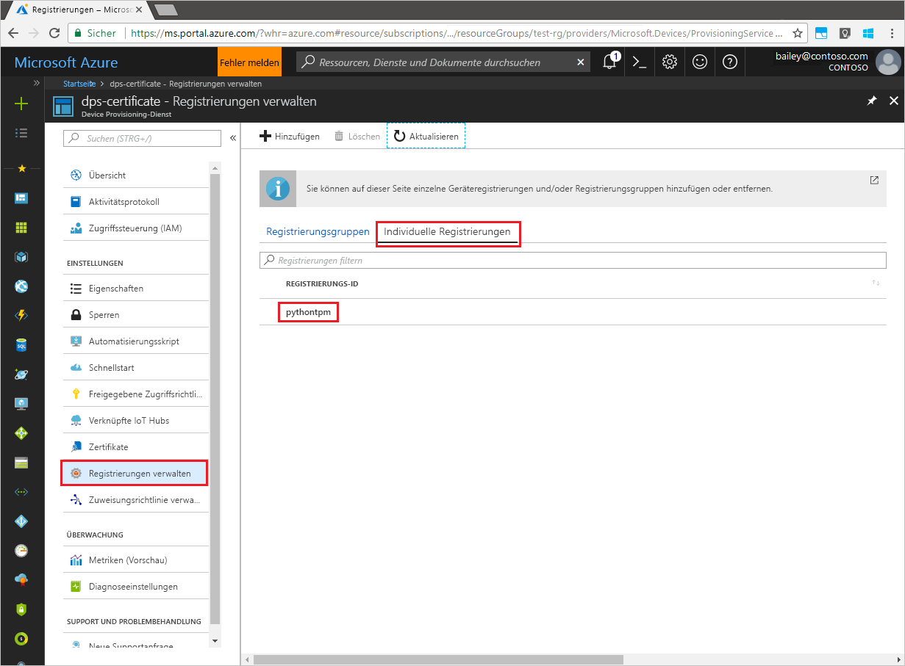

# <a name="quickstart-create-dps-enrollments-using-python-service-sdk"></a>Schnellstart: Erstellen von DPS-Registrierungen mit dem Python-Dienst-SDK

[!INCLUDE [iot-dps-selector-quick-enroll-device-tpm](../../includes/iot-dps-selector-quick-enroll-device-tpm.md)]

In dieser Schnellstartanleitung erstellen Sie programmgesteuert eine individuelle Geräteregistrierung in IoT Hub Device Provisioning Service (DPS) von Azure Das Python-SDK für den Bereitstellungsdienst wird zum Erstellen der Registrierung verwendet. 

## <a name="prerequisites"></a>Voraussetzungen

- Ausführung der Schritte unter [Schnellstart: Einrichten des IoT Hub Device Provisioning-Diensts über das Azure-Portal](./quick-setup-auto-provision.md).
- Ein Azure-Konto mit einem aktiven Abonnement. [Erstellen Sie ein kostenloses Konto.](https://azure.microsoft.com/free/?ref=microsoft.com&utm_source=microsoft.com&utm_medium=docs&utm_campaign=visualstudio)
- [Python 2.x oder 3.x](https://www.python.org/downloads/). In dieser Schnellstartanleitung wird weiter unten das [Python Provisioning Service SDK](https://github.com/Azure/azure-iot-sdk-python/tree/v1-deprecated/provisioning_service_client) installiert.
- [Pip](https://pip.pypa.io/en/stable/installing/), falls in Ihrer Python-Distribution nicht vorhanden.
- Endorsement Key. Führen Sie die Schritte unter [Schnellstart: Bereitstellen eines simulierten TPM-Geräts mithilfe des Azure IoT C SDK](quick-create-simulated-device.md) aus, oder verwenden Sie den Endorsement Key aus dem SDK, wie weiter unten beschrieben.

> [!IMPORTANT]
> Dieser Artikel gilt nur für das veraltete Python-SDK V1. Geräte- und Dienstclients für IoT Hub Device Provisioning Service sind in V2 noch nicht verfügbar. Das Team arbeitet zurzeit mit vollem Einsatz an der Featureparität für V2.

<a id="prepareenvironment"></a>

## <a name="prepare-the-environment"></a>Vorbereiten der Umgebung 

1. Laden Sie [Python 2.x oder 3.x](https://www.python.org/downloads/) herunter, und installieren Sie es. Stellen Sie je nach Einrichtung sicher, dass die 32-Bit- bzw. die 64-Bit-Installation verwendet wird. Fügen Sie Python Ihren plattformspezifischen Umgebungsvariablen hinzu, wenn Sie während der Installation dazu aufgefordert werden. 

1. Wählen Sie für das [Python Provisioning Service SDK](https://github.com/Azure/azure-iot-sdk-python/tree/v1-deprecated/provisioning_service_client) eine der folgenden Optionen aus:

    - Erstellen und kompilieren Sie das **Azure IoT Python SDK**. Eine Anleitung für die Erstellung der Python-Pakete finden Sie [hier](https://github.com/Azure/azure-iot-sdk-python/blob/v1-deprecated/doc/python-devbox-setup.md). Installieren Sie bei Verwendung des Windows-Betriebssystems auch das [Visual C++ Redistributable Package](https://support.microsoft.com/help/2977003/the-latest-supported-visual-c-downloads), um die Verwendung nativer DLLs aus Python zu ermöglichen.

    - [Installieren oder aktualisieren Sie *pip*, das Python-Paketverwaltungssystem](https://pip.pypa.io/en/stable/installing/), und installieren Sie das Paket mit dem folgenden Befehl:

        ```cmd/sh
        pip install azure-iothub-provisioningserviceclient
        ```

1. In diesem Artikel werden sowohl symmetrische Schlüssel als auch TPM-Registrierungen auf den folgenden Registerkarten veranschaulicht. 
 
    # <a name="symmetric-key"></a>[Symmetrischer Schlüssel](#tab/symmetrickey)
    
    Für Geräteregistrierungen mit symmetrischem Schlüssel benötigen Sie einen primären und sekundären Schlüssel für Ihr Gerät. Wenn Sie nicht über einen gültigen symmetrischen Schlüssel verfügen, können Sie die folgenden Beispielschlüssel für dieses Beispiel verwenden:

    *Primärer symmetrischer Schlüssel*

    ```
    UmorGiEVPNIQuaWGXXbe8v9gWayS7XtOZmNMo6DEaEXP65GvhuK3OeRf8RVZ9BymBCHxNg3oRTey0pUHUwwYKQ==
    ```

    *Sekundärer symmetrischer Schlüssel*

    ```
    Zx8/eE7PUBmnouB1qlNQxI7fcQ2HbJX+y96F1uCVQvDj88jFL+q6L9YWLLi4jqTmkRPOulHlSbSv2uFgj4vKtw==
    ```
    
    # <a name="tpm"></a>[TPM](#tab/tpm)
    
    Für TPM-Registrierungen benötigen Sie den Endorsement Key für Ihr Gerät. Falls Sie die Schritte der Schnellstartanleitung unter [Erstellen und Bereitstellen eines simulierten Geräts mithilfe von IoT Hub Device Provisioning-Diensten](quick-create-simulated-device.md) befolgt haben, um ein simuliertes TPM-Gerät zu erstellen, können Sie den für dieses Gerät erstellten Schlüssel verwenden. Andernfalls können Sie den folgenden Endorsement Key verwenden, der mit dem SDK bereitgestellt wird:

    ```
    AToAAQALAAMAsgAgg3GXZ0SEs/gakMyNRqXXJP1S124GUgtk8qHaGzMUaaoABgCAAEMAEAgAAAAAAAEAtW6MOyCu/Nih47atIIoZtlYkhLeCTiSrtRN3q6hqgOllA979No4BOcDWF90OyzJvjQknMfXS/Dx/IJIBnORgCg1YX/j4EEtO7Ase29Xd63HjvG8M94+u2XINu79rkTxeueqW7gPeRZQPnl1xYmqawYcyzJS6GKWKdoIdS+UWu6bJr58V3xwvOQI4NibXKD7htvz07jLItWTFhsWnTdZbJ7PnmfCa2vbRH/9pZIow+CcAL9mNTNNN4FdzYwapNVO+6SY/W4XU0Q+dLMCKYarqVNH5GzAWDfKT8nKzg69yQejJM8oeUWag/8odWOfbszA+iFjw3wVNrA5n8grUieRkPQ==
    ```
    
    ---

## <a name="modify-the-python-sample-code"></a>Ändern des Python-Beispielcodes

In diesem Abschnitt wird veranschaulicht, wie Sie die Bereitstellungsdetails Ihrer individuellen Registrierung dem Beispielcode hinzufügen. 

1. Erstellen Sie mit einem Text-Editor die neue Datei **Enrollment.py**.

1. Fügen Sie am Anfang der Datei **Enrollment.py** die folgenden `import`-Anweisungen und Variablen hinzu. Ersetzen Sie anschließend `dpsConnectionString` durch Ihre Verbindungszeichenfolge, die sich im **Azure-Portal** unter **Device Provisioning Service** unter **Freigegebene Zugriffsrichtlinien** befindet. Ersetzen Sie den bzw. die Schlüssel für Ihr Gerät durch den Wert, den Sie zuvor unter [Vorbereiten der Umgebung](quick-enroll-device-tpm-python.md#prepareenvironment) notiert haben. Erstellen Sie abschließend eine eindeutige `registrationid`, und achten Sie darauf, dass sie nur Kleinbuchstaben, Zahlen und Bindestriche enthält.  

    # <a name="symmetric-key"></a>[Symmetrischer Schlüssel](#tab/symmetrickey)

    ```python
    from provisioningserviceclient import ProvisioningServiceClient
    from provisioningserviceclient.models import IndividualEnrollment, AttestationMechanism
    from provisioningserviceclient.protocol.models import SymmetricKeyAttestation

    CONNECTION_STRING = "Enter your DPS connection string"
    PRIMARY_KEY = "Add a valid key"
    SECONDARY_KEY = "Add a valid key"
    REGISTRATION_ID = "Enter a registration ID"
    ```

    # <a name="tpm"></a>[TPM](#tab/tpm)
   
    ```python
    from provisioningserviceclient import ProvisioningServiceClient
    from provisioningserviceclient.models import IndividualEnrollment, AttestationMechanism

    CONNECTION_STRING = "Enter your DPS connection string"
    ENDORSEMENT_KEY = "Enter the endorsement key for your device"
    REGISTRATION_ID = "Enter a registration ID"
    ```

    ---

1. Fügen Sie die folgende Funktion und den Funktionsaufruf hinzu, um die Erstellung der individuellen Registrierung zu implementieren:
   
    # <a name="symmetric-key"></a>[Symmetrischer Schlüssel](#tab/symmetrickey)

    ```python
    def main():
        print ( "Starting individual enrollment..." )

        psc = ProvisioningServiceClient.create_from_connection_string(CONNECTION_STRING)

        symAtt = SymmetricKeyAttestation(primary_key=PRIMARY_KEY, secondary_key=SECONDARY_KEY)
        att = AttestationMechanism(type="symmetricKey", symmetric_key=symAtt)
        ie = IndividualEnrollment.create(REGISTRATION_ID, att)

        ie = psc.create_or_update(ie)
    
        print ( "Individual enrollment successful." )
    
    if __name__ == '__main__':
        main()
    ```

    # <a name="tpm"></a>[TPM](#tab/tpm)

    ```python
    def main():
        print ( "Starting individual enrollment..." )

        psc = ProvisioningServiceClient.create_from_connection_string(CONNECTION_STRING)

        att = AttestationMechanism.create_with_tpm(ENDORSEMENT_KEY)
        ie = IndividualEnrollment.create(REGISTRATION_ID, att)

        ie = psc.create_or_update(ie)
    
        print ( "Individual enrollment successful." )
    
    if __name__ == '__main__':
        main()
    ```

    ---

1. Speichern und schließen Sie die Datei **Enrollment.py**.
 

## <a name="run-the-sample-to-create-an-enrollment"></a>Ausführen des Beispiels zum Erstellen einer Registrierung

1. Öffnen Sie eine Eingabeaufforderung, und führen Sie das Skript aus.

    ```cmd/sh
    python Enrollment.py
    ```

1. Überprüfen Sie die Ausgabe darauf, ob die Registrierung erfolgreich ist.

1. Navigieren Sie im Azure-Portal zu Ihrem Provisioning-Dienst. Klicken Sie auf **Registrierungen verwalten**. Beachten Sie, dass die Geräteregistrierung auf der Registerkarte **Individuelle Registrierungen** unter dem zuvor erstellten Namen `registrationid` aufgeführt ist. 

      


## <a name="clean-up-resources"></a>Bereinigen von Ressourcen
Wenn Sie planen, sich das Beispiel des Java-Diensts näher anzusehen, sollten Sie die in diesem Schnellstart erstellten Ressourcen nicht bereinigen. Falls Sie nicht fortfahren möchten, führen Sie die folgenden Schritte aus, um alle Ressourcen zu löschen, die im Rahmen dieses Schnellstarts erstellt wurden.

1. Schließen Sie das Ausgabefenster des Python-Beispiels auf Ihrem Computer.
1. Falls Sie ein simuliertes TPM-Gerät erstellt haben, können Sie das TPM-Simulatorfenster schließen.
1. Navigieren Sie im Azure-Portal zu Ihrem Device Provisioning Service, klicken Sie auf **Registrierungen verwalten**, und klicken Sie anschließend auf die Registerkarte **Individuelle Registrierungen**. Aktivieren Sie das Kontrollkästchen der *Registrierungs-ID* für den Registrierungseintrag, den Sie in diesem Schnellstart erstellt haben, und klicken Sie oben im Bereich auf die Schaltfläche **Löschen**.


## <a name="next-steps"></a>Nächste Schritte
In dieser Schnellstartanleitung haben Sie programmgesteuert einen individuellen Registrierungseintrag für ein Gerät erstellt. Ausführlichere Informationen zur Gerätebereitstellung finden Sie im Tutorial zur Einrichtung des Device Provisioning-Diensts über das Azure-Portal.

> [!div class="nextstepaction"]
> [Tutorials für den Azure IoT Hub Device Provisioning-Dienst](./tutorial-set-up-cloud.md)
