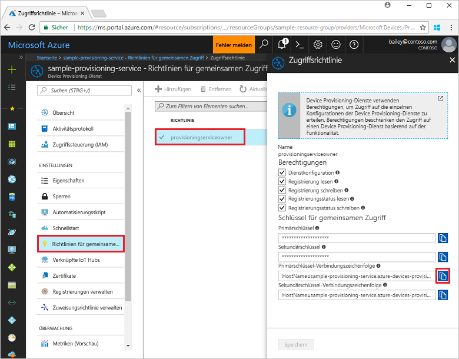
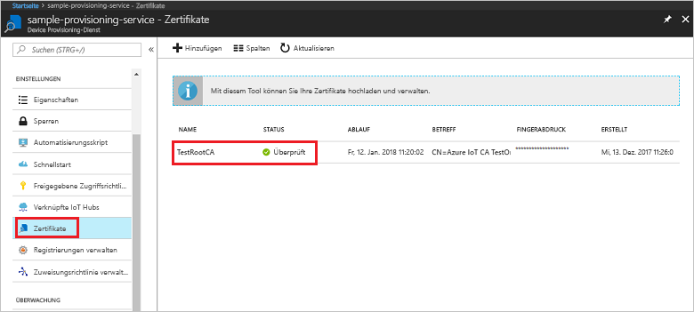

# <a name="quickstart-enroll-x509-devices-to-the-device-provisioning-service-using-nodejs"></a>Schnellstart: Registrieren von X.509-Geräten für den Device Provisioning-Dienst mit Node.js

[!INCLUDE [iot-dps-selector-quick-enroll-device-x509](../../includes/iot-dps-selector-quick-enroll-device-x509.md)]

In dieser Schnellstartanleitung wird veranschaulicht, wie Sie mit Node.js programmgesteuert eine [Registrierungsgruppe](concepts-service.md#enrollment-group) erstellen, für die X.509-Zertifizierungsstellenzertifikate (Zwischen- oder Stammzertifikat) verwendet werden. Die Registrierungsgruppe wird mit dem [IoT SDK für Node.js](https://github.com/Azure/azure-iot-sdk-node) und einer Node.js-Beispielanwendung erstellt. Eine Registrierungsgruppe steuert den Zugriff auf den Bereitstellungsdienst für Geräte, die das gleiche allgemeine Signaturzertifikat in ihrer Zertifikatkette verwenden. Weitere Informationen finden Sie unter [Steuern des Gerätezugriffs auf den Bereitstellungsdienst mit X.509-Zertifikaten](./concepts-security.md#controlling-device-access-to-the-provisioning-service-with-x509-certificates). Weitere Informationen zur Verwendung der auf dem X.509-Zertifikat basierenden Public Key-Infrastruktur (PKI) mit Azure IoT Hub und dem Device Provisioning-Dienst finden Sie unter [Geräteauthentifizierung mit X.509-Zertifikaten](https://docs.microsoft.com/azure/iot-hub/iot-hub-x509ca-overview). 

In dieser Schnellstartanleitung wird vorausgesetzt, dass Sie bereits einen IoT Hub und eine Instanz des Device Provisioning-Diensts erstellt haben. Falls diese Ressourcen noch nicht vorhanden sind, sollten Sie die Schnellstartanleitung [Einrichten des IoT Hub Device Provisioning-Diensts über das Azure-Portal](./quick-setup-auto-provision.md) durcharbeiten, bevor Sie mit diesem Artikel fortfahren.

Die Schritte in diesem Artikel funktionieren für Windows- und Linux-Computer, aber der Artikel wurde für einen Windows-Entwicklungscomputer geschrieben.

[!INCLUDE [quickstarts-free-trial-note](../../includes/quickstarts-free-trial-note.md)]


## <a name="prerequisites"></a>Voraussetzungen

- Installieren Sie [Node.js v4.0 oder höher](https://nodejs.org).
- Installieren Sie [Git](https://git-scm.com/download/).


## <a name="prepare-test-certificates"></a>Vorbereiten von Testzertifikaten

Für diese Schnellstartanleitung müssen Sie über eine PEM- oder CER-Datei verfügen, die den öffentlichen Teil eines X.509-Zertifizierungsstellenzertifikats (Zwischen- oder Stammzertifikat) enthält. Dieses Zertifikat muss in Ihren Bereitstellungsdienst hochgeladen und vom Dienst überprüft werden. 

Das [Azure IoT C SDK](https://github.com/Azure/azure-iot-sdk-c) enthält Testtools zum Erstellen einer X.509-Zertifikatkette, Hochladen eines Stamm- oder Zwischenzertifikats aus dieser Kette und Durchführen eines Eigentumsnachweises über den Dienst, um das Zertifikat zu überprüfen. Mit den SDK-Tools erstellte Zertifikate sind **ausschließlich zur Verwendung für Tests in der Entwicklung vorgesehen**. Diese Zertifikate **dürfen nicht in der Produktion verwendet werden**. Sie enthalten hartcodierte Kennwörter („1234“), die nach 30 Tagen ablaufen. Informationen zum Abrufen von Zertifikaten, die für den Einsatz in der Produktion geeignet sind, finden Sie in der Azure IoT Hub-Dokumentation unter [Abrufen eines X.509-Zertifizierungsstellenzertifikats](https://docs.microsoft.com/azure/iot-hub/iot-hub-x509ca-overview#how-to-get-an-x509-ca-certificate).

Führen Sie die folgenden Schritte aus, um diese Testtools zum Generieren von Zertifikaten zu verwenden: 
 
1. Öffnen Sie eine Eingabeaufforderung oder Git Bash-Shell, und wechseln Sie auf Ihrem Computer in einen Arbeitsordner. Führen Sie den folgenden Befehl zum Klonen des [Azure IoT C SDK](https://github.com/Azure/azure-iot-sdk-c)-GitHub-Repositorys aus:
    
   ```cmd/sh
   git clone https://github.com/Azure/azure-iot-sdk-c.git --recursive
   ```

   Sie sollten damit rechnen, dass die Ausführung dieses Vorgangs mehrere Minuten in Anspruch nimmt.

   Die Testtools befinden sich im geklonten Repository unter *azure-iot-sdk-c/tools/CACertificates*.    

2. Führen Sie die Schritte unter [Managing test CA certificates for samples and tutorials](https://github.com/Azure/azure-iot-sdk-c/blob/master/tools/CACertificates/CACertificateOverview.md) (Verwalten von Zertifizierungsstellen-Testzertifikaten für Beispiele und Tutorials) aus. 


## <a name="create-the-enrollment-group-sample"></a>Erstellen des Registrierungsgruppenbeispiels 

 
1. Führen Sie in einem Befehlsfenster in Ihrem Arbeitsordner Folgendes aus:
  
     ```cmd\sh
     npm install azure-iot-provisioning-service
     ```  

2. Erstellen Sie mit einem Text-Editor in Ihrem Arbeitsordner die Datei **create_enrollment_group.js**. Fügen Sie der Datei den folgenden Code hinzu, und speichern Sie sie:

    ```
    'use strict';
    var fs = require('fs');

    var provisioningServiceClient = require('azure-iot-provisioning-service').ProvisioningServiceClient;

    var serviceClient = provisioningServiceClient.fromConnectionString(process.argv[2]);

    var enrollment = {
      enrollmentGroupId: 'first',
      attestation: {
        type: 'x509',
        x509: {
          signingCertificates: {
            primary: {
              certificate: fs.readFileSync(process.argv[3], 'utf-8').toString()
            }
          }
        }
      },
      provisioningStatus: 'disabled'
    };

    serviceClient.createOrUpdateEnrollmentGroup(enrollment, function(err, enrollmentResponse) {
      if (err) {
        console.log('error creating the group enrollment: ' + err);
      } else {
        console.log("enrollment record returned: " + JSON.stringify(enrollmentResponse, null, 2));
        enrollmentResponse.provisioningStatus = 'enabled';
        serviceClient.createOrUpdateEnrollmentGroup(enrollmentResponse, function(err, enrollmentResponse) {
          if (err) {
            console.log('error updating the group enrollment: ' + err);
          } else {
            console.log("updated enrollment record returned: " + JSON.stringify(enrollmentResponse, null, 2));
          }
        });
      }
    });
    ```

## <a name="run-the-enrollment-group-sample"></a>Ausführen des Registrierungsgruppenbeispiels
 
1. Zum Ausführen des Beispiels benötigen Sie die Verbindungszeichenfolge für Ihren Provisioning-Dienst. 
    1. Melden Sie sich beim Azure-Portal an, wählen Sie im Menü links die Schaltfläche **Alle Ressourcen** aus, und öffnen Sie Ihren Gerätebereitstellungsdienst. 
    2. Klicken Sie auf **Richtlinien für gemeinsamen Zugriff**, und wählen Sie dann die gewünschte Zugriffsrichtlinie aus, um die zugehörigen Eigenschaften zu öffnen. Kopieren Sie im Fenster **Zugriffsrichtlinie** die Primärschlüssel-Verbindungszeichenfolge, und notieren Sie sie. 

        


3. Wie unter [Vorbereiten von Testzertifikaten](quick-enroll-device-x509-node.md#prepare-test-certificates) angegeben, benötigen Sie auch eine PEM-Datei mit einem X.509-Zwischen- oder -Stammzertifikat einer Zertifizierungsstelle, das für Ihren Provisioning-Dienst hochgeladen und überprüft wurde. Vergewissern Sie sich, dass Ihr Zertifikat hochgeladen und überprüft wurde, indem Sie auf der Zusammenfassungsseite von Device Provisioning Service im Azure-Portal **Zertifikate** auswählen. Suchen Sie nach dem Zertifikat, das Sie für die Gruppenregistrierung verwenden möchten, und stellen Sie sicher, dass der Statuswert *verified* (Überprüft) lautet.

     

1. Führen Sie den folgenden Befehl aus (einschließlich der Anführungszeichen der Befehlsargumente), um eine Registrierungsgruppe für Ihr Zertifikat zu erstellen:
 
     ```cmd\sh
     node create_enrollment_group.js "<the connection string for your provisioning service>" "<your certificate's .pem file>"
     ```
 
3. Bei einer erfolgreichen Erstellung werden im Befehlsfenster die Eigenschaften der neuen Registrierungsgruppe angezeigt.

     

4. Stellen Sie sicher, dass die Registrierungsgruppe erstellt wurde. Wählen Sie im Azure-Portal auf dem Zusammenfassungsblatt des Device Provisioning-Diensts die Option **Registrierungen verwalten**. Wählen Sie die Registerkarte **Registrierungsgruppen** aus, und vergewissern Sie sich, dass der neue Registrierungseintrag (*first*) vorhanden ist.

     
 
## <a name="clean-up-resources"></a>Bereinigen von Ressourcen
Wenn Sie planen, sich die Node.js-Dienstbeispiele genauer anzusehen, sollten Sie die in diesem Schnellstart erstellten Ressourcen nicht bereinigen. Falls Sie nicht fortfahren möchten, führen Sie die folgenden Schritte aus, um alle erstellten Azure-Ressourcen zu löschen, die im Rahmen dieses Schnellstarts erstellt wurden.
 
1. Schließen Sie das Ausgabefenster des Node.js-Beispiels auf Ihrem Computer.
2. Navigieren Sie im Azure-Portal zu Ihrem Gerätebereitstellungsdienst, wählen Sie **Registrierungen verwalten** aus, und wählen Sie dann die Registerkarte **Registrierungsgruppen** aus. Aktivieren Sie das Kontrollkästchen des *Gruppennamens* für die X.509-Geräte, die Sie in diesem Schnellstart registriert haben, und klicken Sie oben im Bereich auf die Schaltfläche **Löschen**.    
3. Wählen Sie im Azure-Portal für Ihren Gerätebereitstellungsdienst die Option **Zertifikate** und dann das Zertifikat aus, das Sie für diesen Schnellstart hochgeladen haben, und wählen Sie dann oben im Fenster **Zertifikatdetails** die Schaltfläche **Löschen** aus.  
 
## <a name="next-steps"></a>Nächste Schritte
In diesem Schnellstart haben Sie eine Gruppenregistrierung für ein X.509-Zwischenzertifikat oder ein X.509-Stammzertifikat einer Zertifizierungsstelle erstellt, indem Sie Azure IoT Hub Device Provisioning Service verwendet haben. Ausführlichere Informationen zur Gerätebereitstellung finden Sie im Tutorial zur Einrichtung des Device Provisioning-Diensts über das Azure-Portal. 
 
> [!div class="nextstepaction"]
> [Tutorials für den Azure IoT Hub Device Provisioning-Dienst](./tutorial-set-up-cloud.md)