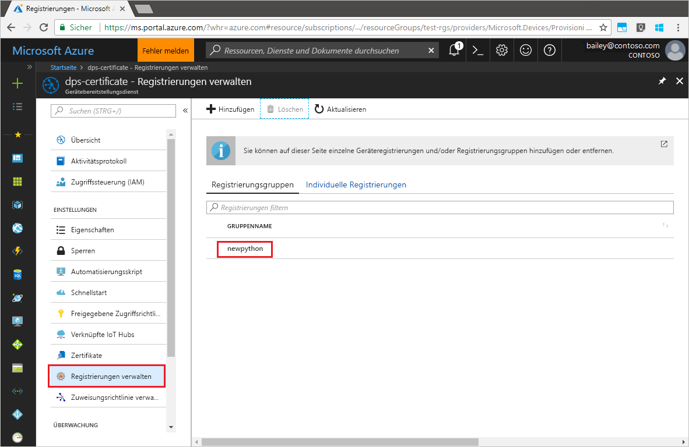

# <a name="quickstart-enroll-x509-devices-to-the-device-provisioning-service-using-python"></a>Schnellstart: Registrieren von X.509-Geräten für den Device Provisioning-Dienst mit Python

[!INCLUDE [iot-dps-selector-quick-enroll-device-x509](../../includes/iot-dps-selector-quick-enroll-device-x509.md)]

In dieser Schnellstartanleitung verwenden Sie Python, um programmgesteuert eine Registrierungsgruppe zu erstellen, für die X.509-Zertifizierungsstellenzertifikate (Zwischen- oder Stammzertifikat) verwendet werden. Eine Registrierungsgruppe steuert den Zugriff auf den Bereitstellungsdienst für Geräte, die das gleiche allgemeine Signaturzertifikat in ihrer Zertifikatkette verwenden. Die Registrierungsgruppe wird mit dem Python Provisioning-Dienst-SDK und einer Python-Beispielanwendung erstellt.

## <a name="prerequisites"></a>Voraussetzungen

- Ausführung der Schritte unter [Schnellstart: Einrichten des IoT Hub Device Provisioning-Diensts über das Azure-Portal](./quick-setup-auto-provision.md).
- Ein Azure-Konto mit einem aktiven Abonnement. [Erstellen Sie ein kostenloses Konto.](https://azure.microsoft.com/free/?ref=microsoft.com&utm_source=microsoft.com&utm_medium=docs&utm_campaign=visualstudio)
- [Python 2.x oder 3.x](https://www.python.org/downloads/). Hinzufügung von Python zu Ihren plattformspezifischen Umgebungsvariablen. In dieser Schnellstartanleitung wird weiter unten das [Python Provisioning-Dienst-SDK](https://github.com/Azure/azure-iot-sdk-python/tree/v1-deprecated/provisioning_service_client) installiert.
- [Pip](https://pip.pypa.io/en/stable/installing/), falls in Ihrer Python-Distribution nicht vorhanden.
- [Git](https://git-scm.com/download/).

> [!IMPORTANT]
> Dieser Artikel gilt nur für das veraltete Python-SDK V1. Geräte- und Dienstclients für IoT Hub Device Provisioning Service sind in V2 noch nicht verfügbar. Das Team arbeitet zurzeit mit vollem Einsatz an der Featureparität für V2.

## <a name="prepare-test-certificates"></a>Vorbereiten von Testzertifikaten

Für diese Schnellstartanleitung müssen Sie über eine PEM- oder CER-Datei verfügen, die den öffentlichen Teil eines X.509-Zertifizierungsstellenzertifikats (Zwischen- oder Stammzertifikat) enthält. Dieses Zertifikat muss in Ihren Bereitstellungsdienst hochgeladen und vom Dienst überprüft werden.

Weitere Informationen zur Verwendung der auf dem X.509-Zertifikat basierenden Public Key-Infrastruktur (PKI) mit Azure IoT Hub und dem Device Provisioning-Dienst finden Sie unter [Geräteauthentifizierung mit X.509-Zertifikaten](../iot-hub/iot-hub-x509ca-overview.md).

Das [Azure IoT C SDK](https://github.com/Azure/azure-iot-sdk-c) enthält Testtools zum Erstellen einer X.509-Zertifikatkette, Hochladen eines Stamm- oder Zwischenzertifikats aus dieser Kette und Durchführen eines Eigentumsnachweises über den Dienst, um das Zertifikat zu überprüfen. Mit den SDK-Tools erstellte Zertifikate sind **ausschließlich zur Verwendung für Tests in der Entwicklung vorgesehen**. Diese Zertifikate **dürfen nicht in der Produktion verwendet werden**. Sie enthalten hartcodierte Kennwörter („1234“), die nach 30 Tagen ablaufen. Informationen zum Abrufen von Zertifikaten, die für den Einsatz in der Produktion geeignet sind, finden Sie in der Azure IoT Hub-Dokumentation unter [Abrufen eines X.509-Zertifizierungsstellenzertifikats](../iot-hub/iot-hub-x509ca-overview.md#how-to-get-an-x509-ca-certificate).

Führen Sie die folgenden Schritte aus, um diese Testtools zum Generieren von Zertifikaten zu verwenden:

1. Suchen Sie den Tagnamen für das [aktuelle Release](https://github.com/Azure/azure-iot-sdk-c/releases/latest) des Azure IoT C SDK.

2. Öffnen Sie eine Eingabeaufforderung oder Git Bash-Shell, und wechseln Sie auf Ihrem Computer in einen Arbeitsordner. Führen Sie den folgenden Befehl zum Klonen des aktuellen Releases des [Azure IoT C SDK](https://github.com/Azure/azure-iot-sdk-c)-GitHub-Repositorys aus. Verwenden Sie das im vorherigen Schritt gefundene Tag als Wert für den Parameter `-b`:

    ```cmd/sh
    git clone -b <release-tag> https://github.com/Azure/azure-iot-sdk-c.git
    cd azure-iot-sdk-c
    git submodule update --init
    ```

    Sie sollten damit rechnen, dass die Ausführung dieses Vorgangs mehrere Minuten in Anspruch nimmt.

   Die Testtools befinden sich im geklonten Repository unter *azure-iot-sdk-c/tools/CACertificates*.

3. Führen Sie die Schritte unter [Managing test CA certificates for samples and tutorials](https://github.com/Azure/azure-iot-sdk-c/blob/master/tools/CACertificates/CACertificateOverview.md) (Verwalten von Zertifizierungsstellen-Testzertifikaten für Beispiele und Tutorials) aus. 

## <a name="modify-the-python-sample-code"></a>Ändern des Python-Beispielcodes

In diesem Abschnitt wird veranschaulicht, wie Sie die Bereitstellungsdetails Ihres X.509-Geräts dem Beispielcode hinzufügen. 

1. Erstellen Sie mit einem Text-Editor die neue Datei **EnrollmentGroup.py**.

1. Fügen Sie am Anfang der Datei **EnrollmentGroup.py** die folgenden `import`-Anweisungen und Variablen hinzu: Ersetzen Sie anschließend `dpsConnectionString` durch Ihre Verbindungszeichenfolge, die sich im **Azure-Portal** unter **Device Provisioning Service** unter **Freigegebene Zugriffsrichtlinien** befindet. Ersetzen Sie den Zertifikatplatzhalter durch das Zertifikat, das Sie zuvor unter [Vorbereiten von Testzertifikaten](quick-enroll-device-x509-python.md#prepare-test-certificates) erstellt haben. Erstellen Sie abschließend eine eindeutige `registrationid`, und achten Sie darauf, dass sie nur Kleinbuchstaben, Zahlen und Bindestriche enthält.  
   
    ```python
    from provisioningserviceclient import ProvisioningServiceClient
    from provisioningserviceclient.models import EnrollmentGroup, AttestationMechanism

    CONNECTION_STRING = "{dpsConnectionString}"

    SIGNING_CERT = """-----BEGIN CERTIFICATE-----
    XXXXXXXXXXXXXXXXXXXXXXXXXXXXXXXXXXXXXXXXXXXXXXXXXXXXXXXXXXXXXXXX
    XXXXXXXXXXXXXXXXXXXXXXXXXXXXXXXXXXXXXXXXXXXXXXXXXXXXXXXXXXXXXXXX
    XXXXXXXXXXXXXXXXXXXXXXXXXXXXXXXXXXXXXXXXXXXXXXXXXXXXXXXXXXXXXXXX
    XXXXXXXXXXXXXXXXXXXXXXXXXXXXXXXXXXXXXXXXXXXXXXXXXXXXXXXXXXXXXXXX
    XXXXXXXXXXXXXXXXXXXXXXXXXXXXXXXXXXXXXXXXXXXXXXXXXXXXXXXXXXXXXXXX
    XXXXXXXXXXXXXXXXXXXXXXXXXXXXXXXXXXXXXXXXXXXXXXXXXXXXXXXXXXXXXXXX
    XXXXXXXXXXXXXXXXXXXXXXXXXXXXXXXXXXXXXXXXXXXXXXXXXXXXXXXXXXXXXXXX
    XXXXXXXXXXXXXXXXXXXXXXXXXXXXXXXXXXXXXXXXXXXXXXXXXXXXXXXXXXXXXXXX
    XXXXXXXXXXXXXXXXXXXXXXXXXXXXXXXXXXXXXXXXXXXXXXXXXXXXXXXXXXXXXXXX
    XXXXXXXXXXXXXXXXXXXXXXXXXXXXXXXXXXXXXXXXXXXXXXXXXXXXXXXXXXXXXXXX
    XXXXXXXXXXXXXXXXXXXXXXXXXXXXXXXXXXXXXXXXXXXXXXXXXXXXXXXXXXXXXXXX
    XXXXXXXXXXXXXXXXXXXXXXXXXXXXXXXXXXXXXXXXXXXXXXXXXXXXXXXXXXXXXXXX
    XXXXXXXXXXXXXXXXXXXXXXXXXXXXXXXXXXXXXXXXXXXXXXXXXXXXXXXXXXXXXXXX
    XXXXXXXXXXXXXXXXXXXXXXXXXXXXXXXXXXXXXXXXXXXXXXXXXXXXXXXXXXXXXXXX
    XXXXXXXXXXXXXXXXXXXXXXXXXXXXXXXXXXXXXXXXXXXXXXXXXXXXXXXX
    -----END CERTIFICATE-----"""

    GROUP_ID = "{registrationid}"
    ```

1. Fügen Sie die folgende Funktion und den Funktionsaufruf hinzu, um die Erstellung der Gruppenregistrierung zu implementieren:
   
    ```python
    def main():
        print ( "Initiating enrollment group creation..." )

        psc = ProvisioningServiceClient.create_from_connection_string(CONNECTION_STRING)
        att = AttestationMechanism.create_with_x509_signing_certs(SIGNING_CERT)
        eg = EnrollmentGroup.create(GROUP_ID, att)

        eg = psc.create_or_update(eg)
    
        print ( "Enrollment group created." )

    if __name__ == '__main__':
        main()
    ```

1. Speichern und schließen Sie die Datei **EnrollmentGroup.py**.
 

## <a name="run-the-sample-group-enrollment"></a>Ausführen der Beispielgruppenregistrierung

In Azure IoT Device Provisioning Service werden zwei Registrierungsarten unterstützt:

- [Registrierungsgruppen:](concepts-service.md#enrollment-group) Für die Registrierung mehrerer verbundener Geräte
- [Individuelle Registrierungen](concepts-service.md#individual-enrollment): Werden zum Registrieren eines einzelnen Geräts verwendet.

An der Erstellung von individuellen Registrierungen mit dem [Python Provisioning-Dienst-SDK](https://github.com/Azure/azure-iot-sdk-python/tree/v1-deprecated/provisioning_service_client) wird noch gearbeitet. Weitere Informationen finden Sie unter [Steuern des Gerätezugriffs auf den Bereitstellungsdienst mit X.509-Zertifikaten](./concepts-x509-attestation.md#controlling-device-access-to-the-provisioning-service-with-x509-certificates).

1. Öffnen Sie eine Eingabeaufforderung, und führen Sie den folgenden Befehl aus, um den [azure-iot-provisioning-device-client](https://pypi.org/project/azure-iot-provisioning-device-client) zu installieren.

    ```cmd/sh
    pip install azure-iothub-provisioningserviceclient    
    ```

2. Führen Sie das Skript an der Eingabeaufforderung aus.

    ```cmd/sh
    python EnrollmentGroup.py
    ```

3. Überprüfen Sie die Ausgabe darauf, ob die Registrierung erfolgreich ist.

4. Navigieren Sie im Azure-Portal zu Ihrem Provisioning-Dienst. Klicken Sie auf **Registrierungen verwalten**. Beachten Sie, dass Ihre Gruppe mit X.509-Geräten unter der Registerkarte **Registrierungsgruppen** mit dem zuvor erstellten Namen `registrationid` angezeigt wird. 

      


## <a name="clean-up-resources"></a>Bereinigen von Ressourcen
Wenn Sie planen, sich das Beispiel des Java-Diensts näher anzusehen, sollten Sie die in diesem Schnellstart erstellten Ressourcen nicht bereinigen. Falls Sie nicht fortfahren möchten, führen Sie die folgenden Schritte aus, um alle Ressourcen zu löschen, die im Rahmen dieses Schnellstarts erstellt wurden.

1. Schließen Sie das Ausgabefenster des Java-Beispiels auf Ihrem Computer.
1. Schließen Sie das Fenster _X509 Cert Generator_ auf Ihrem Computer.
1. Navigieren Sie im Azure-Portal zu Ihrem Gerätebereitstellungsdienst, wählen Sie **Registrierungen verwalten** aus, und wählen Sie dann die Registerkarte **Registrierungsgruppen** aus. Aktivieren Sie das Kontrollkästchen des *Gruppennamens* für die X.509-Geräte, die Sie in diesem Schnellstart registriert haben, und klicken Sie oben im Bereich auf die Schaltfläche **Löschen**.    


## <a name="next-steps"></a>Nächste Schritte
In diesem Schnellstart haben Sie eine simulierte Gruppe von X.509-Geräten für Ihren Gerätebereitstellungsdienst registriert. Ausführlichere Informationen zur Gerätebereitstellung finden Sie im Tutorial zur Einrichtung des Device Provisioning-Diensts über das Azure-Portal. 

> [!div class="nextstepaction"]
> [Tutorials für den Azure IoT Hub Device Provisioning-Dienst](./tutorial-set-up-cloud.md)