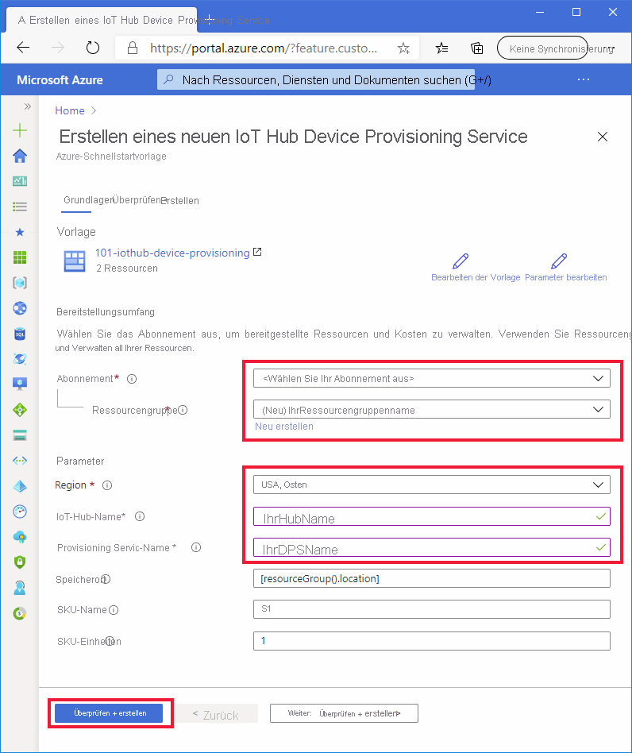

# <a name="quickstart-set-up-the-iot-hub-device-provisioning-service-dps-with-an-arm-template"></a>Schnellstart: Einrichten von IoT Hub Device Provisioning Service (DPS) mithilfe einer ARM-Vorlage

Sie können eine ARM-Vorlage ([Azure Resource Manager](../azure-resource-manager/management/overview.md)) verwenden, um die zum Bereitstellen Ihrer Geräte erforderlichen Azure-Cloudressourcen programmgesteuert einzurichten. Hier erfahren Sie, wie Sie mithilfe einer ARM-Vorlage einen IoT-Hub und eine neue Instanz von IoT Hub Device Provisioning Service erstellen. Außerdem wird der IoT-Hub unter Verwendung der Vorlage mit der DPS-Ressource verknüpft. Dank dieser Verknüpfung kann die DPS-Ressource dem Hub auf der Grundlage der von Ihnen konfigurierten Zuordnungsrichtlinien Geräte zuweisen.

[!INCLUDE [About Azure Resource Manager](../../includes/resource-manager-quickstart-introduction.md)]

In dieser Schnellstartanleitung werden das [Azure-Portal](../azure-resource-manager/templates/deploy-portal.md) und die [Azure CLI](../azure-resource-manager/templates/deploy-cli.md) verwendet, um die erforderlichen programmgesteuerten Schritte zum Erstellen einer Ressourcengruppe und Bereitstellen der Vorlage auszuführen. Sie können aber auch [PowerShell](../azure-resource-manager/templates/deploy-powershell.md), .NET, Ruby oder andere Programmiersprachen verwenden, um diese Schritte auszuführen und Ihre Vorlage bereitzustellen. 

Wenn Ihre Umgebung die Voraussetzungen erfüllt und Sie bereits mit der Verwendung von ARM-Vorlagen vertraut sind, können Sie die Vorlage durch Auswählen der Schaltfläche **In Azure bereitstellen** für die Bereitstellung im Azure-Portal öffnen.

[](https://portal.azure.com/#create/Microsoft.Template/uri/https%3a%2f%2fraw.githubusercontent.com%2fAzure%2fazure-quickstart-templates%2fmaster%2f101-iothub-device-provisioning%2fazuredeploy.json)

[!INCLUDE [quickstarts-free-trial-note](../../includes/quickstarts-free-trial-note.md)]

[!INCLUDE [azure-cli-prepare-your-environment.md](../../includes/azure-cli-prepare-your-environment.md)]


## <a name="review-the-template"></a>Überprüfen der Vorlage

Die in dieser Schnellstartanleitung verwendete Vorlage stammt von der Seite mit den [Azure-Schnellstartvorlagen](https://azure.microsoft.com/resources/templates/101-iothub-device-provisioning/).

> [!NOTE]
> Derzeit ist keine Unterstützung für ARM-Vorlagen zum Erstellen von Registrierungen mit neuen DPS-Ressourcen vorhanden. Dies wird häufig angefragt und ist uns bewusst. Eine entsprechende Implementierung wird derzeit erwogen.

:::code language="json" source="~/quickstart-templates/101-iothub-device-provisioning/azuredeploy.json":::

In der obigen Vorlage sind zwei Azure-Ressourcen definiert:

* [**Microsoft.Devices/iothubs**](/azure/templates/microsoft.devices/iothubs): Erstellt eine neue Azure IoT Hub-Instanz.
* [**Microsoft.Devices/provisioningservices**](/azure/templates/microsoft.devices/provisioningservices): Erstellt eine neue Instanz von Azure IoT Hub Device Provisioning Service, die bereits mit dem neuen IoT-Hub verknüpft ist.


## <a name="deploy-the-template"></a>Bereitstellen der Vorlage

#### <a name="deploy-with-the-portal"></a>Bereitstellen über das Portal

1. Wählen Sie das folgende Abbildung aus, um sich bei Azure anzumelden und die Vorlage für die Bereitstellung zu öffnen. Durch die Vorlage werden ein neuer IoT-Hub und eine neue DPS-Ressource erstellt. Der Hub wird in der DPS-Ressource verknüpft.

    [](https://portal.azure.com/#create/Microsoft.Template/uri/https%3a%2f%2fraw.githubusercontent.com%2fAzure%2fazure-quickstart-templates%2fmaster%2f101-iothub-device-provisioning%2fazuredeploy.json)

2. Wählen Sie die folgenden Werte aus, oder geben Sie sie ein, und klicken Sie anschließend auf **Überprüfen + erstellen**.

        

    Sofern nichts anderes angegeben ist, verwenden Sie jeweils den Standardwert, um den IoT-Hub und die DPS-Ressource zu erstellen.

    | Feld | Beschreibung |
    | :---- | :---------- |
    | **Abonnement** | Wählen Sie Ihr Azure-Abonnement. |
    | **Ressourcengruppe** | Klicken Sie auf **Neu erstellen**, geben Sie einen eindeutigen Namen für die Ressourcengruppe ein, und klicken Sie anschließend auf **OK**. |
    | **Region** | Wählen Sie eine Region für Ihre Ressourcen aus. Beispiel: **USA, Osten** |
    | **IoT Hub-Name** | Geben Sie einen Namen für den IoT-Hub ein. Er muss innerhalb des Namespace *.azure-devices.net* global eindeutig sein. Sie benötigen den Hubnamen im nächsten Abschnitt beim Überprüfen der Bereitstellung. |
    | **Provisioning Service Name** (Name des Bereitstellungsdiensts) | Geben Sie einen Namen für die neue DPS-Ressource (Device Provisioning Service) ein. Der Name muss innerhalb des Namespace *.azure-devices-provisioning.net* global eindeutig sein. Sie benötigen den DPS-Namen im nächsten Abschnitt beim Überprüfen der Bereitstellung. |
    
3. Lesen Sie sich auf dem nächsten Bildschirm die Bedingungen durch. Wenn Sie mit allen Bedingungen einverstanden sind, klicken Sie auf **Erstellen**. 

    Die Bereitstellung dauert etwas. 

    Neben dem Azure-Portal können Sie auch Azure PowerShell, die Azure-Befehlszeilenschnittstelle (Azure CLI) und die REST-API verwenden. Informationen zu anderen Bereitstellungsmethoden finden Sie unter [Bereitstellen von Vorlagen](../azure-resource-manager/templates/deploy-powershell.md).


#### <a name="deploy-with-the-azure-cli"></a>Bereitstellen mit der Azure-Befehlszeilenschnittstelle (Azure CLI)

Wenn Sie die Azure CLI verwenden möchten, benötigen Sie mindestens die Version 2.6. Falls Sie die Azure CLI lokal ausführen, können Sie Ihre Version mithilfe des folgenden Befehls überprüfen: `az --version`

Melden Sie sich bei Ihrem Azure-Konto an, und wählen Sie Ihr Abonnement aus.

1. Falls Sie die Azure CLI nicht im Portal, sondern lokal ausführen, müssen Sie sich anmelden. Führen Sie an der Eingabeaufforderung den [Anmeldebefehl](/cli/azure/get-started-with-az-cli2) aus, um sich anzumelden:
    
    ```azurecli
    az login
    ```

    Befolgen Sie die Anweisungen zur Authentifizierung mit dem Code, und melden Sie sich in einem Webbrowser bei Ihrem Azure-Konto an.

2. Wenn Sie über mehrere Azure-Abonnements verfügen, erhalten Sie durch die Anmeldung bei Azure Zugriff auf alle Azure-Konten, die mit Ihren Anmeldeinformationen verknüpft sind. Führen Sie den folgenden [Befehl aus, um eine Liste der Azure-Konten anzuzeigen](/cli/azure/account), die Sie verwenden können:
    
    ```azurecli
    az account list -o table
    ```

    Verwenden Sie den folgenden Befehl, um das Abonnement auszuwählen, das Sie zum Ausführen der Befehle für die Erstellung Ihres IoT-Hubs und Ihrer DPS-Ressource verwenden möchten. Sie können entweder den Abonnementnamen oder die ID aus der Ausgabe des vorherigen Befehls verwenden:

    ```azurecli
    az account set --subscription {your subscription name or id}
    ```

3. Kopieren Sie die folgenden Befehle, und fügen Sie sie in Ihre CLI-Eingabeaufforderung ein. Drücken Sie anschließend die **EINGABETASTE**, um die Befehle auszuführen.
   
    > [!TIP]
    > Von den Befehlen werden Sie zur Eingabe eines Ressourcengruppenstandorts aufgefordert. Sie können zuerst den folgenden Befehl ausführen, um eine Liste der verfügbaren Standorte anzuzeigen:
    >
    > `az account list-locations -o table`
    >
    >
    
    ```azurecli-interactive
    read -p "Enter a project name that is used for generating resource names:" projectName &&
    read -p "Enter the location (i.e. centralus):" location &&
    templateUri="https://raw.githubusercontent.com/Azure/azure-quickstart-templates/master/101-iothub-device-provisioning/azuredeploy.json" &&
    resourceGroupName="${projectName}rg" &&
    az group create --name $resourceGroupName --location "$location" &&
    az deployment group create --resource-group $resourceGroupName --template-uri  $templateUri &&
    echo "Press [ENTER] to continue ..." &&
    read
    ```

4. Von den Befehlen werden Sie zur Eingabe folgender Informationen aufgefordert. Geben Sie den jeweiligen Wert an, und drücken Sie die **EINGABETASTE**.

    | Parameter | BESCHREIBUNG |
    | :-------- | :---------- |
    | **Projektname** | Der Wert dieses Parameters wird verwendet, um eine Ressourcengruppe für alle Ressourcen zu erstellen. Am Ende des Werts für Ihren Ressourcengruppengruppennamen wird die Zeichenfolge `rg` hinzugefügt. |
    | **location** | Hierbei handelt es sich um die Region, in der sich alle Ressourcen befinden. |
    | **iotHubName** | Geben Sie einen Namen für den IoT-Hub ein. Er muss innerhalb des Namespace *.azure-devices.net* global eindeutig sein. Sie benötigen den Hubnamen im nächsten Abschnitt beim Überprüfen der Bereitstellung. |
    | **provisioningServiceName** | Geben Sie einen Namen für die neue DPS-Ressource (Device Provisioning Service) ein. Der Name muss innerhalb des Namespace *.azure-devices-provisioning.net* global eindeutig sein. Sie benötigen den DPS-Namen im nächsten Abschnitt beim Überprüfen der Bereitstellung. |

    Zum Bereitstellen der Vorlage wird die Azure CLI verwendet. Neben der Azure CLI können Sie auch Azure PowerShell, das Azure-Portal und die REST-API verwenden. Informationen zu anderen Bereitstellungsmethoden finden Sie unter [Bereitstellen von Vorlagen](../azure-resource-manager/templates/deploy-powershell.md).


## <a name="review-deployed-resources"></a>Überprüfen der bereitgestellten Ressourcen

1. Führen Sie zum Überprüfen der Bereitstellung den folgenden [Befehl zum Auflisten von Ressourcen](/cli/azure/resource#az_resource_list) aus, und suchen Sie in der Ausgabe nach dem neuen Bereitstellungsdienst und dem IoT-Hub:

    ```azurecli
     az resource list -g "${projectName}rg"
    ```

2. Führen Sie den folgenden [Befehl zum Anzeigen der DPS-Erweiterung](/cli/azure/iot/dps#az_iot_dps_show) aus, um sich zu vergewissern, dass der Hub bereits mit der DPS-Ressource verknüpft ist:

    ```azurecli
     az iot dps show --name <Your provisioningServiceName>
    ```

    Beachten Sie die Hubs, die mit dem Element `iotHubs` verknüpft sind.


## <a name="clean-up-resources"></a>Bereinigen von Ressourcen

Andere Schnellstarts in dieser Sammlung bauen auf diesem Schnellstart auf. Wenn Sie planen, mit den nachfolgenden Schnellstarts oder Tutorials fortzufahren, sollten Sie die in diesem Schnellstart erstellten Ressourcen nicht bereinigen. Wenn Sie nicht fortfahren möchten, können Sie das Azure-Portal oder die Azure CLI verwenden, um die Ressourcengruppe und alle zugehörigen Ressourcen zu löschen.

Wenn Sie eine Ressourcengruppe und alle zugehörigen Ressourcen über das Azure-Portal löschen möchten, öffnen Sie einfach die Ressourcengruppe, und klicken Sie im oberen Bereich auf **Ressourcengruppe löschen**.

Wenn Sie die Ressourcengruppe mithilfe der Azure CLI löschen möchten, verwenden Sie Folgendes:

```azurecli
az group delete --name "${projectName}rg"
```

Sie können auch Ressourcengruppen und einzelne Ressourcen löschen, indem Sie das Azure-Portal, PowerShell oder REST-APIs oder auch unterstützte Plattform-SDKs verwenden, die für Azure Resource Manager oder IoT Hub Device Provisioning Service veröffentlicht werden.

## <a name="next-steps"></a>Nächste Schritte

In diesem Schnellstart haben Sie einen IoT-Hub und einen Gerätebereitstellungsdienst bereitgestellt und die beiden Ressourcen verknüpft. In der Schnellstartanleitung zur Geräteerstellung erfahren Sie, wie Sie diese Einrichtung zum Bereitstellen eines Geräts verwenden.

> [!div class="nextstepaction"]
> [Schnellstart: Bereitstellen eines Geräts mit symmetrischen Schlüsseln](./quick-create-simulated-device-symm-key.md)
