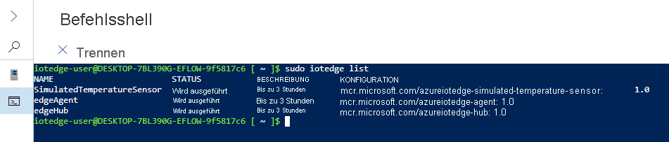

# <a name="quickstart-deploy-your-first-iot-edge-module-to-a-windows-device"></a>Schnellstart: Deploy your first IoT Edge module to a Windows device (Bereitstellen Ihres ersten IoT Edge-Moduls auf einem Windows-Gerät)

[!INCLUDE [iot-edge-version-201806](../../includes/iot-edge-version-201806.md)]

In dieser Schnellstartanleitung können Sie Azure IoT Edge ausprobieren, indem Sie Code in Containern auf einem IoT Edge-Gerät für Linux unter Windows bereitstellen. IoT Edge ermöglicht Ihnen die Remoteverwaltung von Code auf Ihren Geräten, damit Sie noch mehr Workloads an den Edgebereich senden können. In dieser Schnellstartanleitung empfiehlt es sich, ein eigenes Gerät zu verwenden, um zu sehen, wie einfach es ist, Azure IoT Edge für Linux unter Windows zu verwenden.

In diesem Schnellstart erfahren Sie, wie die folgenden Aufgaben ausgeführt werden:

* Erstellen Sie einen IoT Hub.
* Registrieren eines IoT Edge-Geräts für Ihren IoT Hub
* Installieren und Starten der Runtime von IoT Edge für Linux unter Windows auf Ihrem Gerät
* Durchführen der Remotebereitstellung eines Moduls für ein IoT Edge-Gerät und Senden von Telemetriedaten


In dieser Schnellstartanleitung erfahren Sie Schritt für Schritt, wie Sie Ihr Gerät mit Azure IoT Edge für Linux unter Windows einrichten. Anschließend stellen Sie ein Modul über das Azure-Portal auf Ihrem Gerät bereit. Das verwendete Modul ist ein simulierter Sensor, mit dem Daten zu Temperatur, Luftfeuchtigkeit und Luftdruck generiert werden. Andere Tutorials zu Azure IoT Edge bauen hierauf auf, indem Module zum Analysieren der simulierten Daten bereitgestellt werden, um geschäftsrelevante Erkenntnisse zu gewinnen.

Wenn Sie über kein aktives Azure-Abonnement verfügen, können Sie ein [kostenloses Konto](https://azure.microsoft.com/free) erstellen, bevor Sie beginnen.

## <a name="prerequisites"></a>Voraussetzungen

Bereiten Sie die Umgebung für die Azure CLI vor.

[!INCLUDE [azure-cli-prepare-your-environment-no-header.md](../../includes/azure-cli-prepare-your-environment-no-header.md)]

Erstellen Sie eine Cloudressourcengruppe zum Verwalten aller Ressourcen, die Sie in dieser Schnellstartanleitung verwenden.

   ```azurecli-interactive
   az group create --name IoTEdgeResources --location westus2
   ```

Stellen Sie sicher, dass Ihr IoT Edge-Gerät die folgenden Anforderungen erfüllt:

* Editionen
  * Windows 10 ab Version 1809, Build 17763 oder höher
    * Professional, Enterprise, IoT Enterprise
  * Windows Server 2019, Build 17763 oder höher

* Hardwareanforderungen
  * Mindestens erforderlicher freier Arbeitsspeicher: 1 GB
  * Mindestens erforderlicher freier Speicherplatz: 10 GB

>[!NOTE]
>In dieser Schnellstartanleitung wird PowerShell verwendet, um eine Bereitstellung von IoT Edge für Linux unter Windows zu erstellen. Sie können dafür auch Windows Admin Center verwenden. Führen Sie die Schritte in der Schrittanleitung zum [Installieren und Bereitstellen von Azure IoT Edge für Linux auf einem Windows-Gerät](how-to-install-iot-edge-on-windows.md?tabs=windowsadmincenter) aus, falls Sie Ihre Bereitstellung mit Windows Admin Center erstellen möchten.

## <a name="create-an-iot-hub"></a>Erstellen eines IoT-Hubs

Erstellen Sie zunächst mit der Azure CLI einen IoT-Hub.


Für diese Schnellstartanleitung können Sie auch die kostenlose Version von Azure IoT Hub nutzen. Wenn Sie IoT Hub schon einmal genutzt und bereits einen Hub erstellt haben, können Sie diesen IoT-Hub verwenden.

Mit dem folgenden Code wird ein kostenloser **F1**-Hub in der Ressourcengruppe `IoTEdgeResources` erstellt. Ersetzen Sie `{hub_name}` durch einen eindeutigen Namen für Ihren IoT-Hub. Es kann einige Minuten dauern, bis ein IoT-Hub erstellt wurde.

```azurecli-interactive
az iot hub create --resource-group IoTEdgeResources --name {hub_name} --sku F1 --partition-count 2
```

Ändern Sie die SKU in `S1`, falls Sie eine Fehlermeldung erhalten, weil bereits ein kostenloser Hub in Ihrem Abonnement vorhanden ist. Sollten Sie eine Fehlermeldung mit dem Hinweis erhalten, dass der Name für den IoT-Hub nicht verfügbar ist, ist bereits ein Hub mit diesem Namen vorhanden. Probieren Sie einen neuen Namen aus.

## <a name="register-an-iot-edge-device"></a>Registrieren eines IoT Edge-Geräts

Registrieren Sie ein IoT Edge-Gerät bei Ihrem neu erstellten IoT Hub.


Erstellen Sie eine Geräteidentität für das simulierte Gerät, sodass es mit dem IoT Hub kommunizieren kann. Die Geräteidentität befindet sich in der Cloud, und Sie verwenden eine eindeutige Geräte-Verbindungszeichenfolge, um einem physischen Gerät eine Geräteidentität zuzuordnen.

IoT Edge-Geräte weisen ein anderes Verhalten als typische IoT-Geräte auf und können anders verwaltet werden. Verwenden Sie das Flag `--edge-enabled`, um zu deklarieren, dass diese Identität für ein IoT Edge-Gerät bestimmt ist.

1. Geben Sie in Azure Cloud Shell den folgenden Befehl ein, um in Ihrem Hub ein Gerät mit dem Namen **myEdgeDevice** zu erstellen.

     ```azurecli-interactive
     az iot hub device-identity create --device-id myEdgeDevice --edge-enabled --hub-name {hub_name}
     ```

     Falls Sie eine Fehlermeldung zu `iothubowner`-Richtlinienschlüsseln erhalten, sollten Sie überprüfen, ob in Cloud Shell die aktuelle Version der Azure IoT-Erweiterung ausgeführt wird.

1. Zeigen Sie die Verbindungszeichenfolge für Ihr Gerät an, über die Ihr physisches Gerät mit seiner Identität in IoT Hub verknüpft wird. Sie enthält den Namen Ihres IoT-Hubs, den Namen Ihres Geräts und einen gemeinsam verwendeten Schlüssel, mit dem die Verbindungen zwischen diesen Komponenten authentifiziert werden.

     ```azurecli-interactive
     az iot hub device-identity connection-string show --device-id myEdgeDevice --hub-name {hub_name}
     ```

1. Kopieren Sie den Wert des Schlüssels `connectionString` aus der JSON-Ausgabe, und speichern Sie ihn. Dieser Wert ist die Verbindungszeichenfolge des Geräts. Sie verwenden ihn, um im nächsten Abschnitt die IoT Edge-Runtime zu konfigurieren.

     

## <a name="install-and-start-the-iot-edge-runtime"></a>Installieren und Starten der IoT Edge-Runtime

Installieren Sie IoT Edge für Linux unter Windows auf Ihrem Gerät, und konfigurieren Sie es mit der Geräte-Verbindungszeichenfolge.


Führen Sie die folgenden PowerShell-Befehle auf dem Zielgerät aus, auf dem Sie Azure IoT Edge für Linux unter Windows bereitstellen wollen. Für die Bereitstellung auf einem Remotezielgerät mithilfe von PowerShell stellen Sie mit [Remotebefehlen in PowerShell](/powershell/module/microsoft.powershell.core/about/about_remote) eine Verbindung mit einem Remotegerät her und führen Sie diese Befehle remote auf dem Gerät aus.

1. Führen Sie in einer PowerShell-Sitzung mit erhöhten Rechten die folgenden Befehle nacheinander aus, um IoT Edge für Linux unter Windows herunterzuladen.

   ```powershell
   $msiPath = $([io.Path]::Combine($env:TEMP, 'AzureIoTEdge.msi'))
   $ProgressPreference = 'SilentlyContinue'
   Invoke-WebRequest "https://aka.ms/AzEflowMSI" -OutFile $msiPath
   ```

1. Installieren Sie IoT Edge für Linux unter Windows auf Ihrem Gerät.

   ```powershell
   Start-Process -Wait msiexec -ArgumentList "/i","$([io.Path]::Combine($env:TEMP, 'AzureIoTEdge.msi'))","/qn"
   ```

1. Legen Sie die Ausführungsrichtlinie auf dem Zielgerät auf `AllSigned` fest, wenn dies noch nicht so eingestellt ist. Sie können die aktuelle Ausführungsrichtlinie in einer PowerShell-Eingabeaufforderung mit erhöhten Rechten wie folgt überprüfen:

   ```powershell
   Get-ExecutionPolicy -List
   ```

   Wenn die Ausführungsrichtlinie von `local machine` nicht `AllSigned` ist, können Sie die Ausführungsrichtlinie wie folgt festlegen:

   ```powershell
   Set-ExecutionPolicy -ExecutionPolicy AllSigned -Force
   ```

1. Erstellen Sie die Bereitstellung von IoT Edge für Linux unter Windows.

   ```powershell
   Deploy-Eflow
   ```

1. Geben Sie „Y“ ein, um den Lizenzbedingungen zuzustimmen.

1. Durch die Eingabe von „O“ oder „R“ können Sie **Optionale Diagnosedaten** bei Bedarf ein- oder ausschalten. Eine erfolgreiche Bereitstellung ist unten dargestellt.

   

1. Stellen Sie Ihr Gerät mithilfe der Geräteverbindungszeichenfolge bereit, die Sie im vorherigen Abschnitt abgerufen haben. Ersetzen Sie den Platzhaltertext durch Ihren eigenen Wert.

   ```powershell
   Provision-EflowVm -provisioningType ManualConnectionString -devConnString "<CONNECTION_STRING_HERE>"
   ```

Ihr IoT Edge-Gerät ist jetzt konfiguriert. Es kann nun zum Ausführen von in der Cloud bereitgestellten Modulen verwendet werden.

## <a name="deploy-a-module"></a>Bereitstellen eines Moduls

Verwalten Sie Ihr Azure IoT Edge-Gerät über die Cloud, um ein Modul bereitzustellen, das Telemetriedaten an die IoT Hub-Instanz sendet.


<!--
[!INCLUDE [iot-edge-deploy-module](../../includes/iot-edge-deploy-module.md)]

Include content included below to support versioned steps in Linux quickstart. Can update include file once Windows quickstart supports v1.2
-->

Eine wichtige Funktion von Azure IoT Edge ist die Möglichkeit, Code aus der Cloud auf IoT Edge-Geräten bereitzustellen. Bei *IoT Edge-Modulen* handelt es sich um ausführbare Pakete, die als Container implementiert werden. In diesem Abschnitt stellen Sie ein vorgefertigtes Modul aus dem [Abschnitt mit den IoT Edge-Modulen im Azure Marketplace](https://azuremarketplace.microsoft.com/marketplace/apps/category/internet-of-things?page=1&subcategories=iot-edge-modules) direkt über Ihre Azure IoT Hub-Instanz bereit.

Mit dem in diesem Abschnitt bereitgestellten Modul wird ein Sensor simuliert, und es werden Daten generiert. Der Code dieses Moduls ist nützlich, wenn Sie die ersten Schritte mit IoT Edge ausführen, weil Sie die simulierten Daten für die Entwicklung und das Testen nutzen können. Wenn Sie genau sehen möchten, was mit diesem Modul durchgeführt wird, können Sie den [Quellcode für den simulierten Temperatursensor anzeigen](https://github.com/Azure/iotedge/blob/027a509549a248647ed41ca7fe1dc508771c8123/edge-modules/SimulatedTemperatureSensor/src/Program.cs).

Führen Sie die folgenden Schritte aus, um über den Azure Marketplace Ihr erstes Modul bereitzustellen:

1. Melden Sie sich beim [Azure-Portal](https://portal.azure.com) an, und navigieren Sie zu Ihrer IoT Hub-Instanz.

1. Wählen Sie im Menü im linken Bereich unter **Automatische Geräteverwaltung** die Option **IoT Edge** aus.

1. Wählen Sie in der Liste der Geräte die Geräte-ID des Zielgeräts aus.

1. Wählen Sie in der oberen Leiste **Module festlegen** aus.

   

1. Öffnen Sie unter **IoT Edge-Module** das Dropdownmenü **Hinzufügen**, und wählen Sie **Marketplace-Modul** aus.

   

1. Suchen Sie im **Marketplace für IoT Edge-Module** nach dem Modul `Simulated Temperature Sensor`, und wählen Sie es aus.

   Das Modul wird dem Abschnitt mit den IoT Edge-Modulen mit dem gewünschten Status **Wird ausgeführt** hinzugefügt.

1. Klicken Sie auf **Weiter: Routen**, um mit dem nächsten Schritt des Assistenten fortzufahren.

   

1. Entfernen Sie auf der Registerkarte **Routen** die Standardroute **route**, und wählen Sie dann **Weiter: Überprüfen + erstellen** aus, um mit dem nächsten Schritt des Assistenten fortzufahren.

   >[!Note]
   >Routen werden mit Name-Wert-Paaren erstellt. Auf dieser Seite sollten zwei Routen angezeigt werden. Die Standardroute **route** sendet alle Nachrichten an IoT Hub (`$upstream`). Eine zweite Route mit dem Namen **SimulatedTemperatureSensorToIoTHub** wurde automatisch erstellt, als Sie das Modul aus dem Azure Marketplace hinzugefügt haben. Diese Route sendet alle vom Modul für simulierte Temperatur gesendeten Nachrichten an IoT Hub. Sie können die Standardroute löschen, weil sie in diesem Fall redundant ist.

   

1. Überprüfen Sie die JSON-Datei, und wählen Sie dann **Erstellen** aus. Die JSON-Datei definiert alle Module, die Sie auf Ihrem IoT Edge-Gerät bereitstellen. Sie sehen das Modul **SimulatedTemperatureSensor** sowie die beiden Laufzeitmodule **edgeAgent** und **edgeHub**.

   >[!Note]
   >Wenn Sie eine neue Bereitstellung an ein IoT Edge-Gerät übermitteln, wird nichts per Push auf Ihr Gerät übertragen. Stattdessen fragt das Gerät den IoT Hub regelmäßig nach neuen Anweisungen ab. Wenn das Gerät ein aktualisiertes Bereitstellungsmanifest findet, werden die Informationen zur neuen Bereitstellung verwendet, um die Modulimages per Pullvorgang aus der Cloud abzurufen. Anschließend wird die lokale Ausführung der Module gestartet. Dieser Vorgang kann einige Minuten dauern.

1. Nachdem Sie die Bereitstellungsdetails des Moduls erstellt haben, führt Sie der Assistent zur Seite „Gerätedetails“ zurück. Zeigen Sie den Bereitstellungsstatus auf der Registerkarte **Module** an.

   Dort sollten drei Module angezeigt werden: **$edgeAgent**, **$edgeHub** und **SimulatedTemperatureSensor**. Wenn unter **IN BEREITSTELLUNG ANGEGEBEN**, aber nicht unter **VOM GERÄT GEMELDET** für mindestens ein Modul **JA** angegeben ist, ist Ihr IoT Edge-Gerät noch mit dem Startvorgang beschäftigt. Warten Sie einige Minuten, und aktualisieren Sie dann die Seite.

   

## <a name="view-the-generated-data"></a>Anzeigen der generierten Daten

In diesem Schnellstart haben Sie ein neues IoT Edge-Gerät erstellt und die IoT Edge-Runtime darauf installiert. Anschließend haben Sie das Azure-Portal verwendet, um ein IoT Edge-Modul zur Ausführung auf dem Gerät bereitzustellen, ohne Änderungen am Gerät selbst vornehmen zu müssen.

Von dem Modul, das Sie gepusht haben, werden Daten für die Beispielumgebung generiert, die Sie später zum Testen verwenden können. Der simulierte Sensor überwacht sowohl einen Computer als auch seine Umgebung. Beispielsweise kann sich dieser Sensor in einem Serverraum, in einer Fabrik oder in einer Windturbine befinden. Die gesendeten Nachrichten enthalten Informationen zu Umgebungstemperatur und Luftfeuchtigkeit, Computertemperatur und Druck sowie einen Zeitstempel. In IoT Edge-Tutorials werden diese vom Modul erstellten Daten als Testdaten für die Analyse verwendet.

1. Melden Sie sich mithilfe des folgenden Befehls in Ihrer PowerShell-Sitzung bei Ihrem virtuellen IoT Edge für Linux-Computer unter Windows an.

   ```powershell
   Connect-EflowVm
   ```

   >[!NOTE]
   >Das einzige Konto, das zum Herstellen eines SSH mit dem virtuellen Computer zulässig ist, ist der Benutzer, der es erstellt.

1. Sobald Sie angemeldet sind, können Sie die Liste der laufenden IoT Edge-Module mithilfe des folgenden Linux-Befehls überprüfen:

   ```bash
   sudo iotedge list
   ```

   

1. Zeigen Sie mithilfe des folgenden Linux-Befehls die vom Temperatursensormodul an die Cloud gesendeten Nachrichten an:

   ```bash
   sudo iotedge logs SimulatedTemperatureSensor -f
   ```

   >[!IMPORTANT]
   >Bei IoT Edge-Befehlen wird beim Verweisen auf Modulnamen Groß- und Kleinschreibung unterschieden.

   

Sie können auch die [Azure IoT Hub-Erweiterung für Visual Studio Code](https://marketplace.visualstudio.com/items?itemName=vsciot-vscode.azure-iot-toolkit) verwenden, um das Eintreffen von Nachrichten auf Ihrem IoT-Hub zu verfolgen.

## <a name="clean-up-resources"></a>Bereinigen von Ressourcen

Überspringen Sie diesen Schritt, falls Sie mit dem Durcharbeiten der IoT Edge-Tutorials fortfahren möchten. Sie können das Gerät verwenden, das Sie in dieser Schnellstartanleitung registriert und eingerichtet haben. Andernfalls können Sie die erstellten Azure-Ressourcen löschen, um Kosten zu vermeiden.

Wenn Sie Ihren virtuellen Computer und Azure IoT Hub in einer neuen Ressourcengruppe erstellt haben, können Sie diese Gruppe und alle zugehörigen Ressourcen löschen. Wenn Sie nicht die gesamte Gruppe löschen möchten, können Sie stattdessen einzelne Ressourcen löschen.

> [!IMPORTANT]
> Überprüfen Sie den Inhalt der Ressourcengruppe, um sicherzustellen, dass sie keine Elemente enthält, die Sie beibehalten möchten. Das Löschen einer Ressourcengruppe kann nicht rückgängig gemacht werden.

Verwenden Sie den folgenden Befehl, um die Gruppe **IoTEdgeResources** zu entfernen. Das Löschen kann einige Minuten dauern.

```azurecli-interactive
az group delete --name IoTEdgeResources
```

Sie können sich vergewissern, dass die Ressourcengruppe entfernt wurde, indem Sie diesen Befehl zum Anzeigen der Liste mit den Ressourcengruppen verwenden.

```azurecli-interactive
az group list
```

### <a name="remove-azure-iot-edge-for-linux-on-windows"></a>Entfernen von Azure IoT Edge für Linux unter Windows

Verwenden Sie die Dashboard-Erweiterung in Windows Admin Center, um Azure IoT Edge für Linux unter Windows zu deinstallieren.

1. Stellen Sie eine Verbindung mit dem IoT Edge-Gerät in Windows Admin Center her. Die Azure-Dashboard-Toolerweiterung wird geladen.

1. Wählen Sie **Deinstallieren** aus. Nach dem Entfernen von Azure IoT Edge wird von Windows Admin Center auf der Seite **Start** der Eintrag für die Verbindung mit dem Azure IoT Edge-Gerät entfernt.

>[!Note]
>Alternativ können Sie auch auf Ihrem IoT Edge-Gerät **Start** > **Einstellungen** > **Apps** > **Azure IoT Edge LTS** > **Deinstallieren** auswählen, um Azure IoT Edge von Ihrem Windows-System zu entfernen. Mit diesem Verfahren wird Azure IoT Edge zwar von Ihrem IoT Edge-Gerät entfernt, aber die Verbindung ist weiterhin in Windows Admin Center vorhanden. Deinstallieren Sie zum Abschließen des Entfernungsprozesses auch Windows Admin Center über das Menü **Einstellungen**.

## <a name="next-steps"></a>Nächste Schritte

In dieser Schnellstartanleitung haben Sie ein IoT Edge-Gerät erstellt und die Azure IoT Edge-Cloudschnittstelle zum Bereitstellen von Code auf dem Gerät verwendet. Sie verfügen nun über ein Testgerät, das Rohdaten zu seiner Umgebung generiert.

Als Nächstes richten Sie Ihre lokale Entwicklungsumgebung ein, damit Sie mit der Entwicklung von IoT Edge-Modulen für Ihre Geschäftslogik beginnen können.

> [!div class="nextstepaction"]
> [Tutorial: Entwickeln von IoT Edge-Modulen für Linux-Geräte](tutorial-develop-for-linux.md)
