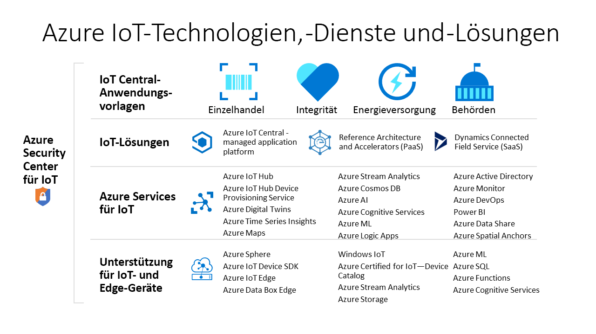

# Welche Azure-Technologien und -Dienste können Sie zum Erstellen von IoT-Lösungen verwenden?

Azure IoT-Technologien und -Dienste bieten Ihnen Optionen, eine Vielzahl von IoT-Lösungen zu erstellen, die die digitale Transformation für Ihre Organisation ermöglichen. Beispielsweise können Sie folgende Aktionen ausführen:

- Verwenden Sie [Azure IoT Central](https://apps.azureiotcentral.com), eine verwaltete IoT-Anwendungsplattform, um eine sichere IoT-Lösung für Unternehmen zu erstellen und bereitzustellen. IoT Central bietet eine Sammlung branchenspezifischer Anwendungsvorlagen, z. B. für Einzelhandel und Gesundheitswesen, um den Lösungsentwicklungsprozess zu beschleunigen.
- Erweitern Sie die Open-Source-Codebasis für einen Azure IoT-[Solution Accelerator](https://www.azureiotsolutions.com), um ein häufiges IoT-Szenario wie die Remoteüberwachung oder Predictive Maintenance zu implementieren.
- Verwenden Sie Azure IoT-Plattformdienste wie [Azure IoT Hub](../iot-hub/about-iot-hub.md) und die [Azure IoT-Geräte-SDKs](../iot-hub/iot-hub-devguide-sdks.md), um eine benutzerdefinierte IoT-Lösung von Grund auf neu zu erstellen.

## Azure IoT Central

Die [IoT Central-Anwendungsplattform](https://apps.azureiotcentral.com) verringert Aufwand und Kosten für die Entwicklung, Verwaltung und Wartung von IoT-Lösungen auf Unternehmensniveau. Mit der anpassbaren Webbenutzeroberfläche von IoT Central können Sie Gerätebedingungen überwachen, Regeln erstellen und Millionen von Geräten und zugehöriger Daten über ihren gesamten Lebenszyklus hinweg verwalten. Die API-Oberfläche in IoT Central ermöglicht Ihnen den programmgesteuerten Zugriff auf die Konfiguration und Interaktion mit ihrer IoT-Lösung.

Azure IoT Central ist eine vollständig verwaltete Anwendungsplattform, die Sie verwenden können, um benutzerdefinierte IoT-Lösungen zu erstellen. IoT Central verwendet Anwendungsvorlagen zum Erstellen von Lösungen. Es gibt Vorlagen für generische Lösungen und bestimmte Branchen, z. B. Energiewirtschaft, Gesundheitswesen, Behörden und Einzelhandel. Mit IoT Central-Anwendungsvorlagen können Sie in wenigen Minuten eine IoT Central-Anwendung bereitstellen, die Sie dann mit Designs, Dashboards und Ansichten anpassen können.

Wählen Sie Geräte im [Azure Certified for IoT-Gerätekatalog](https://catalog.azureiotsolutions.com) aus, um schnell eine Verbindung mit Ihrer Lösung herzustellen. Verwenden Sie die IoT Central-Webbenutzeroberfläche, um zu überwachen und verwalten, dass Ihre Geräte fehlerfrei und verbunden sind. Verwenden Sie Konnektoren und APIs, um Ihre IoT Central-Anwendung in andere Geschäftsanwendungen zu integrieren.

Als vollständig verwaltete Anwendungsplattform verfügt IoT Central über ein einfaches, vorhersagbares Preismodell.

## Azure IoT Solution Accelerators

Die [Azure IoT Solution Accelerators](https://www.azureiotsolutions.com) sind eine Sammlung anpassbarer Lösungen auf Unternehmensniveau. Sie können diese Lösungen unverändert bereitstellen oder mithilfe des Open-Source-Java-oder .NET-Quellcodes eine benutzerdefinierte IoT-Lösung entwickeln.

Azure IoT Solution Accelerators bieten ein hohes Maß an Kontrolle über Ihre IoT-Lösung. Zu den Solution Accelerators zählen vorgefertigte Lösungen für gängige IoT-Szenarien, die Sie in wenigen Minuten in Ihrem Azure-Abonnement bereitstellen können. Mögliche Szenarien:

  - Remoteüberwachung
  - Verbundene Factory
  - Predictive Maintenance
  - Gerätesimulation

Die Open-Source-Codebasis für alle Solution Accelerators ist auf GitHub verfügbar. Laden Sie den Code herunter, um einen Solution Accelerator Ihren speziellen IoT-Anforderungen anzupassen.

Die Solution Accelerators verwenden Azure-Dienste wie Azure IoT Hub und Azure Storage, die Sie in Ihrem Azure-Abonnement verwalten müssen.

## Benutzerdefinierte Lösungen

Verwenden Sie eine bzw. einen der folgenden Azure IoT-Technologien und -Dienste oder mehrere, um eine IoT-Lösung von Grund auf neu zu erstellen oder eine Lösung zu erweitern, die mit IoT Central oder einem Solution Accelerator erstellt wurde:

### Geräte

Entwickeln Sie Ihre IoT-Geräte mit einem der [Azure IoT-Starter Kits](https://catalog.azureiotsolutions.com/kits), oder wählen Sie im [Azure Certified for IoT-Gerätekatalog](https://catalog.azureiotsolutions.com) ein Gerät aus, das Sie verwenden möchten. Implementieren Sie den eingebetteten Code mithilfe der Open-Source-[Geräte-SDKs](../iot-hub/iot-hub-devguide-sdks.md). Die Geräte-SDKs unterstützen mehrere Betriebssysteme wie z. B. Linux, Windows und Echtzeitbetriebssysteme. Es gibt SDKs für mehrere Programmiersprachen wie z. B. [C](https://github.com/Azure/azure-iot-sdk-c), [Node.js](https://github.com/Azure/azure-iot-sdk-node), [Java](https://github.com/Azure/azure-iot-sdk-java), [.NET](https://github.com/Azure/azure-iot-sdk-csharp) und [Python](https://github.com/Azure/azure-iot-sdk-python).

Sie können die Art, wie Sie den eingebetteten Code für Ihre Geräte erstellen, mithilfe des Diensts [IoT Plug & Play](../iot-pnp/overview-iot-plug-and-play.md) weiter vereinfachen. Mit IoT Plug & Play können Lösungsentwickler Geräte in ihre Lösungen integrieren, ohne eingebetteten Code schreiben zu müssen. Das Herzstück von IoT Plug & Play ist ein _Gerätefunktionsmodell_-Schema, das Gerätefunktionen beschreibt. Verwenden Sie das Gerätefunktionsmodell, um den eingebetteten Gerätecode zu generieren und eine cloudbasierte Lösung wie z. B. eine IoT Central-Anwendung zu konfigurieren.

Mit [Azure IoT Edge](../iot-edge/about-iot-edge.md) können Sie Teile ihrer IoT-Arbeitsauslastung von Ihren Azure-Clouddiensten auf Ihre Geräte auslagern. IoT Edge kann die Latenz in Ihrer Lösung verringern sowie die Datenmenge, die Ihre Geräte mit der Cloud austauschen, und Offlineszenarien aktivieren. Sie können IoT Edge-Geräte über IoT Central und einige Solution Accelerators verwalten.

[Azure Sphere](/azure-sphere/product-overview/what-is-azure-sphere) ist eine abgesicherte Anwendungsplattform auf hoher Ebene mit integrierten Kommunikations- und Sicherheitsfunktionen für mit dem Internet verbundene Geräte. Sie umfasst einen geschützten Mikrocontroller, ein spezielles Linux-basiertes Betriebssystem sowie einen cloudbasierten Sicherheitsdienst, der für kontinuierliche und erneuerbare Sicherheit sorgt.

### Cloudkonnektivität

Der [Azure IoT Hub](../iot-hub/about-iot-hub.md)-Dienst ermöglicht eine zuverlässige und sichere bidirektionale Kommunikation zwischen Millionen von IoT-Geräten und einer cloudbasierten Lösung. [Azure IoT Hub Device Provisioning Service](../iot-dps/about-iot-dps.md) ist ein Hilfsdienst für IoT Hub. Der Dienst ermöglicht eine unbeaufsichtigte Just-In-Time-Bereitstellung von Geräten im richtigen IoT Hub – ganz ohne Benutzereingriff. Mit diesen Funktionen können Kunden Millionen von Geräten sicher und skalierbar bereitstellen.

IoT Hub ist eine Kernkomponente der Solution Accelerators, mit der Sie Herausforderungen der IoT-Implementierung wie den folgenden begegnen können:

* Gerätekonnektivität und -verwaltung mit hohem Volumen
* Telemetriedatenerfassung mit hohem Volumen
* Steuerung von Geräten mit Befehlen
* Durchsetzung der Gerätesicherheit

### Überbrückung der Lücke zwischen der physischen und digitalen Welt

[Azure Digital Twins](../digital-twins/overview.md) ist ein IoT-Dienst, mit dem Sie Modelle einer physischen Umgebung erstellen können. Mit dem bereitgestellten Raumintelligenzgraphen können Beziehungen zwischen Personen, Bereichen und Geräten modelliert werden. Das Korrellieren von Daten aus der digitalen und physischen Welt ermöglicht die Erstellung kontextbezogener Lösungen.

IoT Central verwendet digitale Zwillinge zum Synchronisieren von Geräten und Daten in der realen Welt mit den digitalen Modellen, die Benutzern ermöglichen, diese verbundenen Geräte zu überwachen und zu verwalten.

### Daten und Analysen

IoT-Geräte generieren in der Regel große Mengen an Zeitreihendaten, z. B. Temperaturmessungen von Sensoren. [Azure Time Series Insights](../time-series-insights/time-series-insights-overview.md) kann eine Verbindung mit einem IoT Hub herstellen, den Telemetriedatenstrom von Ihren Geräten lesen, diese Daten speichern und Ihnen deren Abfrage und Visualisierung ermöglichen.

[Azure Maps](../azure-maps/index.yml) ist eine Sammlung von Geodiensten, bei denen aktuelle Kartendaten verwendet werden, um einen präzisen geografischen Kontext für Webanwendungen und mobile Anwendungen bereitzustellen. Sie können für die Erstellung Ihrer Anwendungen eine REST-API, ein webbasiertes JavaScript-Steuerelement oder ein Android SDK verwenden.

## Nächste Schritte

Probieren Sie einen der Schnellstarts aus, um praktische Erfahrungen zu sammeln:

- [Erstellen einer Azure IoT Central-Anwendung](../iot-central/core/quick-deploy-iot-central.md)
- [Send telemetry from a device to an IoT hub (Swift)](../iot-hub/quickstart-send-telemetry-cli.md) (Senden von Telemetriedaten von einem Gerät an eine IoT Hub-Instanz (Swift))
- [Testen einer cloudbasierten Remoteüberwachungslösung](../iot-accelerators/quickstart-remote-monitoring-deploy.md)